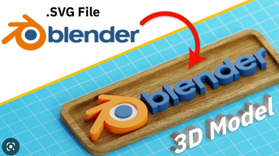

# Crear un modelo 3D desde una imagen vectorial e imprimirlo

Podemos crear una imagen .SVG, o directamente importar una a``Tinkercad``.

Dentro de``Tinkercad``,podremos cambiar el tamaño de los modelos importados, recolocarlos, etc.

Tendremos que exportar el archivo a un formato .STL que pasarle al programa Cura
Por último, en cura, generaremos un archivo .Gcode, que será el que pasemos a la impresora utilizando la tarjeta de memoria