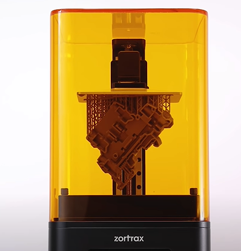

# Impresora resina

Una impresora 3D de resina funciona usando un tipo especial de plástico llamado resina. Utiliza un láser para brillar sobre la resina y hacerla endurecerse en una forma 3D.

El láser se mueve en un patrón y la resina se endurece en la forma del objeto 3D que desea imprimir. El objeto 3D se construye gradualmente capa por capa hasta que esté terminado.

