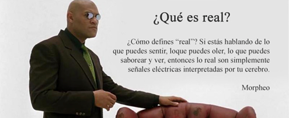

# Virtualización

La virtualización es una práctica de tecnología de la información que permite la creación a través de software de una versión virtual de un recurso tecnológico, que normalmente es un hardware físico. Esta técnica permite que un recurso (hardware o software) se divida en varias unidades virtuales, por lo que los usuarios pueden acceder a una versión virtual de un recurso, en lugar de tener que utilizar el recurso real. Esta técnica también se conoce como virtualización de recursos.

