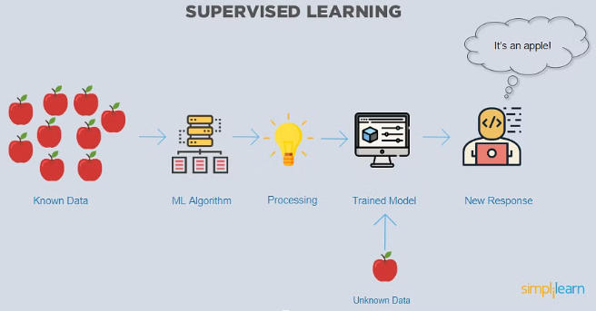
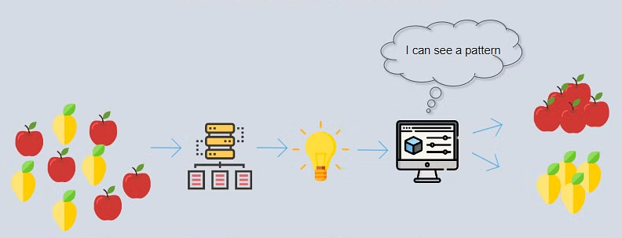

# 2. Machine y deep learning

## Machine learning

El aprendizaje automático es un subconjunto de la IA que se enfoca en proporcionar a las máquinas la capacidad de aprender de los datos, sin ser programadas explícitamente.

---

# Algoritmos y patrones

Se usan **algoritmos** para encontrar **patrones** en los datos, para luego aplicar estos patrones a nuevos datos para hacer predicciones, clasificaciones y tomar decisiones. Esto se puede hacer usando aprendizaje supervisado, aprendizaje no supervisado o aprendizaje por refuerzo.

---

# Aprendizaje supervisado

En el **aprendizaje supervisado**, conocemos los datos previamente, por lo que se los damos al **algoritmo** para que entrene el **modelo**.

Una vez entrenado, puede predecir datos nuevos y dar una respuesta.

---

# Aprendizaje no supervisado

En este ejemplo, el **aprendizaje no es supervisado**. No sabemos cuales son los datos, sino que le damos un conjunto de datos, él busca patrones entre ellos y crea una clasificación.

---

## Deep learning

El **aprendizaje profundo** es un subconjunto del aprendizaje automático que utiliza algoritmos para modelar abstracciones de alto nivel en los datos.

En general, los algoritmos de aprendizaje profundo son más precisos que los algoritmos de aprendizaje automático pero también son más costosos computacionalmente.

Tanto el aprendizaje automático como el aprendizaje profundo se utilizan para crear modelos que pueden hacer predicciones sobre los datos. Sin embargo, el aprendizaje profundo es más efectivo para hacer predicciones sobre datos complejos, como imágenes o datos en lenguaje natural.

---

# Proyectos

- Machine learning for kids: [ML4K](https://machinelearningforkids.co.uk/)
- [Teachablemachine](https://teachablemachine.withgoogle.com/train)
- [Learningml](https://web.learningml.org/)

Programación para NXT:
- https://lab.open-roberta.org/