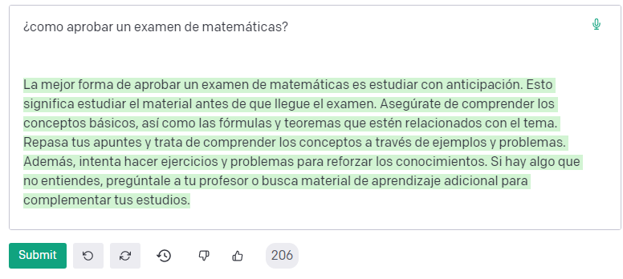
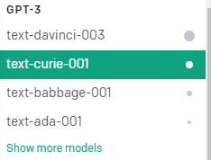
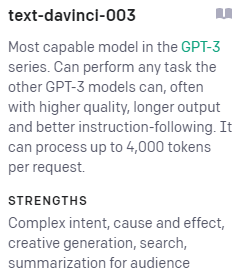

# 4. OpenAI

OpenAI es una empresa de investigación y desarrollo de Inteligencia Artificial fundada en 2015 con el objetivo de promover y desarrollar la IA de manera segura y ética.

---

# GPT-3

**GPT-3** (Generative Pre-trained Transformer 3) es un **modelo de lenguaje** desarrollado por **OpenAI** que utiliza técnicas de  aprendizaje profundo para producir texto similar al creado por una persona.

---

Está diseñada para **generar** texto a partir de una **muestra** de entrada, utilizando una combinación de contenido previamente almacenado y una amplia variedad de modelos de lenguaje.

---

# Modelo

El modelo se **entrena** a partir de gran cantidad de fuentes de texto que se pueden encontrar en Internet.

---

# ¿Qué podemos hacer?

GPT-3 puede crear artículos o historias, así como crear resúmenes a partir de un texto que nosotros le demos como entrada. También permite crear código de programación en muchos lenguajes diferentes.

---

Uno de los aspectos más importantes es que la calidad de las producciones hace complicado distinguir si son creados por este "programa" o por un ser humano real.

---

# Modelos

Los modelos GPT-3 incluyen una variedad de **modelos de lenguaje**. Estos modelos se utilizan para aprender a **predecir** el texto a partir de una muestra de entrada.

Nos ofrece actualmente 4 modelos te texto. Cada uno de ellos tiene capacidades y calidades diferentes, así como son más aptos para unas tareas u otras.

---

Estos modelos proporcionan análisis automatizado de grandes cantidades de datos de texto, con el objetivo de **identificar** rápidamente **temas** y tendencias, descubrir **relaciones** entre documentos y **extraer frases y conceptos** clave.

---

# Modelos

Por ejemplo, **Davinci** es muy bueno resolviendo problemas de lógica y produciendo contenido a partir de poco texto. En cambio, **Curie** es mejor a la hora de resumir textos.

---

Aquí podemos ver un poco más de información sobre este modelo:

---

# Imágenes

**DALL-E** es una red neuronal profunda con capacidades de generación de imágenes creada por OpenAI.

---

# Chat

**ChatGPT** es un modelo de lenguaje de OpenAI que genera diálogos humanos realistas. Todos estos recursos se pueden usar para el desarrollo de Inteligencia Artificial.

---

# Precio

- Por el momento el uso es gratuito, con ciertas limitaciones.
- También existe un uso comercial de su API, para poder integrarla en otros programas o servicios de empresas.
- Se paga un precio por cada 1000 **tokens**. utilizados, que actualmente cuestan 6 céntimos de dólar.