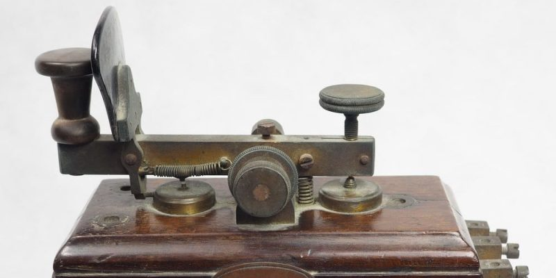
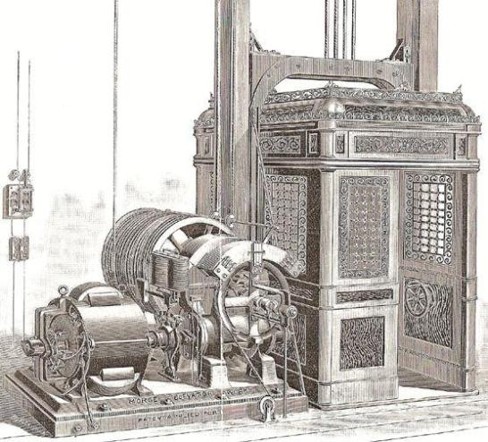

# Siglo XIX

## 1800 Martillo pilón

El martillo pilón fue una herramienta mecánica inventada en 1800 que se usaba para forjar metales. Esta herramienta era una parte esencial de la industria y se utilizaba para fabricar y reparar diferentes tipos de herramientas y objetos metálicos.

## 1801 Pila eléctrica

1801 Pila eléctrica: La primera pila eléctrica fue inventada por Alessandro Volta en 1801. Esta fue la primera fuente de energía eléctrica que funcionaba sin la necesidad de una fuente externa de energía. Esta pila producía energía eléctrica a partir de la reacción química de dos electrodos inmersos en una solución conductora.

## 1801 Electróforo

1801 Electróforo: El electróforo fue inventado por William Nicholson en 1801. Esta era una herramienta eléctrica que se usaba para generar electricidad estática. Esta herramienta estaba formada por una placa metálica conectada a una fuente de energía, una varilla metálica, y un recipiente de líquido aislante.

## 1801 Endiómetro

1801 Endiómetro: El endiómetro fue inventado por Henry Cavendish en 1801. Esta herramienta se usaba para medir la capacitancia de un condensador. Esta herramienta fue un avance muy importante en el campo de la medición eléctrica.

## 1802 Locomotora de vapor

1802 Locomotora de vapor: La primera locomotora de vapor fue inventada por George Stephenson en 1802. Esta locomotora fue una revolución en el transporte y abrió la puerta a una nueva era de transporte seguro y rápido.

## 1803 Acumulador eléctrico

1803 Acumulador eléctrico: El primer acumulador eléctrico fue inventado por Alessandro Volta en 1803. Esta herramienta fue la primera batería capaz de almacenar energía eléctrica y fue un avance muy importante en el campo de la energía eléctrica.

## 1805 Telar Jacquard

1805 Telar Jacquard: El telar Jacquard fue inventado por Joseph-Marie Jacquard en 1805. Esta máquina fue una innovación en el campo de la fabricación textil. Esta máquina estaba equipada con una tarjeta perforada que permitía que se tejan patrones de tejido complicados.

## 1815 Napoleón es derrotado en Waterloo

1815 Napoleón es derrotado en Waterloo: En 1815, Napoleón fue derrotado en la batalla de Waterloo por una coalición de fuerzas lideradas por el duque de Wellington. Esta fue la última batalla de Napoleón y marcó el fin de su reinado.

## 1816 Lámpara de seguridad para mineros, termoelectricidad

1816 Lámpara de seguridad para mineros, termoelectricidad: En 1816, Sir Humphry Davy inventó la lámpara de seguridad para mineros. Esta lámpara funcionaba con una pila eléctrica basada en la termoelectricidad. Esta herramienta fue una importante innovación para la industria minera.

## 1827 Cortadora de césped

1827 Cortadora de césped: La primera cortadora de césped fue inventada por Edwin Budding en 1827. Esta herramienta fue una innovación importante en el campo de la jardinería y permitió que los jardines se mantuvieran limpios y bien cuidados.

## 1830 Dínamo eléctrica

1830 Dínamo eléctrica: La primera dínamo eléctrica fue inventada por Michael Faraday en 1830. Esta herramienta fue un avance importante en el campo de la energía eléctrica y permitió que la electricidad se produjera de forma continua y fiable.

## 1831 Cosechadora

1831 Cosechadora: La primera cosechadora fue inventada por Cyrus McCormick en 1831. Esta herramienta fue una innovación importante en el campo de la agricultura y fue una de las primeras herramientas mecánicas usadas para cosechar. Esta herramienta permitió que la cosecha se realizara de forma más rápida y eficiente.

## 1834 Telégrafo eléctrico

## 1837 Alfabeto Morse

## 1837 Estereoscopio

## 1838 Bicicleta

## 1839 Estampilla de correos

Los barcos con casco de hierro fueron inventados en 1840 por la Compañía Naval de Scott. Estos barcos revolucionarios fueron diseñados para navegar a velocidades mucho más altas que los barcos de madera. Esto abrió nuevas formas de transporte y comercio.

## 1840 Reloj eléctrico

El reloj eléctrico fue inventado en 1840 por Alexander Bain. Esta innovación tecnológica permitió a las personas medir el tiempo con precisión y exactitud. Esto ayudó a mejorar la eficiencia y la productividad en muchos campos.

## 1842. Anestésicos

En 1842, el cirujano británico ``James Simpson`` descubrió el uso de los anestésicos, permitiendo a los cirujanos realizar procedimientos quirúrgicos sin provocar dolor a los pacientes.

Por aquel entonces, los cirujanos habían empezado a usar éter como anestésico.

El 4 de noviembre de 1847, los tres médicos quedaron en casa de Simpson para inhalar ``cloroformo`` que les dejó en un estado inconsciente hasta la mañana siguiente. A partir de ese momento, Simpson lo empezó a usar en algunas cirugías menores y en varios partos con excelentes resultados.

Esta innovación revolucionó el campo de la medicina, cambiando para siempre la naturaleza de los procedimientos quirúrgicos.

En 1846, el inventor alemán Adolph Sax inventó el saxofón, un instrumento musical de viento que combina la potencia del clarinete y la afinación del oboe. Esto abrió la puerta a nuevas formas de expresión musical, y el saxofón se ha convertido en uno de los instrumentos más populares en la música de jazz y pop moderna.

En 1846, el inventor alemán Friedrich Koenig inventó la prensa rotativa, una máquina que imprimía una hoja completa de papel a la vez. Esta innovación permitió a los periódicos aumentar la velocidad de producción de las noticias, aumentando la demanda de información entre el público.

En 1846, el inventor británico Linus Yale inventó la cerradura de seguridad, un mecanismo de bloqueo mejorado que ofrecía una mayor seguridad contra el robo. Esta innovación revolucionó el campo de la seguridad, y las cerraduras de seguridad se han convertido en uno de los dispositivos de seguridad más populares.

En 1851, el inventor francés Louis Daguerre inventó la cámara de placas, un dispositivo diseñado para tomar fotografías. Esta innovación permitió a la gente capturar momentos especiales de una manera nunca antes vista, cambiando para siempre la forma en que la gente ve el mundo.

## 1860 Linóleo

## 1860 Esquiladora

La esquiladora fue inventada en 1860 por Hiram Moore. Esta máquina revolucionaria permitió a los agricultores cortar el pelo de los animales domésticos y cosecharlo para usarlo como materiales para ropa y otros productos. Esta importante innovación modernizó el proceso de producción de lanas.

## 1876 Teléfono

El teléfono fue inventado por Alexander Graham Bell en 1876. Esta innovación revolucionaria permitió a las personas comunicarse a largas distancias a través de una línea telefónica. El teléfono se convirtió en una herramienta esencial para comunicaciones interpersonales, de negocios y militares.

## 1876 Frigorífico

El frigorífico fue inventado por Carl von Linde en 1876. Esta importante innovación permitió que los alimentos se conservaran a temperaturas más bajas, evitando así el deterioro de los alimentos. El frigorífico cambió la forma en que las personas almacenaban los alimentos, permitiendo una mayor duración de la comida.

## 1877 Fonógrafo

El fonógrafo fue inventado por Thomas Edison en 1877. Esta innovación permitió capturar la voz humana y almacenarla en un dispositivo mecánico para su posterior reproducción. El fonógrafo revolucionó el mundo de la música y la tecnología de la información, transformando la forma en que las personas escuchaban y compartían la música.

## 1877 Motor de cuatro tiempos

El motor de cuatro tiempos fue inventado por Nikolaus Otto en 1877. Esta innovación permitió la producción automatizada de motores de combustión interna, los cuales se usan en una amplia variedad de vehículos. Esta importante innovación dio lugar a la era de la automatización, lo que permitió la fabricación de productos de manera más eficiente y asequible.

## 1881 Luis Pasteur, comenzó sus experimentos contra la rabia

Luis Pasteur comenzó sus experimentos en 1881 contra la rabia, creando una vacuna que luego salvó la vida de muchas personas. Estos experimentos comenzaron con la inoculación de una bacteria extraída del cerebro de un animal infectado. Esto fue seguido por la inoculación de la bacteria a un perro, que resultó ser exitoso después de seis meses. Esto demostró que la bacteria de la rabia podía ser inactivada y no causaría la enfermedad. Pasteur luego desarrolló una vacuna para prevenir la rabia.

La vacuna consistía en usar la misma bacteria inactivada para inocular a los animales. Esto significaba que el sistema inmunológico del animal podría producir anticuerpos específicos para la bacteria, lo que significaba que el animal quedaría protegido de la enfermedad en caso de una infección posterior.

Esta fue la primera vacuna exitosa para una enfermedad infecciosa y se convirtió en la base para el desarrollo de vacunas posteriores.

## 1884. Generador de turbina de vapor

En 1884, se inventó el primer generador de turbina de vapor que permitió la producción a gran escala de energía eléctrica.

La turbina de vapor fue inventada en 1884 por Sir Charles Parsons , cuyo primer modelo estaba conectado a una dinamo que generaba 7,5 kW (10 hp) de electricidad. La turbina de vapor es una característica común de todas las centrales térmicas modernas.

## 1885. Primer automóvil

En 1885, los hermanos Daimler y Maybach inventaron el primer automóvil de motor de gasolina. Esta innovación revolucionó los transportes y cambió para siempre la forma en que nos movíamos. El automóvil abrió la puerta a nuevas posibilidades de viajar, y su diseño técnico y su rendimiento mejoraron de forma constante durante el siglo XX. Su impacto fue enorme y ha tenido una enorme influencia en la forma en que vivimos nuestra vida diaria.

## 1885 Bicicleta de pedales

## 1888 Gramófono

En 1888, el gramófono fue inventado, lo que permitió a la gente grabar y reproducir música. Estos inventos revolucionaron los campos de la medicina, transporte, energía y entretenimiento para siempre.

https://artsandculture.google.com/story/awUBd0WvqVFpLg?hl=en

## 1889 Ascensor eléctrico

## 1890 El tubo de Crookes

El tubo de Crookes es un dispositivo de vacío desarrollado por el físico británico William Crookes en 1878. Estaba diseñado para estudiar el comportamiento de los rayos catódicos, una forma de radiación electromagnética. El tubo contenía una lámpara de descarga con un filamento calentador en su centro, una cámara de vacío para albergar la lámpara, una lámina metálica para producir un campo eléctrico, y una pantalla con una placa de plomo en la parte delantera para producir un campo magnético. Cuando el filamento se calentaba, emitía electrones que se desplazaban hacia la superficie de la lámina. Estos electrones eran entonces acelerados y desviados por los campos eléctrico y magnético. El resultado era una descarga visible que se podía ver en la pantalla.

## 1894 Radio

## 1894 Primer periscopio

## 1895 Rayos X

El 8 de noviembre de 1895 el físico alemán Wilhelm Conrad Roentgen descubrió los rayos X mientras realizaba experimentos con tubos de vacío y un generador eléctrico. Con el hallazgo de este haz de luz capaz de atravesar la materia, nació el diagnóstico médico por imágenes que mejoró considerablemente el ejercicio de la medicina.

# 1897 Motor Diesel

El primer motor Diesel fue construido por el inventor alemán Rudolf Diesel en 1897. El motor fue una innovación importante porque eliminaba la necesidad de usar combustibles volátiles como el carbón y el petróleo para generar energía. Esto permitió una mayor eficiencia energética, ya que el motor convertía el combustible directamente en energía mecánica. El motor también fue mucho más silencioso que los motores de combustión interna anteriores

1897 Motor eléctrico compacto
