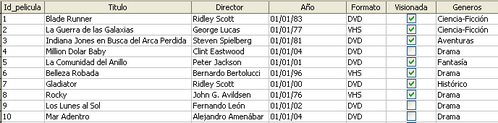

# 4.1. relaciones entre tablas

El problema de la información repetida

Una de las grandes ventajas de las bases de datos es que podemos tener toda la información que necesitamos almacenar en varias tablas, relacionadas entre ellas, en lugar de una única tabla enorme con toda la información.

Se podría pensar en añadir una nueva columna (no la hagáis) a la **tabla Peliculas** que se llamara Género, de manera que por cada película almacenada también tuviera su género.

Si nos fijamos en esta solución podemos ver que se está repitiendo el mismo valor muchas veces, por ejemplo, Ciencia-Ficción aparece en cuatro filas y Drama en otras tantas.

¿Qué problemas podemos tener si lo hacemos así?

1. Que en algún momento nos equivoquemos al teclear, y escribamos, por ejemplo, Ciencia-Fusión.
2. Qué decidamos cambiar el nombre de un género, y por tanto tendríamos que cambiarlo en todas las filas.

