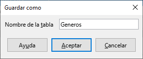

# 4.3. Tabla géneros

La información de géneros la vamos a crear en una nueva tabla e indicaremos de alguna forma que hay filas de la tabla PELICULAS y de la tabla GENEROS que están relacionadas.

Creamos la tabla géneros, con los campos **id_genero** y **nombre_genero**. **id_genero** hay que marcarlo como **clave principal**.

Al marcar **valor automático** a **SI**, no tendremos que rellenar este campo.

Y la guardamos con el nombre generos.

## Repaso de tablas

Ahora mismo deberíais tener 3 tablas:

## Rellenar géneros

Vamos a rellenar la tabla generos. En la primera columna no tenemos que poner nada, siempre se pondrán los valores automáticamente cuando pasemos a la siguiente fila.

🚩 Si no se autocompletan los números, revisa que id_genero sea clave principal.

