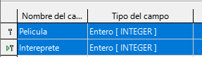
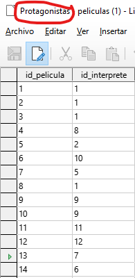
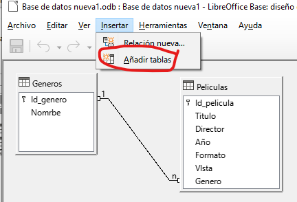
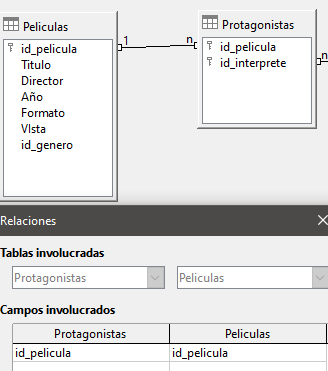
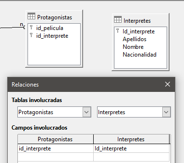

# 4.5. Relación películas - intérpretes (n a n)

También vamos a suponer que quisiéramos almacenar información (apellidos, nombre y nacionalidad) acerca de los principales intérpretes con cada una de nuestra películas.

## ¿Qué tipo de relación es?

En este caso puede darse el caso de:

- 1 película que tiene N intérpretes
- 1 intérprete que participa en N películas

La relación entre películas e intérpretes es de muchos a muchos (N a N).

## ¿Cómo lo podemos hacer?

A pesar de haber creado una **tabla interpretes**  anteriormente, podríamos haber pensado en agregar columnas a la **tabla peliculas** donde guardar la información acerca de sus protagonistas.

Esta solución es difícil de mantener y puede dar multitud de problemas y errores, por lo ya habíamos creado una **tabla interpretes**.

Cuando esto pasa, no basta con añadir una columna. Necesitamos crear una **nueva tabla** que relacione a las otras dos.

## Tabla protagonistas

A esta **tabla** la llamaremos **Protagonistas** con, al menos, dos columnas:

- Identificador de película
- Identificador de intérprete

Cada una de ellas para apuntar a cada una de las claves primarias respectivas de las tablas que queremos relacionar

Cada fila de esta tabla va a representar las relaciones que existen entre las filas de ambas tablas.

## Rellenar información protagonistas

Rellenaremos la tabla, asignando a cada id de película, un id de intérprete. La tabla es la que véis a la izquierda. Si os fijáis:

- La película 1 es blade runner, protagonizada por Harrison ford (intérprete número 1)
- La película 2 es la guerra de las galaxias, protagonizada también por él (intérprete 1)
- Etc.

Como véis la tabla protagonistas enlaza las películas con sus intérpretes, y viceversa.

## Crear las relaciones

Una vez que tenemos creada esta tabla nos falta indicar las **dos relaciones existentes**, siguiendo la misma mecánica que hemos visto en el anterior apartado.

Así, una vez que nos hemos situado de nuevo en la ventana Relaciones y hemos añadido las tablas que queremos relacionar a dicha ventana.

Agregamos la **tabla protagonistas**

Aquí véis las dos tablas que hemos añadido, pero que no están conectadas con nada más. Ahora vamos a enlazar estas 3 tablas entre sí:

## Relacionar películas y protagonistas

Estas dos tablas se relacionarán mediante el **campo id_pelicula**.

## Relacionar protagonistas e Interpretes

Del mismo modo relacionamos estas dos tablas, a través del **campo id_interprete** que aparece en ambas tablas.

## Resumen de relaciones

Resumiendo, al final las relaciones que hemos creado tienen que quedar así. Si tenéis así las relaciones, podéis pasar al siguiente apartado.

