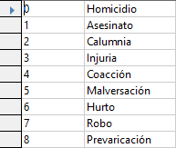

# 3. Nacionadidad y actividad delictiva

Vamos a crear 2 tablas adicionales. Separa en tablas diferentes esta información:

## Tabla nacionalidad.

Una idea de tabla podría ser:

## Tabla actividad delictiva.

!!! warning

    Una condena puede ser por diferentes delitos (más de uno) al mismo tiempo, como prevaricación y malversación, por ejemplo.

Una idea de tabla podría ser:

!!  warning

    Piensa que necesitarás crear o modificar columnas en la tabla delincuentes para relacionar estas nuevas tablas.

No paséis a relaciones hasta que tengáis al menos estas cuatro tablas.

(1 punto)