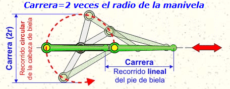

# Mecanismos de transformación

En este apartado veremos diversos mecanismos para transformar el movimiento.

## Manivela - torno

El **torno** es un cilindro unido a una rueda, cuyo centro se allà en el eje y alrededor del cual gira.

La potencia se aplica tangencialmente a la rueda, y la resistencia en una dirección tangente al cilindro.

## Piñón - cremallera

Es un sistema de engranajes que transforma **movimiento circular** en **lineal**.

El engranaje pequeño, llamado piñón, que gira alrededor de un eje. En ocasiones está conectado aun motor que lo mueve,
y en otras a algún tipo de manivela.

El piñón se conecta a una cremallera que se mueve linealmente, que es la que generalmente recibe la fuerza del piñón.
Al girar el piñón, la cremallera se desplaza en la dirección deseada.

En este ejemplo podemos ver su aplicación en un taladro de columna. Gracias también a un mecanismo de manivela, se
aumenta la fuerza ejercida, y por otro lado tenemos mayor **precisión**.

Se trata de un mecanismo **reversible**, que puede funcionar en sentido contrario. En este caso vemos el ejemplo de una
puerta de entrada de coches. La puerta se puede abrir tanto manualmente moviendo la verja como a través del motor.

En los **elevalunas** manuales, la luna del coche sube y baja gracias a este tipo de mecanismo, así como el de torno-manivela.

Al girar la manivela, hace girar al piñón. La cremallera mueve la ventana hacia arriba o abajo.
El sistema de piñón y cremallera convierte el movimiento rotatorio de la manivela en un movimiento lineal, permitiendo que la luna se desplace verticalmente.

## Tornillo y tuerca

Este mecanismo convierte el movimiento **circular** en movimiento **lineal**.
Está compuesto por un **tornillo** con rosca y una **tuerca** con rosca correspondiente.

Al girar el tornillo, la tuerca se desplaza linealmente a lo largo del eje. Podemos pensar en este mecanismo como un plano inclinado enrollado a lo largo del tornillo.

El tornillo y la tuerca nos permitirán realizar un apriete con una fuerza grande, gracias a la ventaja mecánica que nos ofrece.
La desventaja a priori es que deberemos dar muchas vueltas para que la tuerca avance.

Suponiendo las siguientes dimensiones:

**Ventaja mecánica**

Esta ventaja mecánica va a depender del paso o distancia entre los filetes, y del radio del tornillo.

Conseguimos multiplicar la fuerza por 21, aproximadamente.

**Avance**

El avance por vuelta es igual al paso de la rosca..

Por lo que, si queremos saber cuantas vueltas debemos dar para que la tuerca avance un centímetro:

Veamos un ejemplo con un **sargento**, que utilizamos para sujetar piezas con las que vamos a trabajar para que no se muevan

Si nos fijamos bien, realmente está compuesta por dos mecanismos:
En la parte superior, tenemos un tornillo-tuerca.

En la parte inferior el mango es más ancho que el tornillo, por lo que funciona como torno-manivela.

El **gato** de tijera, utilizado para levantar cargas muy pesadas, como levantar un coche para cambiar una rueda, está formado de dos mecanismos combinados

1. El husillo se acciona con una manivela, por lo que funciona como torno-manivela.
2. La manivela va unida a la tuerca, que mueve a su vez las barras
3. Por último, las barras funcionan a modo de palanca, por lo que se amplifica la fuerza del husillo, facilitando el levantamiento con poco esfuerzo.

## Tornillo sin fin

Transforma el movimiento rotacional en movimiento lineal o en otro rotacional, con gran reducción de velocidad.

Este es un mecanismo **reductor**, pues reduce la velocidad de la corona, el engranaje grande. Gracias a esto nos proporciona
una gran precisión, siendo útil en diferentes objetos como relojes, instrumentos de medición o sistemas de posicionamiento de alta precisión

Asímismo, se trata de un mecanismo no reversible, por lo que la corona no puede mover el tornillo sin fin.
Esto produce **autobloqueo**, útil para evitar retrocesos o movimientos indeseados.

Al mismo tiempo proporciona **ventaja mecánica**, aumentando el par (fuerza).

Al girar el tornillo 1 vuelta, el engranaje avanza la distancia igual al paso entre 2 dientes del tornillo.

Necesitaríamos 36 vueltas del tornillo para que el engranaje de 1

Un ejemplo lo encontramos en el **clavijero** de instrumentos de cuerda. En él se alojan las **clavijas**, una para cada cuerda,
que permiten tensar o aflojar independientemente las cuerdas del instrumento.

El tornillo sin fin no es reversible, por lo que la tensión de la cuerda no puede aflojar la afinación por sí sola.

Es un mecanismo que, al ser reductor, nos proporciona gran precisión en el ajuste. Pequeños giros permiten cambiar finamente la
tensión de la cuerda, ideal para afinaciones exactas.

La relación de transmisión de este mecanismo es `1 / Z`, donde Z es el número de dientes del engranaje.

En este caso, al tener 18 dientes, necesitamos 18 vueltas de clavija para que el engranaje de una vuelta completa.

## Biela - manivela

Transformar el movimiento lineal alternativo en movimiento circular o viceversa.
Consiste en una biela, que es una barra que se mueve linealmente, conectada a una manivela, que es un brazo que gira alrededor de un eje.
Al mover la biela, la manivela gira y viceversa.

Se llama carrera al recorrido lineal que se realiza, y que corresponde al doble del radio de la manivela.

Este mecanismo también lo podemos encontrar en los motores. En este caso, el pistón es el que se conecta mediante al cigüeñal
mediante una biela. Al producirse la combustión, esta desplaa el pistón hacia abajo, empujando la biela que a su vez hace girar
el cigüeñal. Al seguir girando, este empuja de nuevo la biela que hace subir a su vez el pistón, expulsando los productos
de la combustión hacia el exterior.

En una máquina de coser, el motor hace girar la manivela, que a su vez se une a la aguja mediante una biela.
De este modo, la aguja sube y baja en un movimiento lineal alternativo.

## Levas

La leva es un disco o pieza con un perfil especial. En las levas el movimiento es guiado por el propio perfil de la leva.
Al girar, empuja un seguidor, que se mueve según una trayectoria definida.

🚗 Aplicaciones:
Motores de automóvil:El árbol de levas acciona las válvulas de admisión y escape,coordinando la entrada de aire y la salida de gases
🧵 Máquinas textiles:
Las levas controlan el movimiento preciso de las agujas para formar los patrones del tejido.
⚙️ Ventaja: Permite convertir movimiento rotativo en movimiento lineal con gran precisión.

El recorrido lineal será igual a `D = R - r`, los radios mayor y menor de la leva.
