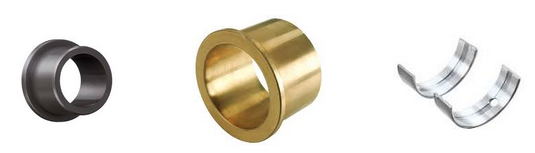
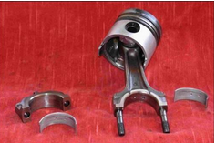
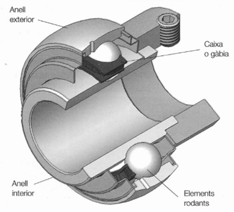
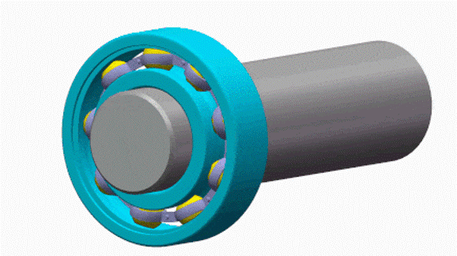
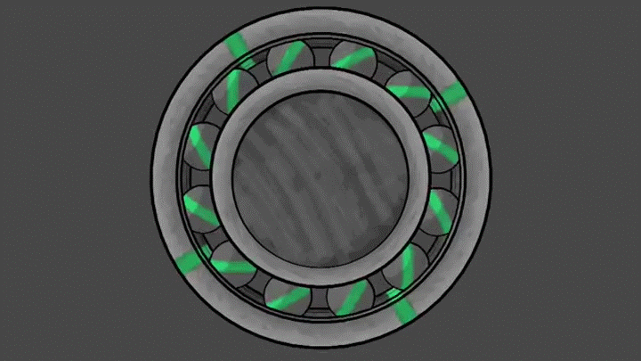
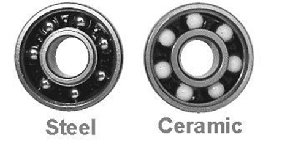
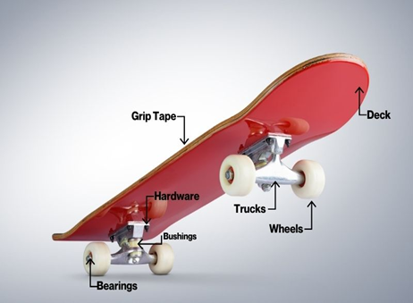
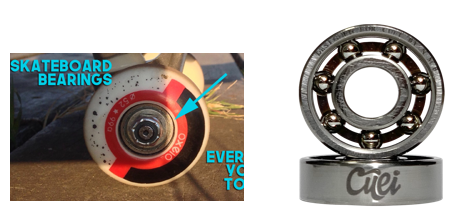

# Mecanismos de Soporte

Muchas partes móviles giran apoyadas sobre alguna otra pieza.
Es por ello que, debido al contacto, se genera una fricción que puede dificultar
el movimiento o generar calor.

Es por ello que se interponen entre ambos elementos que reducen el rozamiento entre piezas móviles y su soporte, protegiendo componentes más importantes y permitiendo un funcionamiento suave.

Estos componentes colocados entre partes móviles y su soporte. Soportan el rozamiento y el desgaste.

## Rozamiento y Rodadura

El `rozamiento` es la fuerza que se opone al movimiento cuando dos superficies están en contacto.

Se ve afectado por diferentes factores:

- **Materiales:**
  - Más adhesivos → más fricción.
  - Más deslizantes → menos.
- **Peso:** A mayor peso, más fricción.
- **Estado de las superficies:**
  - Ásperas → más fricción.
  - Pulidas o lubricadas → menos.

En cambio, la `rodadura` ocurre cuando un cuerpo **rueda** sobre otro, en lugar de deslizarse.
En general, suele ser **menor** que el coeficiente de rozamiento por deslizamiento.

## Cojinetes

Los cojinetes son componentes que permiten el giro de ejes reduciendo la fricción.

El cojinete **roza con el eje**, generando desgaste en sí mismo, no en el eje.
Se cambian cuando su desgaste supera los límites tolerables.

El cojinete se fija al soporte y el eje gira dentro de él. Entre soporte y eje existe un pequeños
espacio llamado **juego de montaje**, que es la diferencia normalizada entre ambos diámetros (en décimas o centésimas de milímetro).

Los cojinetes pueden ser de diferentes materiales en función de su aplicación:

- **Plástico:** Para esfuerzos pequeños.
- **Bronce:** Para esfuerzos medios (motores eléctricos).
- **Acero:** Para grandes esfuerzos, recubiertos interiormente con material antifricción (estaño o plomo).

Un ejemplo lo podemos encontrar en los motores de coches. Las _bielas_ están unidas al **cigüeñal**
y en medio se colocan cojinetes, que reducen la fricción entre las bielas y el cigüeñal.

Son estas plaquitas de color plateado mate que podéis ver.

## Rodamientos

Los rodamientos en cambio, permiten el movimiento por **rodadura** entre piezas móviles, reduciendo mucho la fricción.

En su interior se alojan diferentes piezas que ruedan, que pueden ser de distintos tipos:

- De **esferas**
- De **cilindros**
- De **conos**

En el caso de esferas, estas se alojan entre los dos soportes:

Las bolas giran en su interior al mismo tiempo que soportan el peso.

Los hay de diferentes materiales:

Como ejemplo, en los patinetes o en general cuando hay ruedas que giran
libremente sobre un eje, encontramos rodamientos en las ruedas:

En su interior se alojan los rodamientos, que minimizan la fricción
y facilitan el giro:

