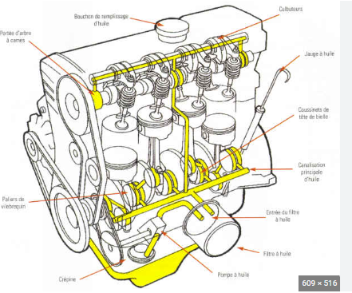

# Lubrificació

La lubricación es esencial para el funcionamiento de la mayoría de las máquinas.

Sin ella, las piezas se rozan entre sí, lo que genera **calor**, **desgaste** y, en última instancia, la falla del mecanismo.

Entre las múltiples ventajas tenemos las siguientes:

1. Forman una película lubricante entre superficies en movimiento.**Evitan el contacto directo entre metales**,
   lo que facilita el movimiento suave.
2. Disminuyen el **desgaste**: Al reducir la fricción, también protegen las piezas del deterioro, aumentando su vida útil.
3. Disipan el **calor**: absorben y transportan el calor generado por el rozamiento, evitando el sobrecalentamiento.
4. Previenen la **corrosión**: incluyen aditivos **anticorrosivos** que protegen las superficies metálicas
   de la oxidación.

## Mantenimento

Un mantenimiento adecuado del sistema de lubricación y la limpieza también son esenciales para una lubricación eficaz. Si la lubricación es inadecuada o insuficiente, puede provocar un aumento del rozamiento y de la temperatura, lo que puede acelerar el desgaste y afectar negativamente a la vida útil de los mecanismos.

## 🛢️ Denominación del aceite – Escala SAE

La denominación del aceite se basa en una **escala de viscosidad**,
establecida por la **Sociedad de Ingenieros de Automoción (SAE)**.

Esta escala clasifica los aceites según su **viscosidad** (o consistencia)
a distintas **temperaturas**, mediante un procedimiento **estandarizado**.

## 🌡️ ¿Qué significan los números?

La denominación incluye dos valores separados por una letra **W** ("Winter", invierno):

> Ejemplo: **10W-40**

- **10W** → Viscosidad a **bajas temperaturas** (aceite en frío)
- **40** → Viscosidad a **altas temperaturas** (aceite a 100 °C)

📌 Un número menor delante de la W indica mejor fluidez en frío.
📌 Un número mayor detrás de la W indica mejor resistencia a temperaturas elevadas.

## Circuitos

Los sistemas de lubricación cuentan con diferentes mecanismos para la recirculación del lubricante. El aceite debe ser bombeado a través del circuito y luego retornado a un recipiente (cárter) donde se recoge.

El **carter** se encuentra en la parte inferior del motor. y recoge el aceite,
y se situa en la parte inferior del vehículo.

Una bomba recoge el aceite y lo impulsa a través del circuito, que transporta
el aceite para lubricar las diferentes piezas.

## 🧽 Filtro de aceite

El aceite del motor **recoge partículas** y restos de **desgaste** de las piezas,
que se liberan debido a la **fricción** durante el funcionamiento.

## ♻️ ¿Por qué filtrar el aceite?

- Al reutilizar el aceite, es necesario **eliminar impurezas** mediante **filtración**.
- Esto evita que los restos circulen y dañen el motor.

## 🔄 ¿Cómo se realiza la filtración?

- Se toma una **derivación de aceite a presión** _antes_ de que llegue a los puntos de lubricación.
- El aceite pasa por un **filtro**, que retiene la suciedad.

## ✅ Ventaja del sistema:

Si el filtro se **obstruye**, la lubricación **no se interrumpe**,
ya que el aceite puede seguir circulando por el circuito principal sin pasar por el filtro.

# 🛢️ ¿Cómo funciona el filtro de aceite?

## 🔄 Circulación del aceite:

1. El aceite entra por unos **orificios** laterales del filtro.
2. Circula a través del **material filtrante**, que retiene la suciedad.
3. Sale limpio por la parte **central** del filtro.
4. Los **residuos e impurezas** quedan **atrapados** en el interior del filtro.

## 📏 Comprobación del nivel de aceite:

Se utiliza una **varilla medidora (dipstick)** que se extrae del motor para revisar el nivel.

## ❓ ¿Por qué baja el nivel de aceite?

El aceite del motor se **consume con el uso** por varios motivos:

- 🔥 **Evaporación** a altas temperaturas.
- 💨 Pequeñas cantidades se **queman** durante la **combustión**.
- 🔧 Puede haber **fugas** o pérdidas internas por desgaste del motor.

## ✅ Recomendación:

Es **normal** que el nivel baje con el tiempo.
🔁 **Revisar y rellenar** el aceite periódicamente para evitar daños al motor.

El aceite debe mantenerse entre dos marcas de la varilla:

