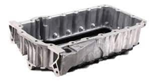
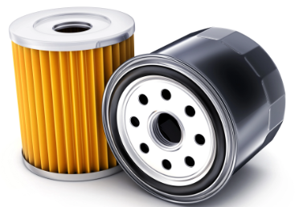

# Lubrificació

La lubricación es esencial para el funcionamiento de la mayoría de las máquinas.

Sin ella, las piezas se rozan entre sí, lo que genera **calor**, **desgaste** y, en última instancia, la falla del mecanismo.

Entre las múltiples ventajas tenemos las siguientes:

1. Forman una película lubricante entre superficies en movimiento.**Evitan el contacto directo entre metales**,
   lo que facilita el movimiento suave.
2. Disminuyen el **desgaste**: Al reducir la fricción, también protegen las piezas del deterioro, aumentando su vida útil.
3. Disipan el **calor**: absorben y transportan el calor generado por el rozamiento, evitando el sobrecalentamiento.
4. Previenen la **corrosión**: incluyen aditivos **anticorrosivos** que protegen las superficies metálicas
   de la oxidación.

## Mantenimento

Un mantenimiento adecuado del sistema de lubricación y la limpieza también son esenciales para una lubricación eficaz. Si la lubricación es inadecuada o insuficiente, puede provocar un aumento del rozamiento y de la temperatura, lo que puede acelerar el desgaste y afectar negativamente a la vida útil de los mecanismos.

## Aceites

La denominación del aceite se basa en una **escala de viscosidad** que se mide a través de un procedimiento
estandarizado y establecido por la Sociedad de Ingenieros de Automoción (SAE). Esta escala clasifica los
aceites según su consistencia o viscosidad a diferentes temperaturas.

En la denominación del aceite se hace referencia a su viscosidad a 100 grados Celsius, la cual se representa
con la letra "W" (que significa "Winter" o invierno en inglés). Así, por ejemplo, un aceite 10W-40 tiene una
viscosidad de 10 a bajas temperaturas (en frío) y de 40 a altas temperaturas (en caliente).

## Circuitos

Los sistemas de lubricación cuentan con diferentes mecanismos para la recirculación del lubricante. El aceite debe ser bombeado a través del circuito y luego retornado a un recipiente (cárter) donde se recoge.

El **carter** se encuentra en la parte inferior del motor. y recoge el aceite,
y se situa en la parte inferior del vehículo.

Una bomba recoge el aceite y lo impulsa a través del circuito, que transporta
el aceite para lubricar las diferentes piezas.

## Filtro

El aceite va recogiendo restos de desgaste de las piezas que se liberan
al aceite por la fricción.

Es por ello que la reutilización del aceite requiere filtración.

La filtración implica tomar una **derivación** de aceite a presión antes de
que llegue a los puntos de lubricación para pasarlo por un filtro.

Esto tiene la ventaja de que, si el filtro se obstruye, la lubricación no se viene afectada.

El aceite entra por unos orificios del filtro y sale por la parte central.

- El aceite entra por unos **orificios** del filtro.
- Circula a través del material filtrante y sale por la parte **central**.
- Los **residuos** e impurezas quedan **atrapados** en el filtro.

Mediante una varilla extraíble podemos comprobar el nivel de aceite, que también se va
gastando debido a varios factores:

- El aceite del motor se consume por **evaporación** a altas temperaturas
- Por pequeñas cantidades que se **queman** durante la **combustión**.
- También puede perderse por desgaste interno del motor o por **fugas**.

Es normal que el nivel baje con el uso. Por eso, se recomienda revisarlo y rellenarlo periódicamente.

El aceite debe mantenerse entre dos marcas de la varilla:

