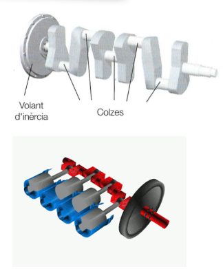
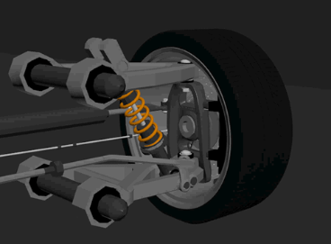
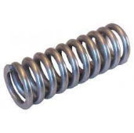
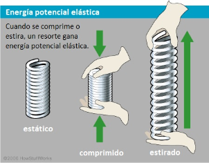
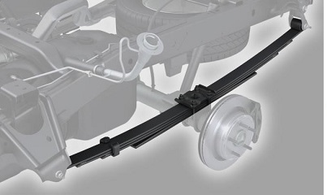
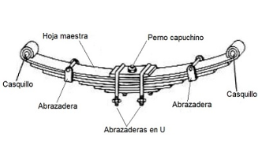
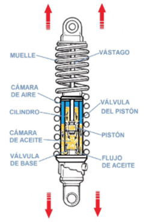
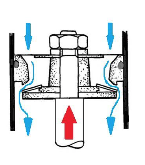

# 📚 Acumuladores de Energía

## 🔋 ¿Qué son?

Los mecanismos acumuladores son dispositivos que **almacenan energía** para liberarla posteriormente cuando sea necesario.
Tipos de energía que pueden almacenar:

- Mecánica
- Hidráulica
- Neumática
- Eléctrica

---

## ⚙️ Volante de Inercia en Motores

### 📌 ¿Por qué es necesario?

- En motores (vapor o combustión interna) el trabajo motor se suministra de forma **discontinua**.
- Las máquinas requieren trabajo **prácticamente constante**.

### ⚡ Ejemplo: Motor de explosión

El **volante de inercia**:

- Suaviza las fluctuaciones de potencia.
- Se coloca en el extremo del **cigüeñal**.
- Almacena energía y la libera para mantener la rotación constante.

## 🔄 Energía Cinética Rotacional

### 📌 ¿Qué es?

Es la energía asociada al movimiento de rotación de un objeto alrededor de un eje.

### 🔧 ¿Cómo se determina?

- Depende de la **distribución de la masa** respecto al eje.
- **Más alejada la masa del eje ➝ mayor momento de inercia**.

### ⚡ Principio para reducirlo:

Concentrar la masa **cerca del eje de rotación**.

---

## 📏 Momento de Inercia

- Se expresa en **kg·m²**.
- Cuanto mayor, más difícil es cambiar la velocidad de rotación de un objeto.

**Ejemplo:**
Hacer girar una varilla desde un extremo es más difícil cuanto mayor sea su momento de inercia.

---

## 🌀 Conservación del Momento Angular

El **momento angular total de un sistema aislado permanece constante** si no hay fuerzas externas (torques) actuando sobre él.

---

## 📊 Cálculo de Energía Acumulada

**Fórmula:**
Para un volante de inercia:

- Masa (m)
- Radio (R)
- Velocidad angular (ω)

**Ejemplo:**

- R = 0,15 m
- m = 500 g
- ω = 2400 rpm

---

# 🚗 Suspensiones

Sistema que conecta las ruedas con el chasis para:

- **Absorber impactos**
- **Mantener el control** ante irregularidades del terreno

## 📎 Componentes:

### 🌀 Muelles (Resortes)

- Absorben impactos deformándose.
- Acumulan **energía potencial elástica**.
- Recuperan su forma al cesar la fuerza.

**Ley de Hooke:**
`F = k * x`

**Energía almacenada:**
`E = 1/2 * k * x²`

**Ejemplo:**
Amortiguador con `k = 3000 N/m` y deformación de `0,15 m`.
Calcular energía potencial almacenada.

### 🌀 Ballestas

- Láminas de acero unidas por abrazaderas.
- Se flexionan y absorben impactos.
- Comunes en **vehículos pesados**.

**Capacidad depende de:**

- Número de hojas
- Espesor y ancho
- Calidad del acero

Cuando el vehículo circula por un terreno irregular, las vibraciones producidas son absorbidas
por las ballestas, las cuales, al flexionarse, evitan que se transmitan a la carrocería del vehículo.

## Resonancia en Muelles

Cuando se aplica y luego se suelta una carga sobre un muelle, este comienza a oscilar
a una **frecuencia natural o propia**, determinada por sus características físicas como
la rigidez y la masa. Si sobre ese muelle se aplican impulsos o fuerzas repetidas con
una frecuencia que **coincide con su frecuencia propia**, se produce un fenómeno
llamado **resonancia**.

En este caso, la energía de cada impulso se acumula en el sistema, lo que provoca un aumento
progresivo de la **amplitud de las oscilaciones**. Si no se controla, este incremento puede ser
tan grande que llegue a **dañar el sistema**, provocando deformaciones o incluso roturas.

Para prevenir la resonancia en sistemas con muelles o ballestas, es común asociarles
**amortiguadores**. Estos componentes disipan parte de la energía del movimiento, reduciendo
las oscilaciones y evitando que la amplitud crezca de manera peligrosa, asegurando así un
funcionamiento más seguro y estable del conjunto.

### 🌀 Amortiguadores

- Disipan energía del movimiento de los muelles.
- Evitan el rebote continuo.
- Controlan las oscilaciones y mejoran estabilidad.

Estructura básica:

- Una cámara llena de aceite hidráulico.
- Dentro de la cámara, se mueve un émbolo con agujeros calibrados.
  Funcionamiento:
  El aceite fluye a través de los agujeros del émbolo.
  Amortiguamiento: El aceite se fuerza a pasar por aperturas de tamaño diferenciado.
  Efecto:
  El paso controlado del aceite reduce la velocidad de los movimientos bruscos, absorbiendo impactos y vibraciones.

El paso controlado del aceite reduce la velocidad de los movimientos bruscos,
absorbiendo impactos y vibraciones
.

https://m.youtube.com/watch?v=fKIdx5dSjLA

## 📋 Resumen:

| Elemento           | Función Principal                             | Ejemplos de uso                 |
| :----------------- | :-------------------------------------------- | :------------------------------ |
| Volante de inercia | Almacenar energía rotacional                  | Motores, turbinas               |
| Muelles            | Absorber impactos, almacenar energía elástica | Suspensiones, puertas, juguetes |
| Ballestas          | Absorber grandes impactos mediante flexión    | Camiones, autobuses             |
| Amortiguadores     | Controlar rebote y disipar energía            | Suspensiones de vehículos       |
