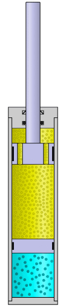

# 📚 Acumuladores de Energía

## 🔋 ¿Qué son?

Los mecanismos acumuladores son dispositivos que **almacenan energía** para liberarla posteriormente cuando sea necesario.
Tipos de energía que pueden almacenar:

- Mecánica
- Hidráulica
- Neumática
- Eléctrica

---

## ⚙️ Volante de Inercia en Motores

### 📌 ¿Por qué es necesario?

- En motores (vapor o combustión interna) el trabajo motor se suministra de forma **discontinua**.
- Las máquinas requieren trabajo **prácticamente constante**.

### ⚡ Ejemplo: Motor de explosión

El **volante de inercia**:

- Suaviza las fluctuaciones de potencia.
- Se coloca en el extremo del **cigüeñal**.
- Almacena energía y la libera para mantener la rotación constante.

## 🔄 Energía Cinética Rotacional

### 📌 ¿Qué es?

Es la energía asociada al movimiento de rotación de un objeto alrededor de un eje.

### 🔧 ¿Cómo se determina?

- Depende de la **distribución de la masa** respecto al eje.
- **Más alejada la masa del eje ➝ mayor momento de inercia**.

### ⚡ Principio para reducirlo:

Concentrar la masa **cerca del eje de rotación**.

---

## 📏 Momento de Inercia

- Se expresa en **kg·m²**.
- Cuanto mayor, más difícil es cambiar la velocidad de rotación de un objeto.

**Ejemplo:**
Hacer girar una varilla desde un extremo es más difícil cuanto mayor sea su momento de inercia.

---

## 🌀 Conservación del Momento Angular

El **momento angular total de un sistema aislado permanece constante** si no hay fuerzas externas (torques) actuando sobre él.

---

## 📊 Cálculo de Energía Acumulada

**Fórmula:**
Para un volante de inercia:

- Masa (m)
- Radio (R)
- Velocidad angular (ω)

**Ejemplo:**

- R = 0,15 m
- m = 500 g
- ω = 2400 rpm

---

# 🚗 Suspensiones

Sistema que conecta las ruedas con el chasis para:

- **Absorber impactos**
- **Mantener el control** ante irregularidades del terreno

## 📎 Componentes:

### 🌀 Muelles (Resortes)

- Absorben impactos deformándose.
- Acumulan **energía potencial elástica**.
- Recuperan su forma al cesar la fuerza.

**Ley de Hooke:**
`F = k * x`

**Energía almacenada:**
`E = 1/2 * k * x²`

**Ejemplo:**
Amortiguador con `k = 3000 N/m` y deformación de `0,15 m`.
Calcular energía potencial almacenada.

### 🌀 Ballestas

- Láminas de acero unidas por abrazaderas.
- Se flexionan y absorben impactos.
- Comunes en **vehículos pesados**.

**Capacidad depende de:**

- Número de hojas
- Espesor y ancho
- Calidad del acero

Cuando el vehículo circula por un terreno irregular, las vibraciones producidas son absorbidas
por las ballestas, las cuales, al flexionarse, evitan que se transmitan a la carrocería del vehículo.

### 🌀 Amortiguadores

- Disipan energía del movimiento de los muelles.
- Evitan el rebote continuo.
- Controlan las oscilaciones y mejoran estabilidad.

Estructura básica:

- Una cámara llena de aceite hidráulico.
- Dentro de la cámara, se mueve un émbolo con agujeros calibrados.
  Funcionamiento:
  El aceite fluye a través de los agujeros del émbolo.
  Amortiguamiento: El aceite se fuerza a pasar por aperturas de tamaño diferenciado.
  Efecto:
  El paso controlado del aceite reduce la velocidad de los movimientos bruscos, absorbiendo impactos y vibraciones.

El paso controlado del aceite reduce la velocidad de los movimientos bruscos,
absorbiendo impactos y vibraciones
.

## Tipos de Amortiguadores

Los amortiguadores pueden clasificarse en **no presurizados** y **presurizados**, según su diseño
interno y el tipo de fluido o gas que utilizan.

Los **amortiguadores no presurizados** contienen únicamente **aceite** en su interior.
Aunque su construcción es más sencilla y económica, presentan algunas desventajas importantes.
La principal es la **formación de bolsas de aire**, que afectan negativamente al
rendimiento del amortiguador. Además, en **climas fríos**, su eficacia se ve reducida, ya que el aceite se vuelve más viscoso y no circula correctamente, lo que limita su capacidad para absorber impactos de manera eficiente.

Por otro lado, los **amortiguadores presurizados** incorporan tanto **aceite como gas
(normalmente nitrógeno)** a presión. Esta combinación permite un funcionamiento más
constante y eficaz, especialmente en condiciones extremas. Gracias al gas presurizado,
se reduce la formación de burbujas de aire y se mejora la **estabilidad y comodidad de marcha**,
lo que los convierte en una opción preferida para vehículos de alto rendimiento o uso exigente.

## Tipos de Amortiguadores Presurizados

Dentro de los amortiguadores presurizados, existen principalmente dos diseños: **doble tubo** y **monotubo**.

Los **amortiguadores de doble tubo** constan de dos cámaras o tubos concéntricos. La cámara interior contiene el aceite, mientras que la cámara exterior actúa como reserva. Cuando el vástago se introduce en el cuerpo del amortiguador, el aceite fluye a través de válvulas ubicadas en el pistón, lo que permite amortiguar el movimiento. Parte del aceite desplazado se transfiere a la cámara de reserva a través de la válvula de pie, asegurando que el sistema mantenga un volumen de aceite adecuado durante todo el recorrido.

Los **amortiguadores monotubo**, también conocidos como de **dos cámaras con gas presurizado**, presentan una única carcasa dividida internamente por un **pistón flotante**. Esta carcasa contiene una cámara de aceite y otra de gas presurizado. Cuando el vástago se comprime, desplaza el aceite, el cual ejerce presión sobre el pistón flotante, comprimiendo el gas. Este diseño permite mantener una **presión interna constante** y reduce significativamente la formación de burbujas, mejorando así el rendimiento incluso en situaciones de alta exigencia.

## 🎵 Resonancia en Muelles

**Frecuencia propia:**
Cuando un muelle oscila tras aplicar y soltar una carga.

**Resonancia:**
Ocurre si la frecuencia de impulsos coincide con su frecuencia propia, provocando **amplitudes crecientes** que pueden dañar el sistema.

**Prevención:**
Asociar **amortiguadores** a muelles y ballestas.

https://m.youtube.com/watch?v=fKIdx5dSjLA

## 📋 Resumen:

| Elemento           | Función Principal                             | Ejemplos de uso                 |
| :----------------- | :-------------------------------------------- | :------------------------------ |
| Volante de inercia | Almacenar energía rotacional                  | Motores, turbinas               |
| Muelles            | Absorber impactos, almacenar energía elástica | Suspensiones, puertas, juguetes |
| Ballestas          | Absorber grandes impactos mediante flexión    | Camiones, autobuses             |
| Amortiguadores     | Controlar rebote y disipar energía            | Suspensiones de vehículos       |
