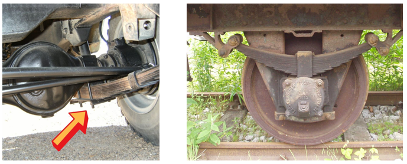
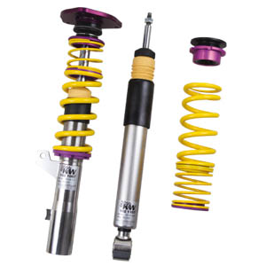

# 📚 Acumuladores de Energía

## 🔋 ¿Qué son?

Los mecanismos acumuladores son dispositivos que **almacenan energía** para liberarla posteriormente cuando sea necesario.

## ⚙️ Volante de Inercia en Motores

### 📌 ¿Por qué es necesario?

En motores (vapor o combustión interna) el trabajo motor se suministra de forma **discontinua**, es decir, a tirones.

En un motor, el **volante de inercia** de coloca en el extremo del **cigüeñal**. Almacena energía y la libera para mantener la rotación constante.

# Energía cinética rotacional

Cuando algo gira, como una peonza o un volante de inercia, **tiene energía por estar rotando**.
Esa energía se llama **energía cinética rotacional**.

Es parecida a la energía que tiene un coche en movimiento, pero en lugar de ir en línea recta, está dando vueltas.

📏 ¿De qué depende?

De dos cosas:

- De lo rápido que gira (su **velocidad angular**, en rpm o rad/s).
- De cómo está **distribuida su masa** respecto al eje de giro.

👉 Cuanto más lejos esté la masa del eje, más cuesta hacerlo girar o frenarlo.
A eso se le llama **momento de inercia**.

Ejemplo sencillo:

Si giras una pesa con los brazos estirados, cuesta más que si los tienes pegados al cuerpo.
Eso es porque al alejar la masa (las pesas) del eje (tu cuerpo) aumentas el momento de inercia.

### 🌀 ¿Qué hace un volante de inercia?

Un volante de inercia es una rueda pesada que almacena energía cuando gira.
👉 Cuanto más rápido gira y más grande es, más energía guarda.

Cuando necesita devolver esa energía, mantiene el giro aunque el motor o la fuerza
que lo impulsa se detenga un momento.
Esto ayuda a que las máquinas **giren de manera más suave y constante**.

📊 ¿Cómo se calcula la energía que almacena?
Se usa esta fórmula:

Energía rotacional = (1/2) × momento de inercia × (velocidad angular)²

Si conoces:

- El peso (masa)
- El tamaño (radio)
- Y a qué velocidad gira (rpm o rad/s)

# 🚗 Suspensiones

Sistema que conecta las ruedas con el chasis para:

- **Absorber impactos**
- **Mantener el control** ante irregularidades del terreno

## 📎 Componentes:

### 🌀 Muelles (Resortes)

- Absorben impactos deformándose.
- Acumulan **energía potencial elástica**.
- Recuperan su forma al cesar la fuerza.

**Ley de Hooke:**
`F = k * x`

**Energía almacenada:**
`E = 1/2 * k * x²`

**Ejemplo:**
Amortiguador con `k = 3000 N/m` y deformación de `0,15 m`.
Calcular energía potencial almacenada.

### 🌀 Ballestas

- Láminas de acero unidas por abrazaderas.
- Se flexionan y absorben impactos.
- Comunes en **vehículos pesados**.

**Capacidad depende de:**

- Número de hojas
- Espesor y ancho
- Calidad del acero

Cuando el vehículo circula por un terreno irregular, las vibraciones producidas son absorbidas
por las ballestas, las cuales, al flexionarse, evitan que se transmitan a la carrocería del vehículo.

## Resonancia en Muelles

Cuando se aplica y luego se suelta una carga sobre un muelle, este comienza a oscilar
a una **frecuencia natural o propia**, determinada por sus características físicas como
la rigidez y la masa. Si sobre ese muelle se aplican impulsos o fuerzas repetidas con
una frecuencia que **coincide con su frecuencia propia**, se produce un fenómeno
llamado **resonancia**.

En este caso, la energía de cada impulso se acumula en el sistema, lo que provoca un aumento
progresivo de la **amplitud de las oscilaciones**. Si no se controla, este incremento puede ser
tan grande que llegue a **dañar el sistema**, provocando deformaciones o incluso roturas.

Para prevenir la resonancia en sistemas con muelles o ballestas, es común asociarles
**amortiguadores**. Estos componentes disipan parte de la energía del movimiento, reduciendo
las oscilaciones y evitando que la amplitud crezca de manera peligrosa, asegurando así un
funcionamiento más seguro y estable del conjunto.

### 🌀 Amortiguadores

- Disipan energía del movimiento de los muelles.
- Evitan el rebote continuo.
- Controlan las oscilaciones y mejoran estabilidad.

Estructura básica:

- Una cámara llena de aceite hidráulico.
- Dentro de la cámara, se mueve un émbolo con agujeros calibrados.
  Funcionamiento:
  El aceite fluye a través de los agujeros del émbolo.
  Amortiguamiento: El aceite se fuerza a pasar por aperturas de tamaño diferenciado.
  Efecto:
  El paso controlado del aceite reduce la velocidad de los movimientos bruscos, absorbiendo impactos y vibraciones.

El paso controlado del aceite reduce la velocidad de los movimientos bruscos,
absorbiendo impactos y vibraciones
.

https://m.youtube.com/watch?v=fKIdx5dSjLA

## 📋 Resumen:

| Elemento           | Función Principal                             | Ejemplos de uso                 |
| :----------------- | :-------------------------------------------- | :------------------------------ |
| Volante de inercia | Almacenar energía rotacional                  | Motores, turbinas               |
| Muelles            | Absorber impactos, almacenar energía elástica | Suspensiones, puertas, juguetes |
| Ballestas          | Absorber grandes impactos mediante flexión    | Camiones, autobuses             |
| Amortiguadores     | Controlar rebote y disipar energía            | Suspensiones de vehículos       |
