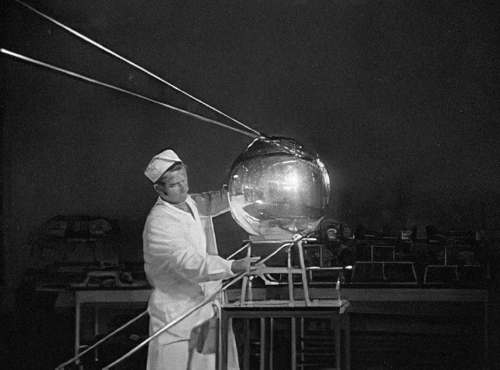

# Aviación

# Primer vuelo de los hermanos Wright

El 17 de diciembre de 1903, los ``hermanos Wright`` realizaron el primer vuelo motorizado controlado de la historia en Kitty Hawk, Carolina del Norte. Orville Wright pilotó el vuelo histórico, que duró 12 segundos y recorrió 36 metros.

# Primer vuelo transatlántico

El 14-15 de junio de 1919, el aviador británico John Alcock y el navegante Arthur Whitten Brown realizaron el primer vuelo sin escalas sobre el Atlántico Norte. Partieron de Terranova, Canadá, y aterrizaron en una turbera cerca de Clifden, en la costa oeste de Irlanda.

# Primer vuelo alrededor del mundo

El 28 de septiembre de 1924, el equipo de la Fuerza Aérea de los Estados Unidos liderado por el teniente coronel Leslie Arnold completó el primer vuelo alrededor del mundo. La hazaña tomó 175 días y cubrió una distancia de 44,342 kilómetros.

---

# Primer vuelo comercial transcontinental

En 1929, la compañía aérea estadounidense Transcontinental Air Transport (más tarde conocida como TWA) comenzó a operar vuelos transcontinentales entre Nueva York y Los Ángeles, utilizando una combinación de vuelos aéreos y terrestres.

---

# Primer vuelo supersónico

El 14 de octubre de 1947, el piloto estadounidense Chuck Yeager rompió la barrera del sonido a bordo del avión experimental Bell X-1.

# Primer vuelo comercial a ``reacción``

El 2 de mayo de 1952, la aerolínea británica BOAC comenzó a operar vuelos comerciales regulares utilizando el avión a reacción de Havilland Comet.

# 1957

El 4 de octubre de 1957, la Unión Soviética lanzó el Sputnik 1, el primer satélite artificial, marcando el inicio de la era espacial. Con 83.6 kg y 58 cm de diámetro, completó órbitas alrededor de la Tierra cada 96.2 minutos, transmitiendo señales de radio. Este hito histórico desencadenó la carrera espacial durante la Guerra Fría.

# NASA

La NASA fue creada el 29 de julio de 1958 en respuesta al lanzamiento del Sputnik 1 por la Unión Soviética en 1957. Establecida mediante la Ley Nacional del Espacio, la agencia se formó bajo la administración de Dwight D. Eisenhower con el propósito de liderar los esfuerzos espaciales y aeroespaciales de los Estados Unidos durante la Guerra Fría.

# Primer vuelo comercial a ``gran altitud``

El 4 de octubre de 1958, la aerolínea estadounidense Pan American World Airways comenzó a operar vuelos comerciales en su avión Boeing 707, que podía volar a altitudes más altas que los aviones anteriores.

# Primer vuelo al espacio

El 12 de abril de 1961, el cosmonauta soviético ``Yuri Gagarin`` se convirtió en el primer ser humano en viajar al espacio, a bordo de la nave ``Vostok 1``.

Vostok 1 fue parte del programa espacial Vostok de la Unión Soviética.
Este vuelo fue un gran logro para la Unión Soviética en la Carrera Espacial y marcó el primer vuelo tripulado al espacio.

Yuri Gagarin se convirtió en el primer ser humano en orbitar la Tierra, consolidando un hito monumental en la historia de la exploración espacial.

El cohete Vostok-K utilizaba una combinación de motores de cohetes alimentados por ``queroseno y oxígeno líquido`` en varias etapas para impulsar la nave espacial Vostok 1 a través de la atmósfera y colocarla en órbita alrededor de la Tierra

# 1969

Apollo 11 (1969): El 20 de julio de 1969, la misión Apollo 11 de la NASA logró el primer alunizaje tripulado con Neil Armstrong y Buzz Aldrin, mientras Armstrong pronunciaba la famosa frase "Un pequeño paso para el hombre, un gran salto para la humanidad".

# Primer vuelo del ``Concorde``

El 2 de marzo de 1969, el avión supersónico Concorde realizó su primer vuelo de prueba en Toulouse, Francia.

# 1990

Lanzado el 24 de abril de 1990, el Telescopio Espacial Hubble ha proporcionado imágenes espectaculares del universo, revolucionando nuestra comprensión del cosmos y la astronomía.

# 1997

El primero de ellos fue el ``Sojourner``, parte de la misión ``Mars Pathfinder`` de la NASA, que aterrizó con éxito en Marte el 4 de julio de 1997.

# Primer vuelo del avión ``Airbus A380``

El 27 de abril de 2005, el avión comercial más grande del mundo, el Airbus A380, realizó su primer vuelo de prueba en Toulouse, Francia.