Diferencial: https://www.youtube.com/watch?v=MIsRpWqCNew
Turbo: https://youtu.be/UvWB3OMzBSA

# Movimiento del coche

En los motores de combustión interna con inyección de combustible, la gasolina se lleva del ``depósito de combustible`` a los cilindros a través de un sistema de inyección de combustible.

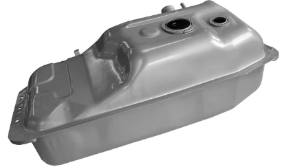

La ``gasolina`` se almacena en un depósito separado del motor y se inyecta directamente en los cilindros en la cantidad y momento adecuados mediante un sistema de inyección controlado por la unidad de control electrónico del motor (ECU).

## Sistema de inyección

El sistema de inyección de combustible está compuesto por:

La ``bomba de combustible`` se encarga de suministrar combustible desde el depósito de combustible hacia el ``regulador de presión`` de combustible, que se encarga de mantener la presión adecuada en el sistema.

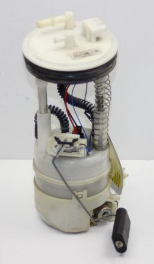

Luego, el combustible es ``inyectado`` en los cilindros en la cantidad y momento adecuados por medio de los ``inyectores de combustible``.

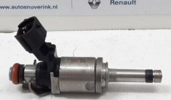

Los inyectores de combustible son válvulas controladas por la ECU que permiten la inyección de una cantidad precisa de combustible en los cilindros. Esta cantidad se controla mediante el tiempo que permanece abierta la válvula del inyector.

## Mezcla aire-combustible

La ``gasolina`` por sí sola no puede quemarse sin la presencia de ``oxígeno`` del aire. Por lo tanto, se inyecta aire en la gasolina para mezclarlo y formar la mezcla de combustible y aire adecuada para la combustión en el motor.

En los motores modernos de inyección de combustible, el combustible se inyecta directamente en los cilindros del motor en la cantidad y momento adecuados por medio de un sistema de inyección controlado por la ``unidad de control electrónico del motor (ECU)``.

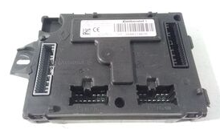

El aire necesario para la combustión se introduce en el motor a través de un ``sistema de admisión de aire``, que está diseñado para permitir que el aire fluya de manera eficiente hacia el interior del motor.

El sistema de admisión de aire generalmente consta de un ``filtro de aire``. El filtro de aire se encarga de filtrar las partículas y contaminantes del aire que entra en el motor.

El ``conducto de admisión`` se encarga de guiar el aire hacia el ``colector de admisión``, donde se mezcla con el combustible antes de entrar en los cilindros.

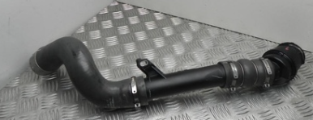

La mezcla de aire y combustible luego entra en el motor a través de la ``válvula de admisión``.

El ``árbol de levas`` es una parte fundamental del sistema de válvulas que controla la entrada y salida de aire y combustible en los cilindros del motor.

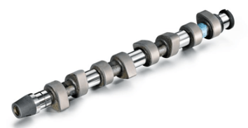

El árbol de levas gira a una velocidad determinada por la rotación del ``cigüeñal``, y cuenta con una serie de levas que abren y cierran las válvulas de admisión y escape en el momento preciso para permitir que la mezcla de combustible y aire entre en el cilindro y que los gases de escape salgan después de la combustión.

Los ``pistones`` se desplazan hacia arriba y hacia abajo en los cilindros, comprimiendo la mezcla de aire y combustible en el interior. Cuando la mezcla comprimida alcanza el punto de ignición, las bujías generan una chispa eléctrica que enciende la mezcla y provoca una explosión controlada. Esta explosión empuja el pistón hacia abajo con gran fuerza, convirtiendo la energía química en energía mecánica.

El movimiento del ``pistón`` se transmite al ``cigüeñal`` a través de las ``bielas``, que conectan el pistón con el cigüeñal. El cigüeñal convierte el movimiento lineal del pistón en movimiento rotativo, y es responsable de transmitir la energía mecánica generada por la combustión a la caja de cambios.

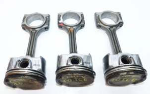

La ``caja de cambios`` permite al conductor seleccionar la marcha adecuada para la velocidad y carga del vehículo.

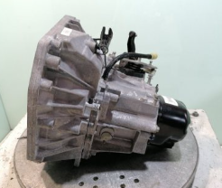

## Transmisión

El movimiento que obtenemos a la salida de la caja de cambios se debe transmitir a las ruedas del coche.

El ``embrague``, que se encuentra entre el motor y la caja de cambios, permite separar temporalmente el motor de la transmisión, lo que permite cambiar de marcha sin detener el motor.

La ``transmisión`` envía la energía a través de un ``eje de transmisión`` que se conecta al diferencial.

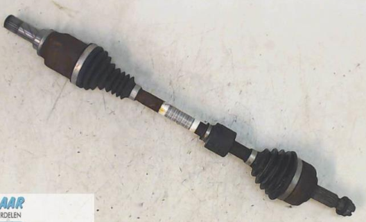

El ``diferencial`` divide esta energía en dos ejes de transmisión, uno para cada rueda trasera. A medida que las ruedas traseras giran, el diferencial permite que giren a velocidades diferentes, lo que compensa la diferencia de distancia recorrida en las curvas y evita el deslizamiento de las ruedas.

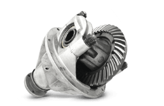

Los gases de escape son producidos por la combustión de la mezcla de combustible y aire en los cilindros del motor y son expulsados del motor a través del sistema de escape.pushe

El sistema de escape incluye un ``catalizador``, que es un dispositivo que reduce las emisiones de los gases de escape. El catalizador contiene metales preciosos como el platino y el paladio, que actúan como catalizadores para promover reacciones químicas que convierten los contaminantes nocivos en sustancias menos perjudiciales.

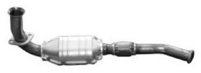