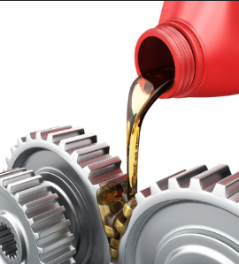

# Lubrificació

La lubricación es el proceso de colocar una sustancia entre dos piezas para disminuir el rozamiento y prevenir la oxidación, la suciedad y otras formas de desgaste. Esto produce una mejor eficiencia y vida útil de los mecanismos.

La lubricación es esencial para el funcionamiento de la mayoría de las máquinas.

Sin ella, las piezas se rozan entre sí, lo que genera calor, desgaste y, en última instancia, la falla del mecanismo.

## Mantenimento

Un mantenimiento adecuado del sistema de lubricación y la limpieza también son esenciales para una lubricación eficaz. Si la lubricación es inadecuada o insuficiente, puede provocar un aumento del rozamiento y de la temperatura, lo que puede acelerar el desgaste y afectar negativamente a la vida útil de los mecanismos.

## Aceites

La denominació de l'oli es basa en una escala de viscositat que es mesura a través d'un procediment estandarditzat i establert per la Societat d'Enginyers d'Automoció (SAE). Aquesta escala classifica els olis segons la seva consistència o viscositat a diferents temperatures.

En la denominació de l'oli es fa referència a la seva viscositat a 100 graus Celsius, la qual es representa amb la lletra "W" (que significa "Winter" o hivern en anglès). Així, per exemple, un oli 10W-40 té una viscositat de 10 a baixes temperatures (en fred) i de 40 a altes temperatures (en calent).

## Circuitos

Los sistemas de lubricación cuentan con diferentes mecanismos para la recirculación del lubricante. El aceite debe ser bombeado a través del circuito y luego retornado a un recipiente (cárter) donde se recoge.

El carter se encuentra en la parte inferior del motor.

## Filtro

La reutilización del aceite requiere filtración.

La filtración implica tomar una derivación de aceite a presión antes de que llegue a los puntos de lubricación para pasarlo por un filtro.

Esto tiene la ventaja de que, si el filtro se obstruye, la lubricación no se viene afectada.

El aceite entra por unos orificios del filtro y sale por la parte central.

