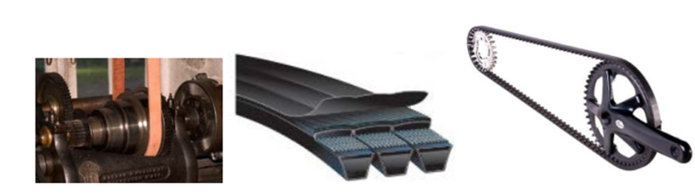
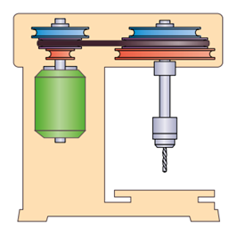
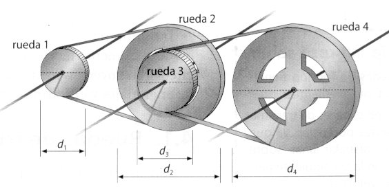
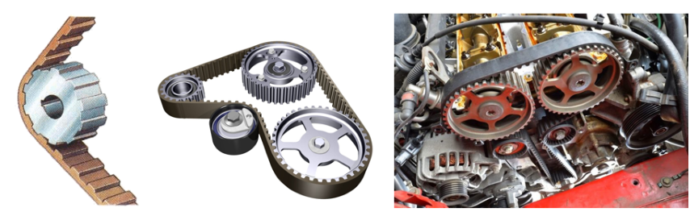

# Polea y correa

Mecanismo de transmisión de movimiento rotativo que se utiliza en aplicaciones de mayor distancia.

Consiste en una polea que se encuentra conectada al motor y que hace contacto con una correa que se extiende hacia otra polea, que a su vez transfiere el movimiento a la máquina o dispositivo que se desea mover.

Las correas pueden ser de diferentes tipos, como las planas, las trapezoidales o las dentadas, y su elección dependerá del tipo de aplicación.

Cuando se necesitan varias relaciones de transmisión diferentes se utilizan las poleas escalonadas.

Son especialmente útiles cuando queremos poder cambiar velocidades, ajustando la correa

Simulador: Simulador de polea y correa
https://www.blocklayer.com/pulley-belteng

Si se necesita una relación de transmisión muy elevada o muy reducida se utilizan los trenes de poleas.

Cuando se necesita una transmisión sin resbalamiento se utilizan las llamadas correas dentadas, que se estudiará más adelante, junto a la transmisión por cadena.

