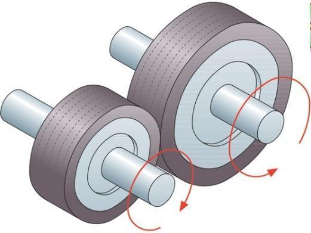
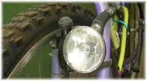

# Ruedas de fricción

Las ruedas de fricción consisten en dos ruedas que se presionan entre sí para transferir el movimiento.

La ``rueda motriz``, que se encuentra conectada al motor, hace contacto con la ``rueda conducida`` y la hace girar.

A este tipo de transmisión también se le conoce como ``transmisión por fricción``.

Estas ruedas presentan una serie de características:

1. Los materiales que se utilizan tienen un alto coeficiente de rozamiento para evitar que las ruedas resbalen entre sí.
2. Normalmente estas ruedas de fricción se emplean en arboles de transmisión muy cercanos y cuando la potencia que hay que transmitir es pequeña.
3. Este tipo de transmisión tiene la ventaja de que es muy fácil de fabricar, no necesita apenas mantenimiento y no produce ruidos

Este sistema es utilizado en aplicaciones donde se requiere una transmisión de potencia a corta distancia, como la dinamo de una bicicleta.

En el siguiente video podemos ver una dinamo en funcionamiento:
