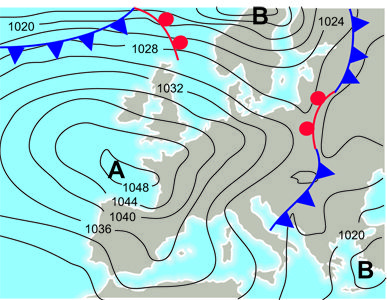
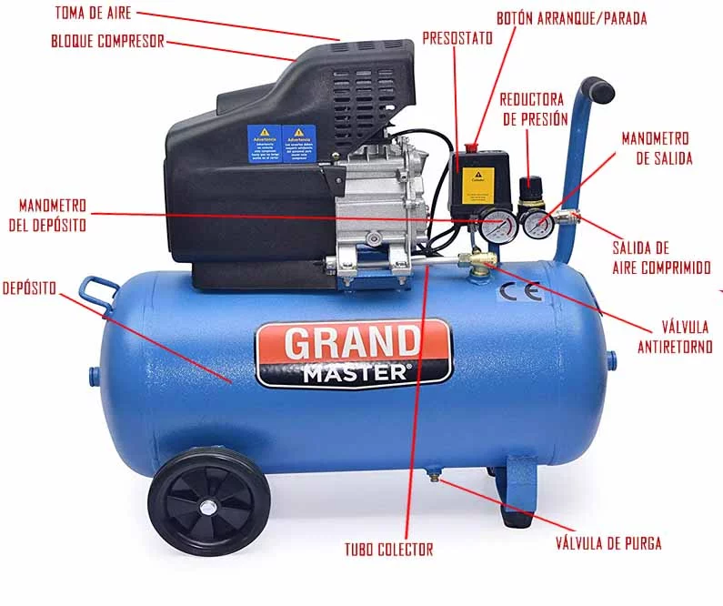
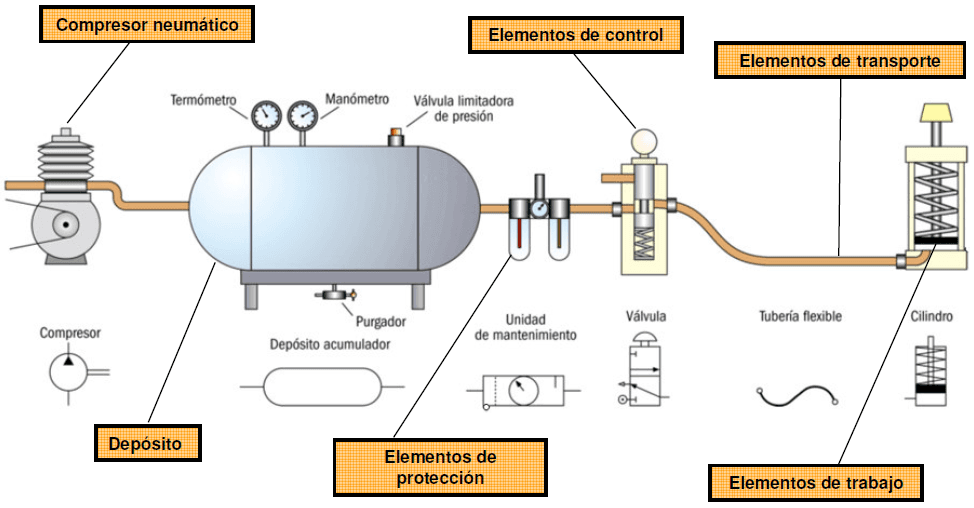
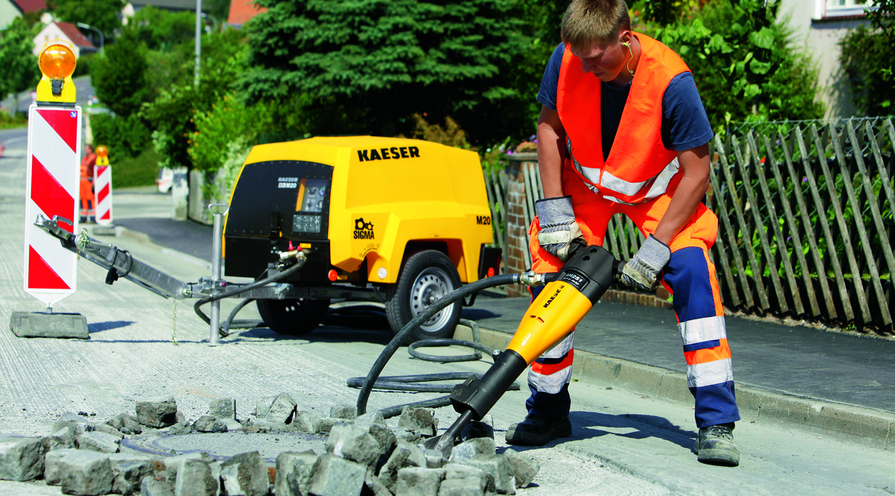

# 1. Introducció

<!-- _class: invert-->

# 1.1. Característiques técniques de I'aire comprimit

L’aire atmosfèric és un element de la natura que es pot fer servir com a agent de ``transport d’energia`` en els processos amb aplicacions industrials pneumàtiques, ja que aquest gas no és inflamable i es pot comprimir bé.

Com tots els gasos, l’aire es pot comprimir notablement a través d’una acció mecànica exterior que el pot fer agafar una ``pressió`` determinada.

# 1.2. Magnituds i unitats

# Pressió

La pressió de l'aire comprimit es mesura en ``bar`` (abreviatura de barra), on 1 bar equival a 100.000 pascals (Pa).

Altres unitats comunes inclouen lliures per polzada quadrada (psi) i kilopascals (kPa).

---

---

A continuació podeu veure una bomba de peu per a bicicleta. El ``manómetre`` indica la pressió que circula dins l'objecte al que està connectat.

Una ``vàlvula`` deixa que entri aire de fora pero no deixa que en surti.
Quan afegim aire augmentam la quantitat que n'hi ha i per tant la força sobre la superfície de les rodes augmenta.

---

A les instal·lacions d'aigua i gas de les nostres cases també s'hi coloca un manòmetre, que ajudarà a vigilar la pressió que hi arriba. En cas de plantes altes, la pressió de l'aigua ha de ser suficient per a vèncer la gravetat i arribar a les aixetes.

---

Aquí teniu un mapa d'ús meteorològic, el ``mapa d'isobares``. Els cercles indiquen zones que estan a la mateixa pressió.

Les borrasques i els anticiclons són els termes utilitzats per descriure zones de pressió atmosfèrica diferents i, per tant, de temps atmosfèric diferents.

---

- Una ``borrasca`` és una àrea de **baixa pressió** atmosfèrica en la qual l'aire ascendeix. A mesura que l'aire ascendeix, es refreda i es forma condensació, que es tradueix en **núvols, precipitacions i temps inestable**.
- D'altra banda, un ``anticicló`` és una àrea de alta pressió atmosfèrica en la qual l'aire descendeix. A mesura que l'aire descendeix, escau i s'escalfa, la qual cosa impedeix la formació de núvols i la precipitació, cosa que dóna lloc a temps assolellat i estable.

---

També podem veure exemples de mecanismes que fan servir les diferències de pressió per a moure líquids.

# 2. Circuit pneumàtic

---

# 3. Grup compressor

El grup compressor és un conjunt de components que treballen junts per comprimir i emmagatzemar aire comprimit. Aquests components inclouen:

# 3.1. El compressor

El compressor és el cor del grup compressor i és lencarregat de comprimir laire. Hi ha diversos tipus de compressors, com els de pistó, els de cargol i els de paletes, cadascun amb els seus propis avantatges i desavantatges.

---

---

Una utilització pràctica del compressor seria per pintar:

---

---

### 3.2. El motor auxiliar:

El motor auxiliar és lencarregat de proporcionar lenergia necessària per fer funcionar el compressor. Pot ser elèctric, dièsel o benzina, depenent de l'aplicació i la disponibilitat d'energia.

### 3.3. El refrigerador:

El refrigerador és un component que s'utilitza per refredar l'aire comprimit després que s'ha comprimit. Això ajuda a reduir la temperatura de l'aire i eliminar la humitat, cosa que ajuda a prevenir la corrosió i altres problemes associats amb l'aire humit.

### 3.4. El dipòsit:

El dipòsit és el lloc on s'emmagatzema l'aire comprimit. Pot ser un tanc vertical o horitzontal i la mida dependrà de la quantitat d'aire que cal emmagatzemar per satisfer les necessitats de l'aplicació.

---

# 3.5. La unitat de manteniment:

La unitat de manteniment és un conjunt de components que sutilitza per mantenir laire comprimit net i sec. Inclou filtres dʻaire, reguladors de pressió i lubricadors dʻaire que ajuden a garantir la qualitat de lʻaire comprimit i prolonguen la vida útil del sistema.

---

# 4. Canonades

---

## Actuadors

---

# Cilindres

---

# 6. Vàlvules

Pel control dels actuadors pneumàtics, com els cilindres, és necessari disposar d’elements de comandament com són les ``vàlvules``.

---

Les vàlvules distribuïdores són les que envien l’aire comprimit a una o altra part de la instal·lacióperquè es faci l’avanç i el retrocés del cilindres pneumàtics en el moment desitjat.

---

# Nomenclatura

Per donar nom a les vàlvules es fa servir el nombre de vies (sortides i entrades) que té i el nombre de posicions que pot adoptar. Així parlem per exemple d'una vàlvula 4/2, que significa que té 4 vies i dues posicions.

---

# Representació

Per representar les vàlvules es fan servir rectangles per les posicions i fletxes o taps a les vies. Una vàlvula 4/2, es representarà amb dos rectangles i quatre punts d'entrada-sortida d'aire, així:

---

<!-- _class: invert -->

# Aplicacions de la pneumàtica

---

# Martell pneumàtic

