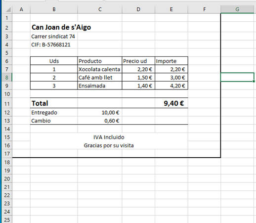
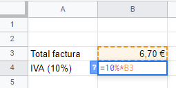
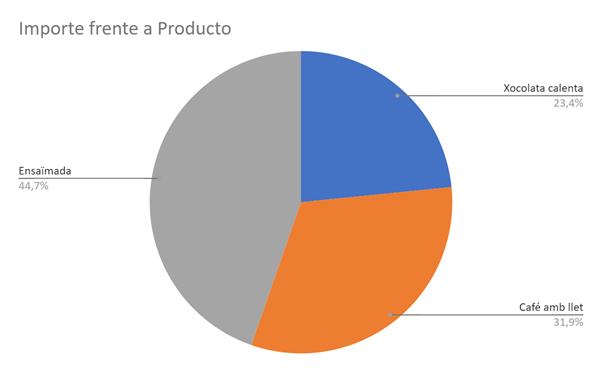
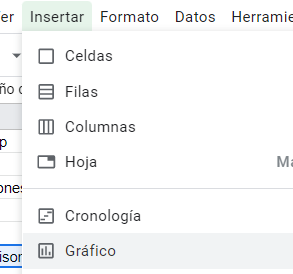

# Instrucciones cafetería



## Paso 1: Calcular columna de importe según unidades y precio por unidad

En la columna importes, añadir las fórmulas para calcular a partir de las unidades y el precio por unidad el importe total de cada producto.

## Paso 2: Calcular total en función de los importes

Sumar todas las celdas de importe para calcular el total de la factura.

## Paso 3: Calcular el cambio

A partir de la cantidad entregada al pagar y el total de la factura, tiene que calcular el cambio que os tiene que devolver.

Prueba a cambiar la cantidad entregada por 20 o 50 euros y comprueba que se calcula bien.

## Paso 4: Modificar la factura inicial y adaptarla

A partir de la hoja de cálculo como está, vienen dos amigos vuestros y pidan lo siguiente. Tenéis que cambiar las cantidades para añadir lo que consumen ellos, ¡no borrar lo que había!
●	Dos helados (2.10 por helado)
●	Dos croissant (1,70) y otro café con leche.
●	La cuenta se paga con un billete de 20.

Tenemos que arreglar la hoja para incluir estos cambios. Para eso tenemos que añadir los productos que no están, y cambiar el número de unidades cada uno.

## Paso 5: Incluir el mensaje de gracias por su visita

Si solo usamos ++enter++, nos moveremos a la siguiente celda. Para escribir más de una línea en una celda, se utiliza ++ctrl+++enter++++ al mismo tiempo.


También podemos combinar varias celdas para crear una sola. En este caso, seleccionamos varias celdas y:


## Paso 6: Calcular el IVA. Mira el ejemplo y adáptalo a tu práctica

El **IVA** es un impuesto que calcula como un porcentaje, que depende del producto que compremos o consumamos.

En restauración, es del **10%**. Es decir, por cada 100 Euros que gastemos, 10 Euros corresponden a impuestos que se utilizan para pagar los servicios públicos (hospitales, colegios, policía, etc).

**Ejemplo**

Si me compro un croissant que vale 2 euros, puedo calular los impuestos de dos formas:

- 10% * 2 = 0.2 euros
- 0.1% * 2 = 0.2 euros

Es decir, 20 céntimos de euro es la parte del precio que corresponde a impuestos.



## Paso 7. Crea el siguiente gráfico

 

Para crear un gráfico:

 

## Paso 8

Incluye en la práctica, a la derecha del nombre de la cafetería, la fecha de la factura. La fórmula que puedes utilizar es
```
=HOY()
```

## Paso 9

Crea dos celdas que indiquen lo que se ha gastado en total en comida y en bebida, de modo que quede así:

 

## Paso 10

Realiza los siguientes cambios en tu hoja de cálculo:

1. Los helados a partir de hoy tendrán un descuento del 10%, y las ensaimadas del 5%.

Agrega una columna en la que pondremos el porcentaje de descuento para que se pueda modificar, y necesitaréis otra columna en la que se haga el cálculo del precio final.
