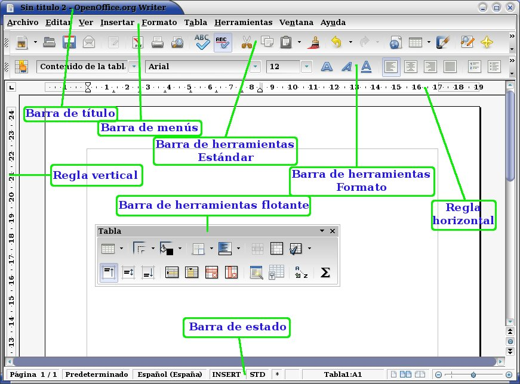

# 2. Primeros pasos

## 2.1. Interfaz de usuario

- Barras
- Reglas

### Zoom

Podemos hacer zoom:

- Con **++ctrl++** y la rueda del ratón
- Utilizando el control de zoom del procesador de textos

## 2.2. Obtener ayuda

Podemos obtener ayuda sobre cualquier tema de Word utilizando la tecla **F1**.

## 2.3. Abrir y guardar documentos

Acciones:

| Función           | Atajo        |
| ----------------- | ------------ |
| Abrir documento   | ++ctrl++ + A |
| Guardar documento | ++ctrl++ + G |

Al guardar el documento podremos elegir entre varios tipos de archivo:

- Doc: Documento de texto de Microsoft Word antiguo
- Docx: Documento de texto de Microsoft Word nuevo
- Odt: Documento de texto de Openoffice / Libreoffice
- Pdf: Formato portable de acrobat

Comparativa de formatos

| Tipo de documento | Programa Libreoffice | Extensión | Equivalente Office |
| ----------------- | -------------------- | --------- | ------------------ |
| Texto             | Writer               | .odt      | .doc               |
| Hoja de cálculo   | Calc                 | .ods      | .xsl               |
| Presentación      | Impress              | .odp      | .ppt               |
| Base de datos     | Base                 | .odb      | .mdb               |

Podemos guardar los archivos:

- En el propio disco duro
- En alguna nube privada (onedrive, drive, etc.)

## 2.4. Desplazamientos en documentos

Podemos movernos por las diferentes partes del documento:

| Función                                       | Atajo                       |
| --------------------------------------------- | --------------------------- |
| Principio de línea                            | Inicio                      |
| Final de línea                                | Fin                         |
| Moverse por páginas                           | AvPag y Repag               |
| Moverse al principio del documento y al final | ++ctrl++ + Inicio           |
| Moverse al final                              | ++ctrl++ + Fin              |
| Una palabra a la izquierda                    | ++ctrl++ + flecha izquierda |
| Una palabra a la derecha                      | ++ctrl++ + flecha derecha   |
| Un párrafo arriba                             | ++ctrl++ + flecha arriba    |
| Un párrafo abajo                              | ++ctrl++ + flecha abajo     |

## 2.5. Selección de textos

Podemos seleccionar un fragmento de texto de varias formas:

| Función                                 | Atajo                                       |
| --------------------------------------- | ------------------------------------------- |
| Seleccionar carácter, palabra y línea   | 1, 2 o 3 clics                              |
| Seleccionar texto                       | ++shift+++ teclas izq. o derecha            |
| Seleccionar todo el texto               | ++ctrl++ + E                                |
| Seleccionar palabras o frases separadas | ++ctrl++ + botón izquierdo en cada elemento |

## 2.6. Cortar, copiar y pegar

Atajos de teclado:

| Función | Atajo        |
| ------- | ------------ |
| Cortar  | ++ctrl++ + X |
| Copiar  | ++ctrl++ + C |
| Pegar   | ++ctrl++ + P |

Existen diferentes tipos de pegado.

## 2.7. Borrar o eliminar

Para **borrar o eliminar** parte del texto, tenemos diferentes combinaciones, con las que podemos borrar por carácter, o por palabra.

| Función                    | Atajo                |
| -------------------------- | -------------------- |
| Un carácter a la izquierda | Retroceso            |
| Una palabra a la izquierda | ++ctrl++ + Retroceso |
| Un carácter a la derecha   | Supr                 |
| Una palabra a la derecha   | ++ctrl++ + Supr      |