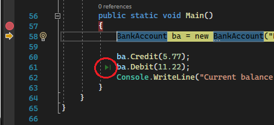

# Depuradores

Los **depuradores** son herramientas esenciales para localizar errores durante la ejecución de un programa. Estos permiten detener la ejecución temporalmente y observar la situación de las variables, entre otras cosas. De esta forma, los errores que no se detectaron durante la compilación pueden ser identificados y corregidos.

## Herramientas de depuración

Las herramientas de depuración ofrecen al programador varias características:
puntos de parada o breakpoints, ejecución paso a paso, una ventana de seguimiento de variables y la posibilidad de modificar los valores de las variables o añadir instrucciones nuevas.

## Tipos de depuradores

Existen principalmente dos tipos de depuradores: aquellos que se ejecutan dentro del entorno de programación y aquellos que son independientes del compilador.

- Los **depuradores integrados** en el entorno de programación suelen ser más fáciles de usar, ya que ofrecen una experiencia de depuración unificada. Estos suelen ser ideales para la depuración básica.
- Por otra parte, los **depuradores independientes** del compilador ofrecen una mayor flexibilidad. Estos son especialmente útiles para la depuración avanzada.