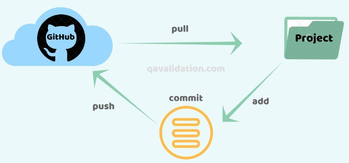

# 13. Pushear

Todo este control de versiones que hemos hecho con el comando ``git`` se hacen en local, es decir, en el ordenador en el que estamos trabajando. Si queremos alojar nuestro proyecto, por ejemplo, en ``github``, necesitaremos enviar los cambios realizados para que se guarden en el repositorio remoto. De esta forma otros usuarios puedan acceder a ellos.

Para ello se utilizan dos comandos git:

- ``git push`` envía los cambios desde el PC a github
- ``git pull`` descarga los cambios desde github a nuestro PC



A esta acción se le llama ``pushear``.  Pushear es el equivalente de hacer un commit en el repositorio remoto.

Ejemplo:

Vamos a enviar (sincronizar) los cambios realizados en el repositorio **local** al repositorio **remoto**.

```
E:\Docencia\apuntes>git push origin master
Enumerating objects: 36, done.
Counting objects: 100% (36/36), done.
Delta compression using up to 8 threads
Compressing objects: 100% (30/30), done.
Writing objects: 100% (30/30), 1.97 MiB | 3.53 MiB/s, done.
Total 30 (delta 4), reused 0 (delta 0), pack-reused 0
remote: Resolving deltas: 100% (4/4), completed with 4 local objects.
To https://github.com/danimrprofe/apuntes
   9118fa98..a8c5f455  master -> master
```

Ahora sí, nuestros cambios se han guardado correctamente en la nube de github, y podremos descargarlos desde cualquier dispositivo conectdo a Internet.

El comando se compone de las siguientes partes:

- **git push**: este es el comando para enviar cambios al repositorio remoto.
- **origin**: Este es el nombre del repositorio remoto. En teoría lo hemos indicado previamente. Si el repositorio fue clonado, ya aparece. Si fue creado desde nuestro pc, tendremos que agregarlo nosotros.
- **master**: este es el nombre de la rama que se enviará al repositorio remoto.

En este ejemplo, los cambios realizados en el repositorio local (E:\Docencia\apuntes) se envían al repositorio remoto (https://github.com/danimrprofe/apuntes) en la rama maestra.

El comando muestra el estado de la inserción, incluidos cuántos objetos se enumeraron, comprimieron y escribieron, y el número total de objetos. El comando también informa la cantidad de objetos locales que se usaron para completar la compresión delta. Finalmente, el comando informa qué rama se empujó y los detalles del empuje.

También puedes pullear cambios del repositorio remoto, lo que es equivalente a hacer un commit en tu repositorio local.