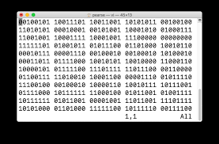
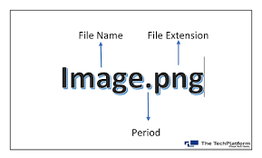
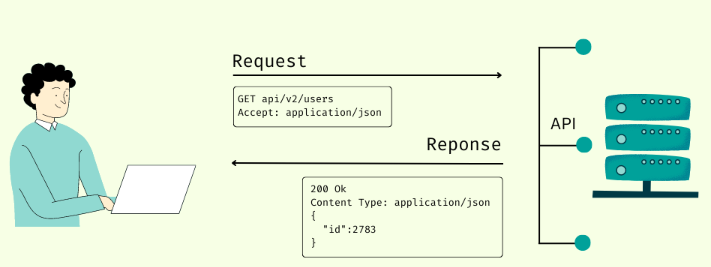
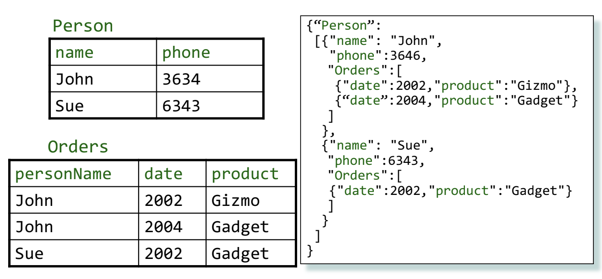
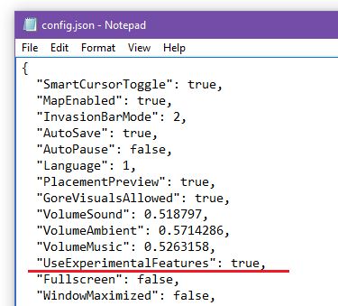
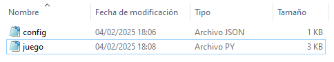

- [GESTIÓ DE FITXERS I FORMATS D'EMMAGATZEMAMENT D'INFORMACIÓ](#gestió-de-fitxers-i-formats-demmagatzemament-dinformació)
  - [1. Fitxers](#1-fitxers)
  - [2. Tipus de fitxers](#2-tipus-de-fitxers)
    - [Estructura bàsica d'un fitxer](#estructura-bàsica-dun-fitxer)
  - [3. Treball amb Python](#3-treball-amb-python)
    - [Modes d'obertura d'arxius en Python](#modes-dobertura-darxius-en-python)
    - [Exemples d'obertura d'arxius](#exemples-dobertura-darxius)
    - [Imprimir contingut per pantalla](#imprimir-contingut-per-pantalla)
    - [Llegir línea per línia](#llegir-línea-per-línia)
    - [Eliminar un archivo](#eliminar-un-archivo)
    - [Mode escriptura](#mode-escriptura)
    - [Mode annexar](#mode-annexar)
    - [Borrar una línea concreta](#borrar-una-línea-concreta)
    - [Modificar una línea concreta](#modificar-una-línea-concreta)
    - [Insertar una línea en una posición concreta](#insertar-una-línea-en-una-posición-concreta)
  - [4. Format CSV](#4-format-csv)
    - [Guardar dades en un fitxer CSV](#guardar-dades-en-un-fitxer-csv)
    - [Llegir des d'un fitxer](#llegir-des-dun-fitxer)
  - [5. FORMAT JSON](#5-format-json)
    - [Característiques principals de JSON](#característiques-principals-de-json)
    - [Estructura bàsica de JSON](#estructura-bàsica-de-json)
    - [Parelles clau-valor](#parelles-clau-valor)
    - [Objectes](#objectes)
    - [Llistes](#llistes)
    - [Treball amb Python](#treball-amb-python)
    - [On es fa servir JSON?](#on-es-fa-servir-json)
    - [Guardar i llegir a un arxiu JSON](#guardar-i-llegir-a-un-arxiu-json)
  - [6. JOC amb JSON](#6-joc-amb-json)
    - [Arxiu de configuració](#arxiu-de-configuració)
    - [Arxiu de joc](#arxiu-de-joc)

# GESTIÓ DE FITXERS I FORMATS D'EMMAGATZEMAMENT D'INFORMACIÓ

Aquesta unitat didàctica té com a objectiu que l'alumnat adquireixi els coneixements i habilitats necessaris per gestionar fitxers de dades, comprendre els diferents formats d'emmagatzematge d'informació (CSV, JSON) i utilitzar mètodes d'accés adequats.

## 1. Fitxers

Un fitxer és un conjunt de **dades** **emmagatzemades** en un dispositiu de memòria (com el disc dur, SSD, o memòria flash) que es poden llegir, escriure i gestionar mitjançant un sistema operatiu.


Els fitxers permeten **organitzar** i **conservar** **informació** de manera persistenta perquè estigui disponible fins i tot després de tancar un programa o apagar l'ordinador.

## 2. Tipus de fitxers

Els fitxers poden ser:

De ``text``, quan contenen dades llegibles per humans (com ara **.txt**, **.csv**)

```
John Doe
Jane Smith
Alice Johnson
```

``Binaris``, quan emmagatzemen informació en format no llegible directament (com **.jpg**, **.exe**).



### Estructura bàsica d'un fitxer

Un fitxer és una seqüència de bytes que es guarda en un dispositiu d'emmagatzematge. Té:

- un **nom**
- una **extensió**
- **permisos** d'accés



## 3. Treball amb Python

### Modes d'obertura d'arxius en Python

Per treballar amb un fitxer, primer cal obrir-lo en un mode específic (lectura, escriptura, afegir, etc.), i després tancar-lo per evitar pèrdues de dades o errors en el sistema.

| Mode | Tipus              | Descripció                                                                                     |
| ---- | ------------------ | ---------------------------------------------------------------------------------------------- |
| `r`  | Lectura            | Obre el fitxer per llegir-lo. L'error es produeix si el fitxer no existeix.                    |
| `w`  | Escriptura         | Crea un fitxer nou (si no existeix) o sobreescriu-lo si ja existeix.                           |
| `a`  | Afegir             | Obre el fitxer per afegir contingut al final sense esborrar el que ja hi ha.                   |
| `x`  | Creació            | Crea un fitxer nou, però genera un error si el fitxer ja existeix.                             |
| `b`  | Binari             | Per obrir fitxers en mode binari (per exemple, per llegir o escriure imatges).                 |
| `t`  | Text               | Per treballar amb fitxers de text. No cal especificar-lo, ja que és el mode per defecte.       |
| `+`  | Lectura/Escriptura | Permet llegir i escriure al mateix temps (combinat amb altres modes, per exemple `r+` o `w+`). |

### Exemples d'obertura d'arxius

- `open('arxiu.txt', 'r')`: Només lectura.
- `open('arxiu.txt', 'w')`: Esborrar i escriure.
- `open('arxiu.txt', 'a')`: Afegir al final.
- `open('arxiu.txt', 'rb')`: Llegir en mode binari.

Per a llegir un arxiu l'hem de obrir en **mode lectura**, utilitzant la funció `open()`:

```python
f = open("arxiu.txt", "r")
```

Una vegada obert, ja podem llegir-lo amb la funció `read()`:

```python
f = open("arxiu.txt", "r")
text = f.read()
```

Quan l'hem acabat de llegir, es important tancar el fitxer amb la funció `close()`:

```python
f = open("arxiu.txt", "r")
text = f.read()
f.close()
```

### Imprimir contingut per pantalla

Si volem imprimir per pantalla tot el contingut de l'arxiu:

```python
f = open("arxiu.txt", "r")
text = f.read()
print(text)
f.close()
```

### Llegir línea per línia

También podemos ir leyendo línea por línea

```python
f = open("arxiu.txt", "r")
text = f.read()
print(text)
f.close()

for linea in f:
    print(linea)

archivo.close()
```

### Eliminar un archivo

Para borrar un archivo podemos utilizar la librería os. Para ello, al principio de nuestro archivo debemos importarla.

```python
# Eliminar un archivo llamado "test.txt"
import os
os.remove("archivo.txt")
```

### Mode escriptura

Si utilizamos el argumento ``w``, abriremos el archivo en modo escritura. De este modo:

- Si el archivo ya existe, se **sobrescribe** completamente, borrando el contenido previo.
- Si el archivo no existe, se crea un **nuevo archivo**.

```python
f = open("alumnes.txt", "w")
f.write("Daniel")
f.close()
```

### Mode annexar

Si utilizamos el argumento ``a``, abriremos el archivo en modo anexar. De este modo:

- Si el archivo ya existe, se añade nuevo contenido al final del archivo sin eliminar el contenido existente.
- Si el archivo no existe, se crea un nuevo archivo.

```python
# abrir el archivo
f = open('alumnes.txt', 'a')
f.write('Pepe')
```

Si volem afegir el contingut a una nova línia, haurem de fer servir el caràcter d'escapament ``\n``. Aquest farà que en el lloc on estigui col·locat es faci un bot de línia.

Esborrarem el contingut previ amb ``w``

```python
f = open('alumnes.txt', 'w')
file.write("Dani\nAna")
file.write("\n")
file.write("Pepe")
```

Ara tindrem un arxiu amb 3 línies.

Activitat 1

Crea un programa que et demani el nom, pes, edat i altura, i calculi el teu índex de masa corporal . A continuació, hauràs de guardar a cada línea les dades d'una persona.

$$
IMC = \frac{\text{pes (kg)}}{\text{altura (m)}^2}
$$

El resultat haurà de ser:

```
Dani (40) 75 kg 1.74 m IMC: 24.77
```

A continuació veurem com esborrar una línea, canviar el contingut o inserir línies al mig de l'arxiu.

### Borrar una línea concreta

Para borrar una línea específica, puedes leer todas las líneas, eliminar la línea que no quieres, y luego escribir de nuevo el archivo.

```python
f = open('alumnes.txt', 'r')
linies = f.readlines()
del linies[1]
f = open('alumnes.txt', 'w')
file.writelines(linies)
```

Línies és una llista, recorda, que els seus elements s'acceceixen amb un índex, i que el primer és el 0: ``línia[0]``, ``linia[1]``, etc.
Si tot va bé, ha d'haver desaparegut el segón nom.

### Modificar una línea concreta

Si deseas modificar una línea específica, puedes seguir un proceso similar, pero actualizando el contenido de la línea en memoria antes de escribirlo de nuevo.

```python
f = open('alumnes.txt', 'r')
linies = f.readlines()
linies[1] = "Lola\n"
f = open('alumnes.txt', 'w')
file.writelines(linies)
```

### Insertar una línea en una posición concreta

Si deseas insertar una línea en una posición específica, puedes insertar la nueva línea en la lista de líneas antes de escribir de nuevo el archivo.

```python
f = open('alumnes.txt', 'r')
linies = f.readlines()
linies.insert(1, "Joan\n")
f = open('alumnes.txt', 'w')
file.writelines(linies)
```

## 4. Format CSV

Els fitxers ``CSV`` (Comma-Separated Values) són fitxers de text on les dades es separen per comes o altres delimitadors. Són útils per emmagatzemar taules de dades i intercanviar informació entre aplicacions.

```csv
name,age
Lionel Messi,35
Cristiano Ronaldo,38
Kylian Mbappé,25
```

### Guardar dades en un fitxer CSV

Hi ha un mòdul de Python per treballar amb fitxers CSV.

```python
import csv

dades = [
    ["Nom", "Edat", "Ciutat"],
    ["John", 28, "New York"],
    ["Alice", 30, "Los Angeles"],
    ["Bob", 25, "Chicago"]
]

with open('treballadors.csv', mode='w', newline='') as file:
    escriptor_csv = csv.writer(file)

    for linia in dades:
        escriptor_csv.writerow(linia)
```

### Llegir des d'un fitxer

```python
import csv

with open('treballadors.csv', mode='r', newline='') as arxiu:
    lector_csv = csv.DictReader(arxiu)

    # Read each row as a dictionary
    for row in lector_csv:
        print(row)
```

## 5. FORMAT JSON

``JSON`` (JavaScript Object Notation) és un format lleuger per a l’emmagatzematge i intercanvi de dades. És fàcilment llegible per humans i estructurat de manera que també és senzill de processar per les màquines. S’utilitza àmpliament en aplicacions web, APIs i bases de dades.

### Característiques principals de JSON

- Textual i **llegible**: utilitza una sintaxi clara basada en claus i valors.
- Lleuger: ocupa poc espai i no conté caràcters innecessaris.
- Independent del llenguatge: encara que es basa en **JavaScript**, es pot utilitzar amb **Python**, **Java**, **C#**, etc.
- Basat en estructures de dades: s'organitza amb objectes i llistes.

### Estructura bàsica de JSON

### Parelles clau-valor

JSON es basa en dos tipus d’estructures fonamentals:

- Les ``claus`` són sempre strings (text entre cometes dobles): **name, age**
- Els ``valors`` poden ser strings, nombres, booleans, arrays o altres objectes: **Lionel Messi, 35**.

```json
  "name": "Lionel Messi"
```

### Objectes

Els ``objectes`` JSON són representats amb **{}** (claus). Aquest objecte té dos parells clau-valor.

```json
{
  "name": "Lionel Messi",
  "age": 35
}
```

### Llistes

Les ``llistes`` o arrays JSON son representades amb **[]** (claudàtors) i contenen una llista ordenada de valors. Els valors poden ser de qualsevol tipus compatible amb JSON. Aquest objecte té un parell clau-valor, i el valor és una llista amb 3 elements.

```json
{
  "players": [
    {
      "name": "Lionel Messi",
      "position": "Forward",
      "team": "Paris Saint-Germain",
      "nationality": "Argentine",
      "age": 35
    },
    {
      "name": "Cristiano Ronaldo",
      "position": "Forward",
      "team": "Al Nassr",
      "nationality": "Portuguese",
      "age": 38
    },
    {
      "name": "Kylian Mbappé",
      "position": "Forward",
      "team": "Paris Saint-Germain",
      "nationality": "French",
      "age": 25
    }
  ]
}
```

### Treball amb Python

Python inclou un ``mòdul json`` per treballar amb fitxers JSON fàcilment
Guardar i carregar dades en format JSON.

### On es fa servir JSON?

Els arxius JSON tenen aplicacions molt variades, d'entre elles destaquen les següents:

- **APIs Web**: comunicació entre aplicacions i serveis.



- **Bases de dades NoSQL**: MongoDB utilitza JSON per emmagatzemar dades.



- **Configuració d’aplicacions**: molts programes utilitzen arxius .json per guardar configuracions.



Amb aquest joc aprendrem a [guardar i llegir dades amb Python i JSON](juego.md).

### Guardar i llegir a un arxiu JSON

```python
import json

arxiu = open("configuracio.json","w")

configuracio = {}
configuracio["nom"] = "Dani"
configuracio["professio"] = "professor"

json.dump(configuracio, arxiu, indent=2)
```

Això generarà un fitxer configuracio.json amb el següent format:

```json
{
  "nom": "Dani",
  "professio": "professor"
}
```

Ara, per fer el contrari:

```python
import json
# Obrir el fitxer en mode lectura
arxiu = open("configuracio.json", "r")
configuracio = json.load(arxiu)  # Carregar el JSON a un diccionari

# Extreure i mostrar els valors directament
print(f"Nom: {configuracio['nom']}")
print(f"Professió: {configuracio['professio']}")
```

## 6. JOC amb JSON

En aquest exemple veurem com utilitzar JSON per emmagatzemar la configuració i les dades de les partides, de manera que quedin guardades en un fitxer quan el programa acabi, i puguem carregar-les de nou quan el programa es torni a obrir per utilitzar aquestes dades.

A més del fitxer Python amb el joc, crearem un fitxer de text ``config.json`` en el qual guardarem tota la informació que necessitem.



### Arxiu de configuració

El contenido del archivo .json será el siguiente.

```JSON
{
    "usuario": "Dani",
    "dificultad": 10,
    "victorias": 2,
    "derrotas": 0
}
```

### Arxiu de joc

L'arxiu quedarà tal que així

```python
import json  # Mòdul per treballar amb fitxers i dades en format JSON (serialització i deserialització).
import random  # Mòdul per generar valors aleatoris, com números, eleccions aleatòries en llistes, etc.
import os  # Mòdul per interactuar amb el sistema operatiu, com gestionar fitxers i directoris.

ARCHIVO_CONFIG = "configuracion.json"  # Nombre del archivo donde se guardará la configuración del juego

# Función para guardar la configuración en un archivo JSON
def guardar_configuracion(datos, ARCHIVO_CONFIG):
    archivo = open(ARCHIVO_CONFIG, "w")
    json.dump(datos, archivo, indent=2)  # Serializa los datos en formato JSON
    print(f"Configuración guardada en {ARCHIVO_CONFIG}")

# Función para cargar la configuración desde el archivo JSON o crear una nueva si no existe
def cargar_configuracion(ARCHIVO_CONFIG):
    if os.path.exists(ARCHIVO_CONFIG):
        archivo = open(ARCHIVO_CONFIG, "r")
        return json.load(archivo)  # Carga los datos desde el archivo JSON
    else:
        # Si no hay configuración previa, se inicia un nuevo perfil
        print("Es tu primera vez.")
        nombre = input("¿Cómo te llamas?")
        configuracion = {
            "usuario": nombre,
            "dificultad": 10,  # Dificultad predeterminada
            "victorias": 0,
            "derrotas": 0
        }
        return configuracion

# Cargar o crear la configuración del usuario
configuracion = cargar_configuracion(ARCHIVO_CONFIG)

# Menú principal del juego
print("Bienvenido", configuracion["usuario"])
print(f"Llevas {configuracion["victorias"]} victorias y {configuracion["derrotas"]} derrotas")
print("¿Qué quieres hacer?")
print("1. Jugar")
print("2. Cambiar dificultad")

accion = int(input())

# Opción para cambiar la dificultad del juego
if accion == 2:
    dificultad = configuracion["dificultad"]
    print("La dificultad actual es", dificultad)
    dificultad = int(input(f"Elige nueva dificultad (1-10)"))
    configuracion["dificultad"] = dificultad
    guardar_configuracion(configuracion,ARCHIVO_CONFIG)

# Opción para jugar el juego de adivinar el número
elif accion == 1:
    dificultad = configuracion["dificultad"]
    numero = random.randint(1, dificultad)  # Genera un número aleatorio según la dificultad
    print("Adivina un número del 1 al", dificultad)
    print("Tienes 3 intentos")

    # Bucle para los 3 intentos
    for intento in range(1, 4):
        numero_elegido = int(input(f"Intento {intento}: "))
        if numero_elegido == numero:
            print("¡Felicidades, has acertado!")
            configuracion["victorias"] += 1  # Suma una victoria al perfil del usuario
            break
        elif numero_elegido < numero:
            print("El número es mayor")
        else:
            print("El número es menor")

        if intento == 3:
            print(f"Has perdido, el número era {numero}")
            configuracion["derrotas"] += 1  # Suma una derrota al perfil del usuario

    # Guardar la configuración actualizada tras el juego
    guardar_configuracion(configuracion, ARCHIVO_CONFIG)

```