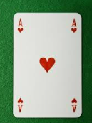
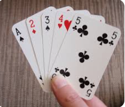

# 1. Programación orientada a objetos

La Programación Orientada a Objetos (POO) es un paradigma que organiza el código alrededor de ``objetos``, que combinan datos y funcionalidad. En Python, todo es un objeto.

## 2. Conceptos Básicos

Las estructuras básicas con las que vamos a trabajar son los **objetos** y las **clases**.

- **Objetos**: Instancias de clases que encapsulan datos y funciones.
- **Clases**: Plantillas para crear objetos.

## 3. Clase

Una **clase** define las propiedades y los comportamientos de un conjunto de objetos. Una clase es una plantilla para crear objetos.

La clase puede tener:

- **Atributos**: Características de un objeto.
- **Métodos**: Funciones asociadas a una clase.

## 4. Crear una clase

Para crear una clase, utiliza la palabra clave ``class`` seguida del nombre de la clase. Los métodos o funciones se identifican con ``def``.

```py
class Coche:
    def __init__(self, marca, modelo):
        self.marca = marca
        self.modelo = modelo
        self.encendido = False

    def encender_apagar(self):
        self.encendido = not self.encendido
```

El método ``__init__`` es un método especial llamado **constructor** que inicializa los atributos de la clase.

Los métodos en una clase se incluyen dentro de la definición de la clase y pueden acceder a los atributos del objeto a través del parámetro ``self``.

## 5. Instanciar objetos

Un **objeto** es una instancia de una clase. Cada objeto que creemos tendrá todas las propiedades y comportamientos definidos para su clase.

Los objetos se crean dándole un **identificador** y asignándole la clase correspondiente. Al indicar la clase, también pasamos los **atributos** que queremos que tenga.

```py
mi_coche = Coche("Toyota", "Corolla")
```

## Resumen

- Cada objeto se crea a partir de una ``clase``.
- Cada clase tiene ``métodos`` y ``propiedades`` que la definen
- A partir de la clase se crean los ``objetos`` necesarios.

## 6. Ejemplo con pokemon

Aquí podemos ver una **clase** pokemon que tiene:

- Tres **atributos**: nombre, tipo y nivel
- Tres **métodos**: init, atacar y subir_nivel

Todo lo que está dentro de class no se ejecuta, simplemente indica como es esta clase.

```python
class Pokemon:
    def __init__(self, nombre, tipo, nivel):
        self.nombre = nombre
        self.tipo = tipo
        self.nivel = nivel

    def atacar(self):
        print(f"{self.nombre} ha usado un ataque de {self.tipo}")

    def subir_nivel(self):
        self.nivel += 1
        print(f"{self.nombre} ha subido al nivel {self.nivel}")
```
Para crear un objeto:
```py
pikachu = Pokemon("Pikachu", "Trueno", 5)
```
Si queremos llamar a la función ``atacar()``. Recuerda que ``pikachu`` es un objeto de la clase ``pokemon``, y esta clase tiene definido un método ``atacar()``.
```py
pikachu.atacar()
```
Para acceder al atributo ``tipo``:
```py
print(pikachu.tipo)
```

## Juego de cartas

Vamos a introducir el concepto de programación orientada a objetos utilizando un juego de cartas.

# Objetos necesarios

Para ello, vamos a crear los siguientes objetos:

La ``Carta`` es el objeto más básico



La ``Baraja`` (conjunto de 52 objetos ``Carta`` diferentes)


La ``Mano`` (conjunto de objetos ``Carta`` de un jugador en una partida)



## Clase Carta

Comenzaremos creando la clase ``Carta``. Cada carta tendrá dos propiedades, el ``palo`` (tréboles, corazones) y el ``valor`` (7,8, as, etc.).

### Constructor (__init__)

El **constructor** en Python es un método especial llamado ``__init__``, que se utiliza para inicializar los atributos de una clase cuando se crea una instancia de ella.

Este método se llama automáticamente al crear un objeto (una instancia) de la clase y permite definir valores iniciales para los atributos del objeto.

**`carta.py`**
``` py linenums="1"
class Carta:
    def __init__(self, palo, valor):
        self.palo = palo
        self.valor = valor
```

El segundo es el método que nos ofrecerá una representación del objeto en formato de texto al hacer ``print()`` sobre el objeto. En Python, si deseas imprimir una representación legible de un objeto, necesitas definir un método especial llamado ``__repr__`` dentro de la clase.

Guardaremos la clase ``Carta`` en un archivo ``carta.py``.

**`carta.py`**
``` py linenums="1"
class Carta:
    def __init__(self, palo, valor):
        self.palo = palo
        self.valor = valor

    def __repr__(self):
        return f"{self.valor} de {self.palo}"
```

## Prueba cartas

Si queremos utilizar esta clase dentro de otro archivo, tendremos que importarla en primer lugar.

**`pruebacartas.py`**
``` py linenums="1"
from carta import Carta
```

La línea de código ``from carta import Carta`` se utiliza en Python para importar una clase llamada ``Carta`` desde un archivo de Python llamado ``carta.py``.

# Constructor (init)

En la segunda línea estamos creando una instancia de la ``clase Carta``, y asignándole el identificador ``cartaprueba``. Al crear un nuevo objeto, se llamará al método ``__init__`` (constructor) de la clase.

**`pruebacartas.py`**
``` py linenums="1"
from carta import Carta
cartaprueba = Carta("tréboles", 2)
```

# Pintar un objeto

No podemos hacer print sobre el objeto a no ser que definamos un métido ``__repr__``
  - ``print(carta)``

También podemos imprimir alguna de sus propiedades:
  - ``print(carta.valor)``
  - ``print(carta.palo)``

# Representación

- La segunda línea llamará al método ``__repr__`` para imprimir información sobre la carta.

#### **`pruebacartas.py`**
``` py linenums="1"
from carta import Carta
cartaprueba = Carta("tréboles", 2)
print(cartaprueba)
```

## 2. Clase baraja

La baraja de póker se compone de 52 cartas. Para ello crearemos la clase ``Baraja`` lo tanto, contendrá 52 objetos ``Carta``.

- El método constructor nos creará una lista de cartas con todas las combinaciones posibles. ``Baraja.cartas`` contendrá una lista de objetos ``Carta``.
- ``Baraja.barajar()`` mezclará las cartas de la baraja
- ``Baraja.contar()`` nos dirá cuantas cartas quedan en la baraja
- ``Baraja.sacar_carta()`` nos devolverá un objeto ``Carta`` de ``Baraja.cartas``.
- ``Baraja.contar()`` nos dirá cuantas cartas quedan en la baraja
- ``Baraja.quedan_cartas()`` devolverá ``True`` en caso de que queden cartas en la lista ``Baraja.cartas``. En caso contrario, ``False``.

Creamos la clase baraja

``` py linenums="1"
import random
from carta import Carta

class Baraja:
```

### Constructor

La baraja está dividida en cuatro palos (en inglés: suit), dos de color rojo y dos de color negro:

- ♠ → Picas (conocidas como espadas).
- ♥ → Corazones (conocidos como copas).
- ♦ → Diamantes (conocidos como rombos, oros o cocos).
- ♣ → Tréboles (conocidos como flores o bastos).

En el constructor, vamos a crear nuestra baraja haciendo todas las combinaciones de valores y palos.

``` py linenums="1"
    def __init__(self):
        self.cartas = []
        palos = ["♥", "♦", "♣", "♠"]
        valores = ["As", "2", "3", "4", "5", "6", "7",
                   "8", "9", "10", "Jota", "Reina", "Rey"]
        for palo in palos:
            for valor in valores:
                self.cartas.append(Carta(palo, valor))
```

Una de las funciones que ha de tener nuestra bajara es poder mezclar las cartas. Para ello utilizaremos el ``módulo random``, que contiene una función que mezcla aleatoriamente los elementos de una lista.

``` py linenums="1"
    def barajar(self):
        random.shuffle(self.cartas)
```

Mostrar todas las cartas que hay en la baraja:

```python
    def mostrar_cartas(self):
        for carta in self.cartas:
            print(carta)
```

Un método que nos muestre una impresión de la baraja:

```python
    def __repr__(self):
        return f"Baraja de {self.contar()} cartas"
```

El método que nos devuelve el número de elementos que hay en la lista de cartas. El método ``len()`` sobre una lista nos da el número de elementos que la conforman.

```python
    def contar(self):
        return len(self.cartas)
```

Y las funciones de sacar cartas y comprobar si quedan:

```python
    def sacar_carta(self):
        if len(self.cartas) > 0:
            return self.cartas.pop()
        else:
            return None

    def quedan_cartas(self):
        """Devuelve True si quedan cartas en la baraja, False si no."""
        return len(self.cartas) != 0
```

# Prueba de la clase Baraja

Para probar este nuevo objeto podemos hacer lo siguiente:

``` py linenums="1"
mibaraja = Baraja()
print("La baraja tiene", mibaraja.contar(), " cartas")
print(mibaraja.quedan_cartas())
# Sacar todas las cartas de la baraja

while mibaraja.quedan_cartas():
    print(mibaraja.sacar_carta(),  " La baraja tiene",
          mibaraja.contar(), " cartas")

mibaraja.barajar()
```

# 3. Clase Mano

En la clase ``Mano`` guardaremos las cartas que tiene cada jugador durante una partida concreta.


- Agregaremos objetos ``Carta`` a la lista ``Mano.cartas`` mediante el método ``añadir_carta()``.
- Con el método ``mostrar_mano`` mostraremos todos los objetos ``Carta`` de ``Mano.cartas``.
- ``calcular_valor`` nos dirá el valor que suman todas las cartas de nuestra mano.

```python
# Esta clase define el objeto Mano, el cual representa un conjunto de cartas.
class Mano:

    # El método __init__ establece la lista de cartas como una lista vacía y el valor como 0.
    def __init__(self):
        self.cartas = []
        self.valor = 0

    # El método añadir_carta añade una carta a la lista de cartas.
    def añadir_carta(self, carta):
        self.cartas.append(carta)

    def calcular_valor(self):
        self.valor = 0

        for carta in self.cartas:
            if carta.valor in ["Jota", "Reina", "Rey"]:
                self.valor += 10
            elif carta.valor == "As":

                self.valor += 11
            else:
                self.valor += int(carta.valor)

        return self.valor

    def mostrar_mano(self):
        for carta in self.cartas:
            print(carta)
```

# Pruebas de la clase Mano
``` py linenums="1"
from baraja import Baraja
from mano import Mano

mibaraja = Baraja()
mibaraja.barajar()

mano_J1 = Mano()

if mibaraja.quedan_cartas():
    mano_J1.añadir_carta(mibaraja.sacar_carta())
    mano_J1.añadir_carta(mibaraja.sacar_carta())
    mano_J1.añadir_carta(mibaraja.sacar_carta())

mano_J1.mostrar_mano()

print("En la baraja quedan", mibaraja.contar(), "cartas")
```

# 4. Juego completo

A continuación mostraremos el juego completo del 21.

- El ``Juego`` será también una clase
- La única propiedad del juego será  ``self.baraja``, que contendrá la baraja con la que vamos a jugar.

### Paso 1. Importar las clases que vamos a utilizar

Importamos las clases Baraja y Mano desde los módulos baraja y mano, respectivamente. Esto permite al programa usar los métodos y atributos definidos en estas clases.

``` py linenums="1"
from baraja import Baraja
from mano import Mano
```

### Paso 2. Crear la clase ``Juego``

``` py linenums="1"
from baraja import Baraja
from mano import Mano

class Juego:
    def __init__(self):

```

### Paso 3. constructor

El método ``__init__()`` se ejecuta al crear una nueva **instancia** de la clase. Este método crea una nueva baraja y la baraja utilizando el método barajar().

``` py linenums="1"
from baraja import Baraja
from mano import Mano

class Juego:
    def __init__(self):
        self.baraja = Baraja()
        self.baraja.barajar()
```

### Paso 4. método jugar

``` py linenums="1"
from baraja import Baraja
from mano import Mano

class Juego:
    def __init__(self):
        self.baraja = Baraja()
        self.baraja.barajar()

    def jugar(self):
        mano_jugador = Mano()
        mano_jugador.añadir_carta(self.baraja.repartir())
        print("Tu mano es: ", mano_jugador.cartas,
              "lo que hace un total de: ", mano_jugador.calcular_valor())
```

### Paso 5. Cálculo de valor de la mano

``` py linenums="1"
from baraja import Baraja
from mano import Mano

class Juego:
    def __init__(self):
        self.baraja = Baraja()
        self.baraja.barajar()

    def jugar(self):
        mano_jugador = Mano()
        mano_jugador.añadir_carta(self.baraja.repartir())
        print("Tu mano es: ", mano_jugador.cartas,
              "lo que hace un total de: ", mano_jugador.calcular_valor())
        while mano_jugador.valor < 21:
            action = input("Quieres PEDIR carta o PASAR? ").lower()
            if action == "pedir":
                mano_jugador.añadir_carta(self.baraja.repartir())
                print("Tu mano es: ", mano_jugador.cartas,
                      "lo que hace un total de: ", mano_jugador.calcular_valor())
            else:
                print("Tu puntuación final es de",
                      mano_jugador.calcular_valor())
                return

```

### Paso 6. Cálculo de fin del juego

``` py linenums="1"
from baraja import Baraja
from mano import Mano

class Juego:
    def __init__(self):
        self.baraja = Baraja()
        self.baraja.barajar()

    def jugar(self):
        mano_jugador = Mano()
        mano_jugador.añadir_carta(self.baraja.repartir())
        print("Tu mano es: ", mano_jugador.cartas,
              "lo que hace un total de: ", mano_jugador.calcular_valor())
        while mano_jugador.valor < 21:
            action = input("Quieres PEDIR carta o PASAR? ").lower()
            if action == "pedir":
                mano_jugador.añadir_carta(self.baraja.repartir())
                print("Tu mano es: ", mano_jugador.cartas,
                      "lo que hace un total de: ", mano_jugador.calcular_valor())
            else:
                print("Tu puntuación final es de",
                      mano_jugador.calcular_valor())
                return
        if mano_jugador.valor == 21:
            print("has GANADO.")
        else:
            print("has PERDIDO.")
        print("Tu puntuación final es de",
              mano_jugador.calcular_valor())
```

### Paso 7. Comienzo de la partida (main)

``` py linenums="1"
from baraja import Baraja
from mano import Mano

class Juego:
    def __init__(self):
        self.baraja = Baraja()
        self.baraja.barajar()

    def jugar(self):
        mano_jugador = Mano()
        mano_jugador.añadir_carta(self.baraja.repartir())
        print("Tu mano es: ", mano_jugador.cartas,
              "lo que hace un total de: ", mano_jugador.calcular_valor())
        while mano_jugador.valor < 21:
            action = input("Quieres PEDIR carta o PASAR? ").lower()
            if action == "pedir":
                mano_jugador.añadir_carta(self.baraja.repartir())
                print("Tu mano es: ", mano_jugador.cartas,
                      "lo que hace un total de: ", mano_jugador.calcular_valor())
            else:
                print("Tu puntuación final es de",
                      mano_jugador.calcular_valor())
                return
        if mano_jugador.valor == 21:
            print("has GANADO.")
        else:
            print("has PERDIDO.")
        print("Tu puntuación final es de",
              mano_jugador.calcular_valor())

if __name__ == '__main__':
    print("hola")
    juego = Juego()
    juego.jugar()
```