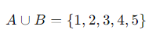
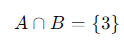
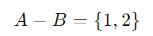
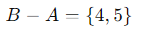

# Conjuntos

Los conjuntos son colecciones **no ordenadas** de elementos **únicos**. Se definen entre llaves, ``{}``, separando sus elementos por comas.

```python
mi_conjunto = {1, 2, 3}
# Adición de elementos:
mi_conjunto.add(4)  # Agrega el valor 4

# Eliminación de elementos:
mi_conjunto.remove(2)  # Elimina el valor 2
```

Los elementos de los conjuntos no quedan ordenados según se agregan. Permiten realizar operaciones matemáticas como la unión, intersección y diferencia.

## Unión, intersección y diferencia

Los conceptos de unión, intersección y diferencia son fundamentales en la teoría de conjuntos y en muchas otras áreas como bases de datos y programación

### Unión (∪)

Dados estos dos conjuntos de números:


La unión de dos conjuntos 𝐴 y 𝐵 B es un conjunto que contiene todos los elementos de  𝐴
A, de 𝐵 B, o de ambos. No se repiten los elementos.



### Intersección (∩)

La intersección de dos conjuntos 𝐴 y 𝐵 es un conjunto que contiene solo los elementos que están tanto en  𝐴 como en 𝐵.



### Diferencia (−)

La diferencia entre dos conjuntos  𝐴 y  𝐵 es un conjunto que contiene los elementos que están en  𝐴
A, pero no en 𝐵.

La diferencia 𝐴 − 𝐵 sería:



Y la diferencia 𝐵 − 𝐴 sería:



Ejemplos:

```python
conjunto1 = {1, 2, 3}
conjunto2 = {3, 4, 5}
union = conjunto1 | conjunto2  # {1, 2, 3, 4, 5}
interseccion = conjunto1 & conjunto2  # {3}
diferencia = conjunto1 - conjunto2  # {1, 2}
```
