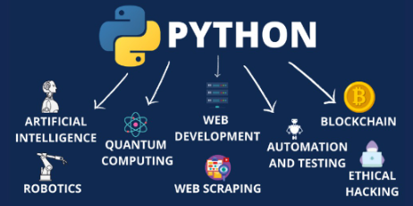

- [Python](#python)
  - [1.Introducción](#1introducción)
  - [2. Como programar en Python](#2-como-programar-en-python)
  - [3. Elementos de un programa](#3-elementos-de-un-programa)
  - [4. Comentarios](#4-comentarios)
  - [3.Variables](#3variables)
  - [Flotantes](#flotantes)
  - [Cálculos con variables](#cálculos-con-variables)
  - [Arreglar errores](#arreglar-errores)
  - [Convertir letras en números](#convertir-letras-en-números)
  - [Convertir tipos de variables](#convertir-tipos-de-variables)
- [Operadores en Python](#operadores-en-python)
  - [Operadores de asignación](#operadores-de-asignación)
- [Operaciones con cadenas de caracteres](#operaciones-con-cadenas-de-caracteres)
  - [Concatenación](#concatenación)
  - [Repetición](#repetición)
  - [Partes de una cadena](#partes-de-una-cadena)
  - [Actividad](#actividad)
- [Operadores aritméticos](#operadores-aritméticos)
  - [Orden de operaciones](#orden-de-operaciones)
- [Operadores lógicos](#operadores-lógicos)
- [Crea un programa de supermercado, que cumpla los siguientes requisitos:](#crea-un-programa-de-supermercado-que-cumpla-los-siguientes-requisitos)
- [Python](#python-1)
  - [Introducción](#introducción)
  - [El lenguaje Python](#el-lenguaje-python-1)
  - [Herramientas online](#herramientas-online-1)
  - [Instalación de Python](#instalación-de-python-1)
  - [Elementos de un programa](#elementos-de-un-programa)
  - [Nombres de archivos](#nombres-de-archivos-1)
- [Variables](#variables)
- [Variables en Python](#variables-en-python-1)
  - [Asignación de variables](#asignación-de-variables-1)
  - [Flotantes](#flotantes-1)
  - [¿Cómo podemos llamar a nuestras variables?](#cómo-podemos-llamar-a-nuestras-variables-1)
  - [Mayúsculas y minúsculas](#mayúsculas-y-minúsculas-1)
  - [Ejemplo nombre y edad](#ejemplo-nombre-y-edad-1)
  - [Cálculos con variables](#cálculos-con-variables-1)
  - [Arreglar errores](#arreglar-errores-1)
  - [Convertir letras en números](#convertir-letras-en-números-1)
  - [Convertir tipos de variables](#convertir-tipos-de-variables-1)
- [Operadores en Python](#operadores-en-python-1)
  - [Operadores de asignación](#operadores-de-asignación-1)
- [Operaciones con cadenas de caracteres](#operaciones-con-cadenas-de-caracteres-1)
  - [Concatenación](#concatenación-1)
  - [Repetición](#repetición-1)
  - [Partes de una cadena](#partes-de-una-cadena-1)
  - [Actividad](#actividad-1)
- [Operadores aritméticos](#operadores-aritméticos-1)
  - [Orden de operaciones](#orden-de-operaciones-1)
- [Operadores lógicos](#operadores-lógicos-1)
- [Crea un programa de supermercado, que cumpla los siguientes requisitos:](#crea-un-programa-de-supermercado-que-cumpla-los-siguientes-requisitos-1)
- [Bucles](#bucles)
  - [Bucle `while`](#bucle-while)
  - [Bucle `for`](#bucle-for)
  - [Funciones](#funciones)
- [Bibliotecas en Python](#bibliotecas-en-python)
  - [¿Qué son las bibliotecas?](#qué-son-las-bibliotecas)
  - [Instalación de una biblioteca](#instalación-de-una-biblioteca)
  - [Cargar una biblioteca](#cargar-una-biblioteca)
  - [Usar una biblioteca](#usar-una-biblioteca)
  - [Ejercicio](#ejercicio)
- [Random](#random)
  - [Importando el módulo](#importando-el-módulo)
  - [Generando un número aleatorio](#generando-un-número-aleatorio)
  - [Generando una lista de números aleatorios](#generando-una-lista-de-números-aleatorios)
  - [Generando una lista de números aleatorios sin repetición](#generando-una-lista-de-números-aleatorios-sin-repetición)
- [Time](#time)

# Python

## 1.Introducción

En este tema aprendremos un **lenguaje de programación**. Los lenguajes de programación se utilizan para crear **programas** que necesitamos que nuestro ordenador utilice.

Los ordenadores trabajan con lenguaje binario (0s y 1s), un idioma completamente diferente al de los humanos. Es por ello que se crean los lenguajes de programación. Gracias a ellos, las personas pueden escribir programas de una forma similar al lenguaje humano.

A diseñar, escribir y probar estos programas se le llama **programar**.

Una vez

### El lenguaje Python

Existen muchos lenguajes de programación, que son como diferentes idiomas. Cada uno tiene unas palabras propias y una determinada forma de escribirse, y se utilizan para tareas muy variadas. Nosotros vamos a aprender a utilizar **Python**, uno de los lenguajes más populares, pero hay muchos más.



## 2. Como programar en Python

### Herramientas online

Para crear nuestros programas podemis usar un entorno de programación online como, por ejemplo, [Repl.it](http://www.repl.it) donde podéis crear programas utilizando cualquier lenguaje a través de un navegador sin necesidad de instalar nada, y todos los proyectos que hagáis se guardarán ahí automáticamente.

Esta opción es la mejor si no queréis o no podéis instalar Python en vuestro ordenador.

### Instalación de Python

Para que un programa escrito en Python se ejecute en un ordenador, es necesario instalar el **intérprete de Python**.
Python tiene dos versiones principales: Python 2 y Python 3. Hoy en día, se recomienda usar **Python 3**, ya que Python 2 ha sido descontinuado.

Se puede descargar para Windows desde esta página: https://www.python.org/downloads/windows/. A continuación hay que instalarlo en el ordenador para que lea y ejecute los programas escritos en Python.


## 3. Elementos de un programa

La programación consiste en escribir una secuencia de **instrucciones** organizadas en **líneas** de código, que en conjunto forman un **programa** capaz de realizar una tarea específica cuando es ejecutado.

Cada instrucción suele escribirse en una línea diferente, aunque esto no tiene por qué ser así. Si no cabe toda la instrucción, continuar en siguiente línea.

```python linenums="1"
print("cada línea termina en ;");
print("esta línea está mal")
print("la línea anterior tendria que terminar en ;");
```

Las instrucciones en un programa se ejecutan **secuencialmente** cuando el programa es iniciado.

En un programa, las líneas están **numeradas** para conocer en qué lugar del programa nos encontramos, pero los números no tienen ningún efecto en especial.

```python linenums="1"
print("estas es la línea 1 ;");
print("esta la 2. va a dar error aquí")
print("esta la 3");
```

### Nombres de archivos

Los archivos de Python se **guardan con extensión .py**, sus **nombres se escriben en minúsculas** y es recomendable **utilizar guiones bajos para separar palabras o números** para mantener la legibilidad y seguir las convenciones de estilo.

Ejemplos:

- operaciones_3_2.py
- operaciones_masa_corporal.py

## 4. Comentarios

El comentario es una línea de texto que se usa para explicar el código
y proporcionar información útil para aquellos que están leyendo el código.

```python
# Esto es un ejemplo de un comentario en python
```

Si lo hacemos así, tendremos que comentar línea a línea:

```python
# Esto se conoce como un comentario de línea única,
# ya que solo se usa una línea para escribir un comentario.
```

También podemos comentar un bloque de varias líneas:

```python
"""
Esto se conoce como un comentario de bloque,
ya que se usan varias líneas para escribir un comentario.
"""
```

Los comentarios en python también se pueden usar para deshabilitar código temporalmente.
Por ejemplo, aquí estamos deshabilitando la línea de código a continuación:

```python
# print("Hola Mundo")
```

## 3.Variables

### Variables en Python

En Python, una **variable** es un nombre que se asocia a un valor, permitiendo almacenar datos para su uso posterior. Cuando creamos una variable, en esencia estamos asignando un nombre simbólico a un valor específico, de modo que podemos reutilizarlo a lo largo de nuestro código.

### Asignación de variables

La **asignación** de variables es el proceso mediante el cual vinculamos un valor a un nombre. Esto nos permite evitar escribir el mismo valor repetidamente, haciendo que el código sea más legible y fácil de mantener.

Por ejemplo, si queremos almacenar el número 5 en una variable llamada `num`, lo hacemos así:

```python
num = 5
```

En Python, las **variables** no tienen un tipo explícito cuando se declaran, pero los valores que almacenan sí tienen un tipo de dato.

A continuación se presenta una lista de los principales tipos de variables (o tipos de datos) en Python:

## Flotantes

Un **float** es un tipo de variable numérica que contiene números decimales. Fíjate que los decimales se excriben con un punto decimal.

```python
altura = 1.75
```

### Cadenas

Las cadenas de caracteres son conjuntos de letras, que normalmente suelen asociarse a una palabra o una frase:

```python
nombre = "Juan"
```

Las **cadenas**, también llamadas **strings**, se pueden escribir entre `'` o entre `"``. Si no pones comillas antes y despues, Python creerá que se trata de una variable, y no un texto.

### Booleanos

Un booleano es un tipo de variable que solo puede tener dos valores: verdadero  (``True``) o falso (``False``).

Un ejemplo de variable booleano es:

```python
es_mayor_de_edad = True
tienecarnet = False
```

### ¿Cómo podemos llamar a nuestras variables?

Existen ciertas reglas a la hora de poner un nombre a una vriable.

La primera es que no podemos usar palabras del propio lenguaje de programación (print, input… no son nombres de variables permitidos). Se llaman palabras reservadas.

Por tanto, esto es incorrecto:

```python
print = 4
```

El nombre debe consistir en una sola palabra. No puede haber espacios. Esto sería incorrecto:

```python
edad usuario = 10
```
En su lugar, mejor usar guiones o camelcase:

```python
edad_usuario = 10
edadUsuario = 20
```

Además de estas reglas, sólo pueden contener letras, números y el guion bajo. Tampoco pueden empezar con un número

### Mayúsculas y minúsculas

Aunque se pueden usar mayúsculas, y Python es muy cuidadoso con eso, entendiendo que Nombre, NOMBRE y nombre son variables DISTINTAS, lo mejor que podemos hacer es no liarnos siguiendo ciertas recomendaciones.

Fijaos en el ejemplo:


También es típico empezar con minúsculas, como hicimos en nombre. Y usar alguno de estos dos estilos para separar palabras:


Consejos

Los acentos suelen dar problemas por lo que mejor evitarlo.

Para la ñ hay quien para no escribir año usa anio , o bien, anyo .

En programas elaborados es muy conveniente elegir nombres de variables que nos den una pista de qué están representando

### Ejemplo nombre y edad

Vamos a hacer un programa que pida al usuario su nombre y año de nacimiento para decirle al final:

Hola, Paco, tienes 45 años.

Para pedirle el nombre y el año de nacimiento usamos la misma estructura que antes. Una línea con un PRINT para que sepan lo que queremos y otra línea con un INPUT para recoger lo que nos han dicho.

Todas las líneas que pongo aquí las tienes que escribir unas debajo de las otras en el mismo ejercicio. Va todo junto.

```python
print('¿Cómo te llamas')
nombre = input()
print('¿En qué año naciste?')
year = input()
```

Estupendo. Ahora cómo calculamos la edad. Bueno, pues sabemos que la edad será el año actual menos el año de nacimiento.

Pero fíjate, esa resta nos da un valor, que es justo lo que queremos, pero que…

```python
edad = 2022 - anyo
```


## Cálculos con variables

El siguiente paso será calcular nuestra edad.

Con esto creamos la variable edad y le ASIGNAMOS el valor de la resta entre el año 2019 y el valor que tenga la variable year , que nos acaba de dar el usuario, y QUE SERÁ DISTINTO EN CADA EJECUCIÓN.

Pintar información por pantalla


Escribe y ejecuta el código anterior junto y adjunta una captura de pantalla. Te dará error, pero es normal. Luego lo arreglaremos

## Arreglar errores

Al ejecutar el programa veremos que nos aparece en rojo un error. LOS ERRORES SON NORMALES. Leamos el mensaje de error.


La línea 8 es donde yo tengo escrita la operación edad= 2019 -year. En la última línea me dice que el operador “menos” no puede trabajar con un tipo entero y un tipo string a la vez.

El asunto es que TODAS LAS ENTRADAS POR TECLADO se toman como CADENAS DE CARACTERES.

Así que el año que introdujo el usuario, para Python son LETRAS (caracteres), y no sabe cómo restar letras y números.

## Convertir letras en números

Las variables pueden ser de diferentes tipos, y podemos transformar una variable de un tipo en otro. En este caso es necesario,puesto que para hacer operaciones matemáticas hay que convertir las letras en números.

¿Hay una manera en Python de tomarse 45 como si fuera un número o como si fuera una cadena de caracteres? Sí.

Hay que usar la función ``int()``. Convierte, si se puede, una cadena de caracteres en un número entero. Veamos el siguiente ejemplo. Edad contiene un string, es decir, las “letras” 3 y 5. Por eso va entre comillas. Cuando queremos sumar una palabra y un número no podemos (no es posible). Los dos objetos a sumar deben ser números o floats (decimales), por eso falla.


En este otro caso, veréis que la variable edad no lleva comillas. Ahora está guardando 35 como número, no como palabra. Por ello, cuando quiero sumar la variable edad y el número 5, al ser ambos números, funciona.


## Convertir tipos de variables

Cambiar de un tipo a otro se llama **casting**. Si queremos hacer una operación y necesitamos convertir una variable de un tipo a otro, podemos utilizar unas funciones que los transforman.

```python
nombre = input("como te llamas: ")
edad = int(input("que edad tienes: "))
print ('Hola', nombre, 'tienes', edad, 'años')
```

- [Python](#python)
  - [1.Introducción](#1introducción)
  - [2. Como programar en Python](#2-como-programar-en-python)
  - [3. Elementos de un programa](#3-elementos-de-un-programa)
  - [4. Comentarios](#4-comentarios)
  - [3.Variables](#3variables)
  - [Flotantes](#flotantes)
  - [Cálculos con variables](#cálculos-con-variables)
  - [Arreglar errores](#arreglar-errores)
  - [Convertir letras en números](#convertir-letras-en-números)
  - [Convertir tipos de variables](#convertir-tipos-de-variables)
- [Operadores en Python](#operadores-en-python)
  - [Operadores de asignación](#operadores-de-asignación)
- [Operaciones con cadenas de caracteres](#operaciones-con-cadenas-de-caracteres)
  - [Concatenación](#concatenación)
  - [Repetición](#repetición)
  - [Partes de una cadena](#partes-de-una-cadena)
  - [Actividad](#actividad)
- [Operadores aritméticos](#operadores-aritméticos)
  - [Orden de operaciones](#orden-de-operaciones)
- [Operadores lógicos](#operadores-lógicos)
- [Crea un programa de supermercado, que cumpla los siguientes requisitos:](#crea-un-programa-de-supermercado-que-cumpla-los-siguientes-requisitos)
- [Python](#python-1)
  - [Introducción](#introducción)
  - [El lenguaje Python](#el-lenguaje-python-1)
  - [Herramientas online](#herramientas-online-1)
  - [Instalación de Python](#instalación-de-python-1)
  - [Elementos de un programa](#elementos-de-un-programa)
  - [Nombres de archivos](#nombres-de-archivos-1)
- [Variables](#variables)
- [Variables en Python](#variables-en-python-1)
  - [Asignación de variables](#asignación-de-variables-1)
  - [Flotantes](#flotantes-1)
  - [¿Cómo podemos llamar a nuestras variables?](#cómo-podemos-llamar-a-nuestras-variables-1)
  - [Mayúsculas y minúsculas](#mayúsculas-y-minúsculas-1)
  - [Ejemplo nombre y edad](#ejemplo-nombre-y-edad-1)
  - [Cálculos con variables](#cálculos-con-variables-1)
  - [Arreglar errores](#arreglar-errores-1)
  - [Convertir letras en números](#convertir-letras-en-números-1)
  - [Convertir tipos de variables](#convertir-tipos-de-variables-1)
- [Operadores en Python](#operadores-en-python-1)
  - [Operadores de asignación](#operadores-de-asignación-1)
- [Operaciones con cadenas de caracteres](#operaciones-con-cadenas-de-caracteres-1)
  - [Concatenación](#concatenación-1)
  - [Repetición](#repetición-1)
  - [Partes de una cadena](#partes-de-una-cadena-1)
  - [Actividad](#actividad-1)
- [Operadores aritméticos](#operadores-aritméticos-1)
  - [Orden de operaciones](#orden-de-operaciones-1)
- [Operadores lógicos](#operadores-lógicos-1)
- [Crea un programa de supermercado, que cumpla los siguientes requisitos:](#crea-un-programa-de-supermercado-que-cumpla-los-siguientes-requisitos-1)
- [Bucles](#bucles)
  - [Bucle `while`](#bucle-while)
  - [Bucle `for`](#bucle-for)
  - [Funciones](#funciones)
- [Bibliotecas en Python](#bibliotecas-en-python)
  - [¿Qué son las bibliotecas?](#qué-son-las-bibliotecas)
  - [Instalación de una biblioteca](#instalación-de-una-biblioteca)
  - [Cargar una biblioteca](#cargar-una-biblioteca)
  - [Usar una biblioteca](#usar-una-biblioteca)
  - [Ejercicio](#ejercicio)
- [Random](#random)
  - [Importando el módulo](#importando-el-módulo)
  - [Generando un número aleatorio](#generando-un-número-aleatorio)
  - [Generando una lista de números aleatorios](#generando-una-lista-de-números-aleatorios)
  - [Generando una lista de números aleatorios sin repetición](#generando-una-lista-de-números-aleatorios-sin-repetición)
- [Time](#time)

# Operadores en Python

Python ofrece muchas herramientas para realizar operaciones matemáticas y lógicas. Estas herramientas se conocen como **operadores** y permiten realizar **cálculos, comparaciones y manipulaciones** de variables.

En este apartado veremos:

- operadores aritméticos
- operadores de asignación
- operadores lógicos

## Operadores de asignación

Los operadores de asignación permiten asignar un valor a una variable.

**Asignación**

La asignación se puede realizar usando el operador `=`. Por ejemplo:

```python
a = 3
print(a) # imprime 3
```

**Adición**

La adición se puede realizar usando el operador `+=`. Por ejemplo:

```python
a = 3
a += 5
print(a) # imprime 8
```

**Sustracción**

La sustracción se puede realizar usando el operador `-=`. Por ejemplo:

```python
a = 3
a -= 5
print(a) # imprime -2
```

**Multiplicación**

La multiplicación se puede realizar usando el operador `*=`. Por ejemplo:

```python
a = 3
a *= 5
print(a) # imprime 15
```

**División**

La división se puede realizar usando el operador `/=`. Por ejemplo:

```python
a = 15
a /= 5
print(a) # imprime 3
```

# Operaciones con cadenas de caracteres

## Concatenación

El operador + permite concatenar cadenas de caracteres.

```python
cadena1 = "Hola"
cadena2 = "mundo"
cadena3 = cadena1 + " " + cadena2
print(cadena3)
```

## Repetición

Intenta hacer ‘Mamá’*5 a ver qué pasa…

## Partes de una cadena

También podemos obtener partes de un string. Para ello utilizaremos [ ]. Si dentro colocamos un número, nos dará la letra que ocupa esa posición.

```python
cadena1 = "Pikachu"
print(cadena1[0])
```

En informática, comenzamos a contar por el 0. Por lo tanto, la D ocupará la posición 0, y la a la posición 1, etc.

## Actividad

Crea un programa que te pida tu nombre y tus dos apellidos  uno a uno, los guarde en 3 variables y te pida por pantalla las iniciales. En mi caso, saldría por pantalla DMR.

# Operadores aritméticos

Los operadores aritméticos permiten realizar operaciones matemáticas básicas como sumar, restar, multiplicar y dividir.

**Suma**

La suma se puede realizar usando el operador `+`. Por ejemplo:

```python
a = 3
b = 4
c = a + b
print(c) # imprime 7
```

**Resta**

La resta se puede realizar usando el operador `-`. Por ejemplo:

```python
a = 3
b = 4
c = a - b
print(c) # imprime -1
```

**Multiplicación**

La multiplicación se puede realizar usando el operador `*`. Por ejemplo:

```python
a = 3
b = 4
c = a * b
print(c) # imprime 12
```

**División**

La división se puede realizar usando el operador `/`. Por ejemplo:

```python
a = 6
b = 3
c = a / b
print(c) # imprime 2
```

**Módulo**

El módulo se puede realizar usando el operador `%`. Por ejemplo:

```python
a = 7
b = 4
c = a % b
print(c) # imprime 3
```

## Orden de operaciones

Para las operaciones hay un orden de prevalencia, como en las matemáticas comunes, por lo cual debes tener cuidado y usar paréntesis, así como asegurarte de que lo que escribes funciona como deseas.

```python
print (3+4*2)
```
En este ejemplo, la multiplicación se hará en primer lugar, y después la suma.

# Operadores lógicos

Los operadores lógicos permiten realizar comparaciones entre variables y devolver un valor booleano.

**Igual**

La igualdad se puede comprobar usando el operador `==`. Por ejemplo:

```python
a = 3
b = 4
c = (a == b)
print(c) # imprime False
```

**No igual**

La desigualdad se puede comprobar usando el operador `!=`. Por ejemplo:

```
a = 3
b = 4
c = (a != b)
print(c) # imprime True
```

**Mayor que**

La comparación mayor que se puede comprobar usando el operador `>`. Por ejemplo:

```python
a = 3
b = 4
c = (a > b)
print(c) # imprime False
```

**Menor que**

La comparación menor que se puede comprobar usando el operador `<`. Por ejemplo:

```python
a = 3
b = 4
c = (a < b)
print(c) # imprime True
```

**Mayor o igual que**

La comparación mayor o igual que se puede comprobar usando el operador `>=`. Por ejemplo:

```python
a = 3
b = 4
c = (a >= b)
print(c) # imprime False
```

**Menor o igual que**

La comparación menor o igual que se puede comprobar usando el operador `<=`. Por ejemplo:

```python
a = 3
b = 4
c = (a <= b)
print(c) # imprime True
```

# Crea un programa de supermercado, que cumpla los siguientes requisitos:

1. Nos ofrece 3 productos con 3 precios diferentes
2. Nos pide cuantos productos queremos de cada tipo
3. Calcule el precio final
4. Finalmente nos pide cuanto dinero damos para pagar y nos dice que cambio nos debe devolver

- [Python](#python)
  - [1.Introducción](#1introducción)
  - [2. Como programar en Python](#2-como-programar-en-python)
  - [3. Elementos de un programa](#3-elementos-de-un-programa)
  - [4. Comentarios](#4-comentarios)
  - [3.Variables](#3variables)
  - [Flotantes](#flotantes)
  - [Cálculos con variables](#cálculos-con-variables)
  - [Arreglar errores](#arreglar-errores)
  - [Convertir letras en números](#convertir-letras-en-números)
  - [Convertir tipos de variables](#convertir-tipos-de-variables)
- [Operadores en Python](#operadores-en-python)
  - [Operadores de asignación](#operadores-de-asignación)
- [Operaciones con cadenas de caracteres](#operaciones-con-cadenas-de-caracteres)
  - [Concatenación](#concatenación)
  - [Repetición](#repetición)
  - [Partes de una cadena](#partes-de-una-cadena)
  - [Actividad](#actividad)
- [Operadores aritméticos](#operadores-aritméticos)
  - [Orden de operaciones](#orden-de-operaciones)
- [Operadores lógicos](#operadores-lógicos)
- [Crea un programa de supermercado, que cumpla los siguientes requisitos:](#crea-un-programa-de-supermercado-que-cumpla-los-siguientes-requisitos)
- [Python](#python-1)
  - [Introducción](#introducción)
  - [El lenguaje Python](#el-lenguaje-python-1)
  - [Herramientas online](#herramientas-online-1)
  - [Instalación de Python](#instalación-de-python-1)
  - [Elementos de un programa](#elementos-de-un-programa)
  - [Nombres de archivos](#nombres-de-archivos-1)
- [Variables](#variables)
- [Variables en Python](#variables-en-python-1)
  - [Asignación de variables](#asignación-de-variables-1)
  - [Flotantes](#flotantes-1)
  - [¿Cómo podemos llamar a nuestras variables?](#cómo-podemos-llamar-a-nuestras-variables-1)
  - [Mayúsculas y minúsculas](#mayúsculas-y-minúsculas-1)
  - [Ejemplo nombre y edad](#ejemplo-nombre-y-edad-1)
  - [Cálculos con variables](#cálculos-con-variables-1)
  - [Arreglar errores](#arreglar-errores-1)
  - [Convertir letras en números](#convertir-letras-en-números-1)
  - [Convertir tipos de variables](#convertir-tipos-de-variables-1)
- [Operadores en Python](#operadores-en-python-1)
  - [Operadores de asignación](#operadores-de-asignación-1)
- [Operaciones con cadenas de caracteres](#operaciones-con-cadenas-de-caracteres-1)
  - [Concatenación](#concatenación-1)
  - [Repetición](#repetición-1)
  - [Partes de una cadena](#partes-de-una-cadena-1)
  - [Actividad](#actividad-1)
- [Operadores aritméticos](#operadores-aritméticos-1)
  - [Orden de operaciones](#orden-de-operaciones-1)
- [Operadores lógicos](#operadores-lógicos-1)
- [Crea un programa de supermercado, que cumpla los siguientes requisitos:](#crea-un-programa-de-supermercado-que-cumpla-los-siguientes-requisitos-1)
- [Bucles](#bucles)
  - [Bucle `while`](#bucle-while)
  - [Bucle `for`](#bucle-for)
  - [Funciones](#funciones)
- [Bibliotecas en Python](#bibliotecas-en-python)
  - [¿Qué son las bibliotecas?](#qué-son-las-bibliotecas)
  - [Instalación de una biblioteca](#instalación-de-una-biblioteca)
  - [Cargar una biblioteca](#cargar-una-biblioteca)
  - [Usar una biblioteca](#usar-una-biblioteca)
  - [Ejercicio](#ejercicio)
- [Random](#random)
  - [Importando el módulo](#importando-el-módulo)
  - [Generando un número aleatorio](#generando-un-número-aleatorio)
  - [Generando una lista de números aleatorios](#generando-una-lista-de-números-aleatorios)
  - [Generando una lista de números aleatorios sin repetición](#generando-una-lista-de-números-aleatorios-sin-repetición)
- [Time](#time)

# Python

## Introducción

En este tema aprendremos un **lenguaje de programación**. Los lenguajes de programación se utilizan para crear **programas** que necesitamos que nuestro ordenador utilice.

Los ordenadores trabajan con lenguaje binario (0s y 1s), un idioma completamente diferente al de los humanos. Es por ello que se crean los lenguajes de programación. Gracias a ellos, las personas pueden escribir programas de una forma similar al lenguaje humano.

A diseñar, escribir y probar estos programas se le llama **programar**.

Una vez

## El lenguaje Python

Existen muchos lenguajes de programación, que son como diferentes idiomas. Cada uno tiene unas palabras propias y una determinada forma de escribirse, y se utilizan para tareas muy variadas. Nosotros vamos a aprender a utilizar **Python**, uno de los lenguajes más populares, pero hay muchos más.


## Herramientas online

Para crear nuestros programas podemis usar un entorno de programación online como, por ejemplo, [Repl.it](http://www.repl.it) donde podéis crear programas utilizando cualquier lenguaje a través de un navegador sin necesidad de instalar nada, y todos los proyectos que hagáis se guardarán ahí automáticamente.

Esta opción es la mejor si no queréis o no podéis instalar Python en vuestro ordenador.

## Instalación de Python

Para que un programa escrito en Python se ejecute en un ordenador, es necesario instalar el **intérprete de Python**.
Python tiene dos versiones principales: Python 2 y Python 3. Hoy en día, se recomienda usar **Python 3**, ya que Python 2 ha sido descontinuado.

Se puede descargar para Windows desde esta página: https://www.python.org/downloads/windows/. A continuación hay que instalarlo en el ordenador para que lea y ejecute los programas escritos en Python.


## Elementos de un programa

La programación consiste en escribir una secuencia de **instrucciones** organizadas en **líneas** de código, que en conjunto forman un **programa** capaz de realizar una tarea específica cuando es ejecutado.

Cada instrucción suele escribirse en una línea diferente, aunque esto no tiene por qué ser así. Si no cabe toda la instrucción, continuar en siguiente línea.

```python linenums="1"
print("cada línea termina en ;");
print("esta línea está mal")
print("la línea anterior tendria que terminar en ;");
```

Las instrucciones en un programa se ejecutan **secuencialmente** cuando el programa es iniciado.

En un programa, las líneas están **numeradas** para conocer en qué lugar del programa nos encontramos, pero los números no tienen ningún efecto en especial.

```python linenums="1"
print("estas es la línea 1 ;");
print("esta la 2. va a dar error aquí")
print("esta la 3");
```

## Nombres de archivos

Los archivos de Python se **guardan con extensión .py**, sus **nombres se escriben en minúsculas** y es recomendable **utilizar guiones bajos para separar palabras o números** para mantener la legibilidad y seguir las convenciones de estilo.

Ejemplos:

- operaciones_3_2.py
- operaciones_masa_corporal.py

# Variables

# Variables en Python

En Python, una **variable** es un nombre que se asocia a un valor, permitiendo almacenar datos para su uso posterior. Cuando creamos una variable, en esencia estamos asignando un nombre simbólico a un valor específico, de modo que podemos reutilizarlo a lo largo de nuestro código.

## Asignación de variables

La **asignación** de variables es el proceso mediante el cual vinculamos un valor a un nombre. Esto nos permite evitar escribir el mismo valor repetidamente, haciendo que el código sea más legible y fácil de mantener.

Por ejemplo, si queremos almacenar el número 5 en una variable llamada `num`, lo hacemos así:

```python
num = 5
```

En Python, las **variables** no tienen un tipo explícito cuando se declaran, pero los valores que almacenan sí tienen un tipo de dato.

A continuación se presenta una lista de los principales tipos de variables (o tipos de datos) en Python:

## Flotantes

Un **float** es un tipo de variable numérica que contiene números decimales. Fíjate que los decimales se excriben con un punto decimal.

```python
altura = 1.75
```

### Cadenas

Las cadenas de caracteres son conjuntos de letras, que normalmente suelen asociarse a una palabra o una frase:

```python
nombre = "Juan"
```

Las **cadenas**, también llamadas **strings**, se pueden escribir entre `'` o entre `"``. Si no pones comillas antes y despues, Python creerá que se trata de una variable, y no un texto.

### Booleanos

Un booleano es un tipo de variable que solo puede tener dos valores: verdadero  (``True``) o falso (``False``).

Un ejemplo de variable booleano es:

```python
es_mayor_de_edad = True
tienecarnet = False
```

## ¿Cómo podemos llamar a nuestras variables?

Existen ciertas reglas a la hora de poner un nombre a una vriable.

La primera es que no podemos usar palabras del propio lenguaje de programación (print, input… no son nombres de variables permitidos). Se llaman palabras reservadas.

Por tanto, esto es incorrecto:

```python
print = 4
```

El nombre debe consistir en una sola palabra. No puede haber espacios. Esto sería incorrecto:

```python
edad usuario = 10
```
En su lugar, mejor usar guiones o camelcase:

```python
edad_usuario = 10
edadUsuario = 20
```

Además de estas reglas, sólo pueden contener letras, números y el guion bajo. Tampoco pueden empezar con un número

## Mayúsculas y minúsculas

Aunque se pueden usar mayúsculas, y Python es muy cuidadoso con eso, entendiendo que Nombre, NOMBRE y nombre son variables DISTINTAS, lo mejor que podemos hacer es no liarnos siguiendo ciertas recomendaciones.

Fijaos en el ejemplo:


También es típico empezar con minúsculas, como hicimos en nombre. Y usar alguno de estos dos estilos para separar palabras:


Consejos

Los acentos suelen dar problemas por lo que mejor evitarlo.

Para la ñ hay quien para no escribir año usa anio , o bien, anyo .

En programas elaborados es muy conveniente elegir nombres de variables que nos den una pista de qué están representando

## Ejemplo nombre y edad

Vamos a hacer un programa que pida al usuario su nombre y año de nacimiento para decirle al final:

Hola, Paco, tienes 45 años.

Para pedirle el nombre y el año de nacimiento usamos la misma estructura que antes. Una línea con un PRINT para que sepan lo que queremos y otra línea con un INPUT para recoger lo que nos han dicho.

Todas las líneas que pongo aquí las tienes que escribir unas debajo de las otras en el mismo ejercicio. Va todo junto.

```python
print('¿Cómo te llamas')
nombre = input()
print('¿En qué año naciste?')
year = input()
```

Estupendo. Ahora cómo calculamos la edad. Bueno, pues sabemos que la edad será el año actual menos el año de nacimiento.

Pero fíjate, esa resta nos da un valor, que es justo lo que queremos, pero que…

```python
edad = 2022 - anyo
```


## Cálculos con variables

El siguiente paso será calcular nuestra edad.

Con esto creamos la variable edad y le ASIGNAMOS el valor de la resta entre el año 2019 y el valor que tenga la variable year , que nos acaba de dar el usuario, y QUE SERÁ DISTINTO EN CADA EJECUCIÓN.

Pintar información por pantalla


Escribe y ejecuta el código anterior junto y adjunta una captura de pantalla. Te dará error, pero es normal. Luego lo arreglaremos

## Arreglar errores

Al ejecutar el programa veremos que nos aparece en rojo un error. LOS ERRORES SON NORMALES. Leamos el mensaje de error.


La línea 8 es donde yo tengo escrita la operación edad= 2019 -year. En la última línea me dice que el operador “menos” no puede trabajar con un tipo entero y un tipo string a la vez.

El asunto es que TODAS LAS ENTRADAS POR TECLADO se toman como CADENAS DE CARACTERES.

Así que el año que introdujo el usuario, para Python son LETRAS (caracteres), y no sabe cómo restar letras y números.

## Convertir letras en números

Las variables pueden ser de diferentes tipos, y podemos transformar una variable de un tipo en otro. En este caso es necesario,puesto que para hacer operaciones matemáticas hay que convertir las letras en números.

¿Hay una manera en Python de tomarse 45 como si fuera un número o como si fuera una cadena de caracteres? Sí.

Hay que usar la función ``int()``. Convierte, si se puede, una cadena de caracteres en un número entero. Veamos el siguiente ejemplo. Edad contiene un string, es decir, las “letras” 3 y 5. Por eso va entre comillas. Cuando queremos sumar una palabra y un número no podemos (no es posible). Los dos objetos a sumar deben ser números o floats (decimales), por eso falla.


En este otro caso, veréis que la variable edad no lleva comillas. Ahora está guardando 35 como número, no como palabra. Por ello, cuando quiero sumar la variable edad y el número 5, al ser ambos números, funciona.


## Convertir tipos de variables

Cambiar de un tipo a otro se llama **casting**. Si queremos hacer una operación y necesitamos convertir una variable de un tipo a otro, podemos utilizar unas funciones que los transforman.

```python
nombre = input("como te llamas: ")
edad = int(input("que edad tienes: "))
print ('Hola', nombre, 'tienes', edad, 'años')
```

- [Python](#python)
  - [1.Introducción](#1introducción)
  - [2. Como programar en Python](#2-como-programar-en-python)
  - [3. Elementos de un programa](#3-elementos-de-un-programa)
  - [4. Comentarios](#4-comentarios)
  - [3.Variables](#3variables)
  - [Flotantes](#flotantes)
  - [Cálculos con variables](#cálculos-con-variables)
  - [Arreglar errores](#arreglar-errores)
  - [Convertir letras en números](#convertir-letras-en-números)
  - [Convertir tipos de variables](#convertir-tipos-de-variables)
- [Operadores en Python](#operadores-en-python)
  - [Operadores de asignación](#operadores-de-asignación)
- [Operaciones con cadenas de caracteres](#operaciones-con-cadenas-de-caracteres)
  - [Concatenación](#concatenación)
  - [Repetición](#repetición)
  - [Partes de una cadena](#partes-de-una-cadena)
  - [Actividad](#actividad)
- [Operadores aritméticos](#operadores-aritméticos)
  - [Orden de operaciones](#orden-de-operaciones)
- [Operadores lógicos](#operadores-lógicos)
- [Crea un programa de supermercado, que cumpla los siguientes requisitos:](#crea-un-programa-de-supermercado-que-cumpla-los-siguientes-requisitos)
- [Python](#python-1)
  - [Introducción](#introducción)
  - [El lenguaje Python](#el-lenguaje-python-1)
  - [Herramientas online](#herramientas-online-1)
  - [Instalación de Python](#instalación-de-python-1)
  - [Elementos de un programa](#elementos-de-un-programa)
  - [Nombres de archivos](#nombres-de-archivos-1)
- [Variables](#variables)
- [Variables en Python](#variables-en-python-1)
  - [Asignación de variables](#asignación-de-variables-1)
  - [Flotantes](#flotantes-1)
  - [¿Cómo podemos llamar a nuestras variables?](#cómo-podemos-llamar-a-nuestras-variables-1)
  - [Mayúsculas y minúsculas](#mayúsculas-y-minúsculas-1)
  - [Ejemplo nombre y edad](#ejemplo-nombre-y-edad-1)
  - [Cálculos con variables](#cálculos-con-variables-1)
  - [Arreglar errores](#arreglar-errores-1)
  - [Convertir letras en números](#convertir-letras-en-números-1)
  - [Convertir tipos de variables](#convertir-tipos-de-variables-1)
- [Operadores en Python](#operadores-en-python-1)
  - [Operadores de asignación](#operadores-de-asignación-1)
- [Operaciones con cadenas de caracteres](#operaciones-con-cadenas-de-caracteres-1)
  - [Concatenación](#concatenación-1)
  - [Repetición](#repetición-1)
  - [Partes de una cadena](#partes-de-una-cadena-1)
  - [Actividad](#actividad-1)
- [Operadores aritméticos](#operadores-aritméticos-1)
  - [Orden de operaciones](#orden-de-operaciones-1)
- [Operadores lógicos](#operadores-lógicos-1)
- [Crea un programa de supermercado, que cumpla los siguientes requisitos:](#crea-un-programa-de-supermercado-que-cumpla-los-siguientes-requisitos-1)
- [Bucles](#bucles)
  - [Bucle `while`](#bucle-while)
  - [Bucle `for`](#bucle-for)
  - [Funciones](#funciones)
- [Bibliotecas en Python](#bibliotecas-en-python)
  - [¿Qué son las bibliotecas?](#qué-son-las-bibliotecas)
  - [Instalación de una biblioteca](#instalación-de-una-biblioteca)
  - [Cargar una biblioteca](#cargar-una-biblioteca)
  - [Usar una biblioteca](#usar-una-biblioteca)
  - [Ejercicio](#ejercicio)
- [Random](#random)
  - [Importando el módulo](#importando-el-módulo)
  - [Generando un número aleatorio](#generando-un-número-aleatorio)
  - [Generando una lista de números aleatorios](#generando-una-lista-de-números-aleatorios)
  - [Generando una lista de números aleatorios sin repetición](#generando-una-lista-de-números-aleatorios-sin-repetición)
- [Time](#time)

# Operadores en Python

Python ofrece muchas herramientas para realizar operaciones matemáticas y lógicas. Estas herramientas se conocen como **operadores** y permiten realizar **cálculos, comparaciones y manipulaciones** de variables.

En este apartado veremos:

- operadores aritméticos
- operadores de asignación
- operadores lógicos

## Operadores de asignación

Los operadores de asignación permiten asignar un valor a una variable.

**Asignación**

La asignación se puede realizar usando el operador `=`. Por ejemplo:

```python
a = 3
print(a) # imprime 3
```

**Adición**

La adición se puede realizar usando el operador `+=`. Por ejemplo:

```python
a = 3
a += 5
print(a) # imprime 8
```

**Sustracción**

La sustracción se puede realizar usando el operador `-=`. Por ejemplo:

```python
a = 3
a -= 5
print(a) # imprime -2
```

**Multiplicación**

La multiplicación se puede realizar usando el operador `*=`. Por ejemplo:

```python
a = 3
a *= 5
print(a) # imprime 15
```

**División**

La división se puede realizar usando el operador `/=`. Por ejemplo:

```python
a = 15
a /= 5
print(a) # imprime 3
```

# Operaciones con cadenas de caracteres

## Concatenación

El operador + permite concatenar cadenas de caracteres.

```python
cadena1 = "Hola"
cadena2 = "mundo"
cadena3 = cadena1 + " " + cadena2
print(cadena3)
```

## Repetición

Intenta hacer ‘Mamá’*5 a ver qué pasa…

## Partes de una cadena

También podemos obtener partes de un string. Para ello utilizaremos [ ]. Si dentro colocamos un número, nos dará la letra que ocupa esa posición.

```python
cadena1 = "Pikachu"
print(cadena1[0])
```

En informática, comenzamos a contar por el 0. Por lo tanto, la D ocupará la posición 0, y la a la posición 1, etc.

## Actividad

Crea un programa que te pida tu nombre y tus dos apellidos  uno a uno, los guarde en 3 variables y te pida por pantalla las iniciales. En mi caso, saldría por pantalla DMR.

# Operadores aritméticos

Los operadores aritméticos permiten realizar operaciones matemáticas básicas como sumar, restar, multiplicar y dividir.

**Suma**

La suma se puede realizar usando el operador `+`. Por ejemplo:

```python
a = 3
b = 4
c = a + b
print(c) # imprime 7
```

**Resta**

La resta se puede realizar usando el operador `-`. Por ejemplo:

```python
a = 3
b = 4
c = a - b
print(c) # imprime -1
```

**Multiplicación**

La multiplicación se puede realizar usando el operador `*`. Por ejemplo:

```python
a = 3
b = 4
c = a * b
print(c) # imprime 12
```

**División**

La división se puede realizar usando el operador `/`. Por ejemplo:

```python
a = 6
b = 3
c = a / b
print(c) # imprime 2
```

**Módulo**

El módulo se puede realizar usando el operador `%`. Por ejemplo:

```python
a = 7
b = 4
c = a % b
print(c) # imprime 3
```

## Orden de operaciones

Para las operaciones hay un orden de prevalencia, como en las matemáticas comunes, por lo cual debes tener cuidado y usar paréntesis, así como asegurarte de que lo que escribes funciona como deseas.

```python
print (3+4*2)
```
En este ejemplo, la multiplicación se hará en primer lugar, y después la suma.

# Operadores lógicos

Los operadores lógicos permiten realizar comparaciones entre variables y devolver un valor booleano.

**Igual**

La igualdad se puede comprobar usando el operador `==`. Por ejemplo:

```python
a = 3
b = 4
c = (a == b)
print(c) # imprime False
```

**No igual**

La desigualdad se puede comprobar usando el operador `!=`. Por ejemplo:

```
a = 3
b = 4
c = (a != b)
print(c) # imprime True
```

**Mayor que**

La comparación mayor que se puede comprobar usando el operador `>`. Por ejemplo:

```python
a = 3
b = 4
c = (a > b)
print(c) # imprime False
```

**Menor que**

La comparación menor que se puede comprobar usando el operador `<`. Por ejemplo:

```python
a = 3
b = 4
c = (a < b)
print(c) # imprime True
```

**Mayor o igual que**

La comparación mayor o igual que se puede comprobar usando el operador `>=`. Por ejemplo:

```python
a = 3
b = 4
c = (a >= b)
print(c) # imprime False
```

**Menor o igual que**

La comparación menor o igual que se puede comprobar usando el operador `<=`. Por ejemplo:

```python
a = 3
b = 4
c = (a <= b)
print(c) # imprime True
```

# Crea un programa de supermercado, que cumpla los siguientes requisitos:

1. Nos ofrece 3 productos con 3 precios diferentes
2. Nos pide cuantos productos queremos de cada tipo
3. Calcule el precio final
4. Finalmente nos pide cuanto dinero damos para pagar y nos dice que cambio nos debe devolver

# Bucles

Los bucles son una herramienta muy útil cuando deseamos ejecutar una secuencia de comandos una y otra vez hasta que una condición de parada se cumpla. En Python hay dos bucles principales: el bucle `while` y el bucle `for`.

## Bucle `while`

El bucle `while` se ejecutará mientras una condición dada sea verdadera. Veamos un ejemplo sencillo.

```python
# Inicializamos la variable contador en 0
contador = 0

# El bucle se ejecutará mientras contador sea menor a 5
while contador < 5:
    print(contador)
    contador += 1
```

En este ejemplo, el bucle `while` se ejecutará mientras la variable `contador` sea menor a 5. Cada vez que el bucle se ejecuta, el valor de la variable `contador` aumenta en 1, hasta llegar a 5. Una vez que el valor de `contador` llega a 5, la condición de parada se cumple y el bucle se detiene.

Un caso especial que podríamos estudiar es un bucle ``while True``. Esto hará que el bucle se repita indefinidamente, a menos que salgamos del programa.

```python
while True:
    print("Este bucle no termina nunca")
```

## Bucle `for`

El bucle `for` se utiliza para iterar sobre los elementos de una secuencia (por ejemplo, una lista, una tupla, un diccionario, etc.). Veamos un ejemplo.

```python
# Creamos una lista con los números del 1 al 5
numeros = [1, 2, 3, 4, 5]

# El bucle se ejecutará para cada elemento de la lista
for numero in numeros:
    print(numero)
```

En este ejemplo, el bucle `for` se ejecutará para cada elemento de la lista `numeros`. En cada iteración del bucle, el elemento actual de la lista se asignará a la variable `numero` y será impreso. Una vez que se hayan iterado sobre todos los elementos de la lista, el bucle se detendrá automáticamente.

Python nos ofrece dos palabras clave para controlar el flujo de un bucle: `break` y `continue`.

### Break

`break` se utiliza para romper un bucle en cualquier momento, incluso si la condición de bucle todavía se cumple. Esto significa que el código restante dentro del bucle no se ejecutará.

Ejemplo:

```python
for i in range(10):
    if i == 5:
        break
    print(i)
```

En este ejemplo, se imprimirán los números del 0 al 4. Una vez que `i` es igual a 5, el bucle se rompe y el resto de la iteración no se ejecutará.

### Continue

`continue` se utiliza para saltar la iteración actual de un bucle y continuar con la siguiente.

Ejemplo:

```python
for i in range(10):
    if i == 5:
        continue
    print(i)
```

En este ejemplo, se imprimirán los números del 0 al 9, excepto el 5. Una vez que `i` es igual a 5, se salta la iteración actual y el código restante dentro de la iteración no se ejecuta.

## Funciones

Las funciones son una forma de organizar el código y las tareas en Python. Para crear una función, se usa la palabra clave def seguida por el nombre de la función y los parámetros entre paréntesis. A continuación, se escribe el cuerpo de la función, que es el código que se ejecutará cuando se llame a la función. Finalmente, se debe retornar el resultado de la función con la palabra clave return.

### Definir una función

Para definir una función en Python, se usa la palabra clave def, seguida del nombre de la función y paréntesis (). Dentro de los paréntesis se pueden incluir parámetros (opcionalmente). Luego, el cuerpo de la función se escribe con sangría.

```python
def nombre_funcion(parametros):
    # Cuerpo de la función
    return valor  # Opcional
```

Un ejemplo podría ser:

```python
def saludar():
    print("¡Hola!")
```

### Llamar a una función

Para llamar a una función, simplemente escribimos su nombre seguido de paréntesis () y pasamos los argumentos si es necesario.

```python
saludar()  # Imprime "¡Hola!"
```

# Bibliotecas en Python

Las bibliotecas de Python son recursos de código que se pueden utilizar para realizar tareas específicas. Estas bibliotecas de código se almacenan en un directorio llamado "librería". Esta guía le ayudará a aprender cómo usar estas bibliotecas para realizar tareas en Python.

## ¿Qué son las bibliotecas?

Una **biblioteca** es una colección de archivos de código que pueden ser usados ​​para realizar tareas específicas. Estas bibliotecas contienen código que se ha escrito con antelación para hacer que sea fácil realizar ciertas tareas. Por ejemplo, una biblioteca puede contener código que le permite crear gráficos o leer archivos de datos.

## Instalación de una biblioteca

Para usar una biblioteca, primero debe **instalarla**. La forma de instalar una biblioteca depende de la biblioteca en particular. Algunas bibliotecas se pueden instalar utilizando el gestor de paquetes de Python, **pip**. Otras bibliotecas se pueden instalar descargando el código fuente y compilándolo.

## Cargar una biblioteca

Una vez que haya instalado una biblioteca, debe cargarla antes de poder usarla. Esto se hace utilizando la función de Python `import`. Por ejemplo, para cargar la biblioteca `matplotlib`, puede usar el siguiente código:

```python
import matplotlib
```

## Usar una biblioteca

Una vez que haya cargado una biblioteca, puede usar el código incluido en dicha biblioteca para realizar tareas. Dependiendo de la biblioteca, esto puede implicar la creación de objetos, la llamada a funciones o el uso de clases. Por ejemplo, la biblioteca `matplotlib` contiene una clase llamada `pyplot` que le permite crear gráficos. Para usar esta clase, primero debe importarla:

```python
from matplotlib import pyplot
```

Una vez que la haya importado, puede usar la clase para crear gráficos usando el siguiente código:

```python
pyplot.plot([1, 2, 3, 4])
pyplot.show()
```

Se nos mostrará la siguiente figura:


## Ejercicio

# Random

El módulo `random` en Python es un paquete estándar de Python que proporciona varias herramientas para generar números aleatorios. Esta herramienta es útil para todos aquellos programadores que deseen generar números aleatorios en sus proyectos.

## Importando el módulo

Para usar el módulo `random`, primero debe importarlo en su código. Esto se hace escribiendo la siguiente línea de código:

```python
import random
```

## Generando un número aleatorio

Para generar un número aleatorio, primero debe escribir la función `random.randint()`. Esta función recibe dos parámetros: el primer parámetro es el número mínimo que el número aleatorio puede tomar, y el segundo parámetro es el número máximo que el número aleatorio puede tomar.

Por ejemplo, para generar un número aleatorio entre 1 y 10, escriba el siguiente código:

```python
num = random.randint(1, 10)
```

## Generando una lista de números aleatorios

Para generar una lista de números aleatorios, primero debe escribir la función `random.sample()`. Esta función recibe dos parámetros: el primer parámetro es la lista de números que contendrá los números aleatorios, y el segundo parámetro es el número de números aleatorios que desea generar.

Por ejemplo, para generar una lista de 5 números aleatorios entre 1 y 10, escriba el siguiente código:

```python
lista = random.sample(range(1, 11), 5)
```

## Generando una lista de números aleatorios sin repetición

Para generar una lista de números aleatorios sin repetición, primero debe escribir la función `random.shuffle()`. Esta función recibe un parámetro que es una lista de números, y mezcla los elementos de la lista de forma aleatoria.

Por ejemplo, para generar una lista de 5 números aleatorios entre 1 y 10 sin repetición, escriba el siguiente código:

```python
lista = list(range(1, 11))
random.shuffle(lista)
lista = lista[:5]
```

# Time

El módulo time de Python proporciona muchas funcionalidades relacionadas con el tiempo como obtener la hora actual, convertir la hora a un formato dado, etc. A continuación, se detallan algunas de las funciones más comunes del módulo time con algunos ejemplos.

### Obtener la hora actual en segundos desde la época

La función `time()` devuelve el número de segundos desde la época (1 de enero de 1970) hasta la hora actual.

```python
import time

# Obtener la hora actual en segundos desde la época
tiempo_actual = time.time()
print("La hora actual en segundos desde la época es:", tiempo_actual)
```

### Obtener la hora actual en un formato determinado

La función `strftime()` se utiliza para convertir la hora a un formato determinado.

```python
import time

# Obtener la hora actual en el formato "%H:%M:%S"
tiempo_actual = time.strftime("%H:%M:%S")
print("La hora actual es:", tiempo_actual)
```