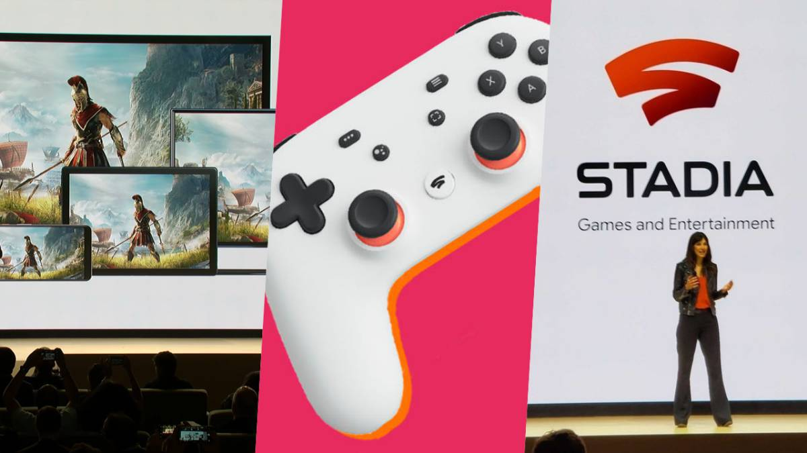

Evolución informática, empresas y redes sociales

- [Microsoft (1975)](#microsoft-1975)
- [Microsoft Office (1989)](#microsoft-office-1989)
  - [Apple (1976)](#apple-1976)
  - [Tecnología en los años 80 y 90](#tecnología-en-los-años-80-y-90)
  - [Ebay (1995)](#ebay-1995)
  - [Hotmail (1997)](#hotmail-1997)
  - [Primeros móviles populares (1990)](#primeros-móviles-populares-1990)
  - [**Manera de conocer a otras personas (1990)**](#manera-de-conocer-a-otras-personas-1990)
  - [1997: chats y foros](#1997-chats-y-foros)
  - [IRC (1996)](#irc-1996)
  - [Buscadores (1999)](#buscadores-1999)
  - [Cibercafés](#cibercafés)
  - [Amazon (1994)](#amazon-1994)
  - [Pixar y Toy Story (1995)](#pixar-y-toy-story-1995)
  - [Booking.com (1996)](#bookingcom-1996)
  - [Google  (1998)](#google--1998)
  - [Paypal (1998)](#paypal-1998)
  - [MSN Messenger (1999)](#msn-messenger-1999)
  - [eDreams (1999)](#edreams-1999)
  - [Foros (2000)](#foros-2000)
  - [iTunes y iPod (2001)](#itunes-y-ipod-2001)
  - [Wikipedia (2001)](#wikipedia-2001)
  - [Fotolog (2002)](#fotolog-2002)
  - [Linkedin (2003)](#linkedin-2003)
  - [Myspace (2003)](#myspace-2003)
  - [Skype (2003)](#skype-2003)
  - [Tesla (2003)](#tesla-2003)
  - [Gmail (2004)](#gmail-2004)
  - [Facebook (2004)](#facebook-2004)
  - [**Internet Móvil (2005)**](#internet-móvil-2005)
  - [**BlackBerry (2005)**](#blackberry-2005)
  - [YouTube (2005)](#youtube-2005)
  - [Twitter (2006)](#twitter-2006)
  - [Tuenti (2006)](#tuenti-2006)
  - [iPhone (2007)](#iphone-2007)
  - [Kindle (2007)](#kindle-2007)
  - [Spotify (2008)](#spotify-2008)
  - [Airbnb (2008)](#airbnb-2008)
  - [Whatsapp (2009)](#whatsapp-2009)
  - [Kickstarter (2009)](#kickstarter-2009)
  - [iPad (2010)](#ipad-2010)
  - [Instagram (2010)](#instagram-2010)
  - [Pinterest (2010)](#pinterest-2010)
  - [**Snapchat (2011)**](#snapchat-2011)
  - [Twitch (2011)](#twitch-2011)
  - [Productos de segunda mano (2013)](#productos-de-segunda-mano-2013)
  - [Patreon (2013)](#patreon-2013)
  - [Tinder (2014)](#tinder-2014)
  - [Uber (2014)](#uber-2014)
  - [Plataformas de Delivery (2015)](#plataformas-de-delivery-2015)
  - [Netflix (2015 en España)](#netflix-2015-en-españa)
  - [Discord (2015)](#discord-2015)
  - [Tik Tok (2016)](#tik-tok-2016)
  - [Waymo (2016)](#waymo-2016)
  - [Asistentes de voz (2017)](#asistentes-de-voz-2017)
  - [AliExpress (2017)](#aliexpress-2017)
  - [Google Stadia (2019)](#google-stadia-2019)
  - [Disney+ (2020 en España)](#disney-2020-en-españa)
  - [BeReal (2020)](#bereal-2020)
  - [META (2021)](#meta-2021)
  - [**Criptomonedas (2021)**](#criptomonedas-2021)
  - [X (2022)](#x-2022)
  - [ChatGPT (2021)](#chatgpt-2021)
  - [**Auge de las inteligencias artificiales**](#auge-de-las-inteligencias-artificiales)
  - [**Inteligencias Artificiales y Microsoft**](#inteligencias-artificiales-y-microsoft)
  - [Bard (2023)](#bard-2023)
  - [Threads (2023)](#threads-2023)
  - [Vision pro (2023)](#vision-pro-2023)
  - [NotebookLM (2024)](#notebooklm-2024)

# Microsoft (1975)

Fundación y visión (1975)
Microsoft fue fundada en 1975 por Bill Gates y Paul Allen con una visión clara: "Un ordenador en cada casa". Su objetivo era desarrollar software accesible para el creciente mercado de la informática personal.

Primer gran éxito: MS-DOS (1980)
En 1980, Microsoft alcanzó un hito clave al firmar un acuerdo con IBM para suministrar el sistema operativo MS-DOS en sus ordenadores personales. Este acuerdo consolidó a Microsoft como un actor fundamental en la industria del software.

Nacimiento de Windows (1985)
En 1985, la compañía lanzó Windows 1.0, introduciendo una interfaz gráfica de usuario que simplificaba la experiencia informática, marcando el inicio de la era de los sistemas operativos basados en ventanas.

# Microsoft Office (1989)

El lanzamiento de Windows 95 se convierte en un hito, llevando a Microsoft a la cima de la industria tecnológica.

## Apple (1976)

Fundación y primeros años (1976)
Apple fue fundada en 1976 por Steve Jobs, Steve Wozniak y Ronald Wayne con la intención de desarrollar y comercializar computadoras personales. Ese mismo año, lanzaron su primer producto: el Apple I, una computadora diseñada y ensamblada por Wozniak.

Primeros modelos y crecimiento
Tras el éxito inicial, Apple lanzó nuevos modelos que marcaron hitos en la informática:

Apple I (1976): Primera computadora de la compañía, vendida como un kit sin carcasa, teclado ni monitor.
Apple II (1977): Uno de los primeros ordenadores personales con gran éxito comercial, gracias a su diseño accesible y su capacidad gráfica avanzada.
Apple III (1980): Diseñado para el mercado empresarial, aunque tuvo problemas técnicos que afectaron su recepción.
El impacto de la Macintosh (1984)

En 1984, Apple revolucionó la industria con la introducción de la Macintosh, el primer ordenador personal de éxito con una interfaz gráfica de usuario y un ratón, facilitando su uso y diferenciándolo de los sistemas basados en texto.

Apple (2000)
Apple reinventa la industria de la música con el iPod (2001)y el servicio iTunes, facilitando la descarga y reproducción de música.
El lanzamiento del iPhone (2007) marca la era de los smartphones, fusionando teléfono, reproductor y computadora en uno.
Apple introduce el iPad (2010), consolidando su ecosistema con iOS y App Store, transformando la forma de consumir contenido digital
9

## Tecnología en los años 80 y 90

Telefonía y comunicaciones
Durante las décadas de 1980 y 1990, la telefonía fija era el principal medio de comunicación:

Cabinas telefónicas: Ubicadas en calles y espacios públicos, funcionaban con monedas o tarjetas prepago.
Teléfonos fijos: Presentes en la mayoría de los hogares y oficinas, con tarifas basadas en la duración y el destino de la llamada.
Pago por llamada: El coste variaba según la distancia y el horario (tarifa reducida en horas valle).
Fax: Amplio uso en empresas y oficinas para el envío de documentos a través de la línea telefónica.

Computación y software

En esta época, los ordenadores personales comenzaron a ser más comunes en los hogares, aunque sin acceso a Internet en la mayoría de los casos:

Ordenadores de sobremesa (PCs): Se populariza la idea de que cada casa tenga uno.
Disquetes: Los primeros programas y videojuegos se distribuían en disquetes de 5,25" y 3,5".
Windows: Se convierte en el sistema operativo más utilizado, consolidando a Microsoft como líder del sector.

Los inicios de Internet
Internet comenzó como un proyecto de comunicación entre universidades y centros de investigación, evolucionando hasta convertirse en una herramienta de uso doméstico.

Primer acceso a Internet
Se realizaba mediante una llamada telefónica.
Requería un módem conectado al ordenador, que convertía señales digitales en analógicas y viceversa.
Las velocidades de conexión eran muy bajas en comparación con los estándares actuales.
Internet en los años 90 y 2000
Durante esta época, el uso de Internet se expandió y comenzó a integrarse en la vida cotidiana. Sus principales aplicaciones eran:

Descarga de archivos: Música, imágenes y documentos a través de servicios como Napster o FTP.
Búsqueda de información: Motores de búsqueda primitivos como Altavista y Yahoo! facilitaban el acceso a datos.
Comunicación: El correo electrónico y los chats (como IRC o ICQ) permitieron nuevas formas de interacción.
Evolución de las tarifas de conexión
Tarifas por minutos (Primeros años)
La conexión se cobraba por minutos, similar a una llamada telefónica.
Esto limitaba el tiempo de uso y generaba costos elevados para los usuarios.
Tarifas nocturnas (Intermedio)
Se introdujeron tarifas reducidas en horarios de menor demanda (generalmente de 18:00 a 8:00).
Esto incentivó la navegación durante la noche, cuando las líneas telefónicas estaban menos saturadas.
Tarifas planas (Finales de los 90 - 2000)
Con el avance de la tecnología y el aumento de la demanda, las empresas de telecomunicaciones implementaron tarifas planas.
Permitían conexión ilimitada por una tarifa fija mensual, eliminando las restricciones de tiempo.
Esto facilitó una mayor accesibilidad y un crecimiento exponencial del uso de Internet.

## Ebay (1995)

### **Fundación**:
- **Año**: 1995
- **Fundador**: Pierre Omidyar
- **Originalmente**: AuctionWeb, un sitio de **subastas en línea** donde las personas pueden **comprar y vender artículos**.
- **Primer artículo vendido**: Un **puntero láser roto**, que fue el primer artículo vendido en el sitio.
- **Cambio de nombre**: En 1997, el sitio pasa a llamarse **eBay**.

### **Adquisiciones**:
- **2002**: eBay compra **PayPal**, facilitando las **transacciones** entre los usuarios.
- **2005**: eBay adquiere **Skype**, pero lo **vende** en 2009.

## Hotmail (1997)

- **Fundación**:
  - Fundado por **Sabeer Bhatia** y **Jack Smith** en 1996.
  - Lanzado en 1997 como uno de los primeros servicios gratuitos de correo electrónico.

- **Innovación**:
  - Ofrecía acceso a correo electrónico desde cualquier dispositivo con conexión a Internet.
  - Utilizaba el dominio **@hotmail.com**.

- **Adquisición por Microsoft**:
  - En 1997, Microsoft compra Hotmail por $400 millones.
  - Posteriormente se renombra como **MSN Hotmail** y luego como **Outlook.com**.

- **Impacto**:
  - Fue uno de los primeros en popularizar el correo electrónico accesible desde cualquier lugar, cambiando la forma de comunicarse.

- **Evolución**:
  - Aportó la idea de "webmail", acceso al correo electrónico a través de un navegador web.

## Primeros móviles populares (1990)

### **Primeros teléfonos móviles**:
- **Teléfonos sencillos**: Los primeros móviles eran dispositivos básicos, con funciones limitadas como llamadas y mensajes.
- **Contrato y tarjetas prepago**: Los usuarios podían adquirir móviles mediante contratos con operadoras o a través de tarjetas prepago recargables.
- **SMS**: Los **mensajes de texto (SMS)** comenzaron a ser populares, permitiendo a los usuarios enviar mensajes cortos entre ellos.

## **Manera de conocer a otras personas (1990)**

### **Encuentros en línea**:
- **Intereses comunes**: A medida que la tecnología avanzaba, internet permitió a las personas **encontrar a otras con intereses similares**.
- **Chats y foros**: Las plataformas de **chats y foros** fueron populares para socializar y compartir ideas en línea.
- **Portales de internet**: Los usuarios se unían a **portales** donde podían crear y unirse a **foros temáticos**, fomentando la interacción y el intercambio de información.

## 1997: chats y foros

## IRC (1996)

**IRC** (Internet Relay Chat) se populariza como una de las primeras plataformas de comunicación en tiempo real.

Basado en **servidores** de chat, permite a los usuarios conectarse y conversar en grupos o de manera privada. Para conectarse, se utilizaba un programa llamado **mIRC**, que facilitaba la interacción entre los usuarios.

## Buscadores (1999)

Dificultades encontrar las páginas web que tenían el contenido que se necesitaba.
Se crean los buscadores
Indexan páginas.

LAN Partys
Internet seguía siendo lento para compartir archivos y  jugar en línea, por lo que se popularizaron las LAN partys y cibercafés.
23

## Cibercafés

Durante los años 90 y principios de los 2000, Internet no era tan común en los hogares, por lo que los cibercafés se convirtieron en un lugar popular para acceder a la red.

Los cibercafés eran ordenadores públicos disponibles para que los usuarios se conectaran a Internet.

Tarifas por tiempo: Se cobraba por el tiempo de uso, limitando el acceso de los usuarios.

En estos establecimientos, era posible:

- Acceder a Internet de alta velocidad, lo que permitía una navegación más rápida.
- Navegar por la web y utilizar buscadores o consultar información.
- Correo electrónico: Usar servicios como Hotmail o Yahoo! para enviar y recibir mensajes.
- Chatear en plataformas como IRC o MSN Messenger.
- Jugar videojuegos en red, participando en partidas multijugador en línea.

## Amazon (1994)

Jeff Bezos fundó Amazon como una librería en línea, con la visión de ser "La Tienda Todo-en-Uno".
Diversificación Rápida (1995-2000): Amazon se expande más allá de los libros, ofreciendo una variedad creciente de productos.
Servicios Amazon Prime (2005): Se lanza Amazon Prime, ofreciendo envíos rápidos y servicios de transmisión, impulsando la fidelidad del cliente.
Expansión Global (2000s en adelante): Amazon se convierte en un gigante del comercio electrónico, diversificándose en servicios en la nube, entretenimiento y más.

## Pixar y Toy Story (1995)

### **Pixar y *Toy Story* (1995)**

- **Pixar Animation Studios**:
  - Fundada en 1979, se convirtió en Pixar en 1986 tras la compra por Steve Jobs.
  - Revolucionó la animación por computadora.

- ***Toy Story* (1995)**:
  - Primera película animada por computadora de largo metraje.
  - Estrenada el 22 de noviembre de 1995.
  - Historia de Woody y Buzz Lightyear, juguetes que cobran vida.
  - Recaudó más de $370 millones y fue un éxito crítico.

## Booking.com (1996)

- Fundada en 1996 en Ámsterdam, por Geert-Jan Bruinsma como una pequeña agencia de reservas.
- Ofrecía **hoteles**, apartamentos, casas, **vuelos** y otros servicios de viaje.
- El modelo de negocio se basa en **comisiones** por reservas.
- Introdujo reseñas y calificaciones de usuarios para ayudar a otros viajeros.
- Utiliza algoritmos de IA para personalizar **recomendaciones**.
- Lanzó una **aplicación** móvil para facilitar la reserva de servicios en cualquier momento.

## Google  (1998)

- Fundado el 4 de septiembre de 1998 por Larry Page y Sergey Brin, dos estudiantes de doctorado de la Universidad de Stanford.
- El **buscador** de Google ganó popularidad a finales de los años 90 y principios de los 2000.
- Se destacó por ser **rápido**, **preciso** y fácil de usar, lo que le permitió ganarse una excelente reputación.

## Paypal (1998)

Peter Thiel, Max Levchin, Elon Musk y Luke Nosek
Dificultad de realizar pagos en línea de forma segura y eficiente.
Pagos en línea:  difícil y arriesgado
Proporcionar su información personal
Número de tarjeta de crédito
Sitios web desconocidos.
Fraudes y suplantación de  identidad
Tecnología de criptografía para proteger transacciones
Adquirida por eBay en 2002 (1.500 mill. $)

## MSN Messenger (1999)

- MSN Messenger fue una de las plataformas más populares de mensajería instantánea, permitiendo la conexión entre usuarios a nivel global.
- Introdujo funciones pioneras como emoticonos y zumbidos, mejorando la interacción.
- Permitió la compartición de archivos y fotos entre los usuarios.
- Se integró con Hotmail, facilitando la comunicación entre las cuentas de correo y la plataforma de mensajería.
- Fue la principal plataforma de mensajería de Microsoft hasta que en 2013, la compañía descontinuó MSN Messenger.

Nokia 3210 (1999)
En los años 1990, Nokia se convirtió en un líder mundial en la industria de teléfonos móviles
A partir de la década de 2010, Nokia vendió su división de dispositivos móviles a Microsoft y se centró en el desarrollo de infraestructura de redes y tecnología 5G
32

## eDreams (1999)

### **Fundación**:
- **Año**: 1999
- **Ubicación**: Barcelona
- **Fundador**: Javier Pérez-Tenessa

### **Servicios**:
- Agencia de **viajes en línea** especializada en la venta de **vuelos**.
- **Comisiones** por la venta de boletos y servicios relacionados.
- **Comparación de precios** para ofrecer las mejores opciones a los usuarios.

### **Características**:
- **Multilingüe y multi divisa** para llegar a una audiencia global.
- **Tecnología de búsqueda avanzada** para facilitar la búsqueda de opciones de viaje.
- **Personalización de ofertas** basadas en las preferencias del usuario.

## Foros (2000)

### **Plataformas de Discusión**:
- Los foros son plataformas **de discusión en línea**, donde los usuarios comparten intereses, conocimientos y debaten sobre diversos temas.
- Fomentan la **interacción y la comunidad virtual**.

### **Estructura Organizativa**:
- **Foros principales**: Categorías amplias que agrupan temas relacionados (por ejemplo, tecnología, entretenimiento, educación).
- **Subforos**: Espacios más específicos dentro de cada categoría para debates enfocados (por ejemplo, en tecnología: smartphones, inteligencia artificial, software).

### **Funcionalidades Clave**:
- **Publicaciones**: Los usuarios crean hilos para iniciar debates o compartir información.
- **Respuestas**: Los usuarios pueden participar en hilos existentes.
- **Moderación**: Equipos de moderadores mantienen el orden y las normas.
- **Personalización**: Los perfiles de usuario pueden incluir avatares, firmas y estadísticas de participación.

### **Interacción**:
- Dentro de cada subforo, los usuarios crean temas que contienen **hilos de discusión**.
- Cada hilo comienza con un **mensaje inicial**, seguido de **respuestas** de otros usuarios.
- **Moderadores** controlan el orden en los foros y ofrecen funcionalidades como perfiles de usuario y notificaciones.

## iTunes y iPod (2001)

### **iTunes (2001)**:
- **Lanzamiento**: 2001, Apple introduce iTunes.
- Plataforma para **comprar y descargar música**.
- **2003**: Inauguración de la **tienda de iTunes**, permitiendo la compra de canciones individuales en formato MP3.

### **iPod (2001)**:
- **Lanzamiento**: Apple lanza el **iPod**, un dispositivo portátil que permite llevar **música a cualquier lugar**.

## Wikipedia (2001)

Jimmy Wales y Larry Sanger (2001).
Wikipedia originalmente estaba pensada como un suplemento de Nupedia
Nupedia: Enciclopedia virtual gratuita escrita por expertos.
60 millones de artículos en 300 idiomas

## Fotolog (2002)

### **Características**:
- Blog en el que se **colgaban fotos** y se podían **comentar**.
- Plataforma para **compartir fotos**.
- Utilización de **cámaras digitales**.
- Se permitía **subir una foto al día**.

### **Impacto**:
- Pionero en la idea de compartir fotos en línea antes de la popularización de redes sociales visuales.

## Linkedin (2003)

- Fundado por Reid Hoffman como una red profesional en línea, enfocada en conexiones laborales y el desarrollo profesional.
- En 2016, Microsoft adquirió LinkedIn, integrando la plataforma en su ecosistema.
- **Perfiles** profesionales: Los usuarios pueden crear perfiles detallados sobre su carrera y habilidades.
- **Networking**: Facilita la conexión entre profesionales para oportunidades de colaboración y empleo.
- Búsqueda de empleo: Herramientas para encontrar y postular a trabajos.
- Compartir **artículos** y actualizaciones: Permite a los usuarios compartir contenido relevante y profesional.
- **Recomendaciones**: Los usuarios pueden recibir y ofrecer recomendaciones sobre habilidades y experiencias laborales.

## Myspace (2003)

- Fundación (2003): Creado por Tom Anderson, Chris DeWolfe y Jon Hart, con el objetivo de compartir música, fotos y mensajes, promoviendo la creatividad y la interacción.
- Impacto clave: Fue una plataforma esencial para artistas independientes, como Arctic Monkeys y Adele.
- Ofreció una personalización única de perfiles, permitiendo agregar HTML y música.
- Declive (Desde 2008): El crecimiento de Facebook lo convirtió en competencia directa.
- La saturación publicitaria y la falta de innovación afectaron su popularidad.
- Legado: MySpace inspiró muchas funcionalidades modernas en redes sociales.
- En 2006, alcanzó los 100 millones de usuarios activos.

## Skype (2003)

### **Fundadores**:
- **Janus Friis** y **Niklas Zennström**.

### **Características**:
- **Tecnología VoIP** eficiente para **llamadas de voz gratuitas** en todo el mundo.
- **Popularidad global** por ofrecer comunicación **gratuita** y **accesible**.
- Pionera en conectar personas a través de **Internet sin costo adicional**.

### **Hitos**:
- **2005**: Adquirida por **eBay**.
- **2011**: Comprada por **Microsoft**.

### **Impacto**:
- Sentó las bases para la evolución de las **comunicaciones digitales**.

## Tesla (2003)

### **Fundación (2003)**:
- **Fundadores**: Martin Eberhard y Marc Tarpenning.
- **Objetivo**: Producir coches eléctricos de alto rendimiento y accesibles.

### **Inversión de Elon Musk (2004)**:
- **Musk se une** como inversor principal, desempeñando un papel clave en el liderazgo de la empresa y su desarrollo.
- Aporta **visión, liderazgo** y **recursos financieros** para la expansión.

### **Tesla Roadster (2008)**:
- **Lanzamiento del Roadster**: Primer vehículo totalmente eléctrico de Tesla.
- Establece **nuevos estándares de rendimiento** para coches eléctricos, con una **autonomía** y **aceleración** sin precedentes.

## Gmail (2004)

- **Lanzamiento**: Google presenta Gmail, un servicio de correo electrónico revolucionario.
- **Capacidad de almacenamiento** de 1 GB, superando ampliamente a los competidores en ese momento.

### **Innovación en Búsqueda**:
- Búsqueda avanzada integrada con la potente tecnología de Google, permitiendo a los usuarios encontrar correos fácilmente.

### **Estrategia de Invitación**:
- Inicio como un servicio de invitación, creando anticipación y exclusividad entre los primeros usuarios.

### **Evolución y Nuevas Funciones**:
- A lo largo de los años, Gmail introduce nuevas características:
  - Etiquetas para organizar correos.
  - Google Chat para comunicación en tiempo real.
  - Espacio de almacenamiento ampliado.

- **Líder en servicios de correo**, manteniéndose a la vanguardia de la tecnología y la innovación en el sector.

## Facebook (2004)

- **Fundadores**: Mark Zuckerberg, junto con sus compañeros de cuarto y estudiantes de Harvard:
  - **Eduardo Saverin**
  - **Andrew McCollum**
  - **Dustin Moskovitz**
  - **Chris Hughes**

### **Características iniciales**:
- **Interfaz simple** y fácil de entender.
- Accesible para un público más amplio.
- Enfocada en las **relaciones personales**.
- Funciones clave:
  - **Lista de amigos**.
  - **Mensajes privados**.
  - **Grupos**.
- Permite conectarse con amigos y familiares.

### **Cultura popular**:
- La película **"La red social"** (2010) retrata la creación de Facebook y su impacto.

## **Internet Móvil (2005)**

- En **mayo de 2005**, las tarifas móviles permitieron por fin conectarse a Internet a través del teléfono móvil.
- En **junio de 2006**, las redes recibieron su primera gran actualización a **HSDPA**, incrementando la velocidad de navegación.
- Ese mismo año, salió al mercado la **primera tarifa semiplana**, después de años de tarifas por minuto.

## **BlackBerry (2005)**

### **BlackBerry Messenger**:
- Plataforma de mensajería exclusiva para dispositivos BlackBerry.
- Pionero en mensajería instantánea, permitía a los usuarios chatear y compartir archivos.
- Fue una opción popular entre profesionales y empresas.

### **Declive**:
- La competencia de plataformas de mensajería como **WhatsApp** y **iMessage** provocó su declive.

## YouTube (2005)

- **Fundación**: 2005
- **Fundadores**: Steve Chen, Chad Hurley y Jawed Karim, tres antiguos empleados de PayPal.
- El primer vídeo subido fue **"Me at the zoo"** por Jawed Karim el **23 de abril de 2005**.
- **Revolución** en la forma de consumir vídeos:
  - Ofrece acceso gratuito a contenido audiovisual.
  - Permite encontrar y compartir contenido de manera global.
  - Democratiza la creación y distribución de videos.

### **Adquisición por Google**:
- En 2006, YouTube fue adquirida por **Google** por **1.650 millones de dólares**.

### **Estadísticas**:
- En **2023**, YouTube cuenta con más de **2.000 millones** de usuarios activos mensuales.

### **YouTube Premium**:
- **YouTube Premium** es el servicio de suscripción que permite a los usuarios:
  - Disfrutar de contenido **sin anuncios**.
  - **Descargar** vídeos para verlos sin conexión.
  - Acceder a **contenido exclusivo** de creadores.

### **Competencia con TikTok**:
- Para competir con plataformas como **TikTok**, YouTube lanzó **"YouTube Shorts"**, una función que permite a los usuarios crear y compartir videos cortos de hasta **60 segundos**, con música de fondo y efectos visuales.

## Twitter (2006)

- **Inventores**: Jack Dorsey, Biz Stone y Evan Williams.
- Plataforma de **microblogging** que permite a los usuarios enviar mensajes cortos llamados **tweets** (hasta 280 caracteres).
- Los tweets pueden contener **texto**, **enlaces**, **imágenes** y **videos**.
- Los usuarios pueden **seguir** a otros y recibir sus tweets en su **línea de tiempo**.

### Características clave:
- **Hashtags**: Se utilizan para etiquetar y agrupar temas específicos.
- **Trending topics**: Muestran los temas más populares en tiempo real.
- **Hilos**: Secuencias de tweets relacionados que se conectan entre sí.
- **Fuente de noticias**: Twitter se ha convertido en una importante fuente de noticias, debates y conexión social en todo el mundo.

### Evolución:
- El límite original de caracteres era de **140** basado en la longitud de los mensajes de texto SMS. En noviembre de 2017, se amplió a **280** caracteres.

### Curiosidades:
- El primer tweet en la historia de Twitter fue enviado por Jack Dorsey el **21 de marzo de 2006**.
- El logotipo de Twitter, un pájaro azul, se llama **"Larry"**, en honor al exjugador de baloncesto **Larry Bird**.

## Tuenti (2006)

- **Lanzamiento**: 2006.
- Red social **española** orientada principalmente a jóvenes.
- Permitía compartir **fotos**, **mensajes** y organizar **eventos**.

## iPhone (2007)

- **Lanzamiento**: 29 de junio de 2007.
- Revolucionó la industria de los **teléfonos móviles**.
- Introdujo interacciones intuitivas como el **pellizcar para hacer zoom**.
- **Pantalla táctil** reemplazó el teclado físico, brindando más espacio para visualización e interacción.
- **App Store**: Creación de un ecosistema de aplicaciones.
- Facilitó la **navegación y visualización de sitios web** con facilidad.
- Estableció un nuevo **estándar para los teléfonos móviles**.

## Kindle (2007)

- **Lanzamiento**:
  - Introducido por **Amazon** en 2007, el **Kindle** popularizó los libros electrónicos.

- **Innovaciones**:
  - **Pantalla de tinta electrónica (E-Ink)**: permitía una lectura cómoda sin reflejos, similar al papel.
  - **Batería duradera**: diseñada para durar semanas con una sola carga.
  - **Diseño portátil**: ligero y fácil de transportar.

- **Impacto en la industria**:
  - Reducción significativa en el costo de los libros electrónicos, haciéndolos más accesibles.
  - Proporcionó acceso global a millones de libros en varios idiomas.

- **Características adicionales**:
  - **Tienda Kindle integrada**: acceso directo a la compra de libros.
  - **Sincronización** con la app Kindle en dispositivos móviles y PC, permitiendo continuar la lectura en cualquier dispositivo.

- **Servicios**:
  - **Kindle Unlimited**: servicio de suscripción para acceder a una amplia variedad de libros.
  - **Prime Reading**: acceso a una selección limitada de libros para miembros de Amazon Prime.

## Spotify (2008)

- **Lanzamiento**:
  - Fundada en **2008** en **Suecia**, **Spotify** revolucionó la forma de consumir música digital.

- **Innovaciones**:
  - **Acceso instantáneo** a millones de canciones sin necesidad de descargarlas.
  - Creación de listas de reproducción personalizadas y recomendaciones basadas en el gusto del usuario.

- **Impacto**:
  - Estableció un nuevo **estándar** en el consumo de música digital mediante streaming.

- **Competencia**:
  - **2011**: **Amazon Music** se lanza como alternativa al streaming.
  - **2015**: **Apple Music** combina **iTunes** con el streaming.
  - **2015**: **Google** presenta **YouTube Music** para competir en el mercado.

## Airbnb (2008)

- Fundada en **San Francisco** en 2008 por **Brian Chesky**, **Nathan Blecharczyk** y **Joe Gebbia**.
- Creada para ofrecer **alojamiento alternativo** en espacios compartidos durante conferencias en San Francisco.
- **Plataforma de alojamiento de viajes**: Ofrece habitaciones, apartamentos, casas y otros tipos de espacios.

## Whatsapp (2009)

- Fundada por **Jan Koum** y **Brian Acton**.
- **Mensajería instantánea** simple y eficiente.
- **Disponibilidad multiplataforma**: Accesible en diversos dispositivos (con gran popularidad global).
- Ofrece **mensajería gratuita** a través de **internet**.
- Desplaza a los mensajes de texto (**SMS**).
- **Facebook** compra WhatsApp en 2014.

## Kickstarter (2009)

- **Lanzamiento**:
  - Fundado en **2009** en **EE.UU.**, **Kickstarter** es una plataforma de financiación colectiva (crowdfunding) para proyectos creativos.

- **Objetivo**:
  - Permite a los creadores de proyectos conseguir fondos directamente del público para financiar ideas innovadoras en áreas como tecnología, cine, música y arte.

- **Impacto**:
  - Revolucionó la forma en que los emprendedores y artistas recaudan dinero, democratizando el acceso a la financiación para proyectos creativos.

- **Proyectos Destacados**:
  - Ha apoyado el lanzamiento de productos como **Pebble** (reloj inteligente) y **Exploding Kittens** (juego de mesa).

- **Modelo**:
  - Los proyectos deben alcanzar una meta de financiación específica para recibir el dinero.

## iPad (2010)

Apple introduce el iPad (2010), consolidando su ecosistema con iOS y App Store,
1. Transformación del consumo digital:
Plataforma ideal para leer, ver y navegar.
Impulso al contenido en formato digital (ebooks, revistas).
2. Educación y creatividad:
Herramienta clave en escuelas y para artistas.
Aplicaciones destacadas como Procreate y GarageBand.
3. Era "Post-PC":
Inició la transición hacia dispositivos móviles versátiles.
4. Impulso al mercado de tablets:
Líder en integración con el ecosistema iOS y App Store.
Inspiró a la competencia, manteniendo su liderazgo.

## Instagram (2010)

- Fundada por **Kevin Systrom** y **Mike Krieger**.
- Red social centrada en el móvil, aprovechando **teléfonos inteligentes** con cámaras de alta calidad.
- Destacada por su **interfaz simple** y centrada en la visualización de **fotos**.
- **Primera aplicación** en ofrecer **filtros** para imágenes.
- Atrajo a muchas **celebridades** e **influencers**.

### **Adquisición por Facebook (2012):**
- **Facebook** adquiere Instagram en 2012 por **1,000 millones de USD**.
- Permitiendo su **expansión** y **desarrollo**.
- Instagram se convierte en una de las plataformas de redes sociales más populares.

### **Evolución de Instagram:**
- **Vídeos (2013)**: Los usuarios pueden compartir videos de hasta **15 segundos**.
- **Publicidad (2013)**: Inicio de la **monetización** a través de anuncios.
- **Mensajes Directos (2013)**: Introducción de la función de **mensajes privados**.
- **Vídeos Extendidos (2015)**: Incremento del límite de duración de videos a **60 segundos**.
- **Instagram Stories (2016)**: Publicaciones temporales (**24 horas**), similar a **Snapchat**.
- **Live Videos (2016)**: Capacidad para transmitir en **vivo**.
- **IGTV (2018)**: Plataforma para videos de formato largo, compitiendo con **YouTube**.
- **Shopping Features (2019)**: Integración de **compras directas** dentro de la aplicación.
- **Reels (2020)**: Competencia directa con **TikTok**, permitiendo la creación de videos **cortos** y **editados**.
- **Cambio de Enfoque**: Mayor integración de características para **influencers** y **creadores de contenido**.

## Pinterest (2010)

- Fundada en **2010** por **Ben Silbermann**, **Paul Sciarra** y **Evan Sharp**.
- Permite **descubrir**, **guardar** y **organizar ideas** e **inspiración visual** en forma de **pines** y **tableros**.
  - **Pines**: Imágenes y videos que se pueden **guardar**, **comentar** y **compartir**.
  - **Tableros**: Colecciones temáticas de pines.
- Utiliza un **algoritmo de recomendación** para mostrar contenido relevante a los usuarios.
- Se ha convertido en una herramienta popular para la **planificación**, la **creatividad** y la **inspiración visual** en diversas áreas de interés.

## **Snapchat (2011)**

- Fundada en **2011**.
- Se diferencia de otras aplicaciones de mensajería al permitir a los usuarios enviar **mensajes y fotos** que **desaparecen** después de que el destinatario los haya visto una vez.
- Esta característica ha sido clave para el éxito de **Snapchat**, ya que ha permitido a los usuarios sentirse más cómodos compartiendo **contenido personal** y **privado** sin preocuparse de que se quede grabado.

## Twitch (2011)

- **Fundada** por **Justin Kan** y **Emmett Shear**.
- Originalmente, se centraba en la **transmisión de contenido relacionado con videojuegos**, pero ha evolucionado para incluir una amplia variedad de temas, como **música, arte** y **entretenimiento** en general.
- Los **usuarios**, conocidos como **"streamers"**, transmiten en vivo su contenido a una audiencia en línea.
- Los **espectadores** pueden interactuar a través de un **chat en vivo** y apoyar a los **streamers** con **donaciones** y **suscripciones pagadas**.

## Productos de segunda mano (2013)

- **Wallapop (2013)**: Fundada en **Barcelona**, utiliza **geolocalización** para facilitar la compra y venta de productos de segunda mano.
- **Vinted (2008)**: Fundada en **Lituania** por **Milda Mitkute** y **Justas Janauskas**, especializada en **ropa usada**.
- **Crisis económica**: Aumentó el **interés por la reutilización** de productos.
- Los **smartphones** facilitaron su popularidad al permitir el acceso rápido a las plataformas de segunda mano.
- La **pandemia** aceleró su uso, impulsado por el **ahorro** y la **sostenibilidad**.
- Fomentaron la **economía circular** y la **moda sostenible**.
- Características como **seguridad**, **diseño intuitivo** y **modelos freemium** contribuyeron a su éxito.

## Patreon (2013)

- **Lanzamiento**:
  - Fundado en **2013** por **Jack Conte** y **Sam Yam** en **EE.UU.**.

- **Objetivo**:
  - Permite a los creadores de contenido recibir apoyo financiero directamente de sus seguidores a través de suscripciones mensuales.

- **Modelo de Suscripción**:
  - Los fans (o "patrons") pagan una tarifa mensual a cambio de contenido exclusivo, acceso anticipado o beneficios especiales.

- **Creadores en Patreon**:
  - Utilizado por **youtubers**, **músicos**, **podcasters**, **artistas** y **escritores**, entre otros, para generar ingresos de forma constante.

- **Impacto**:
  - Se convirtió en una herramienta clave para la monetización de contenidos creativos, permitiendo la independencia financiera de muchos creadores.

- **Servicios Adicionales**:
  - Ofrece diversas herramientas para la gestión de la comunidad, contenido exclusivo y descuentos en productos.

## Tinder (2014)

- **Aplicación de citas** con **geolocalización**.
- Los usuarios **crean perfiles** con **fotos** y **descripciones**.
- Funciones:
  - **Deslizar a la derecha**: Interés en un perfil.
  - **Deslizar a la izquierda**: Desinterés.
  - **"Match"**: Cuando ambos usuarios deslizan a la derecha.
  - Tras un **"match"**, los usuarios pueden iniciar un **chat**.
  - Muestra **perfiles cercanos** según la ubicación.

- **Popularización en España** desde **2014**.
- Es una de las apps de citas más usadas, especialmente por **jóvenes entre 18 y 35 años**.
- **Geolocalización** facilita **encuentros cercanos**.
- Modelo **freemium** con **funciones premium**.
- **Popularidad** creció con la **pandemia** y la **digitalización social**.

## Uber (2014)

- **Fundada** en **2009** por **Garrett Camp** y **Travis Kalanick** en **San Francisco, California**.
- Opera una **red de transporte a demanda** a través de su **aplicación móvil**.
- **Entró en España en 2014** y rápidamente se convirtió en una de las **empresas de transporte a demanda** más populares del país.

## Plataformas de Delivery (2015)

### **Just Eat**
- **Pionera en España**, conecta restaurantes con clientes desde **2010**.

### **Deliveroo**
- Fundada en **2015**.
- Conocida por **restaurantes exclusivos** y **reparto rápido**.

### **Glovo**
- Plataforma **española** lanzada en **2015**.
- Ofrece **comida**, **compras** y **envíos de cualquier tipo**.

### **Uber Eats**
- Disponible desde **2017**.
- **Compite con grandes cadenas** y ofrece un **servicio eficiente**.

### **Características comunes**
- **Geolocalización**: Optimiza entregas y tiempos.
- **Modelos freemium** con tarifas variables y **servicios por suscripción premium**.
- **Popularización** durante la **pandemia** y el auge del delivery.

## Netflix (2015 en España)

- **Fundación**: 1997 en EE.UU. como un servicio de alquiler de DVDs por correo.
- **Llegada a España**: 2015, con la expansión global del servicio de streaming.
- **Contenido Original**: En 2013, comenzó a producir contenido original como *House of Cards*, con un enfoque en series y películas exclusivas.
- **Estrategia de Contenido**: Apuesta por contenido propio y adquisición de derechos de distribución.
- **Catálogo**: Gran variedad de películas, series y documentales.
- **Plataforma**: Accesible en PC, dispositivos móviles, Smart TVs y consolas.
- **Modelos de Suscripción**: Cuotas mensuales con diferentes planes de calidad (Standard, HD, 4K).
- **Producción Original**: Lanza más de 126 títulos originales (series y películas) en 2016.
- **Expansión de Producción**: En 2016, Netflix lanza más series y películas originales que cualquier red de cable o canal tradicional.

## Discord (2015)

- Fundado por **Jason Citron** y **Stanislav Vishnevsky** en **2015**.
- **Alternativa moderna** a otras plataformas de **chat y voz**.
- Permite la **creación de servidores**, que son espacios virtuales donde los usuarios pueden unirse y compartir contenido.
- Incluye **canales de texto y voz**, organizados por **temas o categorías**.

## Tik Tok (2016)

- **Lanzamiento**: **septiembre de 2016** por la empresa china **ByteDance**.
- Permite crear y compartir **videos cortos de hasta 60 segundos**, con una amplia gama de **herramientas de edición** y **efectos especiales**.
- **Algoritmo de recomendación**: Muestra contenido personalizado a los usuarios, adaptándose a sus **preferencias** y **comportamiento de navegación**.

## Waymo (2016)

- Fundación: Surge en 2009 como parte de Google, y en 2016 se independiza bajo Alphabet.
- Tecnología Autónoma: Usa sensores LiDAR, radares y cámaras para navegación segura.
- Servicios de Movilidad: Opera taxis autónomos en Phoenix, San Francisco y Los Ángeles.
- Nivel de Autonomía: Vehículos con tecnología de conducción autónoma de nivel 4.
- Flota: Basada en vehículos modificados como Chrysler Pacifica y Jaguar I-PACE.
- Mapeo Avanzado: Crea mapas de alta precisión para mejorar la seguridad y eficiencia.
- Expansión: Planea llevar su tecnología a más ciudades y sectores de transporte.

## Asistentes de voz (2017)

### **Alexa**

- **Lanzamiento**: **6 de noviembre de 2014** en Estados Unidos.
- **Amazon Echo**: Un altavoz inteligente diseñado para interactuar con los usuarios mediante **comandos de voz**.
- **Lanzamiento en España**: **19 de octubre de 2017**.
- **Funciones**:
  - Reproducir **música**.
  - Proporcionar **información**.
  - Controlar **dispositivos domésticos inteligentes**.
  - Establecer **alarmas** y **recordatorios**.

## AliExpress (2017)

### **AliExpress**:
- Plataforma de **comercio electrónico** china perteneciente al **Alibaba Group**.
- Ofrece una **amplia gama de productos** a precios bajos, desde electrónica hasta moda y artículos para el hogar.
- Se ha convertido en una de las **plataformas de comercio electrónico más populares del mundo**.
- **Desembarcó en España en 2017**, con el objetivo de expandir su presencia en Europa.

## Google Stadia (2019)

**Stadia** es el servicio de **streaming de videojuegos** de Google, lanzado en **noviembre de 2019**.
- Permite jugar a videojuegos en prácticamente **cualquier dispositivo** por streaming.
- No se necesita una **consola física** para jugar, sino que se puede hacer con **dispositivos de los que ya disponemos** (como PC, smartphones y televisores compatibles).

## Disney+ (2020 en España)

- **Fundación**: 2019 en EE.UU., Canadá y los Países Bajos.
- **Llegada a España**: 2020.
- **Contenido**: Enfocado en las franquicias de Disney, Pixar, Marvel, Star Wars y National Geographic.
- **Modelo de Suscripción**: Cuota mensual o anual con un único plan disponible.
- **Características**:
  - Permite hasta **4 transmisiones simultáneas**.
  - **7 perfiles de usuario**, cada uno con recomendaciones personalizadas.
  - Posibilidad de tener el servicio en **hasta 10 dispositivos diferentes**.
- **Plataforma**: Accesible a través de apps en PC, dispositivos móviles, Smart TVs y consolas.
- **Contenido Exclusivo**: Ofrece películas y series originales como *The Mandalorian* de Star Wars y contenido exclusivo de Marvel y Pixar.
- **Estrategia**: Consolidación de su contenido original y grandes franquicias para atraer a un público diverso.

## BeReal (2020)

- **BeReal** es una red social **francesa** creada en **2020** por **Alexis Barreyat**.
- La plataforma solo permite **publicar una foto al día**, la cual consiste en:
  - Una **imagen tomada por la cámara delantera**.
  - Una **imagen tomada por la cámara trasera**.
- **Restricciones**: No se pueden usar **filtros** ni **fotos de la galería** del móvil.

## META (2021)

- **28 de octubre de 2021**: En el evento **Connect**, **Facebook Inc.** anunció un cambio de nombre a **Meta Platforms, Inc.**.
- **Enfoque más allá de las RRSS tradicionales**: Meta busca explorar nuevas tecnologías y experiencias digitales inmersivas.
- **Metaverso**:
  - Meta tiene como objetivo construir un **metaverso** donde las personas puedan interactuar, trabajar, jugar y aprender.
  - Utiliza **entornos virtuales tridimensionales**.
  - **Potenciado por la Realidad Virtual (RV) y Realidad Aumentada (RA)**.

## **Criptomonedas (2021)**

### **Bitcoin**

- **Creada en 2009** por una persona o grupo bajo el seudónimo de **Satoshi Nakamoto**.
- Es una **criptomoneda** basada en un sistema de **efectivo electrónico peer-to-peer**.
- Permite **pagos en línea sin necesidad de intermediarios**.
- En **2022**, la **capitalización de mercado** de todas las criptomonedas superó los **3 billones de dólares**.

### **Usuarios de criptomonedas**

#### **Binance**
- Fundada en **2017** por **Changpeng Zhao**.
- El **mayor exchange de criptomonedas** con un volumen de trading diario superior a **20 mil millones USD**.
- **Desarrollador de software** con experiencia en el trading de **alta frecuencia**.

#### **Coinbase**
- Fundada en **2012** por **Brian Armstrong** y **Fred Ehrsam**, estudiantes de la **Universidad de Stanford**.
- Uno de los **exchange de criptomonedas más populares** del mundo.
- Cuenta con más de **56 millones de usuarios**.

## X (2022)

- 2022: **Elon Musk**, consejero delegado de **Tesla** y **SpaceX**, compra Twitter por 44.000 millones de dólares.
- Musk expresó su objetivo de "liberar el potencial de Twitter como plataforma de libertad de expresión".
- Prometió hacer cambios en la plataforma, incluyendo la **eliminación de bots** y la modificación de la **moderación** de contenido.
- Posteriormente, **cambió el nombre de Twitter a "X"** como parte de su visión de reestructurar la plataforma.

https://help.x.com/es/rules-and-policies/profile-labels

## ChatGPT (2021)

- **OpenAI**: Fundada en **2015** como una **compañía de investigación sin fines de lucro** (luego híbrida).
- **Fundadores**: **Elon Musk**, **Sam Altman** y otros.
- El **14 de marzo de 2023** se lanzó **GPT-4**.
- **Proyectos más destacados**:
  - **ChatGPT**: Un **chatbot** (modelo de lenguaje) que puede ver, oír y hablar.
  - **DALL·E 3**: Un modelo de imágenes que puede crear **imágenes a partir de descripciones de texto**.
  - **GPT-4**: El **modelo de lenguaje más avanzado** y capaz de OpenAI.

## **Auge de las inteligencias artificiales**

- **Playground y ChatGPT**:
  - **Noviembre de 2021**: La aplicación **Playground** fue lanzada al público junto a un servicio **API**.
  - **ChatGPT** fue creado en **2022**.

- **GPT-4 y ChatGPT Plus**:
  - El **14 de marzo de 2023**, OpenAI lanzó **GPT-4** como **API** (con lista de espera) y como función de **ChatGPT Plus**.
  - **ChatGPT Plus**: Costaba **$20 al mes**, ofreciendo **acceso general** a ChatGPT, incluso en horas pico, **tiempos de respuesta más rápidos** y **acceso prioritario** a nuevas funciones y mejoras.

## **Inteligencias Artificiales y Microsoft**

- **Microsoft**:
  - Proporcionó a **OpenAI** una **inversión de mil millones de dólares** en 2019 y una **inversión de diez mil millones de dólares** en 2023.
  - Los sistemas de **OpenAI** se ejecutan en una plataforma de **supercomputación basada en Azure de Microsoft**.

## Bard (2023)

- Desarrollado por **Google AI** en **2023**.
- Plataforma avanzada de **procesamiento del lenguaje natural**.
- Posteriormente, **Bard** evolucionó y pasó a llamarse **Gemini**.
- Este cambio de nombre refleja una **expansión en sus capacidades** y el **compromiso continuo de Google AI** con la **innovación en inteligencia artificial**.

## Threads (2023)

- **Lanzamiento**: **Julio de 2023** (15 de diciembre en Europa).
- Desarrollada por **Meta** (Facebook, WhatsApp, Instagram).
- Es una **red social de microblogging** con **mensajes de menos de 500 caracteres**.
- Permite compartir **texto, imágenes, enlaces** y **videos**.
- La interacción con los **seguidores** se realiza mediante **comentarios**, **likes** y **reenvíos**.
- **Integración con Instagram**: Los usuarios pueden conectarse a través de sus cuentas de Instagram.
- Compite con otras **plataformas de microblogging** como Twitter.
- Ofrece **funciones de privacidad** y **control de audiencia** para los usuarios.

## Vision pro (2023)

- **Dispositivo de realidad mixta** (RA y RV) lanzado por **Apple** en **2023**.
- Equipado con **2 pantallas OLED 8K** y el potente **procesador M2**.
- Incorpora un **sistema de seguimiento de movimiento** con **sensores y cámaras avanzadas** para un **seguimiento preciso de los ojos, manos y voz**.
- **Cámara frontal** para **llamadas** y **videollamadas**.
- **Cámara trasera** para capturar **imágenes y videos** del mundo real.

## NotebookLM (2024)

- **Herramienta de inteligencia artificial** desarrollada por **Google** en **2024**.
- Su función principal es **resumir fuentes** y presentar **citas relevantes**, facilitando la **comprensión de información compleja**.
- Permite **organizar datos** de forma **estructurada** y **accesible**, ofreciendo **resúmenes fáciles de entender** y **conversaciones interactivas**.
- **Integración con herramientas de Google** para una experiencia más fluida.
