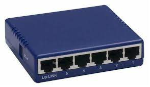
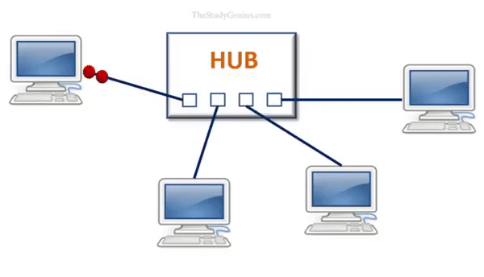

# Hub

Un hub es un dispositivo de red que se utiliza para conectar varios dispositivos en una red local, como una red de ordenadores en una escuela o en una casa. Funciona como un punto central de conexión, permitiendo que los dispositivos se comuniquen entre sí.

# Ejemplo

Imaginemos una red de ordenadores en una clase. Cada ordenador está conectada al hub mediante un cable de red. El hub tiene múltiples puertos en los que se pueden enchufar los cables de red de las ordenadores. Cuando una ordenador envía datos a otra, el hub retransmite esos datos a todos los dispositivos conectados a él.

# Funcionamiento

El hub funciona como un "amplificador de señal" en la red. Toma los datos recibidos de una ordenador y los envía a todos los demás dispositivos en la red, sin importar si los datos son relevantes para esos dispositivos o no. Esto significa que todos los dispositivos conectados al hub reciben los mismos datos, incluso si los datos no estaban destinados para ellos.

El uso de un hub puede tener algunas limitaciones. Al retransmitir todos los datos a todos los dispositivos, puede generar colisiones y congestionar la red. Esto puede afectar el rendimiento general de la red y hacer que la comunicación entre los dispositivos sea más lenta.