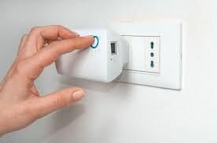

# Repetidor wifi

Un repetidor WiFi, también conocido como extensor de rango o amplificador de señal, es un dispositivo que se utiliza para ampliar la cobertura de una red inalámbrica existente. Su objetivo principal es captar la señal WiFi del enrutador principal y retransmitirla para que llegue a áreas donde la señal es débil o inexistente.

## Funcionamiento

El funcionamiento básico de un repetidor WiFi es el siguiente:

1. El repetidor se coloca en un área donde aún se reciba una señal WiFi adecuada del enrutador principal.

2. El repetidor se conecta a la red inalámbrica existente y establece una conexión inalámbrica con el enrutador principal.
3. El repetidor recibe la señal WiFi del enrutador principal y la amplifica o extiende para cubrir un área más amplia.
4. Los dispositivos cercanos al repetidor pueden conectarse a él para acceder a la red WiFi extendida, como si estuvieran conectados directamente al enrutador principal.