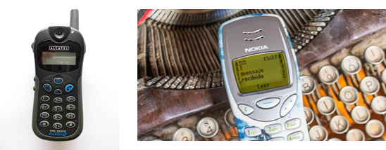
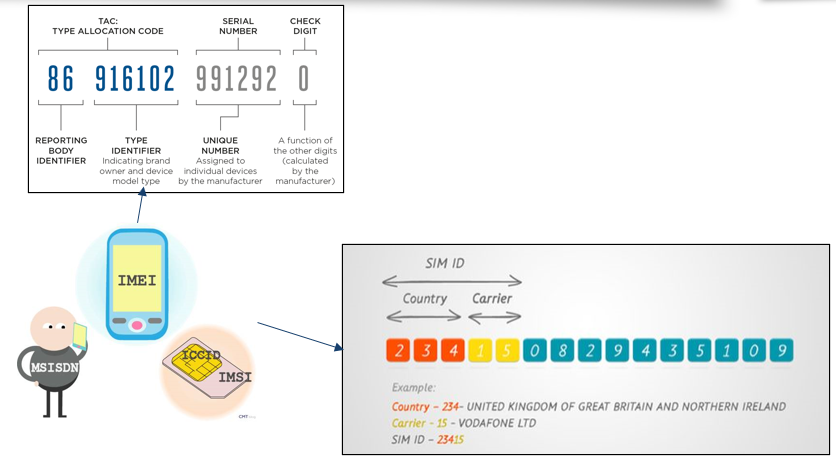
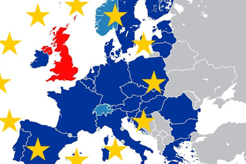
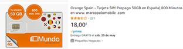
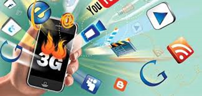

- [Redes móviles](#redes-móviles)
  - [Evolución histórica del mercado](#evolución-histórica-del-mercado)
  - [Liberalización del mercado](#liberalización-del-mercado)
  - [Operadores Móviles Virtuales (OMV)](#operadores-móviles-virtuales-omv)
- [Generaciones de redes móviles](#generaciones-de-redes-móviles)
  - [¿Qué es una generación?](#qué-es-una-generación)
  - [¿Qué implica un cambio de generación?](#qué-implica-un-cambio-de-generación)
  - [Estado actual](#estado-actual)
- [Red móvil 1G](#red-móvil-1g)
  - [Antenas de Telefonía Móvil](#antenas-de-telefonía-móvil)
  - [Red celular](#red-celular)
  - [Handover (cambio de celda)](#handover-cambio-de-celda)
  - [Red de antenas](#red-de-antenas)
  - [Comunicación inalámbrica](#comunicación-inalámbrica)
  - [Frecuencias y espectro electromagnético](#frecuencias-y-espectro-electromagnético)
  - [Bandas de frecuencia para móviles](#bandas-de-frecuencia-para-móviles)
  - [Gestión del espectro](#gestión-del-espectro)
  - [Bandas de frecuencia y operadores](#bandas-de-frecuencia-y-operadores)
- [Red móvil 2G – Principios de los 90](#red-móvil-2g--principios-de-los-90)
  - [Contratos](#contratos)
  - [Evolución de los datos en 2G](#evolución-de-los-datos-en-2g)
  - [Tarjeta SIM](#tarjeta-sim)
  - [Formatos físicos](#formatos-físicos)
  - [eSIM (Embedded SIM)](#esim-embedded-sim)
  - [Dual SIM](#dual-sim)
  - [Identificadores en la red](#identificadores-en-la-red)
  - [Proceso de autenticación en GSM](#proceso-de-autenticación-en-gsm)
  - [Roaming](#roaming)
  - [¿Qué es el roaming?](#qué-es-el-roaming)
- [Red móvil 3G (desde 2004)](#red-móvil-3g-desde-2004)
  - [¿Qué trajo de nuevo?](#qué-trajo-de-nuevo)
  - [¿Qué hizo posible la 3G?](#qué-hizo-posible-la-3g)
  - [Relación con otras generaciones](#relación-con-otras-generaciones)
- [Red móvil 4G (desde 2010)](#red-móvil-4g-desde-2010)
  - [¿Qué trajo de nuevo?](#qué-trajo-de-nuevo-1)
  - [¿Qué hizo posible la 4G?](#qué-hizo-posible-la-4g)
  - [Relación con generaciones anteriores](#relación-con-generaciones-anteriores)
- [Red móvil 5G (desde ~2020)](#red-móvil-5g-desde-2020)
  - [¿Qué trajo de nuevo?](#qué-trajo-de-nuevo-2)
  - [¿Qué hizo posible la 5G?](#qué-hizo-posible-la-5g)
  - [Relación con generaciones anteriores](#relación-con-generaciones-anteriores-1)

# Redes móviles

## Evolución histórica del mercado

1986: Entrada de España en la UE
- UE: Organización supranacional
- Países ceden parte de soberanía. Comparten reglas comunes.
- Evitar conflictos entre estados (interdependencia económica).
Proceso de privatización (Felipe González y José María Aznar)
- España tenía empresas públicas
- Sectores estratégicos: transporte, energía y telecomunicaciones
- Normas de la UE: No se permiten grandes empresas públicas deficitarias.
- Obligación: España privatizó empresas para evitar distorsiones en el mercado.
- Empresas públicas: Algunas se mantuvieron bajo control estatal, pero con limitaciones.
- Capital extranjero: La entrada de inversores en empresas como Telefónica y Seat fue posible gracias a negociaciones con otros países.

## Liberalización del mercado

Telefónica: Posición monopolística (1924-1990)
- Telefónica dominaba el mercado de telecomunicaciones en España.
- Privatización de Telefónica (1995-1997)
- 1994: Liberalización mercado telecomunicaciones.
- Desarrollo de la red digital GSM.
- Nuevas licencias a través de concursos.
Cambio de marcas y operadores
- Telefónica se convierte en Movistar.
- Airtel pasa a ser Vodafone (1995).
- 🖥️ Retevisión > Amena > Orange (1998).
- En 2006: Nacen los operadores móviles virtuales.

Proveedores de servicio
Objetivo de la liberalización
- Aumentar la competencia en el sector.
- Mejorar servicios para los consumidores.
- Comisión Europea impulsó la liberalización del mercado.
- CNMC y otras entidades facilitaron la entrada de Operadores Móviles Virtuales (OMV).

## Operadores Móviles Virtuales (OMV)

- No tienen red propia
- Usan redes de Movistar, Vodafone, Orange y Yoigo.
- Pagan por usar sus redes
- Ofrecen servicios con su propia marca.

Nichos de mercado de los OMV:

- Tarifas prepago para usuarios que prefieren pagar por adelantado.
- Servicios para inmigrantes con planes específicos.
- Planes de bajo coste con precios más competitivos
- Servicios a medida e innovadores.
- Atracción de diversos segmentos de la población.
- Impacto en el mercado
- Mayor competencia en el mercado de telecomunicaciones.
- Diversidad de opciones para los consumidores.

# Generaciones de redes móviles

## ¿Qué es una generación?

- Cada **generación** representa un conjunto de tecnologías móviles con mejoras importantes respecto a la anterior.
- Se identifican con números: **1G, 2G, 3G, 4G, 5G**.
- Cada salto generacional supone:
  - Más velocidad de transmisión.
  - Nuevas funcionalidades.
  - Mejor calidad de servicio.

## ¿Qué implica un cambio de generación?

- Las **antenas** y estaciones base deben **actualizarse** para soportar las nuevas tecnologías.
- Los **móviles** también deben ser **compatibles** para poder aprovechar la nueva red.
- Por eso, no todos los móviles pueden usar redes 5G, por ejemplo.

## Estado actual

- Hoy en día, la **5G** ya está desplegada en muchas ciudades.
- Aún convive con 4G, 3G e incluso algunas zonas con 2G.
- Las generaciones anteriores **no desaparecen de golpe**, sino que se van retirando poco a poco.

# Red móvil 1G

### 📡 Transmisión analógica

- Utilizaban señales analógicas para transmitir voz.
- Comunicaciones por modulación de frecuencia (FM) (radio).
- Susceptibles a interferencias, ruido y escuchas no autorizadas.

### 🔋 Baja eficiencia energética

- Baterías de níquel-cadmio (NiCd), con poca autonomía y pesadas.
- Algunos modelos (como el Ericsson "Hotline") eran grandes y se llevaban como maletines.

### Funcionamiento básico
- **Conexión inicial:** Al encender el teléfono, se conectaba a la antena más cercana.
- **Central conmutadora (MSC):** La antena se comunicaba con la central conmutadora.
- **Llamada:** Al hacer una llamada, esta se dirigía desde el teléfono a la torre, y de ahí por línea terrestre a la red telefónica fija.
- **Solo voz:** No había datos ni SMS (eso llegó con 2G).

## Antenas de Telefonía Móvil

- **Ubicación en ciudades:** Se colocan en edificios altos.
- **Cobertura:** Cada antena cubre un área determinada.
- El teléfono se conecta a la antena más cercana mientras se mueve.
- Las antenas están conectadas entre sí y a Internet, lo que permite enviar información a través de la red de la operadora.

## Red celular

- La cobertura se divide en **celdas** con forma hexagonal.
- Cada celda tiene una **antena propia** (estación base).
- **Celdas:** Zonas geográficas pequeñas con una antena base (torre) que daba cobertura.
- Al moverse de una celda a otra, se realizaba el "handover" (transferencia) para mantener la llamada.
- Cada antena emite en **frecuencias** **distintas** para evitar interferencias.

## Handover (cambio de celda)

- Cuando el usuario se mueve, el móvil **pierde** **señal** de una celda y **gana señal** de otra.
- El sistema cambia automáticamente la conexión a la nueva antena: esto se llama “handover”.
- En 1G, este proceso era **lento y con posibles corte**s, ya que no había buena gestión digital.

## Red de antenas

- Las **antenas** emiten ondas electromagnéticas en una **banda de frecuencia concreta**.
- Estas ondas se **propagan por el aire**, pero pierden potencia con la distancia y los obstáculos.
- Se colocan antenas en lugares altos (tejados, torres) y en función de la **densidad de población**.

## Comunicación inalámbrica

- El móvil recibe la señal con su **antena interna**.
- Detecta solo las ondas de la frecuencia que le interesa, y **descarta otras señales** del entorno (TV, radio, wifi…).
- Así se asegura que solo se conecta con su operador móvil.

## Frecuencias y espectro electromagnético

- El **espectro electromagnético** incluye todas las frecuencias posibles.
- Cada tipo de onda (radio, microondas, rayos X…) tiene propiedades diferentes.
- Ejemplo: los rayos X atraviesan el cuerpo, pero no los huesos.
- En medicina, se usan rayos X o gamma para destruir células cancerosas (radioterapia).

## Bandas de frecuencia para móviles

- Las redes móviles usan **frecuencias concretas**, según lo que se necesite:
  - Mayor cobertura, menor velocidad.
  - Menor cobertura, mayor velocidad.
- Las bandas **bajas (700-900 MHz)** llegan más lejos.
- Las bandas **altas (2-3 GHz)** dan más velocidad pero cubren menos área.

## Gestión del espectro

- El **espectro radioeléctrico** es un recurso **limitado y público**.
- En España lo gestiona la **Secretaría de Estado de Telecomunicaciones e Infraestructuras Digitales**.
- Asignan las frecuencias a los operadores (Movistar, Vodafone, etc.) para que no se solapen.

## Bandas de frecuencia y operadores

- Las compañías como M**ovistar o Vodafone compran o alquilan bandas de frecuencia** al Estado.
- Con esas bandas:
  - Instalan **antenas** que emiten en esas frecuencias.
  - Los** móviles se conectan** a esas frecuencias para poder llamar, enviar mensajes o navegar por internet.

# Red móvil 2G – Principios de los 90

- Digitalización de la red
- Con 2G llega la digitalización de la voz y los datos.
- El estándar más usado fue GSM (Global System for Mobile Communications).

Principales mejoras:

- Introducción de la **tarjeta SIM**.
- Uso de canales compartidos (TDMA: división en el tiempo).
- **Cifrado** de las comunicaciones.
- Envío de **SMS** entre usuarios.
- Transmisión de datos, aunque a baja velocidad.

###  Popularización de los primeros teléfonos móviles

- Los teléfonos eran sencillos, y se ofrecían en modalidad de contrato o tarjetas prepago.
- Permitían llamar y enviar SMS, pero no la conexión a Internet.
- La mensajería consistía en enviar SMS, a un coste fijo.

## Contratos

- Las tarifas más habituales eran de **tarjetas prepago**, con una cantidad de dinero asignada.
- Permitían recargar el saldo de la tarjeta.
- También existía la opción de **contrato**, donde se pagaba una tarifa mensual.

### Tarjetas prepago

- Las **tarjetas prepago** permitían a los usuarios tener control sobre su gasto, ya que solo se podía gastar el saldo cargado.

## Evolución de los datos en 2G

- **GPRS (2001)**
  - Aumenta la **velocidad de transmisión de datos**.
  - Permite el uso de **MMS** (mensajes multimedia) y **navegación web básica**.
- **EDGE**
  - Mejora la velocidad y **ancho de banda**.
  - Soporta aplicaciones multimedia más avanzadas.

## Tarjeta SIM

- **SIM**: *Subscriber Identity Module*.
- Introducida con GSM.
- Contiene información que **identifica al usuario en la red**.

**¿Qué guarda una SIM?**

- IMSI: número único del usuario en la red.
- Ki: clave secreta para autenticar al usuario.
- Agenda de contactos, SMS, y algunos datos del operador.

**¿Qué ventaja tiene?**

- El número está en la **tarjeta**, no en el teléfono.
- Puedes cambiar de móvil y **mantener tu número y contactos**

## Formatos físicos

- Existen **diferentes tamaños**: SIM, microSIM, nanoSIM.
- **Sin SIM**, no puedes conectarte a la **red móvil**.
- Sí puedes conectarte a una **red Wi-Fi** si está disponible.

## eSIM (Embedded SIM)

- SIM **digital integrada** en el dispositivo.
- No necesita tarjeta física.
- Permite cambiar de operador **sin cambiar la SIM**.
- Ahorra espacio y ofrece **más flexibilidad** al usuario.

## Dual SIM

- Permite usar **dos SIM** en el mismo teléfono.

Usos frecuentes:

- **Separar trabajo y vida personal** (dos números en un dispositivo).
- **Combinar operadores**: aprovechar distintas coberturas o tarifas.
- **Viajes**: usar una SIM local y mantener la de tu país.

## Identificadores en la red

| Concepto | Significa                                                                                 | Para qué sirve                                                       | Dónde se guarda                                                 |
| -------- | ----------------------------------------------------------------------------------------- | -------------------------------------------------------------------- | --------------------------------------------------------------- |
| **IMSI** | *International Mobile Subscriber Identity*  (Identidad Internacional de Suscriptor Móvil) | Identifica al **usuario** (la **SIM**) dentro de la red del operador | En la **tarjeta SIM**                                           |
| **IMEI** | *International Mobile Equipment Identity* (Identidad Internacional del Equipo Móvil)      | Identifica al **dispositivo** (**el teléfono**)                      | En el **hardware del móvil** (y no se puede cambiar fácilmente) |

## Proceso de autenticación en GSM

- Móvil envía su IMSI a la red
- Luego usa un TMSI (identificador temporal) para proteger su identidad.
Challenge-Response
- Red envía número aleatorio (RAND) al móvil.
- SIM, usando su clave secreta (Ki), calcula una respuesta (SRES) con el algoritmo A3.
- Red hace el mismo cálculo y compara respuestas. Si coinciden → autenticado.
Generación de clave de cifrado
- A partir de RAND y Ki, la SIM genera una clave de sesión Kc con el algoritmo A8.
- Clave se usará para cifrar los datos entre el móvil y la red.
Cifrado de la comunicación
- Se activa el cifrado usando la clave Kc y el algoritmo A5/x.

## Roaming

## ¿Qué es el roaming?

Permite que una **SIM se conecte a redes extranjeras** cuando estás fuera de tu país.

### ¿Cómo funciona?

1. Al encender el móvil en el extranjero, este **escanea redes disponibles**.
2. Consulta a la **SIM** para saber con qué operadores tiene acuerdos de roaming.
3. El teléfono intenta registrarse en una de esas redes y **envía el IMSI** (identificador único del usuario).
4. La red extranjera pregunta a tu **operadora original** si puede aceptar al usuario.
5. Si es aceptado, se **autoriza el acceso**.
6. Se realiza una **autenticación segura** entre tu SIM y la operadora original (proceso *challenge-response*), con la red extranjera como intermediaria.

✅ Si todo va bien: puedes **llamar, enviar SMS y usar datos** como si estuvieras en tu país.

### 🇪🇺 Roaming en la Unión Europea

- **Sin recargos adicionales** al viajar por la UE.
- Usas tu tarifa habitual: llamadas, mensajes y datos **al mismo precio que en España**.

### Roaming fuera de la UE

- En países como **Marruecos, Ecuador o Filipinas**:
  - Algunas SIMs tienen **datos limitados**.
  - Se conectan a **redes locales**, que pueden tener costes más altos.
  - Es recomendable consultar las condiciones con tu operador antes de viajar.

https://o2online.es/ayuda/paises-por-zonas-zona-1-zona-2-y-zona-3/

# Red móvil 3G (desde 2004)

## ¿Qué trajo de nuevo?

### 1. UMTS (Universal Mobile Telecommunications System)

- Evolución del estándar GSM.
- Usa **WCDMA** (Wideband Code Division Multiple Access) en lugar de TDMA.
- Todos los usuarios comparten **la misma frecuencia**, pero con **códigos únicos**.
- ✅ Permite más usuarios a la vez y mejor rendimiento en zonas densas.

### 2. HSPA y HSPA+ (2006)

- Mejoras sobre 3G estándar.
- Velocidades de hasta **42 Mbps**.
- Permite usar apps con más datos: **YouTube, redes sociales, videollamadas, navegación GPS**, etc.

## ¿Qué hizo posible la 3G?

- **Nacieron los smartphones reales**: iPhone, Android.
- Acceso completo a **Internet móvil** (ya no solo WAP).
- Popularización de apps como:
  - WhatsApp
  - Mapas con GPS
  - Correo electrónico en tiempo real
  - Streaming y redes sociales

##  Relación con otras generaciones

- La 3G fue un **gran salto respecto a la 2G**: voz y datos digitales más rápidos.
- Prepara el camino para la llegada del **4G** y las apps modernas.

# Red móvil 4G (desde 2010)

## ¿Qué trajo de nuevo?

### LTE (Long Term Evolution)

- Tecnología principal de 4G.
- Basada completamente en **datos IP**, incluso para llamadas (VoIP).
- Velocidades mucho más altas: **hasta 100 Mbps o más**.
- Baja latencia ➝ ideal para contenido en tiempo real.

## ¿Qué hizo posible la 4G?

- **Streaming de música y vídeo** fluido (Netflix, Spotify, etc.).
- **Videollamadas en HD** (Skype, FaceTime...).
- Apps más avanzadas: juegos online, trabajo en la nube, apps de transporte (Uber, Google Maps en tiempo real).
- **Tethering** (compartir conexión con otros dispositivos).

## Relación con generaciones anteriores

- Mucho más rápida que 3G.
- Transición a la era de los **datos móviles masivos**.
- Puente entre smartphones y el inicio de los dispositivos conectados.

#  Red móvil 5G (desde ~2020)

## ¿Qué trajo de nuevo?

### Características principales

- **Velocidades ultrarrápidas**: hasta 10 Gbps en teoría.
- **Latencia muy baja**: menos de 1 ms.
- Conexión de **muchos dispositivos al mismo tiempo** (IoT, ciudades inteligentes).
- Tres tipos de bandas:
  - **Banda baja** ➝ cobertura amplia, velocidad moderada.
  - **Banda media** ➝ equilibrio entre cobertura y velocidad.
  - **Banda alta (mmWave)** ➝ velocidad máxima, pero poca cobertura.

## ¿Qué hizo posible la 5G?

- **Realidad aumentada y virtual** en tiempo real.
- **Vehículos autónomos** con comunicación instantánea.
- **Telemedicina** con cirugía remota.
- **Streaming 4K/8K** y experiencias inmersivas.
- Desarrollo de **smart cities** y **IoT masivo**.

## Relación con generaciones anteriores

- No solo mejora la velocidad: **transforma sectores enteros** (industria, salud, transporte).
- Supone el paso de un **móvil conectado** a un **mundo conectado**.
