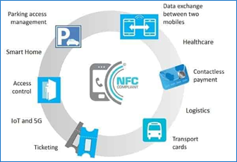
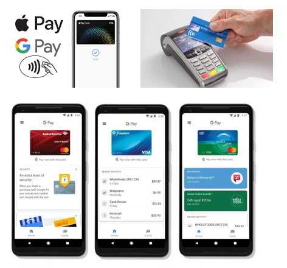
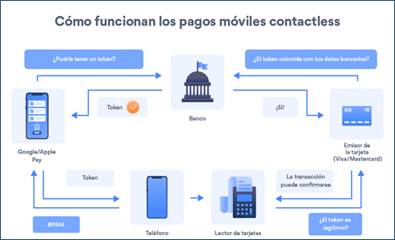
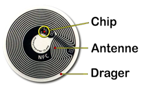

# NFC (Near Field Communication)

## 📡 ¿Qué es NFC?

- Tecnología inalámbrica de **radiofrecuencia** basada en **RFID**.
- Desarrollada en el año 2000, estandarizada en 2003 por el **NFC Forum** (Sony, Nokia y Philips).
- Permite la **transmisión de datos instantánea**, con solo acercar dos dispositivos (a unos 4–10 cm).
- No requiere emparejamiento previo.
- Es **más segura** frente a accesos no autorizados.
- No está pensada para enviar grandes volúmenes de datos como Wi-Fi o Bluetooth.

### 📶 Especificaciones técnicas

- **Frecuencia:** 13.56 MHz
- **Velocidad:** Hasta 424 kbps

## 💳 Aplicaciones de NFC

### ✅ Pagos sin contacto

- Se pueden hacer pagos con:
  - Tarjetas de crédito/débito con NFC
  - Smartphones o smartwatches con NFC
- Compatible con apps como:
  - **Google Pay**, **Apple Pay**, **BBVA Wallet**, **CaixaBank Wallet**

#### 🔧 Requisitos para usar Google Pay:
Teléfono con **chip NFC**.
- Banco compatible vinculado a la app.
- Configuración sencilla:
  - Descargar la app
  - Vincular tarjetas de pago

### ✅ Intercambio de datos

- Compartir información como:
  - Contactos
  - Tickets digitales
  - Claves de autenticación
- Solo acercando los dispositivos

## 🎮 NFC y Amiibo (Nintendo)

- Cada figura Amiibo tiene un **chip NFC** integrado.
- Al acercarla a una consola compatible (ej. Nintendo Switch), se comunica con el juego.

### 📌 ¿Qué permite hacer?

- Desbloquear contenido exclusivo.
- Guardar datos personalizados de juego.
- Modificar la experiencia dentro del juego.

## 🛡️ Seguridad en NFC

### 🔐 Protección durante los pagos

- Se usan **tokens** en lugar de datos bancarios reales.
- Un token es un identificador temporal que solo sirve para una transacción.
- Si un token es interceptado, **no puede reutilizarse**.
- Añade una **capa extra de seguridad** en cada pago.

### 📲 Medidas de seguridad adicionales

- **Acción voluntaria del usuario** (requiere autenticación: PIN, huella, etc.).
- **Distancia de contacto muy corta** (máximo 10 cm).
- **Datos cifrados** y chips NFC diseñados solo para su función.
- **Protección de privacidad**: El chip NFC no accede a otra información del dispositivo.
- **Detección de fraudes** mediante algoritmos y alertas.

## 🏷️ Etiquetas NFC pasivas

- No tienen batería ni fuente de energía propia.
- Se alimentan por **inducción magnética** al acercarse un lector NFC.
- Son **reescribibles** y pueden almacenar pequeñas cantidades de información.

### 🔧 Funcionamiento básico:

1. El lector energiza la etiqueta al acercarse.
2. La antena integrada (una bobina o bucle de cable) permite la comunicación.
3. La antena se conecta a un **circuito integrado (IC)** que guarda los datos.

## 📺 Vídeos recomendados

- [¿Cómo funciona el NFC? - Vídeo 1](https://www.youtube.com/watch?v=YYQ9-HHENsg)
- [Pagos con NFC - Vídeo 2](https://www.youtube.com/watch?v=dV5DcjCL9As)
- [Explicación sencilla de NFC - Vídeo 3](https://www.youtube.com/watch?v=fkre-fLzR84)
