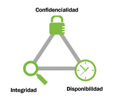
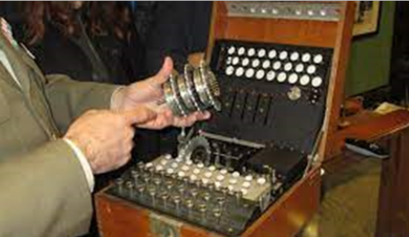
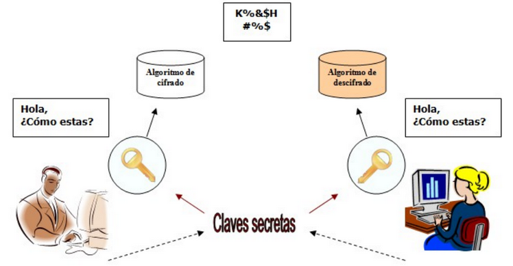
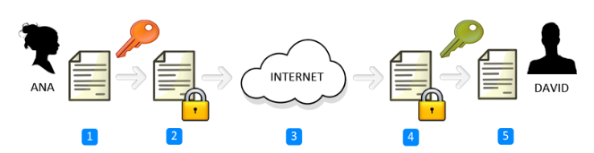
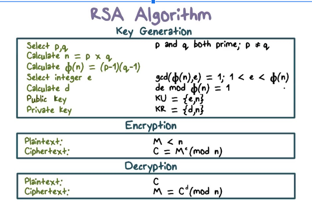
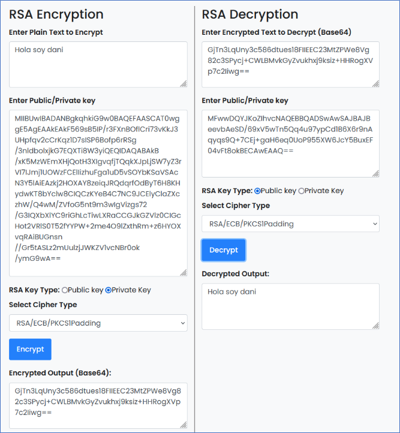
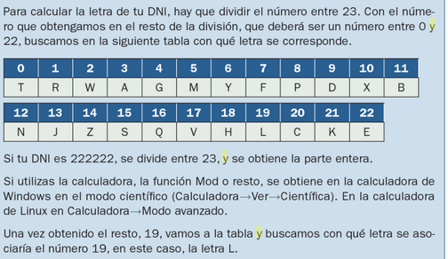
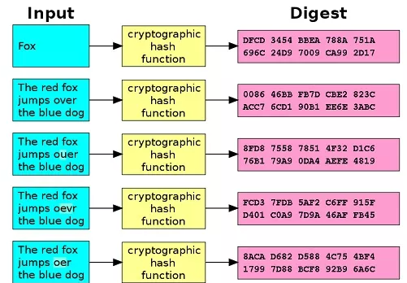
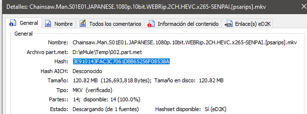
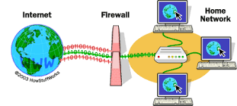

- [1.0. La seguridad de la información](#10-la-seguridad-de-la-información)
- [1.1. Principios de la seguridad informática](#11-principios-de-la-seguridad-informática)
- [1.2. ¿Qué queremos proteger?](#12-qué-queremos-proteger)
- [1.3. Contra qué nos tenemos que proteger](#13-contra-qué-nos-tenemos-que-proteger)
- [1.4. La importancia de los datos](#14-la-importancia-de-los-datos)
- [5.1. Políticas de seguridad](#51-políticas-de-seguridad)
- [5.3. Síntomas de una infección](#53-síntomas-de-una-infección)
- [5.4. Pasos que debe darse en caso de infección](#54-pasos-que-debe-darse-en-caso-de-infección)
- [6.1. Criptografía](#61-criptografía)
  - [Terminologia](#terminologia)
- [6.2. Máquinas de cifrado - Enigma](#62-máquinas-de-cifrado---enigma)
  - [Sistema de engranajes](#sistema-de-engranajes)
  - [Compartición de claves](#compartición-de-claves)
  - [Simulador](#simulador)
- [6.3. Criptografía simétrica](#63-criptografía-simétrica)
  - [Usos](#usos)
  - [Inconvenientes](#inconvenientes)
- [Ejemplo: AES](#ejemplo-aes)
- [6.4. Criptografía asimétrica o de clave pública](#64-criptografía-asimétrica-o-de-clave-pública)
  - [¿Qué claves se necesitan?](#qué-claves-se-necesitan)
  - [¿Qué relación tienen estas 2 claves?](#qué-relación-tienen-estas-2-claves)
  - [Algoritmo RSA](#algoritmo-rsa)
  - [Generación de claves](#generación-de-claves)
  - [Encriptar con clave privada](#encriptar-con-clave-privada)
  - [Webs para practicar](#webs-para-practicar)
- [6.5. Algoritmos](#65-algoritmos)
  - [¿Qué son los algoritmos?](#qué-son-los-algoritmos)
  - [Algoritmos actuales](#algoritmos-actuales)
  - [El algoritmo es público](#el-algoritmo-es-público)
- [6.6. Curiosidades](#66-curiosidades)
  - [DNI y la letra](#dni-y-la-letra)
  - [Cuentas bancarias](#cuentas-bancarias)
- [Funciones de hash](#funciones-de-hash)
  - [Ejemplo emule](#ejemplo-emule)
  - [Ejemplo ``Bitcoin``](#ejemplo-bitcoin)
- [11.1 Seguridad en Bluetooth](#111-seguridad-en-bluetooth)
- [11.2 Wifi](#112-wifi)
- [Antivirus](#antivirus)
  - [¿Es importante tener instalado un antivirus?](#es-importante-tener-instalado-un-antivirus)
  - [Actualización](#actualización)
  - [Ejemplos](#ejemplos)
- [12.1. Introducción](#121-introducción)
- [12.4. Software antispam](#124-software-antispam)
  - [Filtros](#filtros)
- [12.5. Firewall (cortafuegos)](#125-firewall-cortafuegos)
- [Funcionamiento](#funcionamiento)
- [12.6 Redes privadas virtuales](#126-redes-privadas-virtuales)

# 1.0. La seguridad de la información

La **seguridad informática** es el conjunto de acciones, herramientas y dispositivos cuyo objetivo es dotar a un sistema informático (conjunto de hardware, software, personas y procedimientos) de integridad, confidencialidad y disponibilidad.

# 1.1. Principios de la seguridad informática

**¿Quién puede modificar la información?**

Un sistema informático es **íntegro** cuando impide la modificación de la información a cualquier usuario que no haya sido autorizado con anterioridad.

Ejemplos:

- Alteración malintencionada de archivos
- Modificación de informes de ventas (empleados)

**¿Quién puede ver la información?**

Un sistema informático es **confidencial** cuando impide la visualización de datos a los usuarios que no tengan privilegios en el sistema.

Ejemplos:

- Robo de información confidencial por parte de un atacante a través de internet
- Divulgación no autorizada a través de las redes sociales de información confidencial
- Acceso por parte de un empleado a información crítica de la compañía ubicada en carpetas sin permisos asignados, a la que no debería tener acceso

**¿Cuándo podemos acceder a la información?**

Un sistema informático es **disponible** cuando está en todo momento en funcionamiento y accesible para que los usuarios autorizados puedan hacer un uso adecuado de ellos.

Ejemplos:

- Imposibilidad de acceder al correo electrónico corporativo
- Ataque de denegación de servicio, en el que el sistema cae, impidiendo accesos legítimos.

# 1.2. ¿Qué queremos proteger?

La seguridad informática pretende **proteger recursos** valiosos de una organización. En un sistema informático lo que queremos proteger son sus activos, es decir, los recursos que forman parte del sistema y que podemos agrupar en:

- **Hardware**: elementos físicos del sistema informático, tales como procesadores, electrónica y cableado de red, medios de almacenamiento (cabinas, discos, cintas, DVDs,...).
- **Software**: elementos ló́gicos o programas que se ejecutan sobre el hardware, tanto si es el propio sistema operativo como las aplicaciones.
- **Datos**: comprenden la información lógica que procesa el software haciendo uso del hardware. En general serán informaciones estructuradas en bases de datos o paquetes de información que viajan por la red.
- **Otros**: fungibles, personas, infraestructuras,.. aquellos que se 'usan y gastan' como puede ser la tinta y papel en las impresoras, los soportes tipo DVD o incluso cintas si las copias se hacen en ese medio, etc.

**¿Qué es lo más crítico?**

De ellos los mas críticos son los datos, el hardware y el software. Es decir, los datos que están almacenados en el hardware y que son procesados por las aplicaciones software.

El activo mas crítico son los **datos**. El resto se puede reponer con facilidad pero los datos no.

La empresa debe tener una buena política de copias de seguridad y ser capaz de reponerlos en el estado mas próximo al momento en que se produjo la pérdida.

Si la empresa no es capaz de reponer dichos datos, le conllevaría de pérdida de tiempo y dinero.

Para ello se establecen **planes de seguridad** que garantizan los tres principios establecidos con anterioridad. Estos nos ayudan a identificar **vulnerabilidades** e implementar planes de contingencia adecuados.

# 1.3. Contra qué nos tenemos que proteger

- **nosotros mismos**: Borramos archivos sin darnos cuenta, eliminamos programas necesarios para la seguridad o aceptamos correos electrónicos perjudiciales para el sistema.
- **accidentes y averías**: Pueden hacer que se estropee nuestro ordenador y perdamos datos necesarios.
- **usuarios intrusos**: Bien desde el mismo ordenador, bien desde otro equipo de la red, puedan acceder a datos de nuestro equipo.
- **software malicioso o malware**: Programas que aprovechan un acceso a nuestro ordenador para instalarse y obtener información, dañar el sistema o incluso llegar a inutilizarlo por completo

# 1.4. La importancia de los datos

La importancia de la información que manejamos será, en gran medida,relativa a nuestro sector de negocio.

**Ámbito sanitario**

Gran volumen de información personal de pacientes, a la que se deben aplicar todas las medidas de seguridad para evitar que se pierda, modifique o se acceda a ella sin autorización.

Suele ser necesario llevar un registro de los accesos y modificaciones.

**Sector financiero**

Se maneja información confidencial tanto de clientes como de operaciones financieras de compras y ventas de activos cuya difusión puede suponer una importante pérdida económica o un perjuicio para nuestros clientes.

**Sectores industriales o de desarrollo de productos**

Confidencialidad de los procesos y procedimientos que nos pueden aportar una mejora de productividad sobre la competencia.

**Hostelería y restauración**

Se maneja, además de un volumen de datos de carácter personal muy significativo, información sobre reservas, cuya pérdida nos podría poner en una situación muy complicada con nuestros clientes.

**Legislación de datos**

La legislación sobre protección de datos de carácter personal, define datos personales como toda información sobre una persona física identificada o identificable.

Una **persona es identificable** si puede determinarse su identidad, directa o indirectamente.

Esta legislación exige la protección de la seguridad de los datos de carácter personal ante posibles riesgos que afecten a la privacidad de las personas por ejemplo: acceso no autorizado, uso ilegítimo, modificación no autorizada, discriminación por perfilado o pérdida de datos.

**Datos sensibles**

Existen categorías especiales de datos, los denominados **datos sensibles** que exigen una protección reforzada y que están sujetos a un régimen jurídico especial.

Estos datos son datos personales que revelan:

- Ideología, afiliación sindical, opiniones políticas
- Creencias religiosas y otras creencias.
- Origen racial o étnico
- Relativos a la salud o la vida sexual y orientación sexual, datos genéticos y biométricos.
- Datos de condenas penales o administrativas

# 5.1. Políticas de seguridad

Es el conjunto de normas y procedimientos que definen las diferentes formas de actuación recomendada con el fin de garantizar un cierto nivel de seguridad.

Es imposible tener un sistema de seguridad totalmente seguro porque además de que no se podría acceder a muchos sitios es muy caro tener el nivel total de seguridad.

# 5.3. Síntomas de una infección

Algunos síntomas de infección habituales de que un equipo puede estar infectado por algún tipo de malware:

- El sistema va mas lento.
- Desaparece información privada.
- Te sale publicidad indeseada.
- El ratón o las ventanas se mueve sin que tu hagas nada.
- Mal funcionamiento de algunas aplicaciones.
- Conexiones a Internet no intencionadas.
- Cambio del buscador predeterminado.
- Barras nuevas en el navegador sin tu consentimiento.
- Envío de mensajes sin tu mandarlos.
- Aumento de la actividad de tu equipo.

# 5.4. Pasos que debe darse en caso de infección

- **Restaurar el sistema** a un estado anterior: De esta manera no se pierde información, pero si se elimina el virus.

- **Actualizar** la base de datos del **antivirus** y realizar un análisis del sistema.

- Arrancar el sistema con un **LiveCD o Live USB**: permite analizar el equipo con un sistema que no está contaminado y recuperar información.

- Ejecutar **utilidades de desinfección específicas**, que eliminas amenazas concretas: esto sirve cuando ya ha sido detectada la amenaza.

# 6.1. Criptografía

La **criptografía** (del griego 'escritura oculta') es la ciencia de cifrar y descifrar información con técnicas especiales, usado frecuentemente en mensajes que solo puedan ser leídos por las personas a las que van dirigidos.

Al hablar de este área se debería hablar de criptologia que a su vez engloba:

- Las técnicas de cifrado (**criptografía**)
- Sus técnicas complementarias donde se incluye el **criptoanalisis** (técnica que estudia los métodos para romper textos cifrados con objeto de recuperar la información original en ausencia de claves).

- [Práctica tipos de cifrado](https://cryptii.com/pipes/caesar-cipher)

## Terminologia

- El mensaje original recibe el nombre de texto claro.
- El mensaje codificado se denomina texto cifrado.
- El proceso de convertir el texto claro en texto cifrado se denomina cifrado.
- El proceso de recuperar el texto claro a partir del texto cifrado se denomina descifrado.

# 6.2. Máquinas de cifrado - Enigma

Es en la Segunda Guerra Mundial cuando se hace imprescindible el uso de máquinas que cifren los mensajes para así evitar que el enemigo interceptase información sensible para el desarrollo de las operaciones.

La Máquina Enigma era un dispositivo electromecánico usado para cifrar y descifrar mensajes. Estaba compuesta por un teclado, un panel de lámparas, una unidad reflectora, una unidad de rotores y una unidad de conexión.

## Sistema de engranajes

El proceso de codificación comenzaba cuando el usuario tecleaba un mensaje en el teclado. Esto producía una serie de pulsos eléctricos que viajaban a través de los cables conectados al panel de lámparas. Estas luces correspondían a las letras del mensaje en clave.

Los pulsos eléctricos también viajaban a la unidad reflectora, que los desviaba y los enviaba a la unidad de rotores. Esta unidad contenía una serie de ruedas de conexión codificadas con diferentes letras. Estas ruedas se giraban automáticamente a medida que los pulsos eléctricos pasaban a través de ellas, produciendo una nueva secuencia de letras codificadas que se enviaba de vuelta al panel de lámparas.

Finalmente, los pulsos eléctricos viajaban a la unidad de conexión, que los convertía en una secuencia de letras clave que el usuario podía leer. Esta era la forma en que la Máquina Enigma funcionaba para codificar un mensaje.

## Compartición de claves

## Simulador

https://www.101computing.net/enigma-machine-emulator/

# 6.3. Criptografía simétrica

La criptografía simétrica, también conocida como criptografía de clave privada, se utiliza la misma clave para cifrar y descifrar un mensaje.

Esto significa que el remitente y el receptor de un mensaje deben **compartir** la misma **clave** de antemano.

## Usos

La criptografía simétrica suele utilizarse para proteger las comunicaciones entre dos partes. También se puede usar para almacenar datos, como contraseñas, de forma que solo sea accesible para aquellos con la clave.

## Inconvenientes

Un inconveniente de la criptografía simétrica es que, si se pierde o se roba la clave, los datos que protegía también pueden hacerlo. Otra es que puede ser difícil administrar la distribución de claves a varias partes.

# Ejemplo: AES

AES es un tipo de cifrado que se usa para proteger información. El cifrado AES usa una clave que tiene 16, 24 o 32 bytes de largo. La clave se usa para cifrar y descifrar datos.

El cifrado AES es un proceso de dos pasos. En primer lugar, se cifran los datos usando una clave. Luego, los datos se descifran usando la misma clave.

Ejercicio: [encriptacion AES](https://aesencryption.net/)

# 6.4. Criptografía asimétrica o de clave pública

En la criptografía asimétrica tenemos, en lugar de única clave compartida por el emisor y el receptor, 2 claves por cada persona.

.png)

## ¿Qué claves se necesitan?

Cada usuario del sistema criptográfico ha de poseer una pareja de claves, formada por:

- Una **Clave privada**, que será custodiada por su propietario y no se dará a conocer a ningún otro.
- Una **Clave publica**, que será conocida por todos los usuarios.

## ¿Qué relación tienen estas 2 claves?

Esta pareja de claves es **complementaria**: lo que cifra una solo lo puede descifrar la otra y viceversa.

Como es lógico pensar, estas claves se generan a la vez y se encuentran relacionadas matemáticamente entre sí mediante funciones de un solo sentido.

Resulta prácticamente imposible descubrir la clave privada a partir de la pública

## Algoritmo RSA

RSA es un algoritmo de cifrado basado en la teoría de los números primos. Se utiliza en la mayoría de los sistemas de cifrado de datos, como SSL/TLS, para proporcionar una capa de seguridad adicional.

Práctica: https://www.devglan.com/online-tools/rsa-encryption-decryption

## Generación de claves

## Encriptar con clave privada

## Webs para practicar

- https://cryptii.com/pipes/caesar-cipher
- https://cifraronline.com/
- https://www.devglan.com/online-tools/rsa-encryption-decryption
# 6.5. Algoritmos

## ¿Qué son los algoritmos?

Los **algoritmos** son los métodos que se utilizan para transformar el texto claro en el texto cifrado.

Vamos a analizar el cifrado por sustitución del César.

        El algoritmo consiste en:

        - Sustituir cada letra del texto sin cifrar por otra letra del mismo alfabeto que se encuentra situada en el orden del diccionario N puestos por delante.
        - N es el valor de la clave, que como podemos ver, junto con el algoritmo, determinará exactamente la letra que sustituirá a la original.

## Algoritmos actuales

Como podemos imaginar, hoy en día se utilizan diferentes algoritmos, algunos válidos para criptografía de clave privada y otras para criptografía de clave pública.

- **Algoritmos de clave privada**: DES, 3DES, RC4, IDEA Y AES son nombres de algoritmos de clave privada.
- **Algoritmos de clave pública**: DH, EIGamal, RSA.

## El algoritmo es público

“Suele ser un error muy frecuente pensar que los algoritmos de cifrado deben ser secretos para resultar seguros. Los algoritmos de cifrados utilizados son de dominio público y el código fuente asociado también. Sin embargo, siguen siendo seguros porque requieren que el usuario proporcione la clave secreta”

# 6.6. Curiosidades

## DNI y la letra

La letra del DNI se calcula utilizando el algoritmo de Luhn.

1. El número de DNI se divide entre 23.
2. El resto de la división se convierte en número, usando la siguiente tabla:

0=T, 1=R, 2=W, 3=A, 4=G, 5=M, 6=Y, 7=F, 8=P, 9=D, 10=X, 11=B, 12=N, 13=J, 14=Z, 15=S, 16=Q, 17=V, 18=H, 19=L, 20=C, 21=K, 22=E.

3. Si el número de DNI es 12345678 y el resto de la división es 3, la letra correspondiente es A.

## Cuentas bancarias

- El **banco** con el código de entidad 3185 es el Banco de Crédito de España.
- La **sucursal** es la de Calle Alcalá, 9826, 28027 Madrid

# Funciones de hash

Las funciones hash son algoritmos matemáticos que se usan para convertir datos de cualquier tamaño en una cadena de caracteres de tamaño fijo. Esto permite que los datos sean rápidamente comparados y verificados.

Son útiles para la criptografía, ya que permiten almacenar y transmitir datos de forma segura, ya que los datos cifrados se pueden verificar sin necesidad de descifrarlos.

También se usan para la **autenticación** de usuarios, ya que los usuarios pueden verificar su identidad al proporcionar una contraseña cifrada que coincida con una contraseña guardada de forma segura.

Además, se usan para detectar la **corrupción de datos**, ya que si los datos cambian, la función hash generará un valor diferente. Esto permite a los usuarios detectar cualquier cambio en los datos sin necesidad de verificarlos manualmente.

Las funciones hash también se usan para detectar la **duplicación de archivos**, ya que los archivos con contenidos idénticos generarán el mismo valor de hash.

En resumen, las funciones hash son algoritmos matemáticos que se usan para convertir datos de cualquier tamaño en una cadena de caracteres de tamaño fijo. Esto les permite a los usuarios verificar y detectar cambios en los datos de forma rápida y segura, así como detectar la duplicación de archivos.

## Ejemplo emule

El hash en este caso se genera a partir del contenido de un archivo, en bits. Solo de esta forma podemos afirmar que dos o más archivos son exactamente idénticos, puesto que:

1. Dos archivos pueden tener el **mismo nombre** pero ser distintos
3. Dos archivos pueden tener el **mismo tamaño** pero diferente contenido

Compararlos bit a bit no tiene sentido pues es computacionalmente muy costoso. Es mucho más rápido comparar sus hashes.

## Ejemplo ``Bitcoin``

El hash de un bloque nuevo se calcula a partir de 3 cosas:

- Un hash generado a partir de todas las transacciones que contendrá el bloque.
- El hash del bloque anterior
- Un nonce o número aleatorio

# 11.1 Seguridad en Bluetooth

**Bluetooth** es la palabra que define un estándar global de comunicaciones inalámbricas para **redes de área persona**l y que permite la transmisión de voz y de datos entre diferentes equipos por medio de un enlace por radiofrecuencia en entornos de comunicaciones móviles.

La tecnología Bluetooth tiene un alcance de unos **diez metros**, por lo que se ha integrado en dispositivos de la vida cotidiana que forman parte de las redes personales (PAN) como teléfonos y relojes inteligentes.

Los ciberatacantes que emplean estas comunicaciones suelen utilizar antes que amplían el campo de acción de la señal.  Algunos de los ataques son los siguientes:

- **Bluejacking**. Consiste en el envío de spam al usuario por medio del intercambio con este de una vCard, de una nota o de un contacto.
- **Bluesnarfing**. Aprovecha las vulnerabilidades del protocolo para sustraer información del dispositivo atacado.
- **Bluebugging**. Utiliza técnicas de ingeniería social  para que la victima acepte una conexión inicial para infectar el dispositivo con malware de control remoto.

A partir de ahí el usuario dispondrá de acceso remoto al teléfono del usuario y podrá utilizar sus funciones.

La adopción de algunas medidas de seguridad sencillas puede evitar los ataques. Por esta razón, deberían de formar parte de la conducta habitual de un usuario de dispositivos Bluetooh.

Algunas de ellas son:

- Activar bluetooh cuando sea necesario realizar algún tipo de comunicación a través de este medio y desactivarlo cuando se deje de utilizar.
- Cambiar el **nombre del dispositivo** para que no desvele datos personales y configurarlo para que permanezca oculto.
- No emparejar ni aceptar conexiones entrantes de **dispositivos desconocidos**, ya que la información podría estar infectada de software malicioso.
- Verificar periódicamente la lista de **dispositivos de confianza** para eliminar los que no se utilizan habitualmente.

# 11.2 Wifi

Las redes wifi utilizan una tecnología  inalámbrica  que realiza la conexión entre dispositivos situados en un área relativamente pequeña, como una habitación, una oficina, una casa o un edificio, a través de ondas electromagnéticas.

Algunas de las medidas de seguridad basicas que se pueden configurar en el router para mantener una red wifi segura son las siguientes:

- **Personalizar la contraseña de acceso:** las contraseñas por defecto de algunos routers suelen ser muy vulnerables o se pueden averiguar rápidamente en Internet.
- **Cambiar el SSID:** el nombre de la red es el identificador con el que se etiqueta la red inalámbrica para que cada usuario pueda localizarla.
- **Revisar el cifrado:** la señal inalámbrica puede ser interceptada más fácilmente por una red cableada, por lo que es necesario utilizar estándares de cifrado como WPA2.
- **Desactivar el acceso por WPS:** el estándar WPS facilita la configuración de una red segura con WPA2 a sus usuarios.
- **Filtrar las MAC:** las direcciones MAC son establecidas por el fabricante y únicas para cada dispositivo de la red.
- **Actualizar el firmware:** el fimware es el software que controla los circuitos de los dispositivos electrónicos.
- **Comprobar el historial de actividad:** la actividad del router puede desvelar información sobre posibles intrusiones, ya que muestra los datos de los equipos conectados, los horarios, la duración de la sesión, etc...
- **Utilizar software de auditoría:** en el mercado existen herramientas diseñadas para evaluar la seguridad de una red y detectar sus posibles vulnerabilidades. Una de las mas populares es Nmap.
# Antivirus

Son programas diseñados para detectar, bloquear y/o eliminar el software dañino.

Tienen 2 mecanismos básicos de detección de amenazas:

**Comparación**

Buscando entre los programas el patrón de código que coincida con los almacenados en una biblioteca de patrones de virus conocidos.

**Detección de programas basados en su comportamiento**

Conoce una serie de comportamientos sospechosos
Estudia a los programas que, por su código, estén preparados para llevarlos a cabo.

## ¿Es importante tener instalado un antivirus?

Es importantísimo!
Son algo parecido a nuestros guardaespaldas
Se mantienen siempre alerta de posibles programas dañinos que puedan colarse en tu ordenador y hacer uso de los datos y archivos que tienes guardados.
Es básico tener instalado un antivirus.

## Actualización

Los antivirus se encuentran en constante **actualización**, debido a la aparición de nuevos virus. Los antivirus, además, suelen incorporar otras funciones como:

- Antispam
- Cortafuegos
- Cifrado de datos
- Monitor de red

## Ejemplos

Existe una gran variedad de antivirus, entre los más destacados están:

- Avast
- Avira
- Gdata
- KAspersky,etc.

# 12.1. Introducción

- Ya hemos visto en clase que
 - Hay amenazas para nuestro ordenador (personas,accidentes,averías,etc)
Existen programas,correos o webs que suponen una amenaza (virus, troyanos, phishing...)
- Hoy veremos que herramientas podemos utilizar para detectar o evitar estas amenazas

Tipos de herramientas que veremos:

- Antivirus
- Antiespía
- Firewall

 12.3. Antispyware (antiespías)
Programas
Se encargan de que en tu ordenador no haya programas que roben tus datos.

Hoy en día los antivirus tratan de ampliar su protección hacia cualquier ipo de malware y suelen incluir esta función.

En ocasiones es necesario utilizar programas especiales específicos para detectar el spyware y que complementan la actividad del antivirus.

**¿cual es la mejor manera de protegerse de estos programas malignos?**

- Ser consciente de su existencia
- Hacer un uso de la red y del software que minimice el riesgo de que puedan entrar en el sistema.
- La prudencia es la principal herramienta
- Extremar la cautela a la hora de enfrentarse a un programa desconocido.
- No todos los programas que se reciben por correo o se descargan gratuitos de la red están limpios de amenazas.
- Es importante comprobar y pensar antes de ejecutar.

# 12.4. Software antispam

El spam o correo basura es correo electrónico que se envía masiva e indiscriminadamente por empresas de publicidad.

## Filtros

El software antispam son programas basados en **filtros** capaces de detectar el correo basura, tanto desde el punto cliente( nuestro ordenador) como desde el punto servidor(nuestro proveedor de correo).

Estos filtros analizan los correos electronicos antes de ser descargados por el cliente.La forma de detección esta basada en lsitas o bases de datos de correos spam , en el analisis de la existencia del remitente, etc.

Actualmente la mayoria de los antivirus tienen integrado un filtro antispam.

# 12.5. Firewall (cortafuegos)

Un firewall es un programa informático encargado de controlar y filtrar las conexiones de entrada y salida a la red de una máquina, así como el tráfico de datos entrante y saliente.

Es un mecanismo básico de prevención contra amenazas de intrusión externa, ya que supone una barrera de protección entre un equipo o red privada y el mundo exterior. Además de controlar el acceso al exterior, un firewall también filtra las comunicaciones, registra los eventos, genera alarmas y permite la configuración de políticas de seguridad.

# Funcionamiento

- Como un portero
- Nadie pasará sin que él les dé permiso para hacerlo.
- Te avisa de posibles programas que quieren hacer algo malo en tu ordenador
- Te hacen invisible ante los posibles ladrones en busca de víctimas.
- En la web
- Descargas gratuitas de cortafuegos
- Es recomendable hacerse con uno

# 12.6 Redes privadas virtuales

Consiste en conectarse a Internet a través de una red privada, estableciendo una conexión cifrada y así evita que el buscador guarde tus datos.

- **VPN de acceso remoto:** acceso a una red privada con una red pública. Ejemplos son conexiones desde lugares públicos como hoteles o cafeterías.
- **VPN de sitio a sitio:** conectar redes a través de internet, pudiendo comunicarse entre ellas.
