<<<<<<< HEAD
- [1. La seguridad de la información](#1-la-seguridad-de-la-información)
- [2. Principios de la seguridad informática](#2-principios-de-la-seguridad-informática)
- [3. ¿Qué queremos proteger?](#3-qué-queremos-proteger)
- [4. Contra qué nos tenemos que proteger](#4-contra-qué-nos-tenemos-que-proteger)
- [5. Amenazas y ataques](#5-amenazas-y-ataques)
  - [Amenazas Humanas](#amenazas-humanas)
  - [Amenazas lógicas](#amenazas-lógicas)
  - [Amenazas Físicas](#amenazas-físicas)
- [6. Seguridad activa y pasiva](#6-seguridad-activa-y-pasiva)
  - [Técnicas de seguridad activa](#técnicas-de-seguridad-activa)
  - [Técnicas o prácticas de seguridad pasiva](#técnicas-o-prácticas-de-seguridad-pasiva)
=======
- [1.0. La seguridad de la información](#10-la-seguridad-de-la-información)
- [PRINCIPIOS DE SEGURIDAD](#principios-de-seguridad)
- [¿QUÉ DEBEMOS PROTEGER?](#qué-debemos-proteger)
- [¿CONTRA QUÉ NOS TENEMOS QUE PROTEGER?](#contra-qué-nos-tenemos-que-proteger)
- [AMENAZAS](#amenazas)
    - [Amenazas Humanas](#amenazas-humanas)
    - [Amenazas lógicas](#amenazas-lógicas)
    - [Amenazas Físicas](#amenazas-físicas)
- [SEGURIDAD ACTIVA Y PASIVA](#seguridad-activa-y-pasiva)
    - [Técnicas de seguridad activa](#técnicas-de-seguridad-activa)
    - [Técnicas o prácticas de seguridad pasiva](#técnicas-o-prácticas-de-seguridad-pasiva)
>>>>>>> 9727d98f4375f32af9e635ba2448b31ce031dcae
- [3. Malware](#3-malware)
- [3.1. Malware](#31-malware)
  - [¿Qué es el malware?](#qué-es-el-malware)
  - [¿por qué se crea?](#por-qué-se-crea)
  - [¿Cömo entra en nuestros equipos?](#cömo-entra-en-nuestros-equipos)
- [3.2. Cómo se infecta un ordenador](#32-cómo-se-infecta-un-ordenador)
  - [Explotando una vulnerabilidad](#explotando-una-vulnerabilidad)
  - [Ingeniería social](#ingeniería-social)
  - [Por un archivo malicioso](#por-un-archivo-malicioso)
  - [Dispositivos extraibles](#dispositivos-extraibles)
  - [Cookies maliciosas](#cookies-maliciosas)
  - [3.3. Tipos de malware más conocidos](#33-tipos-de-malware-más-conocidos)
    - [Virus](#virus)
    - [Gusano](#gusano)
    - [Troyano](#troyano)
- [3.5. Spyware y adware](#35-spyware-y-adware)
  - [PUAs](#puas)
  - [¿Cómo se instalan?](#cómo-se-instalan)
  - [Cómo protegernos](#cómo-protegernos)
  - [Spyware](#spyware)
  - [Usos del spyware](#usos-del-spyware)
  - [¿Cómo funciona?](#cómo-funciona)
  - [Adware](#adware)
- [RANSOMWARE](#ransomware)
  - [Cómo se infectan los equipos](#cómo-se-infectan-los-equipos)
  - [¿Qué hace el ransomware?](#qué-hace-el-ransomware)
  - [Como prevenirlo](#como-prevenirlo)
  - [Phishing](#phishing)
  - [Pharming](#pharming)
  - [Spam](#spam)
  - [¿Qué hacer si lo recibo?](#qué-hacer-si-lo-recibo)
  - [¿Cómo evitar recibir spam?](#cómo-evitar-recibir-spam)
  - [La lista robinson](#la-lista-robinson)
  - [Hoax](#hoax)
- [4.  Ataques](#4--ataques)
- [4.1. Tipos de ataques](#41-tipos-de-ataques)
- [4.2. Ataques remotos](#42-ataques-remotos)
- [4.3. Botnets](#43-botnets)
- [Usos](#usos)
  - [Servidores de comando y control](#servidores-de-comando-y-control)
  - [Ejemplos](#ejemplos)
- [INGENIERÍA SOCIAL](#ingeniería-social-1)
  - [Ejemplo](#ejemplo)
  - [Componentes psicológicos](#componentes-psicológicos)
  - [Autoridad](#autoridad)
  - [Intimidación](#intimidación)
  - [Consenso](#consenso)
  - [Escasez](#escasez)
  - [Urgencia](#urgencia)
  - [Familiaridad](#familiaridad)
  - [Confianza](#confianza)
  - [¿Cómo defendernos?](#cómo-defendernos)
- [4.5. Ciberacoso](#45-ciberacoso)
  - [Denegación de servicios DoS](#denegación-de-servicios-dos)
  - [DDoS (DoS distrobuido)](#ddos-dos-distrobuido)
  - [Ataques de reflexión y amplificación](#ataques-de-reflexión-y-amplificación)
  - [Ataques de reflexión](#ataques-de-reflexión)
  - [Ataque de amplificación](#ataque-de-amplificación)
  - [Ping](#ping)
- [4.7. Espionaje](#47-espionaje)
  - [Los móviles y nuestra intimidad](#los-móviles-y-nuestra-intimidad)
  - [¿Qué es el spyware?](#qué-es-el-spyware)
  - [¿Qué es Pegasus?](#qué-es-pegasus)
  - [¿Cómo se descubrió la existencia de Pegasus?](#cómo-se-descubrió-la-existencia-de-pegasus)
  - [¿Quién es NSO?](#quién-es-nso)
  - [Funcionamiento de un ataque](#funcionamiento-de-un-ataque)
  - [Fases del ataque](#fases-del-ataque)
  - [Ataques sin interacción del usuario](#ataques-sin-interacción-del-usuario)
- [5.1. Políticas de seguridad](#51-políticas-de-seguridad)
- [5.3. Síntomas de una infección](#53-síntomas-de-una-infección)
- [5.4. Pasos que debe darse en caso de infección](#54-pasos-que-debe-darse-en-caso-de-infección)
- [CRIPTOGRAFÍA](#criptografía)
  - [MÁQUINAS DE CIFRADO. ENIGMA](#máquinas-de-cifrado-enigma)
  - [6.3. Criptografía simétrica](#63-criptografía-simétrica)
  - [6.4. Criptografía asimétrica o de clave pública](#64-criptografía-asimétrica-o-de-clave-pública)
  - [Generación de claves](#generación-de-claves)
  - [Encriptar con clave privada](#encriptar-con-clave-privada)
  - [Webs para practicar](#webs-para-practicar)
  - [6.5. Algoritmos](#65-algoritmos)
  - [6.6. Curiosidades](#66-curiosidades)
  - [Cuentas bancarias](#cuentas-bancarias)
<<<<<<< HEAD
  - [6.7. Funciones de hash](#67-funciones-de-hash)
=======
- [Funciones de hash](#funciones-de-hash)
  - [Usos más habituales](#usos-más-habituales)
  - [Ejemplo emule](#ejemplo-emule)
  - [Ejemplo ``Bitcoin``](#ejemplo-bitcoin)
>>>>>>> 9727d98f4375f32af9e635ba2448b31ce031dcae
- [7. Identidad digital, certificados, firma y DNIe](#7-identidad-digital-certificados-firma-y-dnie)
  - [7.1. certificado digital](#71-certificado-digital)
  - [7.2 DNI Electrónico](#72-dni-electrónico)
  - [Envío](#envío)
<<<<<<< HEAD
- [11. Seguridad en redes inalámbricas](#11-seguridad-en-redes-inalámbricas)
  - [11.1 Seguridad en Bluetooth](#111-seguridad-en-bluetooth)
  - [11.2 Wifi](#112-wifi)
=======
  - [Firma de documentos electrónicos](#firma-de-documentos-electrónicos)
  - [Sellado en el tiempo](#sellado-en-el-tiempo)
- [Identidad digital](#identidad-digital)
  - [Identificación](#identificación)
  - [HUELLA DACTILAR](#huella-dactilar)
    - [Firma](#firma)
  - [DNI](#dni)
  - [Documento nacional de identidad](#documento-nacional-de-identidad)
  - [¿Cómo nos identificamos en Internet?](#cómo-nos-identificamos-en-internet)
  - [Contraseñas](#contraseñas)
  - [Formas de demostrar nuestra identidad](#formas-de-demostrar-nuestra-identidad)
- [11.1 Seguridad en Bluetooth](#111-seguridad-en-bluetooth)
- [11.2 Wifi](#112-wifi)
>>>>>>> 9727d98f4375f32af9e635ba2448b31ce031dcae
- [Antivirus](#antivirus)
  - [¿Es importante tener instalado un antivirus?](#es-importante-tener-instalado-un-antivirus)
  - [Actualización](#actualización)
  - [Ejemplos](#ejemplos-1)
- [12.1. Introducción](#121-introducción)
- [12.4. Software antispam](#124-software-antispam)
  - [Filtros](#filtros)
- [12.5. Firewall (cortafuegos)](#125-firewall-cortafuegos)
- [Funcionamiento](#funcionamiento)
- [12.6 Redes privadas virtuales](#126-redes-privadas-virtuales)
- [Biometría](#biometría)
- [Face ID](#face-id)
- [Touch ID](#touch-id)
- [Biometría](#biometría-1)
  - [Cómo la podemos aprovechar](#cómo-la-podemos-aprovechar)
  - [Huella dactilar](#huella-dactilar-1)
  - [Reconocimiento facial](#reconocimiento-facial)
  - [Reconocimiento de iris](#reconocimiento-de-iris)
  - [Reconocimiento de firma](#reconocimiento-de-firma)
  - [Reconocimiento de la palma](#reconocimiento-de-la-palma)
- [Privacidad y anonimato](#privacidad-y-anonimato)
- [Las capas de la web. Clearnet, deep web y dark web](#las-capas-de-la-web-clearnet-deep-web-y-dark-web)
  - [¿Qué es la web?](#qué-es-la-web)
  - [Las 3 capas de la web](#las-3-capas-de-la-web)
- [Clearnet o web superficial](#clearnet-o-web-superficial)
- [2. Deep web](#2-deep-web)
- [3. Dark web](#3-dark-web)
  - [¿Cómo surge la dark web?](#cómo-surge-la-dark-web)
  - [¿Cómo funciona?](#cómo-funciona-1)
  - [¿Por qué es más segura?](#por-qué-es-más-segura)
- [4. TOR](#4-tor)
  - [¿Qué es TOR?](#qué-es-tor)
  - [¿Qué te puede ocurrir?](#qué-te-puede-ocurrir)
  - [Aspectos positivos](#aspectos-positivos)
  - [¿Quién usa TOR?](#quién-usa-tor)
  - [¿Quién usa TOR?](#quién-usa-tor-1)
- [5. Ejecutar TOR](#5-ejecutar-tor)
  - [Configuración](#configuración)
  - [Acceso a sitios](#acceso-a-sitios)
  - [Conclusión](#conclusión)
- [Silk road](#silk-road)
- [¿Qué es el doxxeo?](#qué-es-el-doxxeo)
  - [Introducción](#introducción)
  - [Qué es el doxxeo](#qué-es-el-doxxeo-1)
- [¿Por qué lo hacen?](#por-qué-lo-hacen)
- [¿Cuales son sus propósitos?](#cuales-son-sus-propósitos)
- [¿Cómo se lleva a cabo?](#cómo-se-lleva-a-cabo)
- [¿Cómo conseguir información?](#cómo-conseguir-información)
- [Peligros](#peligros)
- [Posibles resultados](#posibles-resultados)
- [¿Cómo protegerse](#cómo-protegerse)
  - [Ejemplos](#ejemplos-2)
- [OSINT](#osint)
- [Certificados de servidor web y HTTPS](#certificados-de-servidor-web-y-https)
- [Los rastreadores o trackers](#los-rastreadores-o-trackers)
  - [¿Qué son?](#qué-son)
  - [¿Por qué siguen nuestra actividad?](#por-qué-siguen-nuestra-actividad)
- [Bloqueo de rastreadores](#bloqueo-de-rastreadores)
- [Redes privadas virtuales](#redes-privadas-virtuales)
  - [Algunas ventajas de utilizar una VPN](#algunas-ventajas-de-utilizar-una-vpn)
  - [Inconvenientes](#inconvenientes)

# 1. La seguridad de la información

La **seguridad informática** es el conjunto de acciones, herramientas y dispositivos cuyo objetivo es dotar a un sistema informático (conjunto de hardware, software, personas y procedimientos) de integridad, confidencialidad y disponibilidad.

<<<<<<< HEAD
# 2. Principios de la seguridad informática
=======
# PRINCIPIOS DE SEGURIDAD
>>>>>>> 9727d98f4375f32af9e635ba2448b31ce031dcae

**¿Quién puede modificar la información?**

Un sistema informático es **íntegro** cuando impide la modificación de la información a cualquier usuario que no haya sido autorizado con anterioridad.

Ejemplos:

- Alteración malintencionada de archivos
- Modificación de informes de ventas (empleados)

**¿Quién puede ver la información?**

Un sistema informático es **confidencial** cuando impide la visualización de datos a los usuarios que no tengan privilegios en el sistema.

Ejemplos:

- Robo de información confidencial por parte de un atacante a través de internet
- Divulgación no autorizada a través de las redes sociales de información confidencial
- Acceso por parte de un empleado a información crítica de la compañía ubicada en carpetas sin permisos asignados, a la que no debería tener acceso

**¿Cuándo podemos acceder a la información?**

Un sistema informático es **disponible** cuando está en todo momento en funcionamiento y accesible para que los usuarios autorizados puedan hacer un uso adecuado de ellos.

Ejemplos:

- Imposibilidad de acceder al correo electrónico corporativo
- Ataque de denegación de servicio, en el que el sistema cae, impidiendo accesos legítimos.

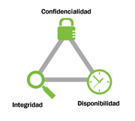

<<<<<<< HEAD
# 3. ¿Qué queremos proteger?
=======
# ¿QUÉ DEBEMOS PROTEGER?
>>>>>>> 9727d98f4375f32af9e635ba2448b31ce031dcae

La seguridad informática pretende **proteger recursos** valiosos de una organización. En un sistema informático lo que queremos proteger son sus activos, es decir, los recursos que forman parte del sistema y que podemos agrupar en:

- **Hardware**: elementos físicos del sistema informático, tales como procesadores, electrónica y cableado de red, medios de almacenamiento (cabinas, discos, cintas, DVDs,...).
- **Software**: elementos ló́gicos o programas que se ejecutan sobre el hardware, tanto si es el propio sistema operativo como las aplicaciones.
- **Datos**: comprenden la información lógica que procesa el software haciendo uso del hardware. En general serán informaciones estructuradas en bases de datos o paquetes de información que viajan por la red.
- **Otros**: fungibles, personas, infraestructuras,.. aquellos que se 'usan y gastan' como puede ser la tinta y papel en las impresoras, los soportes tipo DVD o incluso cintas si las copias se hacen en ese medio, etc.

**¿Qué es lo más crítico?**

De ellos los mas críticos son los datos, el hardware y el software. Es decir, los datos que están almacenados en el hardware y que son procesados por las aplicaciones software.

El activo mas crítico son los **datos**. El resto se puede reponer con facilidad pero los datos no.

La empresa debe tener una buena política de copias de seguridad y ser capaz de reponerlos en el estado mas próximo al momento en que se produjo la pérdida.

Si la empresa no es capaz de reponer dichos datos, le conllevaría de pérdida de tiempo y dinero.

Para ello se establecen **planes de seguridad** que garantizan los tres principios establecidos con anterioridad. Estos nos ayudan a identificar **vulnerabilidades** e implementar planes de contingencia adecuados.


<<<<<<< HEAD
# 4. Contra qué nos tenemos que proteger
=======
# ¿CONTRA QUÉ NOS TENEMOS QUE PROTEGER?
>>>>>>> 9727d98f4375f32af9e635ba2448b31ce031dcae

- **nosotros mismos**: Borramos archivos sin darnos cuenta, eliminamos programas necesarios para la seguridad o aceptamos correos electrónicos perjudiciales para el sistema.
- **accidentes y averías**: Pueden hacer que se estropee nuestro ordenador y perdamos datos necesarios.
- **usuarios intrusos**: Bien desde el mismo ordenador, bien desde otro equipo de la red, puedan acceder a datos de nuestro equipo.
- **software malicioso o malware**: Programas que aprovechan un acceso a nuestro ordenador para instalarse y obtener información, dañar el sistema o incluso llegar a inutilizarlo por completo

<<<<<<< HEAD
# 5. Amenazas y ataques
=======
# AMENAZAS
>>>>>>> 9727d98f4375f32af9e635ba2448b31ce031dcae

Existen 3 tipos de amenazas según su origen:

## Amenazas Humanas

Tipos de amenazas humanas más habituales:

- Usuarios con conocimientos básicos
- Hackers
- Antiguos empleados de una Organización

## Amenazas lógicas

- Software Malicioso
- Vulnerabilidades del software

## Amenazas Físicas

- Fallos en los dispositivos
- Accidentes
- Catástrofes Naturales

<<<<<<< HEAD
# 6. Seguridad activa y pasiva
=======
# SEGURIDAD ACTIVA Y PASIVA
>>>>>>> 9727d98f4375f32af9e635ba2448b31ce031dcae

## Técnicas de seguridad activa

El fin de las medidas de seguridad activa es evitar daños a los sistemas informáticos.

Para ello podemos utilizar diferentes estrategias:

- Empleo de **contraseñas** adecuadas y seguras (elegir una contraseña segura, comprobar la seguridad de una contraseña)
- **Encriptación** de los datos (codificar la información con una contraseña, cualquier persona que la intercepte no pueda ver el mensaje original)
- El uso de **software de seguridad** informática
- Control de Acceso
- Firmas y certificados digitales
- Utilizar protocolos seguros como HTTPS

Enlaces:

- [Comprobar si nuestros datos han sido comprometidos](https://haveibeenpwned.com/
)
- https://howsecureismypassword.net/

## Técnicas o prácticas de seguridad pasiva

Su fin es minimizar los efectos causados por un accidente, un usuario o un malware.

Estrategias:

- Hardware adecuado frente a accidentes y averías (refrigeración del sistema, conexiones eléctricas adecuadas, etc.)
- Realización de copias de seguridad (**backup**) de los datos (en más de un soporte y en distintas ubicaciones físicas)
- Herramientas de Limpieza
- Sistemas de Alimentación Ininterrumpida (**SAI**)
- Sistemas Redundantes


# 3. Malware

# 3.1. Malware

## ¿Qué es el malware?

Nuestro ordenador está expuesto a una serie de pequeños programas o software , potencialmente **peligrosos**. Tienen la capacidad de hacer daño a un equipo y posibilidad de **propagarse** a otros sistemas.

Agrupa a los virus, gusanos, troyanos y en general a todos los programas que se han desarrollado para acceder a los ordenadores sin autorización y producir efectos no deseados.

## ¿por qué se crea?

- En los comienzos la motivación principal de los creadores de virus era el reconocimiento publico.
- Con la evolución de las tecnologías de comunicación y su implantación en todos los aspectos de la la vida diaria, los ciberdelincuentes han visto en ello un negocio muy lucrativo, han pasado a tener una motivación económica.

## ¿Cömo entra en nuestros equipos?

que puede introducirse en el sistema por medio de:

- Los correos electrónicos
- La navegación por páginas web falsas

Los **ciberataques** combinan habitualmente varios tipos.

# 3.2. Cómo se infecta un ordenador

## Explotando una vulnerabilidad

Los sistemas operativos o programas no siempre se comportan como se espera en determinadas situaciones y esto es aprovechado para ejecutar comandos no
deseados o introducir programas maliciosos.

La **vulnerabilidad** es un fallo de seguridad que puede ser explotado por un atacante para obtener acceso no autorizado a un sistema o datos.

Un **exploit** es un método, código o técnica que aprovecha una vulnerabilidad para atacar a un sistema.

- Ejecutar código no autorizado en un sistema objetivo.
- Obtener acceso a un sistema o datos que de otra forma estarían prohibidos.

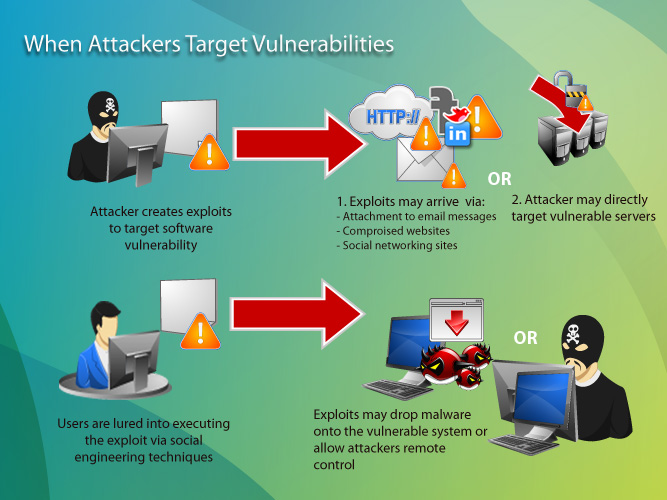

## Ingeniería social

Mediante técnicas de abuso de confianza para apremiar a un usuario a que realice determinada acción.

A menudo, los delincuentes cibernéticos utilizan técnicas de ingeniería social para:

1. Obtener acceso a cuentas de correo electrónico, redes sociales y otros servicios en línea.
2. Una vez que han obtenido acceso a estas cuentas, enviar correos electrónicos falsos a otros usuarios o publicar enlaces maliciosos en redes sociales.
3. También pueden usar estas cuentas para acceder a otros servicios en línea, como bancos en línea y sitios de comercio electrónico.

## Por un archivo malicioso

Es la forma en que gran cantidad de malware llega al ordenador, en archivos adjuntos, por medio del correo no deseado o spam, por la ejecución de aplicaciones web, archivos descargados de redes p2p, cracks, etc.

## Dispositivos extraibles

Muchos gusanos dejan copias de si mismos en dispositivos extraibles y por
medio de la ejecución automática al conectarlo o reproducirse.

- Un ejemplo sería si se conecta una unidad **USB** infectada a un ordenador, ya que esta podría transferir el virus al pc. T
- También es posible que un ordenador se infecte si se **descargan** archivos infectados desde internet.

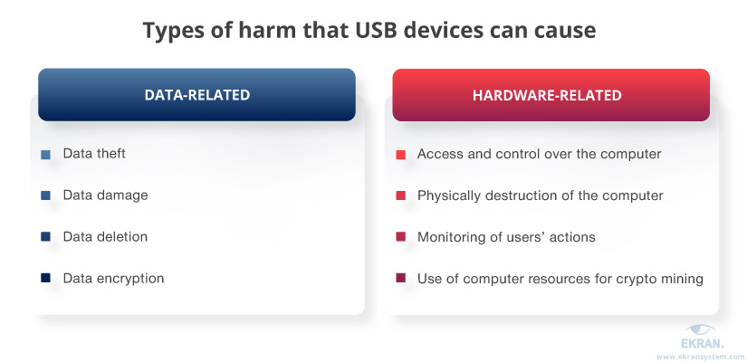

## Cookies maliciosas

Pequeños ficheros que monitorizan y registran las actividades del usuario en
internet con fines maliciosos, por ejemplo tener hábitos de navegación para empresas de publicidad.

## 3.3. Tipos de malware más conocidos

Algunos de los tipos de malware más habituales son:

- Virus
- Gusanos
- Troyanos
- Espía
- Dialers
- SPAM
- Pharming
- Phishing

Enlace: los 8 virus más famosos de todos los tiempos.

https://uk.norton.com/norton-blog/2016/02/the_8_most_famousco.html

### Virus


Se trata de un programa que se instala en el ordenador sin el conocimiento del usuario.

- Su finalidad de **propagarse** a otros equipos de la red o de otras redes a las que esté conectado.
- Puede provocar desde pequeñas **bromas** hasta la **destrucción** total de discos duros.


### Gusano

Tipo de virus cuya finalidad es la de multiplicarse e infectar una red de ordenadores. Las consecuencias no suelen implicar la destrucción de archivos pero sí **ralentizan** el funcionamiento.

### Troyano


Código malicioso que **se oculta dentro de un archivo** inofensivo y útil o llamativo para el usuario. Requieren la intervención de sus víctimas para propagarse.

Lo que intentan es disponer de una puerta de entrada a nuestro ordenador para que otro usuario o aplicación recopile información de nuestro ordenador o tome el control absoluto de él.

Existen una gran variedad de troyanos, en función de sus acciones y utilidades:

- **Downloader** (descarga otros programas maliciosos)
- **Clicker** (busca beneficio económico a través de clicks en publicidad)
- **Keylogger** (registra las actividades que se realizan en el sistema)
- **Backdoor** (abre puertos en el sistema)
- **Bot** (controla el equipo de forma remota), etc.

# 3.5. Spyware y adware

## PUAs

Las aplicaciones potencialmente no deseadas (**PUA**, por sus siglas en inglés) son aplicaciones que el usuario puede no desear debido a su comportamiento inesperado o intrusivo, como cambiar la configuración del navegador, mostrar anuncios, recopilar datos o cambiar la configuración del sistema.

Los ejemplos de PUA incluyen **adware, spyware y optimizadores de sistema**.

## ¿Cómo se instalan?

Las aplicaciones no deseadas generalmente se instalan sin el conocimiento del usuario y pueden afectar negativamente el rendimiento de un dispositivo. En algunos casos, las PUAs también pueden ser maliciosas y usarse para propagar malware. Es importante estar al tanto de las PUAs y tomar medidas para eliminarlas de su dispositivo.

## Cómo protegernos

Para protegerse de las PUA, debe usar un software de seguridad, como un programa antivirus o antispyware, que pueda detectar y eliminar las PUA de su dispositivo.

Además, debe tener cuidado al descargar e instalar aplicaciones, y solo descargue aplicaciones de fuentes confiables. Finalmente, debe escanear regularmente su dispositivo en busca de PUAs y otro software malicioso.

## Spyware


El spyware es un tipo de software malicioso instalado en un dispositivo **sin el conocimiento o permis**o del usuario. Realiza un **seguimiento** de la actividad en el dispositivo y envía los **datos** a un servidor externo, generalmente operado por el creador del spyware u otro tercero.

## Usos del spyware

Se puede usar para:

- Monitorear correos electrónicos, mensajes, llamadas telefónicas
- Rastrear la ubicación física del usuario.
- Interceptar datos de usuarios, como números de tarjetas de crédito, contraseñas y otra información confidencial
- Manipular el dispositivo, por ejemplo, cambiando la configuración, desactivando el software de seguridad e incluso secuestrando el dispositivo.
- Rastrear hábitos de navegación.

## ¿Cómo funciona?

Una vez instalado, el software espía generalmente comenzará a **rastrear** las actividades del usuario y **enviará** los datos al creador o a un tercero.

## Adware


Software que se esconde en los anuncios de Internet. Tras acceder los equipos y dispositivos, este malware roba la información de las empresas y usuarios.

# RANSOMWARE

El ransomware es un tipo de **malware** que amenaza con bloquear el acceso a los archivos de un ordenador hasta que una cantidad de dinero es pagada.

## Cómo se infectan los equipos

El ransomware se puede propagar a través de archivos adjuntos en mensajes de correo electrónico, descargas de sitios web inseguros, o descargar directamente en un dispositivo.

## ¿Qué hace el ransomware?

Una vez que el ransomware se instala:

1. se cifra los archivos importantes del usuario y bloquea el acceso al dispositivo.
2. Un mensaje aparece en la pantalla para informar al usuario que sus archivos se han bloqueado y que para restaurar el acceso necesitan pagar una tarifa.
3. Si el usuario no paga la tarifa, los archivos permanecerán bloqueados para siempre.

## Como prevenirlo

Los usuarios pueden prevenir el ransomware:

1. Instalando un buen ``antivirus``
2. ``Actualizando`` regularmente los programas y desactivando la opción de abrir automáticamente los archivos adjuntos en los correos electrónicos.
3. Evitar ``descargar archivos`` de sitios web inseguros.

Si un usuario sospecha que su dispositivo ha sido infectado con ransomware, debe buscar ayuda de un experto informático lo antes posible.

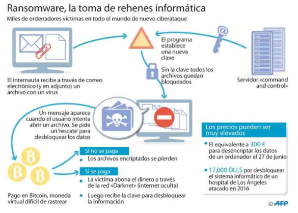


## Phishing


Es un tipo de fraude ejecutado a través de un **correo electrónico** en el que se solicita la actualización de los datos personales (usualmente vinculados a cuentas u otros instrumentos financieros).


Aparece un **enlace** para que se haga clic de acceso a una página falsa que tendrá prácticamente la **misma apariencia** de la página de la institución simulada.


## Pharming


Se instala un código malicioso introducido premeditadamente que permite **redireccionar** un nombre de dominio a otra máquina diferente.

Si el usuario ha sido redireccionado, cuando introduzca el nombre de dominio ingresará a una página ‘web’ falsa (en apariencia similar a la que deseaba ingresar) permitiéndole al estafador obtener todos los datos personales del cliente.

Finalidad:

- Obtener datos bancarios
- Cometer delitos económicos

## Spam


Envío de correo electrónico publicitario de forma masiva a cualquier dirección de correo electrónico existente. Su finalidad en general suele ser la de
vender productos.

## ¿Qué hacer si lo recibo?

Consejos:

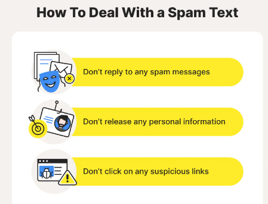

## ¿Cómo evitar recibir spam?


## La lista robinson

- https://www.listarobinson.es/
- https://www.ocu.org/consumo-familia/derechos-consumidor/consejos/como-apuntarse-lista-robinson


## Hoax


Mensajes de correo distribuidos en cadena, cuyo objetivo es realizar engaños masivos. Por ejemplo:

- Historias solidarias inventadas
- Mensajes que traen mala suerte
- Alertas falsas sobre virus

# 4.  Ataques

# 4.1. Tipos de ataques

- **Interrupción**: Destruir o dejar inutilizable los dispositivos.
- **Interceptación**: Acceder a recursos para los que no tiene autorización.
- **Modificación**: Acceder a los recursos y manipularlos.
- **Suplantación o fabricación**: Inserta objetos falsificados. Pueden ser:
 - Suplantación de identidad
 - Suplantación de una dirección web
 - Suplantación de una dirección IP


# 4.2. Ataques remotos

Se trata de un conjunto de técnicas utilizadas para intentar acceder a un sistema informático a distancia. Se suele utilizar software malicioso que aprovecha vulnerabilidades de seguridad de programas o del sistema operativo.

- **Inyección de Código:** Añade o borra información en sitios remotos
- **Escaneo de Puertos**: Averigua los puertos abiertos para atacar.
- **Denegación de Servicios (DoS):** Satura los recursos de un equipo o de una red para que deje de responder.
- **Escuchas de Red**: Captura e interpreta el tráfico de una red.
- **Spoofing**: Suplanta la identidad del usuario.
- **Fuerza Bruta:** Probar todas las combinaciones posibles de claves de un sistema.
- **Elevación de Privilegios:** El atacante se hace root o administrador para controlar más.

Ejemplos:

- [SQL Injection](https://www.w3schools.com/sql/sql_injection.asp)

# 4.3. Botnets

Una ``botnet``, o mejor dicho, una red de bots (también conocida como ejército zombi) es una red constituida por un gran número de equipos informáticos que han sido "secuestrados" por malware, que quedan bajo control del atacante.

# Usos

Al tomar el control de cientos o miles de equipos, las botnets se suelen utilizar para:

- Enviar spam o virus
- Realizar ataques de denegación de servicio distribuido (DDoS).
- Minería de criptomonedas
- Ataques de fuerza bruta


Para que un equipo forme parte de una botnet, primero es necesario que se **infecte** con algún tipo de **malware** que se comunica con un servidor remoto o con otros equipos infectados de la red. De esta forma, recibe instrucciones de quien controla la botnet, normalmente hackers y ciberdelincuentes.

## Servidores de comando y control

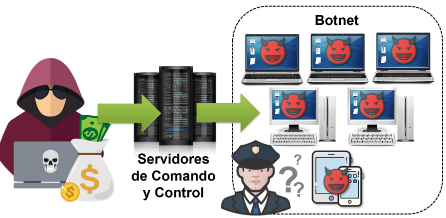


## Ejemplos

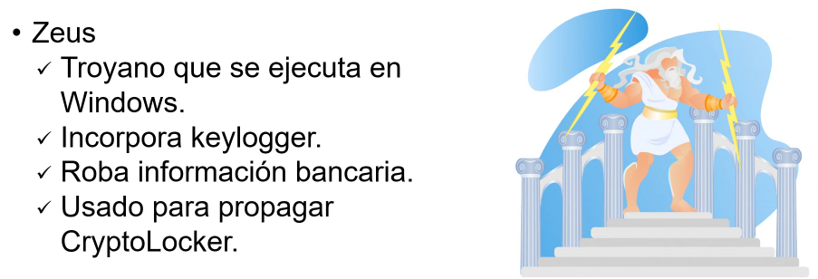

# INGENIERÍA SOCIAL

Los **eslabones** más **débiles** de cualquier cadena de seguridad son los seres humanos. La ingeniería social busca explotar este punto débil, apelando a la vanidad, la avaricia, la curiosidad, el altruismo o el respeto o temor a la autoridad de las personas, para conseguir que revele cierta información o que permita el acceso a un sistema informático.

## Ejemplo


Hay una serie de técnicas de ingeniería social que los ladrones utilizan. Incluyen:

- Cebos (ofrecerle algo que desea para conseguir que descargue un archivo malicioso),
- Phishing (un correo electrónico fraudulento para que comparta información personal)
- Pretextos (hacerse pasar por otra persona con el fin de obtener acceso a información privilegiada)
- Scareware (engañarle para que crea que su equipo está infectado con malware y luego ofrecer una solución que infecta el ordenador).

## Componentes psicológicos


## Autoridad


## Intimidación


## Consenso

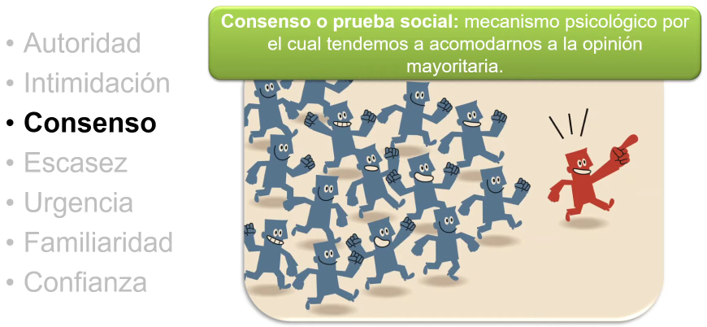

## Escasez

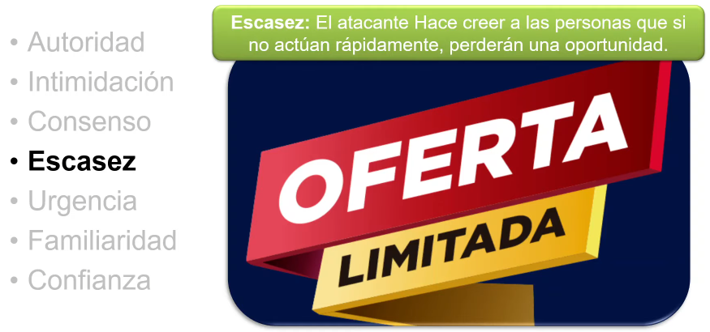

## Urgencia


## Familiaridad

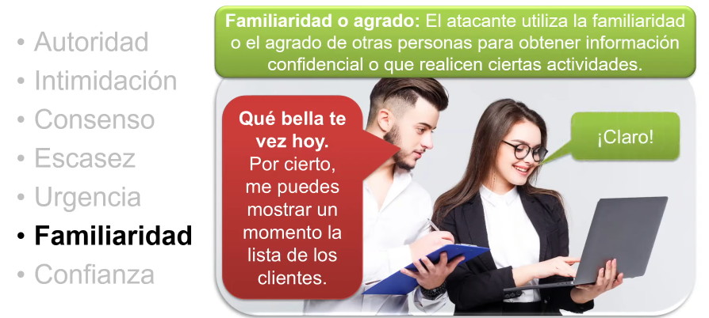

## Confianza

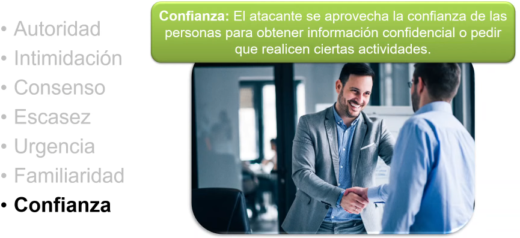

## ¿Cómo defendernos?

- Educación y capacitación a los usuarios
- Políticas de seguridad sin excepciones

# 4.5. Ciberacoso

El ciberacoso puede ser el tipo de ataque en línea más pernicioso, ya que los acosadores, que suelen **ocultarse** tras personalidades falsas, tienden a aprovecharse de las **inseguridades** o **debilidades** personales de la víctima para humillarla y causarle daños **psicológicos**.


El ciberacoso suele consistir en:

- El envío de mensajes amenazantes.
- La publicación de fotografías o vídeos humillantes de la víctima en redes sociales.

En ocasiones, incluso se crean páginas web sobre la víctima. Como a menudo vemos en los periódicos, el efecto del ciberacoso puede ser devastador y, en ocasiones, incluso mortal.

**¿De dónde proviene el ciberacoso?**

El ciberacoso lo practica la misma gente indeseable que acosa en la vida real. Personas que quieren **abusar de su poder** y elevar su **status** en las redes sociales **denigrando** y **humillando** a otros, especialmente si consideran que la otra persona es más débil o creen que puede representar una amenaza.


Los ciberacosadores pueden:

- Realizar publicaciones anónimas
- Esconderse tras identidades falsas
- Utilizar su identidad real sabiendo que no se van a enfrentar cara a cara con sus víctimas.

Muchos de ellos dicen o publican cosas en línea que jamás se atreverían a decir en la vida real.

Los ataques de denegación de servicio (DoS) **bloquean** sitios web o redes completas **saturándolos con tráfico**.
- Causa que un servicio o recurso sea inaccesible a usuarios legítimos.
- El atacante sobrecarga diferentes tipos de recursos como CPU, memoria, almacenamiento o recursos de la red.


**¿cómo se ven afectados los usuarios?**

Dado que tanto el objetivo como los equipos utilizados en la botnet son víctimas, los usuarios individuales reciben daños colaterales en el ataque, ya sus equipos se ralentizan y fallan mientras se encuentran bajo el control del hacker.

Los motivos que llevan a un hacker a organizar un ataque DDoS suelen ser:

- El beneficio económico
- La venganza
- El deseo de ser un "troll"

El ataque hace que se cierre el sitio web y que sus servicios en línea dejen de estar disponibles para los usuarios, que suelen perder la paciencia y la confianza en la empresa, terminando por buscar otras opciones empresariales alternativas. Además de la consecuente **pérdida de ingresos**, esto produce un daño importante en la **reputación** de la organización.

## Denegación de servicios DoS


## DDoS (DoS distrobuido)


## Ataques de reflexión y amplificación

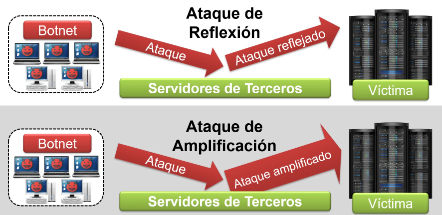

## Ataques de reflexión


## Ataque de amplificación

## Ping


# 4.7. Espionaje


## Los móviles y nuestra intimidad

A medida que los teléfonos móviles continúan estando estrechamente integrados en nuestra vida personal y laboral. Registran nuestra actividad telefónica, ubicación, etc. Tener acceso a esta información es posible teniendo acceso al dispositivo móvil.

Por este mot**ivo, algunas empresas están creando** aplicaciones sofisticadas que pueden ejecutarse en los dispositivos de las víctimas sin que ellas sepan de la presencia de la amenaza o de la intención de los actores.

Esto se puede ver en la diversidad de amenazas que tienen como objetivo los dispositivos móviles:

- Las que tienen una motivación financiera, como el adware, los troyanos bancarios y el fraude por SMS
- Las que buscan información personal,propiedad intelectual o información corporativa.

## ¿Qué es el spyware?

Se trata de una aplicación maliciosa diseñada para recopilar y recuperar información de un dispositivo infectado sin el conocimiento de la víctima.

Entre la información que pueden extraer se encuentran:
- Mensajes SMS de la víctima
- Detalles de contacto, o grabar sus llamadas
- Registros de llamadas

Activar de forma remota el micrófono y la cámara de un dispositivo para capturar de forma subrepticia audio, video, y contenido de la imagen.

## ¿Qué es Pegasus?

Pegasus es un spyware que se creó para espiar sistemas operativos (iOS y Android). Pegasus es el principal software espía del grupo NSO.

## ¿Cómo se descubrió la existencia de Pegasus?

Pegasus fue descubierto en agosto de 2016. Un activista recibió un mensaje sobre la revelación de secretos a través de un enlace en su teléfono. Ante la sospecha, envió el link recibido al citizen lab de la universidad de Toronto, que lo investigó.

El Citizen lab es un laboratorio de investigación multidisciplinario ubicado en la Universidad de Toronto. Se centra en la investigación centrado en el estudio de las amenazas digitales para la sociedad civil y el compromiso político de alto nivel.

## ¿Quién es NSO?

Se trata de una empresa de ciberseguridad con sede en Israel fundada en 2010. Esta empresa desarrolla y vende software de vigilancia de teléfonos móviles a gobiernos de todo el mundo.


NSO afirma que proporciona el spyware a las agencias autorizadas de los gobiernos de manera legal para combatir el terrorismo y el crimen, pero varias veces se ha descubierto que su spyware se ha utilizado para espiar a activistas humanos, periodistas, etc.

El nombre NSO viene de sus creadores:

- N-Niv Carmi.
- S-Shalev Hulio
- O-Omri Lavie

## Funcionamiento de un ataque

El funcionamiento es el de un virus del tipo troyano. Al tener acceso al dispositivo, se conecta remotamente para descargar otros programas, instalarlos, y transmitir información a través de internet sin que el usuario se de cuenta.

En los ataques de un clic, el ataque comienza cuando el atacante envía un URL del sitio web (a través de SMS, correo electrónico, redes sociales o cualquier otro mensaje) a un objetivo identificado.

El usuario solo tiene que hacer clic en el enlace. Entonces, el software ejecuta silenciosamente una serie de exploits contra el dispositivo de la víctima para poder instalar los paquetes de software de espionaje.

El software de espionaje contiene códigos maliciosos, procesos y aplicaciones que se utilizan para espiar, recopilar datos e informar de lo que hace el usuario en el dispositivo.

## Fases del ataque

**primera fase**

En la primera fase se incluye la parte de la URL que apunta a un archivo HTML. Este archivo explota una vulnerabilidad en webkit.

**Segunda fase**

Se descarga más código en un paquete ofuscado y encriptado. Este contiene el código necesario para explotar el kernel y un loader que descarga y desencripta un paquete para la fase 3.

**Tercera fase**

En esta fase se descarga el software de espionaje, daemons y otros procesos que se usan cuando el dispositivo ha sido jailbreakeado. Se instalan para ello unos hooks en las apps que se quieren espiar.

También comprueba si el dispositivo ha sido **jailbreakeado** previamente y cancela el acceso.

En esta fase se despliegan una serie de **tarballs**, cada uno con una finalidad concreta.

## Ataques sin interacción del usuario

Las versiones más nuevas han desarrollado capacidades como ataques de clic cero (zero-click).

Estos ataques no requieren ninguna interacción por parte del propietario del teléfono para tener éxito. Explotan las vulnerabilidades de "día cero" en el sistema operativo, que aún no han sido identificadas.

En 2019 Whatsapp reveló que Pegasus había explotado una vulnerabilidad relacionada con hacer una llamada perdida en whatsapp, por ejemplo.

Hacia 2020, Pegasus cambió hacia exploits sin clic y ataques basados en la red. Estos métodos permitieron a los clientes entrar en los teléfonos de destino sin requerir la interacción del usuario y sin dejar rastros detectables.

En 2022, a partir de una investigación se hace público que varios teléfonos de políticos en España se habrían visto comprometidos por el uso de este software.

# 5.1. Políticas de seguridad

Es el conjunto de normas y procedimientos que definen las diferentes formas de actuación recomendada con el fin de garantizar un cierto nivel de seguridad.

Es imposible tener un sistema de seguridad totalmente seguro porque además de que no se podría acceder a muchos sitios es muy caro tener el nivel total de seguridad.

# 5.3. Síntomas de una infección

Algunos síntomas de infección habituales de que un equipo puede estar infectado por algún tipo de malware:

- El sistema va mas lento.
- Desaparece información privada.
- Te sale publicidad indeseada.
- El ratón o las ventanas se mueve sin que tu hagas nada.
- Mal funcionamiento de algunas aplicaciones.
- Conexiones a Internet no intencionadas.
- Cambio del buscador predeterminado.
- Barras nuevas en el navegador sin tu consentimiento.
- Envío de mensajes sin tu mandarlos.
- Aumento de la actividad de tu equipo.

# 5.4. Pasos que debe darse en caso de infección

- **Restaurar el sistema** a un estado anterior: De esta manera no se pierde información, pero si se elimina el virus.

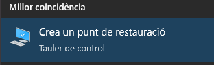

- **Actualizar** la base de datos del **antivirus** y realizar un análisis del sistema.

- Arrancar el sistema con un **LiveCD o Live USB**: permite analizar el equipo con un sistema que no está contaminado y recuperar información.


- Ejecutar **utilidades de desinfección específicas**, que eliminas amenazas concretas: esto sirve cuando ya ha sido detectada la amenaza.

# CRIPTOGRAFÍA

La **criptografía** (del griego 'escritura oculta') es la ciencia de cifrar y descifrar información con técnicas especiales, usado frecuentemente en mensajes que solo puedan ser leídos por las personas a las que van dirigidos.

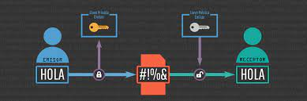

Al hablar de este área se debería hablar de criptologia que a su vez engloba:

- Las técnicas de cifrado (**criptografía**)
- Sus técnicas complementarias donde se incluye el **criptoanalisis** (técnica que estudia los métodos para romper textos cifrados con objeto de recuperar la información original en ausencia de claves).

- [Práctica tipos de cifrado](https://cryptii.com/pipes/caesar-cipher)

**Terminologia**

- El mensaje original recibe el nombre de texto claro.
- El mensaje codificado se denomina texto cifrado.
- El proceso de convertir el texto claro en texto cifrado se denomina cifrado.
- El proceso de recuperar el texto claro a partir del texto cifrado se denomina descifrado.


## MÁQUINAS DE CIFRADO. ENIGMA

Es en la Segunda Guerra Mundial cuando se hace imprescindible el uso de máquinas que cifren los mensajes para así evitar que el enemigo interceptase información sensible para el desarrollo de las operaciones.

La Máquina Enigma era un dispositivo electromecánico usado para cifrar y descifrar mensajes. Estaba compuesta por un teclado, un panel de lámparas, una unidad reflectora, una unidad de rotores y una unidad de conexión.


**Sistema de engranajes**

El proceso de codificación comenzaba cuando el usuario tecleaba un mensaje en el teclado. Esto producía una serie de pulsos eléctricos que viajaban a través de los cables conectados al panel de lámparas. Estas luces correspondían a las letras del mensaje en clave.

Los pulsos eléctricos también viajaban a la unidad reflectora, que los desviaba y los enviaba a la unidad de rotores. Esta unidad contenía una serie de ruedas de conexión codificadas con diferentes letras. Estas ruedas se giraban automáticamente a medida que los pulsos eléctricos pasaban a través de ellas, produciendo una nueva secuencia de letras codificadas que se enviaba de vuelta al panel de lámparas.

Finalmente, los pulsos eléctricos viajaban a la unidad de conexión, que los convertía en una secuencia de letras clave que el usuario podía leer. Esta era la forma en que la Máquina Enigma funcionaba para codificar un mensaje.


**Compartición de claves**


**Simulador**

https://www.101computing.net/enigma-machine-emulator/

## 6.3. Criptografía simétrica

La criptografía simétrica, también conocida como criptografía de clave privada, se utiliza la misma clave para cifrar y descifrar un mensaje.

Esto significa que el remitente y el receptor de un mensaje deben **compartir** la misma **clave** de antemano.

**Usos**

La criptografía simétrica suele utilizarse para proteger las comunicaciones entre dos partes. También se puede usar para almacenar datos, como contraseñas, de forma que solo sea accesible para aquellos con la clave.

**Inconvenientes**

Un inconveniente de la criptografía simétrica es que, si se pierde o se roba la clave, los datos que protegía también pueden hacerlo. Otra es que puede ser difícil administrar la distribución de claves a varias partes.


**AES**

AES es un tipo de cifrado que se usa para proteger información. El cifrado AES usa una clave que tiene 16, 24 o 32 bytes de largo. La clave se usa para cifrar y descifrar datos.

El cifrado AES es un proceso de dos pasos. En primer lugar, se cifran los datos usando una clave. Luego, los datos se descifran usando la misma clave.

Ejercicio: [encriptacion AES](https://aesencryption.net/)

## 6.4. Criptografía asimétrica o de clave pública

En la criptografía asimétrica tenemos, en lugar de única clave compartida por el emisor y el receptor, 2 claves por cada persona.


**¿Qué claves se necesitan?**

Cada usuario del sistema criptográfico ha de poseer una pareja de claves, formada por:

- Una **Clave privada**, que será custodiada por su propietario y no se dará a conocer a ningún otro.
- Una **Clave publica**, que será conocida por todos los usuarios.


**¿Qué relación tienen estas 2 claves?**

Esta pareja de claves es **complementaria**: lo que cifra una solo lo puede descifrar la otra y viceversa.

Como es lógico pensar, estas claves se generan a la vez y se encuentran relacionadas matemáticamente entre sí mediante funciones de un solo sentido.

Resulta prácticamente imposible descubrir la clave privada a partir de la pública


**Algoritmo RSA**

RSA es un algoritmo de cifrado basado en la teoría de los números primos. Se utiliza en la mayoría de los sistemas de cifrado de datos, como SSL/TLS, para proporcionar una capa de seguridad adicional.


Práctica: https://www.devglan.com/online-tools/rsa-encryption-decryption

## Generación de claves

Curiosidad: La diferencia entre la longitud de la clave pública y la privada en RSA es que **la clave pública es siempre menor que la clave privada**. Esto se debe a que la clave pública se utiliza para cifrar los mensajes, mientras que la clave privada se utiliza para descifrarlos.


## Encriptar con clave privada


## Webs para practicar

- https://cryptii.com/pipes/caesar-cipher
- https://cifraronline.com/
- https://www.devglan.com/online-tools/rsa-encryption-decryption

## 6.5. Algoritmos

**¿Qué son los algoritmos?**

Los **algoritmos** son los métodos que se utilizan para transformar el texto claro en el texto cifrado.

Vamos a analizar el cifrado por sustitución del César.

        El algoritmo consiste en:

        - Sustituir cada letra del texto sin cifrar por otra letra del mismo alfabeto que se encuentra situada en el orden del diccionario N puestos por delante.
        - N es el valor de la clave, que como podemos ver, junto con el algoritmo, determinará exactamente la letra que sustituirá a la original.

**Algoritmos actuales**

Como podemos imaginar, hoy en día se utilizan diferentes algoritmos, algunos válidos para criptografía de clave privada y otras para criptografía de clave pública.

- **Algoritmos de clave privada**: DES, 3DES, RC4, IDEA Y AES son nombres de algoritmos de clave privada.
- **Algoritmos de clave pública**: DH, EIGamal, RSA.

**El algoritmo es público**

“Suele ser un error muy frecuente pensar que los algoritmos de cifrado deben ser secretos para resultar seguros. Los algoritmos de cifrados utilizados son de dominio público y el código fuente asociado también. Sin embargo, siguen siendo seguros porque requieren que el usuario proporcione la clave secreta”

## 6.6. Curiosidades

### DNI


La letra del DNI se calcula utilizando el algoritmo de Luhn.

1. El número de DNI se divide entre 23.
2. El resto de la división se convierte en número, usando la siguiente tabla:

0=T, 1=R, 2=W, 3=A, 4=G, 5=M, 6=Y, 7=F, 8=P, 9=D, 10=X, 11=B, 12=N, 13=J, 14=Z, 15=S, 16=Q, 17=V, 18=H, 19=L, 20=C, 21=K, 22=E.

3. Si el número de DNI es 12345678 y el resto de la división es 3, la letra correspondiente es A.

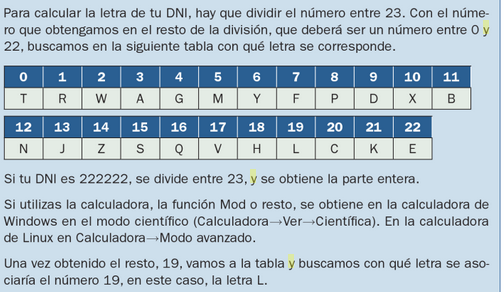

## Cuentas bancarias

- El **banco** con el código de entidad 3185 es el Banco de Crédito de España.
- La **sucursal** es la de Calle Alcalá, 9826, 28027 Madrid


## 6.7. Funciones de hash

Las funciones hash son algoritmos matemáticos que se usan para convertir datos de cualquier tamaño en una cadena de caracteres de **tamaño fijo**. Esto permite que los datos sean rápidamente comparados y verificados.


Son útiles para la criptografía, ya que permiten almacenar y transmitir datos de forma segura, ya que los datos cifrados se pueden verificar sin necesidad de descifrarlos.

## Usos más habituales

**Autenticación**

También se usan para la **autenticación** de usuarios, ya que los usuarios pueden verificar su identidad al proporcionar una contraseña cifrada que coincida con una contraseña guardada de forma segura.

**Corrupción de datos**

Además, se usan para detectar la **corrupción de datos**, ya que si los datos cambian, la función hash generará un valor diferente. Esto permite a los usuarios detectar cualquier cambio en los datos sin necesidad de verificarlos manualmente.

**Detección de archivos iguales o duplicados**

Las funciones hash también se usan para detectar la **duplicación de archivos**, ya que los archivos con contenidos idénticos generarán el mismo valor de hash.

**Ejemplo emule**

El hash en este caso se genera a partir del contenido de un archivo, en bits. Solo de esta forma podemos afirmar que dos o más archivos son exactamente idénticos, puesto que:

1. Dos archivos pueden tener el **mismo nombre** pero ser distintos
3. Dos archivos pueden tener el **mismo tamaño** pero diferente contenido

Compararlos bit a bit no tiene sentido pues es computacionalmente muy costoso. Es mucho más rápido comparar sus hashes.


**Ejemplo ``Bitcoin``**

El hash de un bloque nuevo se calcula a partir de 3 cosas:

- Un hash generado a partir de todas las transacciones que contendrá el bloque.
- El hash del bloque anterior
- Un nonce o número aleatorio


# 7. Identidad digital, certificados, firma y DNIe

## 7.1. certificado digital

Para poder realizar firma electrónica o demostrar nuestra identidad necesitamos tener un **certificado digital**. Este certificado es el que acredita nuestra identidad en Internet.

En muchas páginas web de organismos públicos podréis encontrar un acceso con certificado digital. Para poder hacerlo, necesitamos tener uno.


En otros casos, también podremos elegir entre acceso con el sistema cl@ve.


El certificado es un **documento digital** que autentica, mediante una pareja de **claves** en un fichero software o en tarjeta la identidad del firmante.

Este ejemplo muestra un certificado instalado en un ordenador:


El certificado, además de nuestra información, fecha de validez y organismo emisor, contiene dos claves de criptografía pública, asociados a la persona.


### Ejemplo de certificado electrónico

Al acceder a una página o aplicación en las que se nos solicite un certificado digital nos pedirá seleccionar cual queremos utilizar.

Para ello deberemos disponer de uno, de lo contrario nos dará un error.


### Cómo conseguir un certificado

Estos certificados se pueden conseguir de varias formas:

1. El propio **DNI** electrónico contiene un certificado digital que podemos utilizar.
2. Algunos organismos como la FNMT (Fábrica Nacional de Moneda) también nos pueden hacer un certificado digital.

 El certificado autentica, mediante una pareja de claves en un fichero software o en tarjeta la identidad del firmante.

### Autoridades de certificación

Estos certificados, son emitidos por una entidad emisora de certificados que **dan fe de que el portador del certificado es quien dice ser**.

Existen varias autoridades de certificación:

- FNMT
- Agencia de Tecnología y Certificación Electrónica de la Generalitat Valenciana
- Agència Catalana de Certificació
- Dirección General de la Policía (para el DNI), etc.

### Tipos de certificados

Las entidades certificadoras expiden distintos tipos de certificados, dependiendo de si el solicitante es:

- Un ciudadano
- Un representante de una empresa (persona jurídica, de entidad sin personalidad jurídica y, para administradores únicos y solidarios)
- Un empleado público

Si disponemos de un certificado y quieres comprobar su validez, firmar, visualizar o validar una firma puedes utilizar los servicios del portal de firma electrónica.

### ¿Cómo conseguir un certificado digital?

Paso 1\. Realizar una solicitud online\.

- Desde el **ordenador** donde queremos instalarlo\.
- Utilizando el **navegador** que queramos\.
- Al final de este proceso se obtiene un código que será necesario para poder acreditar tu identidad\.


Paso 2\. Acreditar identidad

- Presentarse en una Oficina de Registro para acreditar tu identidad\.
- sssPara el DNI tendrás que personarte en las oficinas de la D\. G\. de la Policía

_[http://mapaoficinascert\.appspot\.com/\#](http://mapaoficinascert.appspot.com/#)_

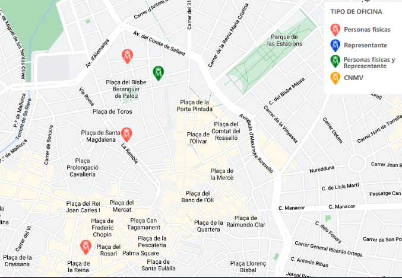

**Paso 3. Descargar certificado**

- Antes realizar el registro presencial
- Tenemos que tener del código obtenido en el primer paso
- Con esto podremos descargar el certificado vía Internet\.
- El certificado quedará instalado en ese navegador y PC utilizado


### Utilización

La mayoría de administraciones públicas tienen un portal telemático en el que realizar trámites y solicitudes, utilizando el certificado electrónico o la clave para identificarnos.


Una vez entremos, si tenemos nuestro certificado digital instalado, nos permitirá seleccionarlo (podríamos tener varios en el equipo).


## 7.2 DNI Electrónico

### Introducción y curiosidades

Hay que remontarse hasta el año 1944 -en plena época franquista y en los últimos coletazos de la Segunda Guerra Mundial- para conocer el origen de este documento.

Entró en funcionamiento un 2 de marzo: los primeros documentos de identidad no portaban fotografías y, por tanto, resultaba complejo reconocer y dar con algunas personas.

Los tres primeros números le correspondieron a Franco y su familia


Del 10 al 99, reservados para miembros de la Casa Real. Además, no existe el número 13 en los DNIs -por superstición.

### Primer DNI informatizado

El primer DNI informatizado regulado por Orden del ministerio del Interior de fecha
12 de julio de 1990.

No figura impresión dactilar y si dos líneas de caracteres OCR.


### Primer DNI electrónico

Primer DNI que incorpora CHIP, convirtiendo al Documento Nacional de Identidad en un
documento electrónico.

Se trata además de una tarjeta de policarbonato grabada con láser, con las mismas medidas que una tarjeta de crédito convencional.

Permite la conexión a servicios telemáticos, a través de un lector de tarjetas conectado al ordenador.


### Máquina para crear DNI


### DNIe


__El DNIe es el carnet de identidad de siempre\, con un chip incluido en su interior\. Este chip guarda información nuestra que nos permite utilizarlo también para autenticarnos en Internet\. __

### ¿Qué podemos hacer con el DNIe?

Este DNI aparece el 2006 y se fabrica hasta el 2015.

El DNIe me permite:

1. Acreditar electrónicamente identidad
2. Firmar digitalmente documentos electrónicos


### ¿Qué información contiene el chip?

El chip integrado contiene la siguiente información nuestra:

- Datos personales
- Fotografía
- Firma digitalizada
- Huella dactilar
- Certificados de autenticación y firma electrónica


### DNI 3.0

El DNI 3\.0\. nació en enero del 2015

Incorpora las mayores y más sofisticadas medidas de seguridad que hacen virtualmente imposible su falsificación\.

Disponer de un chip dual\-interface que permite su utilización con contacto y también modo contactless \(NFC\)

Elimina la necesidad de un lector de tarjetas o drivers\, facilitando la conexión online y la autenticación del ciudadano\.


_[https://www\.dnielectronico\.es/PDFs/Historia\_de\_los\_documentos\_de\_identidad\.pdf](https://www.dnielectronico.es/PDFs/Historia_de_los_documentos_de_identidad.pdf)_


### DNIe

Para poder utilizarlo necesitaremos un PIN que nos proporcionarán en la DGP\. Si lo olvidamos\, tendremos que ir presencialmente a conseguir otro\.

También necesitaremos:

- Lector de tarjetas
- Software de acceso a la tarjeta


### PIN

El ``PIN`` es la contraseña personal que cada DNI electrónico tiene asociado\. Se nos entrega en el momento de expedición del DNIe\, en un sobre sellado\.

No podemos cambiar el PIN por Internet\. Si que queremos es modificar nuestro PIN o incluso obtenerlo de nuevo en  __Puntos de Actualización del DNI \(PAD\)\.__  No es necesario que pidamos cita previa

Podremos hacerlo nosotros mismos a través de las máquinas que se encuentran a disposición de los ciudadanos

### ¿Qué podemos hacer?

- Consultar datos personales
- Vida laboral
- Puntos tráfico
- Empadronamiento
- Trámites
- Declaración renta
- Pago tasas
- Desempleo
- Servicios con empresas
- Banca online
- Firma de contratos


### Pagar tasas o impuestos

El DNIe o el certificado electrónico nos permiten también pagar tasas \(por ejemplo\, para que nos den un título o certificado de estudios\) o impuestos\.

En Baleares\, existe la Agencia Tributària o  __Atib__  donde podemos pagar nuestros impuestos\, tanto presencialmente en sus oficinas como online a través de su  __sede electrónica__ \.

### Lectores

__Los tipos de lectores más habituales son:__

- Lector USB conectado a un ordenador
- Teclado especial con lector integrado
- Smartphone mediante la tecnología NFC
- La necesidad de tener este hardware ha sido uno de los principales problemas a la hora de implantar el DNI electrónico


_[https://www\.youtube\.com/watch?v=kTC\-xxdTufA](https://www.youtube.com/watch?v=kTC-xxdTufA)_

### Partes DNIe


**Firma digital**

La firma digital viene a sustituir a la manuscrita en el mundo de la informática. Es decir, si firmamos de forma digital un documenta, le estaremos dando veracidad y como sucede con la firma manuscrita, no podremos decir que no lo hemos firmado nosotras; por lo tanto, seremos responsables de lo que en él se diga.

**¿Para qué sirve la firma electrónica?**

La firma digital viene a sustituir a la manuscrita en el mundo de la informática\.

- Si firmamos de forma digital un documento\, le estaremos dando  __veracidad__
- No podremos decir que no lo hemos firmado nosotros
- Seremos responsables de lo que en él se diga\.

Una firma electrónica es un conjunto de datos electrónicos que:

- Se adjuntan a un documento electrónico determinado
- Identifican al firmante de manera inequívoca
- Certifican la integridad del documento
- Aseguran que el firmante no puede repudiar lo firmado\.

### Mecanismo

La descripción del mecanismo de firma electrónica es el siguiente texto:

**Paso 1. Creamos el documento**

```
La firma electrónica es un concepto jurídico, equivalente electrónico al de la firma manuscrita, donde una persona acepta el contenido de un mensaje electrónico a través de cualquier medio electrónico válido. Ejemplos:

La firma electrónica a su vez puede tener diferentes técnicas para firmar un documento, así tenemos las siguientes: Código secreto o de ingreso: es la necesidad de una combinación determinada de números o letras, que son sólo conocidas por el dueño del documento, o lo que todos usamos, por ejemplo, en los cajeros automáticos, es el famoso PIN (Personal Identification Number).

Métodos basados en la Biometría: se realiza el acceso al documento mediante mecanismos de identificación física o biológica del usuario o dueño del documento. La forma de identificación consiste en la comparación de características físicas de cada persona con un patrón conocido y almacenado en una base de datos. Los lectores biométricos identifican a la persona por lo que es (manos, ojos, huellas digitales y voz). En el perfeccionamiento del cifrado de mensajes, llegamos a lo que se conoce como criptografía.
```

**Paso 2. Calculamos el hash**

Se calcula un valor resumen del documento\, conocido como **hash**, utilizando algún algoritmo como el  **SHA 256**.

```
8D1DA152769DA821009BBB2D6DD856DE
```

!!! note

    Al estar calculado con SHA256, el hash tiene 256 bits (0s y 1s), que se pueden representar con 64 dígitos hexadecimales.

**Paso 3. Firmamos el hash con nuestra clave privada**

Este valor resumen se cifra utilizando nuestra **clave privada**.

Nota: Recordemos que nuestra clave privada nunca sale de nuestro dispositivo, únicamente la pública.

```
MIIBVQIBADANBgkqhkiG9w0BAQEFAASCAT8wggE7AgEAAkEA0CUu5s7oUYtm1k/XLYOtPU0QaBAirTQ8RcT/Mn/JQCmyoQh8nrhb3IB93WRR5+mmzaa6WFU7TJyM7J0+VWTm0QIDAQABAkAwMuwRdohFmcpOhl6Fo6BSOa466sGc6iOq5FtUDlNED/iu8urdmKi24r+8mnykcGadZIXcnH+ti3GOfdW/dTIhAiEA9uZW7uD1eaVzyHeLDyswOV1j8bCCSLUQbpWxXp6E488CIQDX0StiAkGhT9Ju9wRsdHDoakUoc2xywoswY+MH1xQTXwIhAMnZmJrlCWsxS85JhUOacGuFoW73ehwNA2kVMpQDjutbAiA4/+CiYRAuZ6OfdRQxBMvxRmf/mASThrg2Tpterbp6pwIhAJMFoBU4zGYBm3UQOjZkRXNtxKZsJODtmNgZWYvdJZkD
```

El resultado de este valor es lo que se conoce como firma digital del documento\.

```
sfsvMBz4RdrOOCe1naThF0ZkESDW0fjIpXf3GQchsDpkvc7oI5IowPu6Yefqr3O5LTu5pc0RoHoaJzMN5EMaHA==
```

Esto permite asegurar que la única persona que ha podido firmar el documento soy yo\, el único que conoce la clave privada.

## Envío

El documento firmado contendrá:

1. El contenido del texto original
2. La clave pública de la persona que ha firmado
3. La firma digital

Con estos 3 elementos, en cualquier momento podemos comprobar que la firma es auténtica.

##### Firma de documentos electrónicos

Si contamos con un **certificado digital**, podemos comenzar a firmar documentos. La firma electrónica en documentos se puede realizar de dos formas:

- Online, a través de un servicio de verificación y generación de firmas electrónicas como es VALIDe
- A través de aplicaciones de firma electrónica o de ofimática que, tras ser descargadas y ejecutadas en un ordenador, permitirán realizar firmas de documentación sin la necesidad de estar conectado a Internet.


### Sellado en el tiempo

Una de las características más útiles que puede ir asociada a la firma electrónica es lo que se conoce como "sellado en el tiempo"\. Se trata de un método para probar que un conjunto de datos \(en este caso\, la firma que se ha realizado\) existió en un momento determinado \(fecha y hora\)\.


### Identidad digital

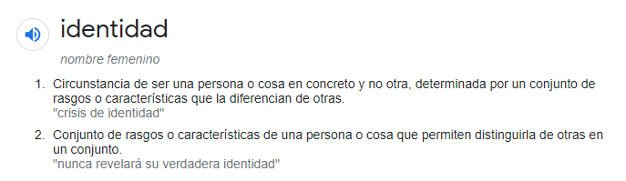

### Identificación

En nuestro día a día\, necesitamos identificarnos para acceder a servicios. Es decir\, demostrar que somos nosotros realmente.

Las formas de identificación más comunes son el DNI\, el pasaporte\, la tarjeta de crédito o el carnet de conducir. Todas estas formas sirven para poder acceder a servicios bancarios\, alojamientos\, transporte\, compras en línea\, entre otros. Además\, muchos lugares también requieren la presentación de un documento de identificación para poder acceder a ellos.

En el mundo real la verificación relacionada con

- Rasgos (aspecto físico)
- Datos (huella dactilar)
- Firmas (firma en documentos)

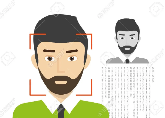

Pero en el mundo digital\, la autenticación se basa en otros métodos como:

- Contraseñas
- Códigos de seguridad
- Token de autenticación
- Biometría
- La autenticación de dos factores (2FA)


### HUELLA DACTILAR


Las huellas digitales son únicas, incluso para estos hermanos idénticos. Esto se debe a que las huellas dactilares no responden a la genética sino que, al formarse al tercer mes de embarazo, van variando cuando los dedos rozan con el cordón umbilical o este crece permitiendo más movimientos intrauterinos


### Firma

La firma de una persona es una forma de identificación. No es una forma válida de autenticación en sí misma, ya que no es una prueba de quién es la persona. Para ser válida, la firma debe ser autenticada por un tercero, como un notario público, y debe estar asociada con un documento legalmente vinculante.


### DNI


### Documento nacional de identidad

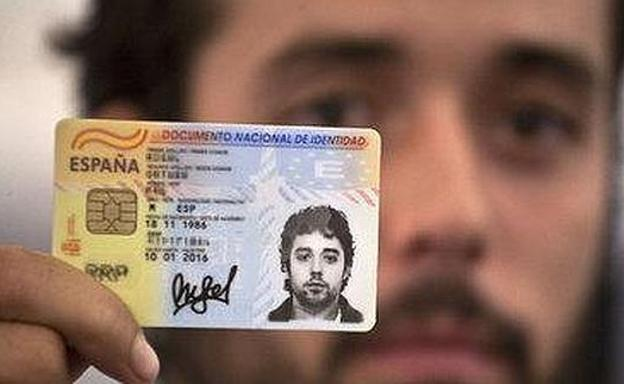

La forma más habitual de demostrar nuestra identidad es presentar nuestro DNI o firmar\.

La policía nos da un DNI solo a nosotros\, con nuestra huella\, foto y firma\.

Presentando este documento con nuestra foto\, demostramos que nuestros  __datos __ son los que allí figuran\.


### ¿Cómo nos identificamos en Internet?

En la actualidad, muchas de las tareas que antes se realizaban de forma presencial ahora se han trasladado al ámbito **digital**, ya sea por comodidad o por imposición legal. Esto conlleva una necesidad de encontrar una forma de acreditar de manera segura nuestra identidad, ya que no podemos mostrar físicamente un documento de identidad como el DNI.

### Contraseñas

La contraseña es el método más ampliamente extendido para proteger nuestros datos, permitiendo una identificación y acceso seguros a nuestra información. Aunque no es el método más seguro, hay algunos elementos clave que debemos tener en cuenta para mejorar su seguridad: utilizar contraseñas largas y complejas, incluir caracteres especiales, mayúsculas o minúsculas, cambiar la contraseña de forma regular y no utilizar la misma contraseña para varias páginas.

 Además, es conveniente contar con métodos de recuperación, como un número de teléfono o dirección alternativa, para poder recuperar el acceso si olvidamos la contraseña.


### Formas de demostrar nuestra identidad

Existen multitud de métodos de demostrar nuestra identidad digitalmente:

1. DNIe
2. Certificado digital
3. Contraseñas
4. Biometría

Algunas simplemente sirven para proteger algo\, y otras demuestran que somos una persona concreta\.

# 11. Seguridad en redes inalámbricas

## 11.1 Seguridad en Bluetooth

**Bluetooth** es la palabra que define un estándar global de comunicaciones inalámbricas para **redes de área persona**l y que permite la transmisión de voz y de datos entre diferentes equipos por medio de un enlace por radiofrecuencia en entornos de comunicaciones móviles.

La tecnología Bluetooth tiene un alcance de unos **diez metros**, por lo que se ha integrado en dispositivos de la vida cotidiana que forman parte de las redes personales (PAN) como teléfonos y relojes inteligentes.

Los ciberatacantes que emplean estas comunicaciones suelen utilizar antes que amplían el campo de acción de la señal.  Algunos de los ataques son los siguientes:

- **Bluejacking**. Consiste en el envío de spam al usuario por medio del intercambio con este de una vCard, de una nota o de un contacto.
- **Bluesnarfing**. Aprovecha las vulnerabilidades del protocolo para sustraer información del dispositivo atacado.
- **Bluebugging**. Utiliza técnicas de ingeniería social  para que la victima acepte una conexión inicial para infectar el dispositivo con malware de control remoto.

A partir de ahí el usuario dispondrá de acceso remoto al teléfono del usuario y podrá utilizar sus funciones.

La adopción de algunas medidas de seguridad sencillas puede evitar los ataques. Por esta razón, deberían de formar parte de la conducta habitual de un usuario de dispositivos Bluetooh.

Algunas de ellas son:

- Activar bluetooh cuando sea necesario realizar algún tipo de comunicación a través de este medio y desactivarlo cuando se deje de utilizar.
- Cambiar el **nombre del dispositivo** para que no desvele datos personales y configurarlo para que permanezca oculto.
- No emparejar ni aceptar conexiones entrantes de **dispositivos desconocidos**, ya que la información podría estar infectada de software malicioso.
- Verificar periódicamente la lista de **dispositivos de confianza** para eliminar los que no se utilizan habitualmente.

## 11.2 Wifi

Las redes wifi utilizan una tecnología  inalámbrica  que realiza la conexión entre dispositivos situados en un área relativamente pequeña, como una habitación, una oficina, una casa o un edificio, a través de ondas electromagnéticas.

Algunas de las medidas de seguridad basicas que se pueden configurar en el router para mantener una red wifi segura son las siguientes:

- **Personalizar la contraseña de acceso:** las contraseñas por defecto de algunos routers suelen ser muy vulnerables o se pueden averiguar rápidamente en Internet.
- **Cambiar el SSID:** el nombre de la red es el identificador con el que se etiqueta la red inalámbrica para que cada usuario pueda localizarla.
- **Revisar el cifrado:** la señal inalámbrica puede ser interceptada más fácilmente por una red cableada, por lo que es necesario utilizar estándares de cifrado como WPA2.
- **Desactivar el acceso por WPS:** el estándar WPS facilita la configuración de una red segura con WPA2 a sus usuarios.
- **Filtrar las MAC:** las direcciones MAC son establecidas por el fabricante y únicas para cada dispositivo de la red.
- **Actualizar el firmware:** el fimware es el software que controla los circuitos de los dispositivos electrónicos.
- **Comprobar el historial de actividad:** la actividad del router puede desvelar información sobre posibles intrusiones, ya que muestra los datos de los equipos conectados, los horarios, la duración de la sesión, etc...
- **Utilizar software de auditoría:** en el mercado existen herramientas diseñadas para evaluar la seguridad de una red y detectar sus posibles vulnerabilidades. Una de las mas populares es Nmap.
# Antivirus

Son programas diseñados para detectar, bloquear y/o eliminar el software dañino.

Tienen 2 mecanismos básicos de detección de amenazas:

**Comparación**

Buscando entre los programas el patrón de código que coincida con los almacenados en una biblioteca de patrones de virus conocidos.

**Detección de programas basados en su comportamiento**

Conoce una serie de comportamientos sospechosos
Estudia a los programas que, por su código, estén preparados para llevarlos a cabo.

## ¿Es importante tener instalado un antivirus?

Es importantísimo!
Son algo parecido a nuestros guardaespaldas
Se mantienen siempre alerta de posibles programas dañinos que puedan colarse en tu ordenador y hacer uso de los datos y archivos que tienes guardados.
Es básico tener instalado un antivirus.

## Actualización

Los antivirus se encuentran en constante **actualización**, debido a la aparición de nuevos virus. Los antivirus, además, suelen incorporar otras funciones como:

- Antispam
- Cortafuegos
- Cifrado de datos
- Monitor de red

## Ejemplos

Existe una gran variedad de antivirus, entre los más destacados están:

- Avast
- Avira
- Gdata
- KAspersky,etc.

# 12.1. Introducción

- Ya hemos visto en clase que
 - Hay amenazas para nuestro ordenador (personas,accidentes,averías,etc)
Existen programas,correos o webs que suponen una amenaza (virus, troyanos, phishing...)
- Hoy veremos que herramientas podemos utilizar para detectar o evitar estas amenazas

Tipos de herramientas que veremos:

- Antivirus
- Antiespía
- Firewall

 12.3. Antispyware (antiespías)
Programas
Se encargan de que en tu ordenador no haya programas que roben tus datos.

Hoy en día los antivirus tratan de ampliar su protección hacia cualquier ipo de malware y suelen incluir esta función.

En ocasiones es necesario utilizar programas especiales específicos para detectar el spyware y que complementan la actividad del antivirus.

**¿cual es la mejor manera de protegerse de estos programas malignos?**

- Ser consciente de su existencia
- Hacer un uso de la red y del software que minimice el riesgo de que puedan entrar en el sistema.
- La prudencia es la principal herramienta
- Extremar la cautela a la hora de enfrentarse a un programa desconocido.
- No todos los programas que se reciben por correo o se descargan gratuitos de la red están limpios de amenazas.
- Es importante comprobar y pensar antes de ejecutar.

# 12.4. Software antispam

El spam o correo basura es correo electrónico que se envía masiva e indiscriminadamente por empresas de publicidad.

## Filtros

El software antispam son programas basados en **filtros** capaces de detectar el correo basura, tanto desde el punto cliente( nuestro ordenador) como desde el punto servidor(nuestro proveedor de correo).

Estos filtros analizan los correos electronicos antes de ser descargados por el cliente.La forma de detección esta basada en lsitas o bases de datos de correos spam , en el analisis de la existencia del remitente, etc.

Actualmente la mayoria de los antivirus tienen integrado un filtro antispam.

# 12.5. Firewall (cortafuegos)

Un firewall es un programa informático encargado de controlar y filtrar las conexiones de entrada y salida a la red de una máquina, así como el tráfico de datos entrante y saliente.


Es un mecanismo básico de prevención contra amenazas de intrusión externa, ya que supone una barrera de protección entre un equipo o red privada y el mundo exterior. Además de controlar el acceso al exterior, un firewall también filtra las comunicaciones, registra los eventos, genera alarmas y permite la configuración de políticas de seguridad.

# Funcionamiento

- Como un portero
- Nadie pasará sin que él les dé permiso para hacerlo.
- Te avisa de posibles programas que quieren hacer algo malo en tu ordenador
- Te hacen invisible ante los posibles ladrones en busca de víctimas.
- En la web
- Descargas gratuitas de cortafuegos
- Es recomendable hacerse con uno

# 12.6 Redes privadas virtuales

Consiste en conectarse a Internet a través de una red privada, estableciendo una conexión cifrada y así evita que el buscador guarde tus datos.

- **VPN de acceso remoto:** acceso a una red privada con una red pública. Ejemplos son conexiones desde lugares públicos como hoteles o cafeterías.
- **VPN de sitio a sitio:** conectar redes a través de internet, pudiendo comunicarse entre ellas.

# Biometría

# Face ID

Se trata de otro sistema, esta vez de desbloqueo por reconocimiento facial.

Un sensor proyecta puntos infrarrojos sobre el rostro para obtener imagen 3D.


Esta imagen se guarda en nuestro dispositivo, y se contrasta con nuestra cara cuando queremos desbloquear el dispositivo.

# Touch ID

Se trata de un sistema de reconocimiento de huella dactilar.

Permite el desbloqueo de dispositivos mediante escaneo y reconocimiento biométrico.

Es un método seguro de autenticación en diversos servicios que fue introducido por primera vez en iPhone 5S (2013).


# Biometría

La biometría ha cambiado la forma en que la seguridad es entendida y administrada. La biometría es una herramienta de seguridad que hace uso de características físicas o comportamientos únicos para identificar o autenticar a un usuario.

## Cómo la podemos aprovechar

Esta tecnología se utiliza para **identificar** rápidamente a un individuo, para validar su identidad y, en algunos casos, para proporcionar **acceso** a recursos específicos. Esto se logra mediante el uso de técnicas de biometría como la huella dactilar, la verificación de la voz, el reconocimiento facial, el reconocimiento iris, el reconocimiento de la firma y el reconocimiento de la palma.

## Huella dactilar

La huella dactilar es una de las técnicas de biometría más antiguas y ampliamente usadas. Esta técnica se basa en el uso de un dispositivo que escanea la huella dactilar del usuario y la compara con una base de datos para verificar la identidad del usuario.


Se considera una de las técnicas más confiables de biometría debido a que la huella dactilar de una persona nunca cambia y es única para cada persona.

## Reconocimiento facial

Otra técnica de biometría popular es el **reconocimiento facial**, que se basa en el uso de una cámara para capturar una imagen facial del usuario.

Esta técnica compara la imagen capturada con una base de datos para verificar la identidad del usuario. Esta técnica es muy eficaz, ya que el rostro de una persona es único para cada individuo.

## Reconocimiento de iris

El reconocimiento iris es otra técnica de biometría popular. Esta técnica se basa en el uso de un dispositivo para escanear el iris del usuario y compararlo con una base de datos para verificar la identidad del usuario. Esta técnica es muy precisa, ya que el iris de una persona es único para cada individuo y es muy difícil de falsificar.

## Reconocimiento de firma

Otra técnica de biometría es el reconocimiento de la firma. Esta técnica se basa en el uso de un dispositivo para escanear la firma del usuario y luego compararla con una base de datos para verificar la identidad del usuario. Esta técnica es muy útil para verificar la identidad de un usuario, ya que la firma de una persona es única para cada individuo.

## Reconocimiento de la palma

Por último, la técnica de biometría de reconocimiento de la palma es una técnica de identificación que se basa en el uso de un dispositivo para escanear la palma del usuario y luego compararla con una base de datos para verificar la identidad del usuario. Esta técnica es muy precisa, ya que el patrón de la palma de una persona es único para cada individuo.

# Privacidad y anonimato

# Las capas de la web. Clearnet, deep web y dark web

## ¿Qué es la web?

- Internet tiene varias capas
- Nosotros navegamos una capa que nos permite ver internet  como algo interactivo y entender el lenguaje que hablan las máquinas, que son las páginas web o los servicios que vemos nosotros a través de internet
- Navegadores nos lo ponen todo muy bonito para que veamos las páginas web, para que veamos los servicios como los vemos

## Las 3 capas de la web


- WEB SUPERFICIAL
- DEEP WEB
- DARK WEB

# Clearnet o web superficial

Cuando navegamos habitualmente en internet a través de un navegador como Chrome, Internet Explorer, Firefox, etc., estamos viendo lo que se conoce como "web superficial".


Esta web superficial incluye servicios, contenido y aplicaciones de todo tipo, desde redes sociales hasta medios de comunicación, que son indexados por Google y accesibles a través de los navegadores.


# 2. Deep web

La Web Profunda o Web Invisible es el contenido de Internet que no se encuentra **indexado** en los motores de **búsqueda** tradicionales como Google, Yahoo o Bing, como por ejemplo:

- Los contenidos de tu Google Drive
- Las intranets empresariales y académicas
- Registros de casos judiciales
- Contenido privado de redes sociales
- Páginas de gobierno.


# 3. Dark web

La Dark Web no es accesible desde un navegador tradicional, o al menos no sin una configuración especial.
No pondrás un enlace en la barra de direcciones y accederás al Dark Web así sin más.


## ¿Cómo surge la dark web?

- proyecto militar que se utilizaba para compartir archivos  e información
- Funcionaba en otra capa, no en la capa que nosotros vemos, con otro navegador diferente
- Lo diseñaron así para que fuera anónimo y para que pudieran, al tener unos fines militares de tal modo que esta información pudiera viajar de forma más segura.


## ¿Cómo funciona?

- La darknet funciona  en otra capa distinta
- Necesita un navegador diferente  (Tor)
- Logotipo de una cebolla
- Páginas terminan en .onion
- Tor traduce y lo que permite indexar y ver estas páginas que están en esta red
- Esto tenía unos fines militares hace muchos años.

## ¿Por qué es más segura?

- Cuando consultamos nuestras páginas web, vamos dejando un rastro técnico.
- La dirección IP se puede rastrear
- En TOR, esta IP se oculta
- Comunicación pasa por varios nodos
- Navegación aparentemente anónima

# 4. TOR

## ¿Qué es TOR?


**Tor** es un software de código abierto y una red anónima que permite a los usuarios navegar por la web de forma privada y segura. Funciona encriptando datos y enrutando el tráfico a través de múltiples nodos o "saltos" para ocultar la ubicación original del usuario.


Además, se puede usar para acceder a "sitios de cebolla" o "servicios ocultos", que son sitios web alojados en la red Tor y solo se puede acceder a ellos a través de Tor. En este tutorial, explicaremos cómo usar Tor y acceder a los sitios de cebolla.

## ¿Qué te puede ocurrir?

Algunas personas utilizan estas páginas web  y esta capa diferente para publicar o vender todo tipo de cosas ilícitas. Si tú navegas por internet no pasa nada, puedes ver lo que hay y comprobarlo.

El problema es comprar, vender o prestarse a mercadear con este tipo de servicios. En general, hay muchos estafadores (la mayoría).

## Aspectos positivos

- Es positiva porque te permite navegar de forma anónima. Debido a que no pueden rastrear la IP.
- También es un navegador que te permite también acceder a la web superficial, pero escondiendo tu dirección IP.
- La navegación es lenta, a menos que lo necesite para navegar de forma anónima,  que puede utilizar otro tipos de sistemas de navegación.

## ¿Quién usa TOR?

- El principal objetivo de Tor es proteger la privacidad de sus usuarios, es por esto que lo usan los que les preocupa proteger la privacidad.
- La gente normal usa Tor para navegar sin dejar rastros de navegación.

## ¿Quién usa TOR?

- Usuarios que viven en países que censuran contenido usan Tor para navegar sin restricciones.
- Los periodistas usan Tor para compartir información y proteger la confidencialidad de la navegación por Internet.
- Los agentes del orden usan Tor para llevar a cabo investigaciones enmascarando su rastro
- Los activistas y denunciantes utilizan Tor para proteger su identidad de los que censuran la libertad.
- Muchas personas más usan Tor de manera cotidiana para sus actividades en línea

# 5. Ejecutar TOR

## Configuración

El primer paso es descargar e instalar el Navegador Tor. Esta es una versión especial del navegador Firefox diseñada específicamente para usar Tor. Se puede descargar desde el sitio web del Proyecto Tor.

[ Web del proyecto TOR](https://www.torproject.org/es/download/)


Una vez que se complete la descarga, haga doble clic en el archivo ejecutable para comenzar el proceso de instalación. Cuando se le solicite, elija una ubicación de instalación y haga clic en "Instalar".


Una vez que se complete la instalación, inicie el navegador Tor. Se le pedirá que haga clic en "Conectar" para conectarse a la red Tor.


Cuando se establezca la conexión, se le presentará una ventana que muestra su dirección IP actual. Esta es la dirección IP que será visible para los sitios web que visites mientras usas el Navegador Tor.


## Acceso a sitios

Principalmente la Dark Web suele formarse por páginas que con unos **enlaces** muy particulares a través de dominios propios como las **.onion** de TOR o las **.i2p** de los eepsites de I2P, pero a las que no puedes acceder a no ser que tengas el software necesario para navegar por las Darknets en las que se alojan.

Algunos sitios son accesibles desde la Clearnet, como Onion City, capaces de indexar miles de páginas .onion. También existen otros buscadores dentro de las propias Darknets como not Evil, Torch o una versión de DuckDuckGo también hacen lo mismo.

Además, otras herramientas como **Onion.to** permiten acceder a las Dark Webs de TOR con sólo añadir la terminación .to, al dominio **.onion**, de manera que la web luzca como tupagina.onion.to.

Ahora que el navegador Tor está instalado y conectado a la red Tor, puede comenzar a acceder a los sitios de cebolla. Los sitios Onion se pueden encontrar buscando en la web o a través de directorios como:

-  The Hidden Wiki
-  OnionDir

Una vez que haya localizado un sitio que le gustaría visitar, copie la URL y péguela en la barra de direcciones del navegador Tor.


Cuando visite un sitio de cebolla, se le presentará una página de advertencia. Esta página tiene como objetivo alertarlo sobre el hecho de que está accediendo a un sitio en la red Tor y que su actividad de navegación puede ser monitoreada. Haga clic en "Aceptar" para acceder al sitio web.

## Conclusión

El uso de Tor y los sitios de cebolla es una excelente manera de navegar por la web **de forma anónima y segura**. Con el Navegador Tor instalado y conectado a la red Tor, puede acceder a los sitios de cebolla rápida y fácilmente. Solo recuerde estar siempre al tanto de los riesgos asociados con la navegación web en la red Tor y tenga cuidado al visitar los sitios.

# Silk road

Silk Road era una plataforma en línea que operaba en la parte oscura de la web conocida como la dark web. La dark web es una parte de la web que no es indexada por los motores de búsqueda tradicionales y que se accede a través de navegadores especiales como Tor.


Silk Road se lanzó en 2011 y se convirtió rápidamente en uno de los principales mercados en línea para la compra y venta de drogas ilegales, así como de otras mercancías ilegales y contrabando. La plataforma utilizaba ``Bitcoin`` como moneda de pago y se promocionaba como un lugar seguro y anónimo para realizar transacciones ilegales.

Sin embargo, en 2013 la plataforma fue cerrada por el FBI y su fundador, **Ross Ulbricht**, fue detenido y acusado de varios cargos relacionados con el tráfico de drogas y la conspiración para cometer fraude electrónico. Ulbricht fue condenado a cadena perpetua sin libertad condicional en 2015.


Silk Road es un ejemplo de cómo la dark web puede utilizarse para actividades ilegales y peligrosas. Es importante tener en cuenta que la dark web no es un lugar seguro y puede ser peligroso navegar por ella. Es mejor evitar la dark web y no participar en actividades ilegales en línea.

# ¿Qué es el doxxeo?


## Introducción


## Qué es el doxxeo

- Doxing es el acto de encontrar y compartir la información personal y confidencialde alguien sin su permiso.
- Tipo de ciberataque y ciberacoso en Internet
- Doxing puede ser usado para amenazar o atacar a la persona, o para chantajearla.
- Sus víctimas son mayoritariamente mujeres

# ¿Por qué lo hacen?

- Venganza
- Justicia extrajudicial


- Dañar a persona con notoriedad


- Dañar a personas con opiniones o puntos de vista opuestos


# ¿Cuales son sus propósitos?

- Intimidar a la víctima invadiendo y eliminando su privacidad
- Perpetuar el acoso distribuyendo la información para futuros acosadores

# ¿Cómo se lleva a cabo?

FASE 1

- Recopilan toda la información que puedan encontrar
- Redes sociales, páginas webs, bases de datos
- Buscan teléfonos y direcciones, pirateo de bases de datos, ataques de ingeniería social.
Objetivo: reunir toda la información posible sobre la víctima, su entorno y su vida.

FASE 2

- Difusión de información recopilada
- Todos los medios y plataformas disponibles en la Red.
- Objetivo: llegar al mayor número de personas y estas sigan difundiéndola.
- Incitación al acoso y amenazas

# ¿Cómo conseguir información?

Hay una variedad de estrategias de doxing que se pueden usar para recopilar información sobre un individuo.

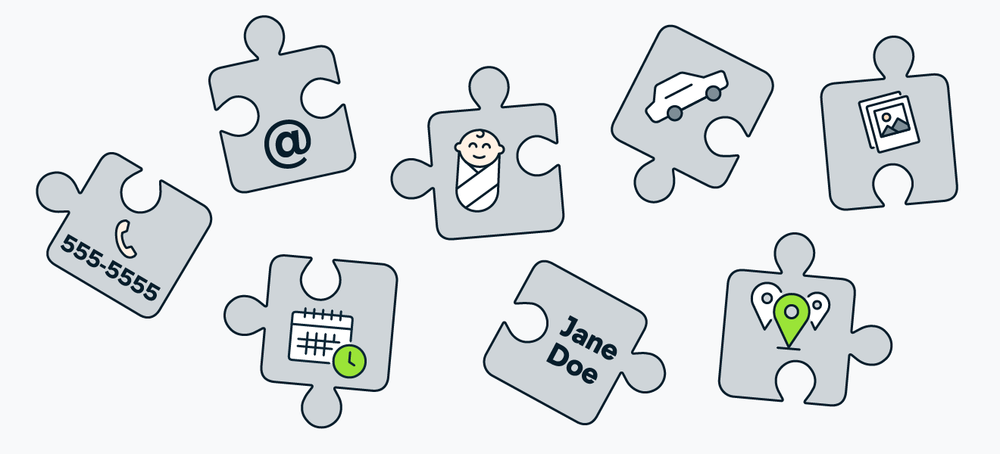

Algunas estrategias comunes de doxing incluyen:

1. Búsqueda de plataformas de **redes sociales**: esto se puede hacer buscando el nombre de la persona en plataformas de redes sociales como Facebook, Twitter e Instagram. Esto a menudo puede generar información valiosa, como la información de contacto de la persona, la fecha de nacimiento y el historial laboral.

2. Realización de una **búsqueda inversa de imágenes**: esto se puede hacer cargando una imagen de la persona en un motor de búsqueda como Google Images. Esto a menudo puede ayudar a encontrar otras instancias de la imagen en línea, que pueden proporcionar información adicional sobre el individuo.

3. Búsqueda de **registros públicos**: esto se puede hacer buscando el nombre de la persona en las bases de datos de registros públicos, como las que mantiene el gobierno de los EE. UU. Esto puede proporcionar información como los antecedentes penales, los antecedentes financieros y los registros de propiedad de la persona.

4. Uso de **motores de búsqueda web**: esto se puede hacer buscando el nombre de la persona en motores de búsqueda web populares como Google y Bing. A menudo, esto puede proporcionar información como el sitio web, el blog y los perfiles de redes sociales de la persona.

5. Ponerse en contacto con la persona directamente: esto se puede hacer enviándole a la persona un correo electrónico, un mensaje instantáneo o un mensaje en las redes sociales. Esta puede ser una estrategia arriesgada, ya que la persona puede darse cuenta de que está siendo investigada.

6. Contratación de un **investigador privado:** Esto se puede hacer mediante la contratación de un investigador profesional para realizar una investigación más exhaustiva. Esta suele ser una opción más costosa, pero puede brindar más información que otras estrategias de doxing.

7. Doxing en represalia: esto implica divulgar información personal sobre alguien en represalia por haber divulgado información personal sobre usted. Esta puede ser una estrategia peligrosa, ya que puede escalar la situación y conducir a más ciberacoso.

# Peligros
Facilita identificación en mundo real / familiares
Dirección, trabajo, teléfono


# Posibles resultados

- Terminar suscrito a algún servicio o recibir pedidos no deseados
- Recibir amenazas o acosos
- Suplantación de identidad
- Swatting (denuncias falsas)

Consecuencias:

- Puede llevar al acoso y hasta las amenazas de violencia.
- Puede dañar la reputación de una persona.
- Pérdida de trabajo o expulsión de la escuela.
- Puede hacer que una persona tenga dificultades para encontrar un hogar o conseguir un préstamo.
- Puede hacer que una persona sea excluida de redes sociales y otras plataformas en línea.
- Hacer que una persona tenga dificultades para conseguir un trabajo o ingresar a la universidad.
- Pérdida de anonimato en Internet
- Información queda expuesta en la red
- Obligar a la persona a abandonar presencia en redes
- Cambiar de vivienda o trabajo

# ¿Cómo protegerse

- La mejor forma de protegerse del doxxeo es ser cuidadoso con la información que se comparte en línea.
- No publicar información personal en sitios web públicos o en redes sociales
- Tener cuidado de no revelar demasiada información en conversaciones en línea.
- No abrir enlaces sospechosos o adjuntos de correo electrónico, ya que esto podría permitir que un atacante ingrese a su sistema.
- Googlearnos.
- justdelete.me
- No reutilizar contraseñas
- Habilitar autenticación de doble factor

## Ejemplos

1. Empezamos casi por el principio de esta práctica. En 1997, activistas antiaborto de EE. UU. se hicieron con información personal de las clínicas y profesionales que llevaban a cabo esta práctica en el país, publicándola en una lista negra que estuvo colgada en Internet hasta 2002. En ella no solo se identificaba a estas personas, también si incitaba a hacerles daño.

2. Seguimos en EE. UU., pero en el año 2013; tras el atentado de la Maratón de Boston, miles de usuarios en Reddit decidieron jugar a ser policías y tratar de identificar a los responsables. Al final, lo que consiguieron fue identificar erróneamente a varios sospechosos, a los que sometieron a ataques de doxing. Ninguna de estas personas era responsable del atentado. Lo peor, es que a causa del acoso recibido, una de ellas acabó suicidándose.

3. Y para terminar, un caso más cercano y más conocido. Hablamos de la persona que difundió la imagen y los datos personales de la víctima de ‘la Manada’. Dicha difusión la llevó a cabo en redes sociales, foros y medios digitales.

# OSINT

Las técnicas **OSINT** (Inteligencia de Fuentes Abiertas) se refieren a la recopilación y análisis de la información disponible de forma pública. Estas técnicas se utilizan para recopilar información sobre un objetivo específico, como una persona, una empresa o una organización.

Se basan en fuentes de información **abiertas y públicas**, como redes sociales, foros, sitios web, medios de comunicación, bases de datos y más.

Estas técnicas se han convertido en una parte integral de la **seguridad de la información** y el análisis de datos, y se utilizan para detectar amenazas, rastrear actividades maliciosas y más.

# Certificados de servidor web y HTTPS

SSL es un protocolo criptográfico en el que se otorgan certificados a las páginas para garantizar la integridad y confidencialidad de las comunicaciones de esta.


Cuando va a un sitio que utiliza **HTTPS** (seguridad de conexión), el servidor del sitio web utiliza un certificado para demostrar la identidad del sitio web a los navegadores, como Chrome. Cualquiera puede crear un certificado que afirme ser el sitio web que desee.


En los navegadores aparece como un candado verde, y si además el nombre de la web está en verde es que se trata de una versión extendida de este protocolo.

# Los rastreadores o trackers

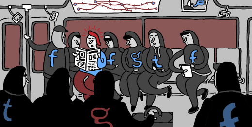

## ¿Qué son?

Estos rastreadores se usan para monitorear la actividad de los usuarios en redes sociales, foros, blogs y otros sitios web populares. Estos rastreadores también se utilizan para recopilar y analizar datos sobre el comportamiento de los usuarios en línea para fines de marketing, investigación y seguridad. Crean un **perfil** con nuestros datos.

## ¿Por qué siguen nuestra actividad?

El objetivo de gran parte de este seguimiento es dirigirnos a nosotros con publicidad. Los datos sobre nuestras actividades en línea se recopilan y agregan en perfiles. Estos perfiles les dicen a los rastreadores de terceros quiénes somos, qué nos interesa y predicen lo que haremos en el futuro.


# Bloqueo de rastreadores

Existen extensiones de navegador o navegadores propiamente dichos, que nos permiten bloquear a ciertos rastreadores, así como informarnos de cuestiones relacionadas con la privacidad.


En este caso, **classroom** tiene la comunicación encriptada, ningún tracker, pero prácticas de privacidad poco deseables.
Podemos ver información acerca de las prácticas que lleva a cabo este sitio web:

- Puede utilizar nuestros datos en otros productos de Google
- Nos sigue en otras páginas web
- Los logs se guardan siempre


# Redes privadas virtuales

Las VPN se utilizan para proporcionar una conexión segura a una red privada a través de una red pública, como Internet. Esto se logra mediante el uso de una serie de protocolos de seguridad para crear un "túnel" seguro entre dos puntos.

Esta conexión segura ayuda a proteger la privacidad y seguridad de la información transmitida entre los puntos.


- VPN de acceso remoto: acceso a una red privada con una red pública. Ejemplos son conexiones desde lugares públicos como hoteles o cafeterías.
- VPN de sitio a sitio: conectar redes a través de internet, pudiendo comunicarse entre ellas.

## Algunas ventajas de utilizar una VPN

Una de las principales razones de la popularidad de las VPN es la seguridad que proporcionan. La encriptación de los datos y los protocolos de seguridad utilizados en una VPN aseguran que la información se mantenga segura mientras viaja a través de Internet. Esto es especialmente útil para aquellos que desean acceder a redes privadas desde su hogar u oficina.

Otra ventaja de las VPN es la capacidad de evitar las restricciones geográficas. Esto significa que los usuarios pueden acceder a contenido restringido en su país sin tener que viajar físicamente. Esto también se puede utilizar para cambiar la dirección IP de un usuario para ocultar su ubicación real.

## Inconvenientes

Sin embargo, hay algunos inconvenientes que deben tenerse en cuenta al usar una VPN. Algunos servicios de VPN pueden ser costosos. Además, a veces puede haber problemas de velocidad. Esto puede ser debido a la congestión de la red o al mal funcionamiento de los servidores VPN.
