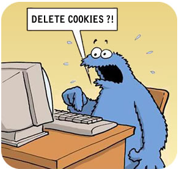

# Cookies

* _Navegar_  por la web significa realizar una serie de peticiones de páginas diferentes.
* El servidor  _olvida_  lo que ha sucedido anteriormente, no sabe lo que hemos hecho en páginas anteriores.
* No es adecuado cuando una página debe mostrar información diferente a cada usuario dependiendo de lo que han hecho anteriormente.
  * Páginas con subscripción
  * Comercio electrónico
* ¿Cómo podríamos  _rastrear_  a los usuarios?

## ¿Podríamos rastrear a los usuarios diferenciándolos por IP?

En las casas y oficinas, varios equipos comparten la misma IP pública. Estos equipos se ven desde fuera como uno solo.

Una IP identifica un ordenador, no el usuario que hay detrás. Varios usuarios pueden utilizar el mismo ordenador (misma IP)

Muchos ISP asignan IP a los clientes utilizando DHCP. La IP que tenemos en un momento dado, podría de repente ser la de tu vecino.

Cuando un cliente solicita una página web, el servidor le puede enviar  _información adicional _ en forma de cookie, además de la página.

Una cookie es una  _cadena de texto _ (máximo 4 KB) que el servidor puede asociar al navegador

Las cookies permiten que el sitio web  **recuerde**  las acciones y preferencias de un usuario

Por ejemplo se puede  **guardar**  el identificador de sesión, el idioma, el tamaño de letra, etc.

Cuando regrese al sitio o navegue por las páginas no tiene que volver a configurarlo

Antes de que el navegador envíe una petición para una página a un website, mira en la carpeta de cookies del disco.

**Comprueba si tiene cookies ** para el dominio al que va a hacer la solicitud. Si hay alguna, las incluye en el mensaje de petición.

El servidor recibe la petición junto a la cookie y las interpreta.

El navegador guarda las cookies durante un tiempo determinado en el disco duro del cliente.

Un campo  _expires_  especifica cuando  _caduca_ .

Para eliminar una cookie del disco duro del cliente, el servidor la vuelve a enviar de nuevo, con una fecha de expiración pasada.

