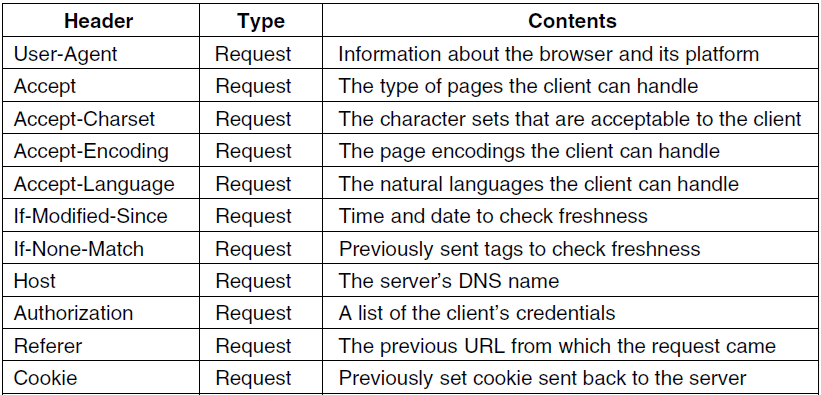

# Peticiones HTTP

Una petición HTTP (Hypertext Transfer Protocol) es un mensaje que un cliente envía a un servidor web para solicitar información o recursos.

Cuando se introduce una dirección web (URL) en un navegador web, el navegador envía una **petición HTTP** al servidor correspondiente para solicitar el **contenido** de la página web.

La petición HTTP incluye información sobre el tipo de petición que se está realizando, la versión del protocolo HTTP que se está utilizando, la dirección del servidor y la ruta del recurso solicitado.

La petición HTTP también puede incluir otros encabezados que proporcionan información adicional al servidor.

**Ejemplo de sesión**

* El mensaje de  _solicitud_  del cliente tiene la siguiente estructura:
  * Línea de petición (request line)
  * Cabeceras de petición (request headers)
  * Una línea en blanco separa las cabeceras del cuerpo del mensaje
  * Un cuerpo de mensaje, si fuese necesario especificar algo más.


## Formato de la petición

La línea de petición es la primera línea de una petición HTTP y tiene la siguiente estructura:

```
Método URI Versión_HTTP
```

Donde:

- **Método** especifica el tipo de acción que se está solicitando al servidor, como GET, POST, PUT, DELETE, etc.
- **URI** es la dirección del recurso que se está solicitando al servidor, que puede ser una URL completa o una ruta relativa al dominio.
- **Versión_HTTP** es la versión del protocolo HTTP que se está utilizando, como HTTP/1.1 o HTTP/2.

Tomando como ejemplo la línea de petición que has proporcionado:

- El método es GET
- La URI es /Ciclos/CFGS/DAW.html
- La versión del protocolo HTTP es HTTP/1.1.

Esto significa que se está solicitando el recurso DAW.html que se encuentra en la ruta /Ciclos/CFGS/ en el servidor correspondiente utilizando la versión 1.1 del protocolo HTTP.

## Métodos

* El método utilizado por defecto por los navegadores es el  **GET** . Pero en determinadas situaciones se pueden utilizar otros.
* HTTP define 8  _métodos_ , los cuales indican la acción que se desea realizar sobre el recurso
  * GET
  * HEAD
  * POST
  * PUT
  * DELETE
  * TRACE
  * OPTIONS
  * CONNECT

* _Método GET_
  * Solicita una representación del recurso solicitado
  * GET /images/logo.png HTTP/1.1 (obtiene una imagen)
  * GET /pages/index.html HTTP/1.1 (obtiene una página web)
* _M_  _étodo_  _ HEAD_
  * Solicita una respuesta, idéntica a la que se generaría en una consulta GET, pero sin el cuerpo de la respuesta
  * Es útil para conseguir los metadatos incluidos en la cabecera de la respuesta, sin tener que enviar todo el contenido
* _Método POST_
  * Envía datos para ser procesados (en un formulario HTML) a un recurso específico

* _Método PUT_
  * Carga en el servidor un recurso especificado (archivo)
    * PUT /path/filename.html HTTP/1.1
* _Método DELETE_
  * Borra un recurso especificado.

* _Método TRACE_
  * Solicita al servidor que en el mensaje de respuesta incluya el mensaje de solicitud
  * Se utiliza en tareas de diagnóstico y comprobación
* _Método OPTIONS_
  * Retorna los métodos HTTP para un recurso URL específico
  * Permite adivinar qué se puede hacer sobre un recurso URL
* _Método CONNECT_
  * Se utiliza para convertir la conexión HTTP en un túnel TCP/IP transparente para utilizar comunicaciones cifradas mediante el protocolo SSL

## Cabeceras

  * Las cabeceras indican información extra que queremos hacer llegar al cliente o al servidor, relacionada con la petición o la respuesta.
  * Existen cabeceras que se pueden utilizar solo en una petición, en la respuesta o en ambas. Son opcionales y pueden o no incluirse en los mensajes.
  * El formato de las cabeceras es  _nombre:valor_

### Ejemplos de cabeceras de petición

  * _Host: _ especifica el recurso solicitado
  * _User\-agent_  _: _ informa del navegador que se utiliza
  * _Accept\-language_  _: _ indica en que idioma se desea recibir la página solicitada
  * _Accept\-encoding_  _, _  _accept\-charset_  _: _ indican al servidor que tipo de contenidos conoce el navegador y sabe representar

Ejemplo de sesión


Cabeceras de petición



### Formato de petición HTTP

