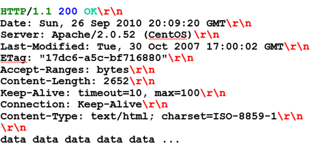

# Respuestas HTTP

La petición realizada fue satisfactoria ya que el servidor respondió con un código de estado 200 OK, indicando que el recurso fue encontrado. Además, el servidor informó la fecha y hora de respuesta, la versión y módulos del servidor web y el tipo de contenido (text/html).

Finalmente, el servidor entregó el contenido pedido, en este caso el archivo index.html.




## Códigos de estado

El servidor responde con códigos de estado. El  **código de estado ** es importante y le dice al cliente cómo interpretar la respuesta del servidor

Los códigos de estado están formados por 3 dígitos y incluyen una descripción. Ejemplo:  **404 **  **Not**  ** **  **Found**  ** **

Los códigos de estado se dividen en 5  **clases**  diferentes, según el primer dígito:


Los códigos de estado HTTP son números de 3 dígitos que indican el resultado de una solicitud. Los primeros dígitos indican el estado general de la solicitud, mientras que los otros 2 dígitos proporcionan información adicional. Por ejemplo:

- el código de estado 200 OK significa que la solicitud se completó exitosamente y los datos se devuelven, mientras que
- el código de estado 301 Moved Permanently indica que el recurso solicitado se ha movido y se especifica la nueva ubicación.
- El código de estado 302 Moved Temporarily significa que la URL está temporalmente fuera de servicio y se especifica una nueva ubicación.
- Los códigos de estado 400 Bad Request indican un error de sintaxis en la solicitud, mientras que el código de estado 403 Forbidden significa que el usuario no tiene permiso para realizar la solicitud. El código de estado 404 Not Found indica que el documento solicitado no existe, mientras que el código de estado 408 Request Timeout indica que la petición tardó demasiado en completarse por algún motivo.
- El código de estado 505 HTTP Version Not Supported significa que la versión HTTP solicitada no está soportada.

En este caso, el servidor contesta informando que el contenido pedido ha sido  **movido de lugar** para siempre.

También nos informa de la nueva  **dirección**  en la que podemos encontrarlo.

El navegador hace la redirección  **automáticamente** , sin que el usuario intervenga.

```http
GET / HTTP/1.1
Host: http://softuni.org
User-Agent: Gecko/20100115 Firefox/3.6
<CRLF>
```

Redirección

```http
HTTP/1.1 301 Moved Permanently
Location: http://softuni.bg
```

### Cabeceras de respuesta

Las puede incluir el servidor en sus mensajes de respuesta


