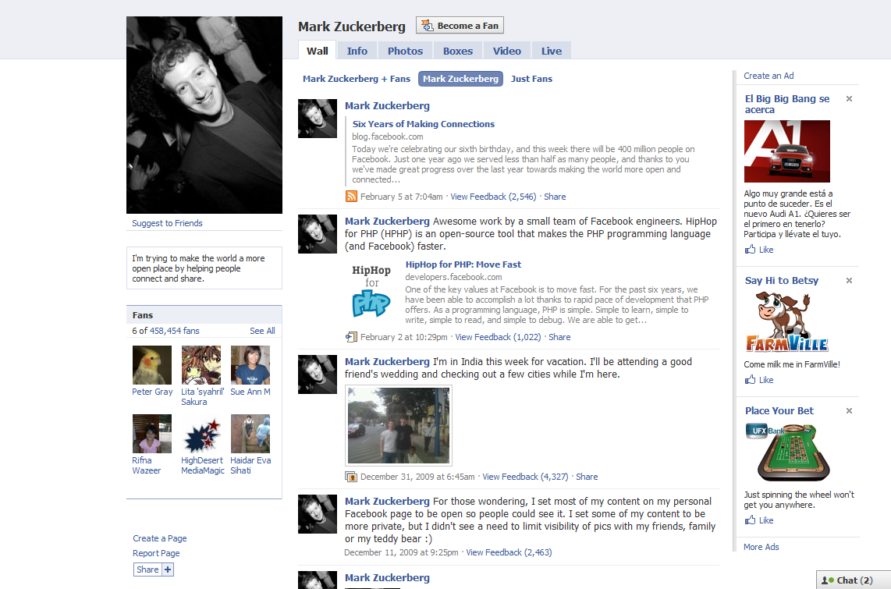
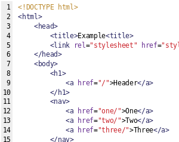
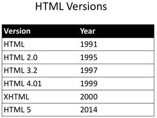
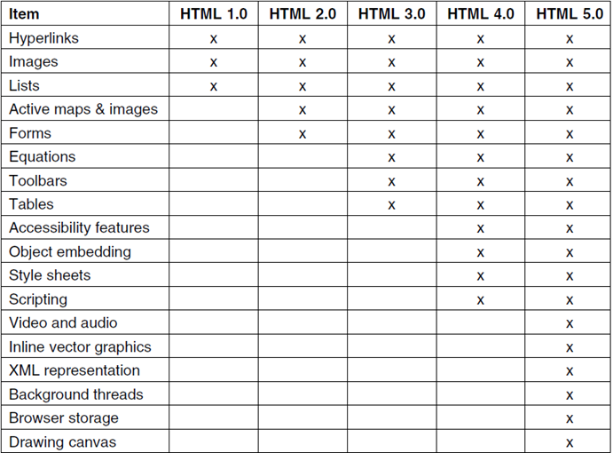
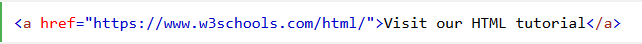
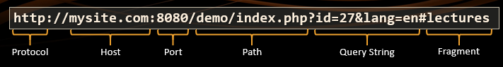

# La WWW

Una página web consiste en al menos un **archivo HTML** que puede incluir referencias a varios **objetos**, como por ejemplo otros archivos HTML, imágenes , Applets , archivos de AUDIO, scripts, CSS, etc.

Cada objeto se puede acceder a través de internet mediante una dirección única a nivel mundial llamada **URL**.

Los contenidos de las páginas web pueden ser de diferentes tipos: textos, elementos multimedia, como imágenes, vídeos, etc.

Su reproducción o visualización requiere de otros  **complementos**  que son añadidos al navegador y que quedan integrados en él de forma transparente al usuario.

* Es posible ejecutar determinadas aplicaciones complementarias que aumentan la funcionalidad de la página web.
* **Aplicaciones que se **  _ejecutan en el cliente web_
  * Se ejecutan directamente en el equipo del usuario.
  * El servidor envía el código al navegador (suele ser en Java o JavaScript) y este lo ejecuta.
  * Lógicamente, el navegador debe ser capaz de ejecutarlo, y para ello a menudo requiere de la instalación de extensiones.
* **Aplicaciones que se **  _ejecutan en el servidor _
  * Suelen ser en PHP, Perl, Python, etc.
  * Al ejecutarse estos programas generan un código HTML que es enviado al navegador. Este lo interpreta y lo muestra al usuario.

## Estructura de la WWW

La  _WWW_  es un entramado de documentos escrito en un formato de texto llamado hipertexto

El  _hipertexto_  es un sistema de organización de la información basado en la posibilidad de moverse por dentro de un texto y hacia otros textos diferentes mediante palabras clave

El lenguaje basado en hipertexto más conocido es el lenguaje  _HTML_  (Hyper\-text markup language). La versión más actual de HTML es la 5

## Comparativa de versiones

## Estructura de la WWW

* La estructura del hipertexto está formada por 3 elementos esenciales
  * _Nodos_ : unidades básicas que contienen información
  * _Enlaces_ : interconectan los nodos vinculando segmentos de información
  * _Anclajes_ : se utilizan para marcar el inicio y destino de cada enlace
* Todos estos elementos permiten acceder a la información a través de la  _navegación_  entre diferentes páginas

## Direcciones URL

El localizador uniforme de recursos o  _URL_  es una dirección que permite encontrar y acceder a un objeto concreto en internet.

Está formada por una secuencia de caracteres que sigue una determinada  _estructura_

No es obligatorio especificar todos los componentes de la URL. En caso de no hacerlo, el navegador presupone un  _valor por defecto_ .

Por ejemplo, si no especificamos protocolo se entenderá que es HTTP. Si no especificamos un puerto, será en puerto 80.

