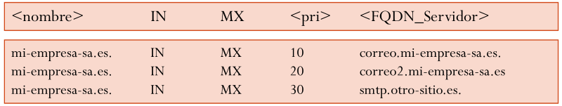

# DNS

## Servicio DNS

El **Sistema de Nombres de Dominio** \(DNS\) es un registro que relaciona nombres, pseudónimos o alias con direcciones IP. Esto es necesario porque los usuarios tienden a olvidar fácilmente las direcciones IP, mientras que los nombres son mucho más fáciles de recordar. Por ejemplo, ¿cuál es más fácil de recordar: 216.64.210.28 o cocacola.com?

Si no existiera el protocolo DNS, los usuarios tendrían que escribir la dirección IP del sitio web deseado en lugar de la URL, lo que generaría muchas confusiones y la navegación sería mucho más complicada.

A principios de los años 80, cuando existían muy pocos servidores, todos los hosts tenían una lista de dominio (hosts.txt) que contenía todos los nombres de dominio existentes. Esta lista se obtenía periódicamente por FTP, y su gestión era completamente manual. Con el crecimiento de ARPANET, esta lista se volvió inmanejable, haciendo imposible la gestión de los más de 50.000 nombres nuevos diarios. Por ello, se cambió a un sistema de gestión de forma distribuida (en millones de servidores DNS) y jerárquica.

## Espacio de nombres de dominio

 El servicio DNS permite traducir un nombre a una dirección IP. Esto fue definido por primera vez en 1984, en los RFC 1034 y 1035. La información de los nombres de dominio e IP ya no se almacena en un solo servidor, sino que está **distribuida** en varios. Estos servidores forman una base de datos distribuida en la que se almacenan las asociaciones entre nombres de dominio y direcciones IP de una **zona** en particular.


__EJEMPLO__

```dns
127.0.0.1		localhost
192.168.0.2	  mi-servidor.lan
192.168.0.3	  otro-pc.lan
```

## Nombres de dominio

* La base de datos de DNS está clasificada por  __nombres de dominio__
* Un __ nombre de dominio __ es sucesión de 2 a 5 grupos\, de 1 a 63 caracteres\.
  * Etiqueta más a la derecha se le llama  _dominio_  de nivel superior o TLD
  * Etiqueta de la izquierda expresa un  <span style="color:#00B050">subdominio</span>
  * Parte de más a la izquierda suele expresar  <span style="color:#FF0000">nombre de la máquina</span>
  * El nombre de un nodo es el  __trayecto completo __ de cada nodo de los niveles superiores\, separado por puntos\.

<span style="color:#FF0000">a01smx</span> \. <span style="color:#00B050">informática</span> \. _iesfbmoll\.org_


Zona cont\.ficticio\.es


El comienzo del árbol se denomina la  __raíz__  del sistema DNS \(root\) y tiene una etiqueta vacía \(se puede representar con un punto\)

Por debajo puede existir un número indeterminado de nodos\. Normalmente se utilizan  __hasta cinco niveles__ \.

Se asemeja a una estructura de directorio que nos podemos encontrar en Linux o en Windows


Espacio de nombres de dominio

## Partes de un nombre de dominio

  * __Raíz: __ La raíz no tiene etiqueta\. Se suele considerar que la etiqueta del elemento raíz es el carácter nulo\.
  * __TLD: __ Dominio de nivel superior \(\.es\, \.com\)
  * __Dominios o subdominios: __ Cada uno de los círculos representa un dominio distinto y comprende a ese elemento y a todos los que “cuelgan” de él
* Cada nombre de dominio incluye a los subdominios\. El dominio “es” incluye a los dominios “rediris\.es” y “ficticio\.es” así como todo lo que cuelgue de estos dos\.
* Puede asignarse la misma etiqueta a dos elementos distintos siempre que no sean elementos hermanos \(siempre que no cuelguen del mismo padre\)
  * <span style="color:#0070C0"> __smx__ </span> \.ifbmoll\.org
  * <span style="color:#0070C0"> __smx__ </span> \.informática\.iesfbmoll\.org

## Nombres de dominio absolutos y relativos

  * Si hacemos referencia a [www\.iesfbmoll\.org](http://www.iesfbmoll.org/) o [www\.google\.com](http://www.google.com/) se trata de máquinas diferentes
  * Si sólo hacemos referencia a www\, podría hacer referencia a un servidor web de cualquier dominio
* __Para referirnos a un dominio usando un nombre podemos utilizar__
  * <span style="color:#0070C0">Nombre </span>  <span style="color:#0070C0"> __relativo__ </span>  <span style="color:#0070C0"> \(www\, informática\)</span>
    * Solo parte del dominio\. Es necesario saber el contexto completo
  * <span style="color:#0070C0">Nombre </span>  <span style="color:#0070C0"> __absoluto__ </span>  <span style="color:#0070C0">: \(www\.informatica\.iesfbmoll\.org\.\)	</span>
    * __FQDN \(__  __Fully__  __ __  __Qualified__  __ Domain Name\)__ \,
    * El nombre del nodo se identifica de manera única dentro de la jerarquía que genera el árbol\.
    * En total\, el FQDN no debe exceder los 255 caracteres y acaba en punto

## Dominios de primer nivel \(Top __  __Level__  __ Domain\)

  * Los dominios de primer nivel suelen denominarse por sus siglas en inglés: TLD \(Top Level Domain\) y\, a efectos administrativos
  * Los TLD se pueden dividir en
    * Dominios genéricos \(gTLD\, Generic Top\-Level Domain\)
    * Dominios geográficos \(ccTLD\, Country\-Code Top\-Level Domain\)


## Dominios genéricos

|  TLD  |                                                                          Descripción                                                                          |
| :---: | :-----------------------------------------------------------------------------------------------------------------------------------------------------------: |
|  com  |                                       Agrupa organizaciones comerciales (google.com, yahoo.com, strands.com, etcétera).                                       |
|  edu  |                                Reúne organizaciones educativas universitarias (eada.edu, ortegaygasset.edu, mit.edu, etcétera)                                |
|  net  | Originalmente destinado a organizaciones involucradas en tecnologías de redes, como proveedores de servicios de Internet y otras compañías de infraestructura |
|  org  |                               Reúne organizaciones no comerciales (linuxdoc.org, ubuntu.org, linux.org, insflug.org, etcétera).                               |
|  gov  |                            Agrupa organizaciones gubernamentales de Estados Unidos (nasa.gov, nsf.gov, whitehouse.gov, etcétera).                             |
|  int  |                                Para el uso de organizaciones internacionales (redcross.int, interpol,int, coe.int, etcétera).                                 |

## Delegación de dominios

DNS es una base de datos distribuida y descentralizada\. Permite su administración descentralizada mediante la delegación de dominios

__La delegación es __  el proceso por el cual el gestor de un determinado dominio delega la tarea de gestión\, incluyendo el mantenimiento de servidores DNS\, de un dominio hijo en una entidad determinada\.

El  __dominio__  \(iesfbmoll\.org\) puede ser dividido en  __subdominios__  \(fp\.iesfbmoll\.org o esobach\.iesfbmoll\.org\) por el administrador y delegar el control de cada uno a otro servidor DNS\.

La autoridad que se hace cargo de la delegación debe asumir también la responsabilidad de mantener actualizados los datos \(los registros de recursos\)\.

## Esquema distribuido con delegación

### Dominios y zonas

Cada servidor se encarga de los nombres de su zona


__¿Qué datos hay en la zona raíz? __

Solo las referencias a los servidores DNS de todos los dominios de primer nivel que existen en Internet\.

__¿Qué datos hay en la zona es? __

Solo las referencias a los servidores DNS de segundo nivel\. Si existiera un sitio web que fuera \(www\.es su dirección IP estaría en la zona \.es\)\.

__¿Qué datos hay en la zona marca\.es? __

Las direcciones IP de los ordenadores dentro de ese dominio\.


* __Sin delegación__
  * Tendríamos un único servidor DNS con toda la información existente
* __Podemos crear zonas distintas: __
  * La zona raíz
  * La zona \.es
  * La zona \.elmundo\.es
* Cada una de ellas con sus propios servidores DNS\.
* Cada servidor se encargará de tener actualizados los datos de su zona


Una zona en realidad es un  __archivo__  que contiene determinados  __registros__  de la base de datos del espacio de nombres de dominio\.


## Dominio ARPA

* Se utiliza para poder obtener el nombre completo de una dirección IP \(resolución inversa\)
* La IP se escribe al revés y termina en  <span style="color:#0070C0">in\-addr\.arpa</span>
* __Ejemplo de registro inverso: __
  * 5\.78\.200\.100\.in\-addr\.arpa PTR IN www\.prueba\.com
* __Podríamos hacer la siguiente consulta__
  * ¿Qué nombre de dominio tiene la IP 100\.200\.78\.5?
  * Corresponde al dominio www\.prueba\.com


## Tipos de consultas

### ¿Cómo funciona una consulta DNS?

* __Cada zona DNS debería tener 2 servidores__
  * Un servidor  __primario__  que mantiene la base de datos de la zona
  * Uno o más servidores  __secundarios__  o de backup \(a los que se transfiere esta información\)
* __La resolución de nombres puede ser de dos tipos__
  * __Autoritaria: __ Cuando se puede realizar a través de la información contenida en la base de datos de la zona
  * __No autoritaria:__  Se puede hacer consultando respuestas anteriores de otros servidores dejadas en la caché


Tipos de consultas

* __El mecanismo de una consulta puede ser:__
  * Iterativo \(consultas iterativas\)
  * Recursivo \(consultas recursivas\)

Tipos de consultas

El cliente consulta la dirección “delegado\.google\.es”


Las respuestas que se reciben por parte de un servidor DNS son válidas durante un tiempo que este servidor determina \(TTL\)

Si se guardan las respuestas a las peticiones realizadas\, se pueden utilizar estos datos para reducir el tráfico DNS\.

Cuando un primer usuario pide la dirección IP de [www\.google\.es](http://www.google.es/)\, el servidor puede realizar una petición y guardar una copia de la respuesta

Si dentro de un tiempo\, otro usuario vuelve a hacer la petición\, se puede contestar con la IP guardada\, sin tener que volver a pedir la información

Si no existiera la caché en DNS\, cada vez que se preguntara por un nombre o una dirección IP en Internet\, los servidores raíz recibirían una consulta\.

# Base de datos del protocolo DNS

# Servicio DNS

Base de datos del protocolo DNS

Los servidores DNS guardan información de la  __zona__  o las zonas de las que se hace cargo en archivos de zona\.

Cada archivo de zona contiene una serie de  __registros__  que relacionan los diferentes nombres de dominio entre ellos y también entre dominios e IPs\.

El formato de cada registro de recursos es el siguiente:

<span style="color:#FF0000"> __[www\.miempresa\.es](http://www.miempresa.es/)__ </span>  <span style="color:#FF0000"> __\. __ </span>  __	IN 	A 	195\.57\.80\.100__

A la hora de resolver nombres\, los servidores DNS consultan las zonas que contienen registros de recursos \(RR\)\.

Base de datos del protocolo DNS

* Estructura de un registro
  * __Nombre de dominio:__  www\.miempresa\.es
  * __Clase__ : IN
  * __Tipo__ : A
  * __Valor TTL__ : No aparece en este caso
  * __Rdata__  __ \(datos\): __ 195\.57\.80\.100

<span style="color:#FF0000"> __[www\.miempresa\.es](http://www.miempresa.es/)__ </span>  <span style="color:#FF0000"> __\. __ </span>  __	IN 	A 	195\.57\.80\.100__

## Tipos de registros de recursos

| Nombre del recurso  | Tipo de registro |                                                Función                                                 |
| :-----------------: | :--------------: | :----------------------------------------------------------------------------------------------------: |
| Inicio de autoridad |       SOA        |            Identifica al servidor autoritario de una zona y sus parámetros de configuración            |
| Servidor de nombres |        NS        |                       Identifica servidores de nombres autorizados para una zona                       |
|      Dirección      |        A         |                         Asocia un nombre de dominio FQDN con una dirección IP                          |
|       Puntero       |       PTR        | Asigna una dirección IP a un nombre de dominio completamente cualificado. Para las búsquedas inversas. |
| Registro de correo  |        MX        |             Indica máquinas encargadas de la entrega y recepción de correo en el dominio.              |
|   Nombre canónico   |      CNAME       |                            Permite asignar uno o más nombres a una máquina.                            |
|        Text         |       TXT        |                                     Almacena cualquier información                                     |
|      Servicio       |       SRV        |                              Ubicación de los servidores para un servicio                              |

## Campos de los registros de recursos

* __Propietario: __
  * Nombre de máquina o dominio DNS al que pertenece el recurso\.
  * Puede contener el símbolo @\, que representa el nombre de la zona descrita\.

__Propietario 	TTL 	Clase 	Tipo 	RDATA__


__Campos de los registros de recursos__

* __TTL \(Time __  __To__  __ Live\): __
  * Tiempo de vida en segundos que puede estar el registro en la caché
  * Expresado en días \(d\)\, horas \(h\)\, minutos \(m\) y segundos \(s\)\.
  * El cero \(0\) no se almacena en caché\.
  * Se trata de un campo opcional\.

__Propietario 	TTL 	Clase 	Tipo 	RDATA__

<span style="color:#FF0000"> __[www\.miempresa\.es](http://www.miempresa.es/)__ </span>  <span style="color:#FF0000"> __\. __ </span>  __	IN 	A 	195\.57\.80\.100__

__Campos de los registros de recursos__

* __Clase: __
  * Indica la clase de registro\.
  * Nos interesa IN \(de Internet\)\.
* __Tipo: __
  * Varía en función del campo clase\.

__Propietario 	TTL 	Clase 	Tipo 	RDATA__

<span style="color:#FF0000"> __[www\.miempresa\.es](http://www.miempresa.es/)__ </span>  <span style="color:#FF0000"> __\. __ </span>  __	IN 	A 	195\.57\.80\.100__

__Campos de los registros de recursos__

* __RDATA__
  * Información específica del tipo de recurso\.
  * Para un registro de clase IN y tipo A\, este apartado especifica una dirección IP\.
  * Puede también ser otro nombre de dominio
  * Indica la respuesta que esperamos\.

__Propietario 	TTL 	Clase 	Tipo 	RDATA__

<span style="color:#FF0000"> __[www\.miempresa\.es](http://www.miempresa.es/)__ </span>  <span style="color:#FF0000"> __\. __ </span>  __	IN 	A 	195\.57\.80\.100__

## Tipos de registros DNS (RR)

Tipos de registros de recursos

* __Registros SOA \(__  __Start__  __ __  __of__  __ __  __authority__  __\)__
  * Inicio de autoridad \(Start of Authority\)
  * Indica la dirección del servidor principal de esa zona y datos sobre como se sincronizan los secundarios con el primario\.
  * Un solo registro SOA por zona\.


Tipos de registros de recursos

* __Registros NS__
  * Indica el FQDN de uno de los servidores de dominio de la zona\.
  * Deben existir tantos registros NS como servidores de nombres hay en esa zona\.
  * El nombre de la derecha identifica a cada uno de los servidores\.
  * Para cada servidor deberemos definir un registro A más adelante

```
<nombre_zona> IN  NS  <FQDN_Servidor>
mi-empresa-sa.es. IN  NS  dns1.mi-empresa-sa.es.
mi-empresa-sa.es. IN  NS  dns2.mi-empresa-sa.es.es.
mi-empresa-sa.es. IN  NS  dns.otro-sitio.com.
mi-empresa-sa.es. IN  NS  dns.otro-lugar.eu
```

Tipos de registros de recursos

* __Registros MX__
  * Indican el/los servidor/es de correo electrónico que son los encargados de recibir email para el nombre del dominio indicado\.
    * _Nombre_ : O un dominio\, o el nombre de un ordenador\.
    * _Pri_ : Prioridad de ese servidor \(cuanto más bajo\, mayor prioridad\)\.
    * _FQDN\_Servidor: _ Nombre completamente cualificado del servidor de email\.



Tipos de registros de recursos

* __Registros A__
  * Nos permite especificar una dirección IP para un determinado nombre\.
  * _Nombre_ :
    * Un FQDN \(terminado en “\.”\)
    * Un nombre relativo \(no termina en “\.”\) en cuyo caso se añade el nombre de la zona al final de ese nombre relativo\.
  * Debemos de indicar direcciones públicas\.


* __Registros CNAME__
  * Se usan cuando quiero que varios nombres apunten al mismo ordenador\.
  * Nombre\_alias: nombre que queremos que apunte al verdadero\.
  * Ejemplo:  Servidor web con el nombre ldap\.mi\-empresa\-sa\.es \(con su correspondiente registro A\) y quiero que  sea servidor POP3\, IMAP y SMTP\.
  * Ojo\! Los CNAME pueden apuntar a algo en otro dominio\.


Tipos de registros de recursos

* __Registros PTR__
  * Se utilizan para las zonas de búsqueda inversa\, donde en lugar de preguntar por el nombre\, se preguntará por la IP\.
  * Utiliza el dominio  _in\-addr\.arpa_
  * Nombre\_in\-addr: Nombre que bajo el dominio in\-addr\.arpa tiene una dirección IP\.
  * Ejemplo:
    * Dirección IP 150\.214\.7\.10 se corresponde con:


# Base de datos del protocolo DNS

# Servicio DNS

Sincronización de datos entre servidores

El servidor maestro es el que contiene la información original de las zonas para las que está configurado como maestro\.

La información se transfiere del maestro al secundario mediante la descarga de los archivos de zona por parte del esclavo\. Esto se llama  __transferencia de zona__

Los servidores de nombre secundarios solicitan una transferencia de zona periódicamente para mantener actualizada la información acerca de la zona\.

En caso de fallo del servidor DNS primario\, el secundario atiende las peticiones de resolución de nombres puesto que tendrá una  __copia de la zona__ \.


Sincronización de datos entre servidores

Tipos de registros de recursos

Si el esclavo compara el serial de la zona que tiene guardada y es el mismo\, no se actualiza\. De lo contrario\, se descarga la zona del maestro\.

Al cabo de 1h \( __3600__ \) el esclavo intentará sincronizar la zona con el servidor\.

Si no lo consigue\, irá reintentándolo cada 10 min \( __600__ \)\.

Cuando pasen 1 semana \( __604800__ \) \, se declarará no autoritativo

Si el servidor devuelve una respuesta negativa \(por ejemplo\, NXDOMAIN o NODATA\)\, deberá esperar 1min \( __60__ \) antes de volver a intentar la solicitud


Tipos de registros de recursos

* _Actualización_ :
  * Cada cuánto tiempo deben los secundarios contactar al primario para comprobar si se ha actualizado la zona\.
  * Si es alto\, el secundario estará mucho tiempo con datos de la zona anticuados\.
* _Reintento_ :
  * Cada cuánto tiempo deben los secundarios reintentar una actualización de zona\. \(suele ser menor que el de actualización\)
* _Expiración_ :
  * Tiempo durante el cual un secundario puede estar sin contactar con el primario para comprobar la zona\.
  * Si supera ese tiempo\, el secundario se declara a sí mismo no autoritativo para la zona\.
* _TTL Negativo_ :
  * Tiempo de vida durante el cual se debe almacenar en la caché de cualquier otro servidor DNS una respuesta negativa\.

Hoy en día\, el primario debe enviar un mensaje de notificación \( __NOTIFY__ \) a cada uno de los secundarios siempre que haya una actualización en la que los secundarios tomen el archivo de la zona de inmediato\.

Hoy en día\, el mecanismo de "actualizar / reintentar / caducar" es solo un respaldo\, en caso de que el mecanismo NOTIFY no funcione\.

## DNS dinámico

**DNS dinámico en internet**

Los proveedores ISP asignan normalmente una dirección IP dinámica por DHCP al router desde el que accedamos a internet

También podemos pagar  para que nos asigne una dirección IP estática pero suele ser bastante caro\.

La dirección IP puede cambiar cada cierto tiempo a cada vez que se apaga o enciende el router

No tenemos control sobre nuestra IP  y no podemos configurar los DNS

DNS dinámico en internet

* Algunos sitios web nos ofrecen servicios DNS dinámico en internet
* Estos sitios web enlazan la IP del host al sitio web donde nos hemos registrado
* Cuando el ISP nos cambia la IP al router
  * También se modifica en la web del proveedor \(no\-ip\)
  * Siempre tendremos actualizada IP que cambia un nombre de dominio
