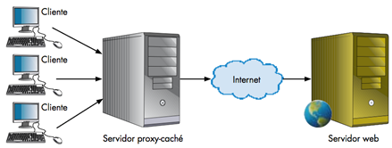
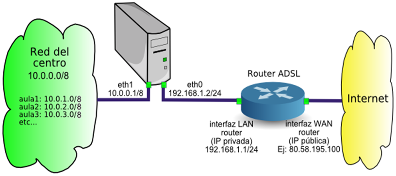
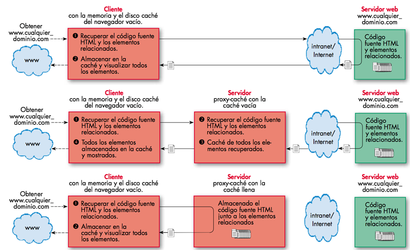

# Proxy

Un proxy-caché es un servidor que actúa como pasarela entre Internet y una red local, permitiendo la centralización del tráfico y evitando la necesidad de que cada ordenador de la red local tenga una conexión directa a Internet. Además, esta herramienta también puede ser usada para controlar los accesos no permitidos desde Internet hacia la red local.

## Ventajas de utilizar un proxy - caché

El uso de un proxy caché ofrece muchas ventajas, como mayor velocidad de navegación, uso más eficiente de la línea de conexión con Internet, **cortafuegos** de contenidos y **filtrado** de servicios. Esto proporciona una mejor seguridad y protección, así como una mejor experiencia de usuario al navegar por la web.

## ¿Cómo funciona?

- Un proxy de conexión a Internet es un servidor que hace de intermediario entre los PCs de la red y el router de conexión a Internet
- Cuando un usuario quiere acceder a Internet, su PC realiza la petición al servidor Proxy y es el Proxy quien  realmente accede a Internet.
- Posteriormente, el proxy enviará los datos al PC del usuario para que los muestre en su pantalla.
- El PC del usuario no tendrá conexión directa con el router, sino que accederá a Internet por medio del proxy.

## Posibilidades del proxy

El uso de un proxy ofrece a los usuarios una mayor seguridad y control, permitiendo controlar el acceso a páginas web específicas, así como el uso de protocolos como el ftp, email, messenger, p2p, etc. Además, el proxy almacena páginas en la memoria temporal para acelerar la descarga cuando varios usuarios hacen uso de la misma página. También es posible crear una lista de urls prohibidas para que el proxy deniegue el acceso a éstas.

## ¿Qué podemos hacer con un proxy?

Permite crear una lista de palabras prohibidas en url. El proxy denegará el acceso cuando se introduzcan en
formularios de búsqueda o en la barra de direcciones.

Se puede permitir o denegar el acceso a subredes o a PCs concretos. Si diseñamos la red de forma que cada aula
del centro tenga un rango determinado, por ejemplo 10.0.X.Y donde X es el número de aula e Y el número de PC,
sería posible permitir o denegar la conexión a Internet aula por aula.

El proxy guarda informes de todas las conexiones que hacen los usuarios. Al principio puede ser interesante ver
a qué páginas de contenido inadecuado acceden nuestros alumnos, para agregarlas a la lista de urls prohibidas.

Los PCs de nuestra red están más seguros de ataques externos ya que el proxy hace de barrera cortafuegos

## Inconvenientes

- Necesario configurar aplicación por aplicación
- Para que las aplicaciones accedan a Internet a través del proxy, es necesario configurar cada aplicación: - navegador web, cliente ftp, cliente de correo, etc...
- Todas las comunicaciones con el exterior pasarán por el servidor.
- Si el proxy falla, la red se quedará sin conexión a Internet.
- Es recomendable conveniente disponer de un proxy de repuesto.
- El proxy requiere mantenimiento.
- Para que todo funcione, es necesario que exista un administrador de la red que se encargue de actualizar, - revisar, mantener y reparar el proxy cuando deje de funcionar.

## Ejemplo de funcionamiento

## Proxy squid

**Squid** es una herramienta software muy extendida entre distribuciones basadas en GNU/Linux que actúa como servidor proxy caché para los protocolos HTTP, FTP y SSL, así como proxy transparente para DNS.

Su principal función consiste en soportar el protocolo **ICP** (Internet Cache Protocol), que permite la integración y comunicación de servidores **caché**, con la ventaja de poder establecer una jerarquía para suplir el fallo de un servidor caché con la colaboración de los restantes.

## Monitorizar proxy

Existen varios mecanismos con los que llevar a cabo un seguimiento de la actividad de Squid, como los propios archivos de log y herramientas específicas que, haciendo uso de la información almacenada, generan informes completos de actividad.

## Log principal

Archivo `/var/log/squid/cache.log`

Para saber si Squid funciona de manera correcta, basta con visualizar las últimas entradas de este archivo, en el que se reflejan todas las incidencias en el arranque del servicio, así como diversos problemas de funcionamiento e incidencias en la parada del servicio. Para visualizar las últimas entradas del archivo se utiliza la orden: # tail /var/log/squid/cache.log

## Log de acceso

Archivo `/var/log/squid/access.log`

Contiene todas las peticiones servidas por el proxy a los navegadores web (clientes). Se puede consultar de la forma siguiente: # more access.log | grep DENIED

Las líneas de este archivo de log contienen una serie de códigos que empiezan por TCP_ para indicar que se trata de peticiones HTTP.

Los códigos más usuales son los siguientes:

