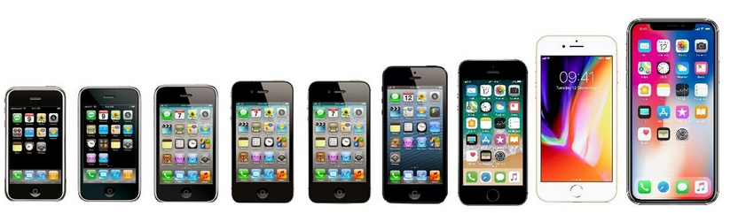

[游댗 Enrere](../) | [游 P많ina principal](http://danimrprofe.github.io/apuntes/)

# iOS

**iOS** es un sistema operativo creado por Apple para su uso en dispositivos portátiles como el ``iPhone``, ``iPod`` y ``iPad``.

---

---

``Apple`` fabrica sus propios smartphones (iPhone) y el sistema operativo que incluye (iOS). De serie, trae un conjunto de programas propios de Apple incluidos, y podemos instalar otras apps de terceros, si queremos.

---

---

## El ecosistema de Apple

El ecosistema de Apple es una forma de referirse al conjunto de dispositivos y servicios de Apple. Estos productos y servicios se conectan entre sí.  Esto incluye la **sincronización** de contenido entre dispositivos, el aprovechamiento de los **recursos compartidos** entre ellos y la integración de **aplicaciones** y servicios.

---

Es un sistema operativo muy adaptado para los dispositivos Apple y aprovechan muy bien el hardware. La última versión a día de hoy es el iPhone 14. La última versión es ``iOS 16``.

---

## App store

Su tienda de apps es la App store. A este store solo se puede acceder con dispositivos de Apple, y no se pueden instalar aplicaciones que no provengan de ella. En general, algunas aplicaciones solo tienen versión para App store y las aplicaciones suelen ser más caras que sus respectivas versiones de Android.

---

Tiene aplicaciones exclusivas para iOS y otras multiplataforma (también para Android). Instalar apps desde otro lugar no es posible, a no ser que se realice un Jailbreak. Esto se debe a que Apple mantiene un gran control sobre el contenido disponible en la App Store, lo que ofrece una mayor seguridad a los usuarios.

---

---

Apple también tiene sus propios ``conectores``, que no siempre son compatibles con componentes de otras marcas.

---

## iCloud

iCloud es un servicio creado por Apple que ofrece la posibilidad de guardar datos en servidores de Apple (la nube) y sincronizarlos en los diferentes dispositivos Apple usados por una misma persona, además de servir como copia de seguridad.

---

---

Como parte de sus beneficios, ofrece 5 GB de almacenamiento gratuito, que se puede ampliar pagando una cuota mensual. De esta manera, los cambios realizados en un dispositivo aparecerán en todos los demás dispositivos. iCloud ofrece diferentes planes y precios para su almacenamiento.