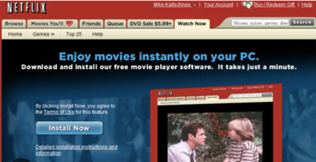
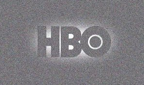
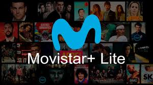

# 6. Plataformas de streaming

El 37% de los hogares españoles con internet declaran tener algún tipo de estas plataformas. Vamos a ver algunas de las más conocidas.

## 6.1. Netflix

Netflix es una plataforma de streaming de video que comenzó como un servicio de alquiler de DVD por correo en 1997 en Estados Unidos.

En 2007, la empresa decidió incluir también un servicio de streaming en línea, lo que la convirtió en una de las primeras plataformas de este tipo en el mercado. Desde entonces, Netflix se ha convertido en una de las principales plataformas de streaming de video a nivel mundial.

En 2015, Netflix llegó a España, ofreciendo un catálogo de series y películas en línea a través de suscripción mensual.

## Netflix original

Desde 2013, Netflix ha incursionado en la producción de contenido propio, lo que ha llevado a la plataforma a convertirse en una de las principales productoras de series y películas en el mundo.

El primer gran éxito de producción propia de Netflix fue la serie "House of Cards", lanzada en 2013 y que tuvo una gran acogida entre la crítica y el público.

## 2. HBO

<!-- _class: invert -->

## HBO

HBO es una marca de Time Warner y se estableció en 1972 en Estados Unidos. Fue uno de los primeros canales de televisión por cable en el país.

## HBO: España

En España, HBO llegó en 2016 con una plataforma de streaming propia, ofreciendo su contenido a través de internet. Además, tiene un acuerdo exclusivo con **Vodafone** para que los clientes del operador puedan acceder a su contenido de forma gratuita o con descuentos especiales.

## Estrategia

La estrategia de HBO se ha basado en producir series de alta calidad y actualidad, con tramas complejas y personajes bien desarrollados. Algunas de sus series más populares incluyen "Juego de Tronos", "Westworld", "The Sopranos" y "The Wire".

## 6.3. Movistar plus

"Movistar+" fue la fusión del servicio existente de Movistar TV con el contenido de Canal+ después de la adquisición.

---

Telefónica adquirió Canal+ de PRISA en 2014, lo que la convirtió en el mayor proveedor de televisión de pago de España. Luego, la empresa cambió el nombre de su servicio Movistar TV existente a "Movistar+" e incorporó el contenido de Canal+ a la plataforma.

El nuevo servicio se lanzó en 2015 y ofrece a los clientes acceso a una amplia gama de canales de televisión, contenido bajo demanda y la capacidad de grabar y almacenar contenido en la nube.

## Yomvi

Una de las principales características del servicio era su capacidad de visualización multidispositivo, que permitía a los usuarios ver contenido en múltiples dispositivos a través de la plataforma ``Yomvi``.

Otro aspecto clave fue la estrategia de la empresa de poseer y crear su propio contenido, en lugar de depender de proveedores externos.

## Movistar+ Lite

Movistar+ Lite es un nuevo servicio de Movistar, que a diferencia de su Movistar+ convencional no necesita que seas cliente de Movistar, y lo puedes contratar por separado.

## 4. Amazon prime video

<!-- _class: invert -->

---

Amazon Prime Video fue lanzado en septiembre de 2006 en los Estados Unidos como Amazon Unbox. Inicialmente, el servicio permitía a los usuarios descargar películas y programas de televisión para su visualización en dispositivos de Amazon, como el reproductor de medios digital Amazon Fire TV y los dispositivos móviles Kindle.

## Amazon Instant Video

En 2011, Amazon cambió el nombre de Unbox a Amazon Instant Video y comenzó a ofrecer una suscripción anual para su servicio Amazon Prime, que incluía acceso a una amplia biblioteca de contenido de streaming.

## Amazon Prime Video

Con el tiempo, Amazon Instant Video se convirtió en Amazon Prime Video, que es ahora el servicio de streaming de video principal de Amazon.

Amazon Prime Video ha expandido su alcance globalmente y actualmente está disponible en más de 200 países y territorios en todo el mundo. La plataforma también ha desarrollado contenido original muy aclamado como "The Marvelous Mrs. Maisel", "Transparent", "The Man in the High Castle", "The Boys" y muchas otras series y películas de éxito.

## Asociación con otros servicios

Los clientes de Amazon Prime Video también pueden tener acceso a otros servicios como Amazon Prime (para envíos), Amazon Drive, reproducción sin anuncios en Twitch y acceso prioritario a ofertas flash.

# 5. Disney plus

<!-- _class: invert -->

---

Disney Plus es un servicio de suscripción de streaming de video propiedad de The Walt Disney Company que se lanzó en **2019**.

## Características

Algunas de las características de Disney Plus hoy en día son:

- Biblioteca de películas y programas de televisión de Disney, Pixar, Marvel, Star Wars y National Geographic, así como contenido exclusivo de Disney Plus
- Sin anuncios en la plataforma
- Descargas ilimitadas de contenido en hasta 10 dispositivos
- Resolución de 4K HDR y sonido envolvente en algunos títulos
- Perfiles de usuario para hasta siete cuentas diferentes
- La capacidad de transmitir en cuatro dispositivos simultáneamente
- Uso ilimitado en dispositivos móviles, televisores inteligentes, consolas de videojuegos y otros dispositivos compatibles
- Una sección de "Kids Mode" para mantener un ambiente seguro y apto para niños

## Contenido

## 6.6. Comparativa suscripciones

