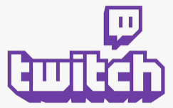

---

# Twitch

- **Twitch** nace como un servicio de vídeo online para retransmitir en directo partidas de videojuegos.
- Fundado en el año 2011 como una plataforma para la transmisión en vivo de videojuegos
- Se ha convertido en uno de los sitios más populares para este tipo de contenido.

---

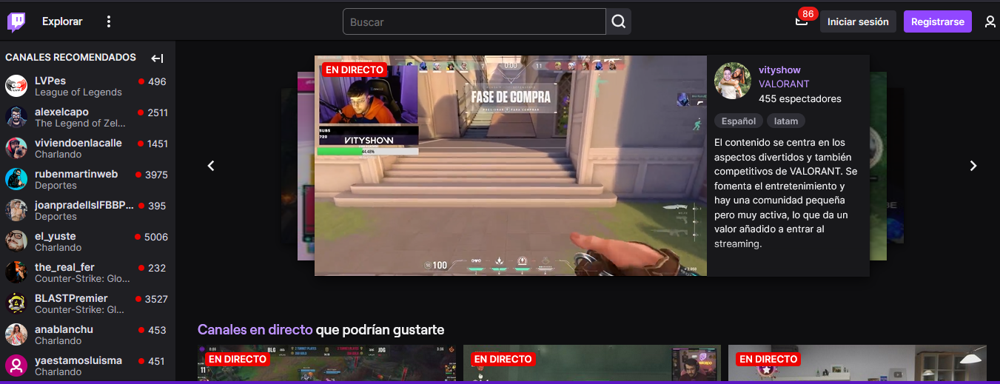

---

# Compra por parte de Amazon

- En **2014** Twitch fue adquirido por **Amazon** por un valor de 970 millones de dólares
- Permitió una mayor inversión en la plataforma y el desarrollo de nuevas funciones y herramientas.

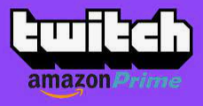

---

# Acceder a Twitch

Podéis visualizarlo a través de la web en [twitch.tv](http://twitch.tv) o instalar la app de[Twitch](twitch/index.md) desde la Play Store.

---

## Categorías

Hoy en día, se ha expandido para incluir también otras disciplinas como música, arte o, simplemente charlas de diversas temáticas a modo de podcast, entre otros.

---

# Categorías

- Las **categorías** engloban todos los canales que en ese momento retransmiten sobre un tema concreto.
- Las **etiquetas** (español, composición musical) para describir qué tipo de contenido realizan y en qué idiomas retransmiten.

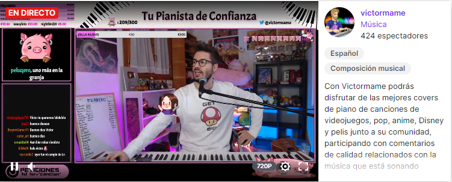

---

# Los canales

- Twitch se organiza por ``canales``.
- En cada momento, el streamer elige que **categoría** describe el contenido que está creando.

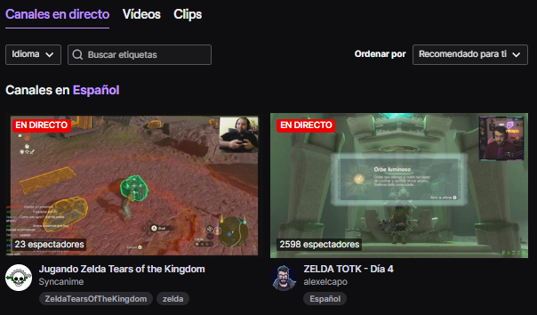

---

# Configuración

Cada ``streamer`` crea su propio canal y, si quiere, configurar ciertos aspectos como:

- Los **horarios** de emisión
- **iconos** o **comandos** de chat personalizados
- Ciertas **recompensas**.

---

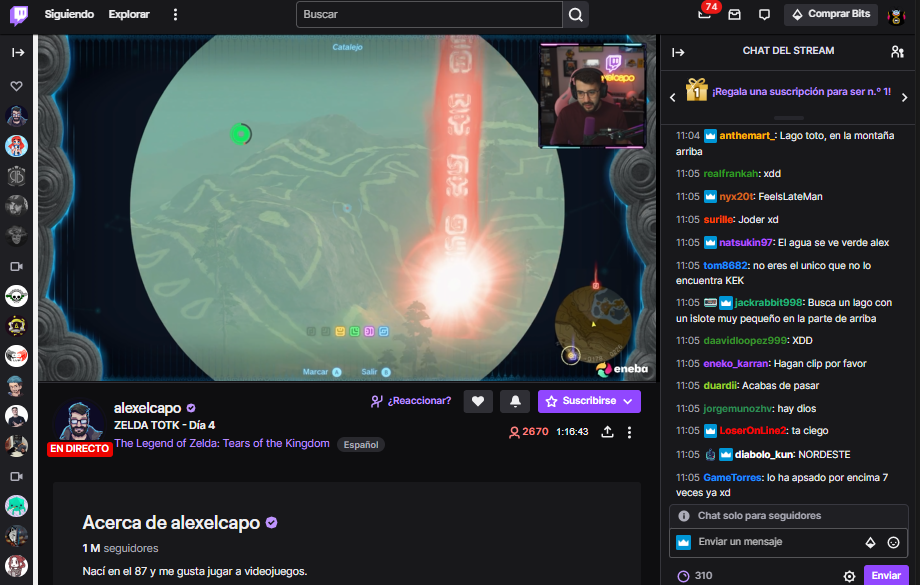

---

# Visualización

Las retransmisiones se pueden ver en directo o bien en diferido.

Debajo del vídeo, podremos ver información sobre el canal:
- Como funciona su comunidad
- Qué contenido puedes encontrar
- Cuantos usuarios están viendo el directo
- Si sigues o no el canal y un botón para suscripciones.

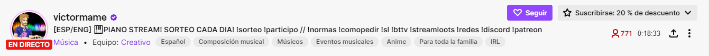

---

# Hostear

- Cuando el streamer no está online, puede hostear un canal.
- En su canal se verá **otro canal** que él haya elegido para que sus seguidores lo puedan ver mientras él no está retransmitiendo.

---

# Raids

Cuando un streamer va a dejar de emitir, antes de cerrar la retransmisión:

- Puede **ceder sus seguidores** a otro canal que esté emitiendo en este momento.
- Esto se llama **hacer una raid**.
- Los seguidores que quieran pueden **cambiarse a este canal** y seguir viéndolo si les apetece.

---

# Seguir un canal

``Seguir`` un canal es gratuito, y es similar a seguir a un usuario en Instagram o Twitter.
- Puedes seguir a todos los usuarios que te interesen.
- Cuando el usuario comienza un stream o retransmisión, se te ``notificará`` que comienzan, para que puedas abrir su canal y ver su emisión en directo.

---

De este modo podremos ver si alguno de nuestros canales está emitiendo, y se nos recomendarán otros parecidos a los que ya seguimos.

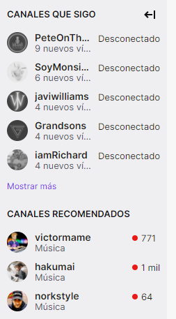

---

# Bits

- Son una ``moneda virtual`` utilizada para apoyar a los creadores de contenido.
- Se pueden **ganar** viendo contenido o realizando ciertas acciones.
- Los espectadores pueden **comprar** bits con dinero real.
- Estos bits se pueden ``utilizar`` para enviar mensajes y emojis especiales durante las transmisiones en vivo o para hacer donaciones.

---

# Chat

Cada canal tiene asociado un ``chat``, en el que los usuarios que ven el stream pueden:

- Compartir sus impresiones con los otros espectadores o viewers
- Interactuar con el streamer, para pedirle algo o darle algún consejo.

---

# Votaciones

Otros métodos de participación incluyen ``votaciones``, que pueden ser iniciadas para que los usuarios den su opinión sobre ciertos temas.

---

# Moderadores

Al tratarse de un chat, existen ``moderadores`` o ``mods`` que ayudan al streamer, bloqueando usuarios o ayudándole a gestionar el chat.

---

# Comandos

Los chats también disponen de ciertos comandos que el bot del canal reconoce automáticamente para realizar ciertas acciones.

---

# Suscripción a un canal

Si quieres participar de una forma más activa en el canal te puedes **suscribir**.

- Las suscripciones son de **pago mensual**
- Si tienes **Amazon prime** te puedes suscribir gratuitamente a un canal por mes.

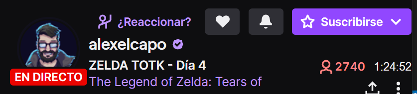

---

# Modalidades de suscripción

Existen diferentes modalidades de suscripción según:

- El **tiempo** que lleves viendo el canal
- El **nivel** de suscripción

Las suscripciones que te dan ciertas **ventajas** y, a cambio, ayudan **económicamente** al streamer.

---

# Ventajas

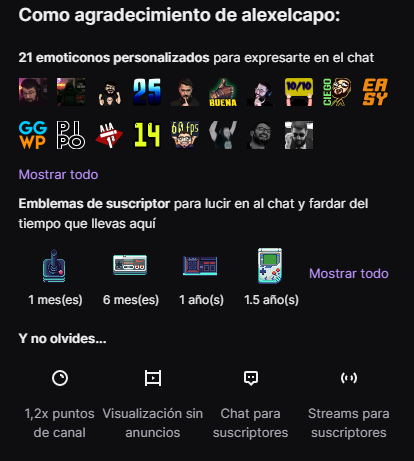

---

---

---

# Crear un canal y emitir (opcional)

Si tienes conocimientos suficientes, ganas y algo que quieras compartir, puedes crear un canal propio y emitir tu propio contenido. Para esto necesitarás un mínimo de equipamiento y configuración.

---

# Panel del creador

Vamos a buscar la clave.

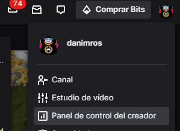

---

# Configuración > stream

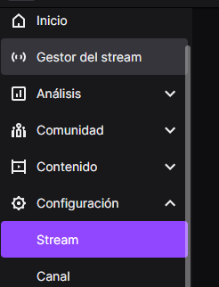

---

# Copiar la clave

Pulsamos en **copiar**

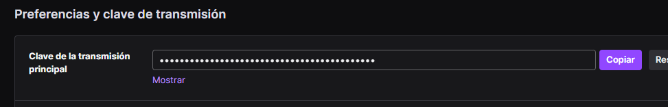

---

# Pegar clave en Twitch

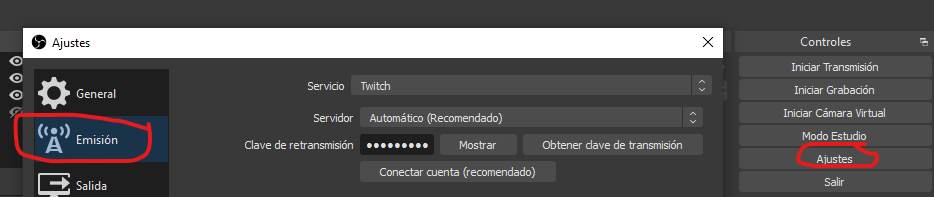