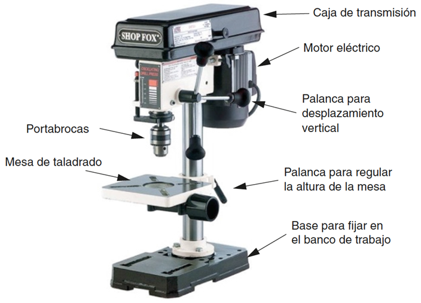
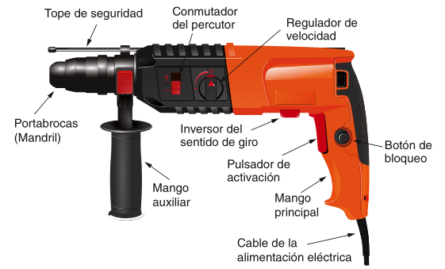
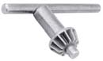
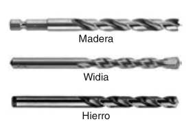
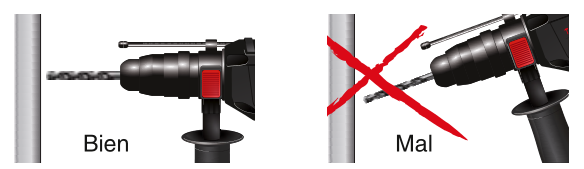
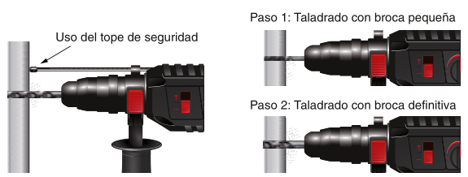
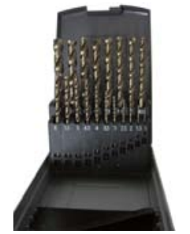
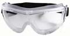

# El taladro

El **taladro** es una herramienta eléctrica que permite realizar orificios de diferentes diámetros y en diversos tipos de materiales.

El taladro puede ser de columna o de mano.

## Taladro de columna

también denominado «de sobremesa», es ideal para ser instalado de forma fija en el taller del reparador. Dispone de una mesa regulable en altura, para colocar y sujetar la pieza que se va a taladrar. En muchas ocasiones viene acompañado de un pequeño tornillo de banco. Existen taladros de sobremesa de reducido tamaño,
ideales para la fabricación de circuitos impresos en electrónica.

## Taladro eléctrico de mano

Es portátil y permite hacer orificios en
cualquier dirección. Pude ser de baterías o de conexión por cable.

Muchos taladros de mano tienen regulador de velocidad y un conmutador para
invertir el sentido de giro del motor. Esto los convierte en ideales para ser utilizados como destornilladores eléctricos.

Algunos taladros requieren una herramienta para la fijación de brocas en el portabrocas y otros disponen de sistemas de inserción rápida.

## Brocas

Son los elementos que realizan el corte de material en la operación de taladrado. Tienen aristas cortantes dispuestas de forma helicoidal, encargadas de extraer las virutas de material en el objeto taladrado.

Pueden ser de diferentes tipos en función del  material que vaya a taladrar: madera, metal o pared. Las destinadas a taladrar paredes y tabiques se denominan brocas de Widia, por el material del que están construidas, y a simple vista se diferencian de las utilizadas para hierro o madera porque su cabeza es más ancha que su cuerpo.

Este tipo de brocas no es adecuado para taladrar otros materiales como el plástico, la madera o el hierro. De igual forma, no se puede utilizar para taladrar en pared una broca para metal.

Las brocas se identifican por su **diámetro** en milímetros. Así, una broca de 8 realizará un orificio de 8 mm.

## Procedimiento para taladrar correctamente

1. El taladro debe colocarse perpendicular a la superficie que se va a taladrar, evitando movimientos de vaivén que podrían dañar o romper la broca.

Figura 1.55. Forma correcta de colocar el taladro.
Bien
Paso 1: Taladrado con broca pequeña
Paso 2: Taladrado con broca definitiva
Uso del tope de seguridad
Mal
Bien
Paso 1: Taladrado con broca pequeña
Paso 2: Taladrado con broca definitiva
Uso del tope de seguridad
Mal
1. Se debe utilizar el tope de seguridad cuando no sea necesario taladrar
por completo el objeto.
1. En el taladrado de orificios de gran diámetro es aconsejable realizar previamente un orificio con una broca más pequeña.

Figura 1.57. Uso del tope de seguridad y taladrado de materiales duros.
Bien
Paso 1: Taladrado con broca pequeña
Paso 2: Taladrado con broca definitiva
Uso del tope de seguridad
Mal
Bien
Paso 1: Taladrado con broca pequeña
Paso 2: Taladrado con broca definitiva
Uso del tope de seguridad
Mal
1. En materiales duros, es aconsejable realizar el taladrado en varios
pasos, facilitando así el enfriamiento de la broca.
1. Debido al desprendimiento de virutas, siempre que se taladre es obligatorio el uso de gafas de seguridad.
Figura 1.54. Tipos de brocas.
Madera
Widia
Hierro

## Juego de brocas

En el taller de reparación no debe faltar un juego de brocas para metal completo.

La operación de taladrado requiere el uso de **gafas protectoras**.

