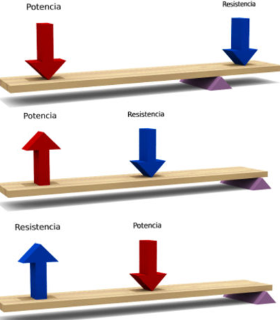
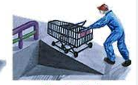
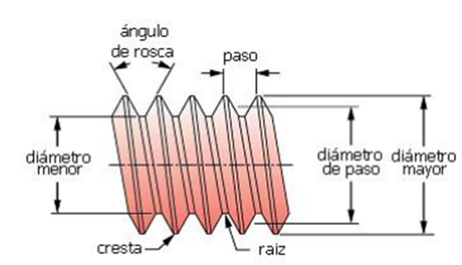
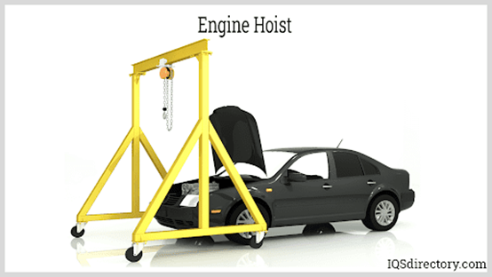
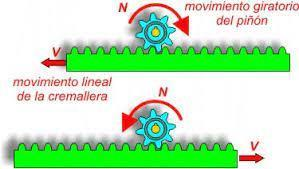
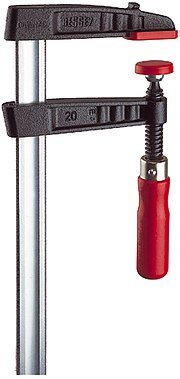

- [Introducción](#introducción)
- [Máquinas simples](#máquinas-simples)
  - [Palanca](#palanca)
  - [Plano inclinado](#plano-inclinado)
  - [Rueda](#rueda)
  - [Cuña](#cuña)
  - [Tornillo](#tornillo)
- [Mecanismos de transmisión](#mecanismos-de-transmisión)
  - [Poleas](#poleas)
  - [Transmisión circular](#transmisión-circular)
  - [Engranajes](#engranajes)
  - [Planetario](#planetario)
  - [Diferencial](#diferencial)
  - [Cadenas](#cadenas)
- [Mecanismes d’acoblament d’eixos](#mecanismes-dacoblament-deixos)
  - [Acoblament per maniguet](#acoblament-per-maniguet)
  - [Junta cardan](#junta-cardan)
  - [Junta homocinètica](#junta-homocinètica)
  - [Embrague](#embrague)
- [Mecanismos de transformación](#mecanismos-de-transformación)
  - [manivela-torno](#manivela-torno)
  - [piñón-cremallera](#piñón-cremallera)
  - [Tornillo-tuerca](#tornillo-tuerca)
  - [Tornillo sin fin](#tornillo-sin-fin)
  - [Biela-manivela](#biela-manivela)
  - [Leva](#leva)
  - [Excéntrica](#excéntrica)
  - [Cigüeñal](#cigüeñal)
  - [Pistones](#pistones)
- [Soporte de elementos mecánicos](#soporte-de-elementos-mecánicos)
  - [Cojinetes](#cojinetes)
- [Sistemas de retención](#sistemas-de-retención)
  - [Frenos](#frenos)
  - [Pastillas de freno](#pastillas-de-freno)
  - [Frenos de tambor](#frenos-de-tambor)
  - [Frens de disc](#frens-de-disc)
  - [Accionament dels sistemes de frenat](#accionament-dels-sistemes-de-frenat)
  - [Líquidos de freno](#líquidos-de-freno)
  - [Servofrens](#servofrens)
  - [Trinquetes](#trinquetes)
  - [Ruedas de bicicleta](#ruedas-de-bicicleta)
  - [Resorte](#resorte)
- [Lubrificació](#lubrificació)
  - [Mantenimento](#mantenimento)
  - [Aceites](#aceites)
  - [Circuitos](#circuitos)
  - [Filtro](#filtro)

# Introducción

Las herramientas son objetos hechos con el fin de facilitar una tarea mecánica. Requieren que el usuario aplique cierta medida de fuerza y energía para que funcionen.

Una máquina es un conjunto de mecanismos formados por elementos fijos y móviles que interactúan entre sí y que es capaz de realizar un trabajo o aplicar una fuerza.

Dispositivo o conjunto de dispositivos mecánicos diseñados para realizar una función específica.

Los mecanismos son los elementos de una máquina capaces de transmitir y transformar movimientos y fuerzas desde un elemento motriz o conductor hasta un elemento conducido.

# Máquinas simples

Las seis máquinas clásicas simples son dispositivos mecánicos que pueden darle a uno una ventaja mecánica (es decir, reducir la fuerza requerida para realizar una tarea).

1. La palanca
2. El eje y la rueda
3. La polea
4. El plano inclinado
5. La cuña
6. El tornillo.

## Palanca

La palanca es una barra rígida con un punto de apoyo o fulcro, a la que se aplica una fuerza y que, girando sobre el punto de apoyo, vence una resistencia.

Se cumple la conservación de la energía y, por tanto, la fuerza aplicada por su espacio recorrido ha de ser igual a la fuerza de resistencia por su espacio recorrido (2π·r).

Tradicionalmente se distinguen existen tres tipos de palancas dependiendo de la posición relativa de las fuerzas aplicada y resistente respecto al fulcro.

- Primer grado
- Segundo grado
- Tercer grado

## Plano inclinado

Los planos inclinados son útiles ya que pueden reducir la cantidad de fuerza requerida para mover un objeto verticalmente

Dada la conservación de la energía, cuando el ángulo del plano inclinado es más pequeño

Se puede levantar más peso con una misma fuerza aplicada
A cambio, la distancia a recorrer será mayor

## Rueda

Junto al fuego, la rueda ha sido uno de los grandes avances prehistóricos de la Humanidad.  La rueda es un elemento circular y mecánico que gira alrededor de un eje.

Con las ruedas se consigue vencer el rozamiento cuando se desplaza un objeto, o tener una manivela que se pueda girar de forma continua.

1839 Charles Goodyear descubrió la vulcanización, proceso mediante el cual el caucho se mezcla con azufre y se le aplica calor y presión, lo que mejora su plasticidad y resistencia

## Cuña

Transforma una fuerza vertical en dos horizontales antagonistas.

El ángulo de la cuña determina la proporción entre las fuerzas aplicada y resultante, de un modo parecido al plano inclinado.

## Tornillo

Este mecanismo simple trasforma un movimiento giratorio aplicado al tornillo en otro rectilíneo.

El tornillo viene a ser un plano inclinado, en el que la fuerza aplicada tiene dirección tangencial y la fuerza resultante tiene dirección axial, según el eje del tornillo.

Por lo tanto, la ventaja mecánica tiene la misma expresión que en el plano inclinado, siendo el ángulo α igual a la inclinación de la rosca.

Cuando únicamente gira, como en el gráfico anterior, el tornillo se denomina husillo, y es común que vaya ligado a una tuerca, que no puede girar y es la que se desplaza:

# Mecanismos de transmisión

Los mecanismos de transmisión son dispositivos que transmiten movimiento, fuerza y potencia de un punto a otro.

## Poleas

Una polea es un elemento mecánico formado por una rueda con una ranura por la que pasa una cuerda, cinta o cable. Esta cuerda puede ser arrastrada por una fuerza externa aplicada en el otro extremo, lo que permite desplazar una carga o resistencia.

El principal objetivo del uso de las poleas es reducir el esfuerzo obteniendo ventaja mecánica, aunque también pueden utilizarse para cambiar la dirección de la fuerza.

### Politja mòbil

La politja mòbil no és altra cosa que una politja de ganxo connectada a una corda que té un dels seus extrems ancorat a un punt fix i l'altre (extrem mòbil) connectat a un mecanisme de tracció.

L'inconvenient d'aquest muntatge és que per elevar la càrrega hem de fer força en sentit ascendent, cosa que resulta especialment incòmoda i poc efectiva. Per solucionar-ho es recorre a la seva utilització sota la forma de polipast (combinació de politges fixes amb mòbils).

### Polipast

Un polipasto es un aparato que sirve para elevar o mover cargas pesadas. Este aparato está formado por un conjunto de poleas que van ligadas a un gancho o carga.

Cuando se tira de la cuerda del polipasto, la carga se mueve hacia arriba, gracias a la multiplicación de fuerzas que se produce con las poleas.

El polipasto puede utilizarse en una gran variedad de actividades, como en la construcción, el traslado de mercancías, en talleres mecánicos, entre otros.

### Simulador de poleas

En el siguiente enlace podemos simular el comportamiento de distintos tipos de poleas:

https://www.compassproject.net/html5sims/pulleysim/pulley_en.html

## Transmisión circular

### Ejes

Un eje es un elemento, normalmente cilíndrico, que gira sobre sí mismo y sirve para sostener diferentes piezas.

Atendiendo a la forma de trabajo, los ejes pueden ser:

Ejes fijos: Permiten el giro de los elementos mecánicos situados sobre ellos, pero no giran solidariamente con ellos, es decir, los elementos mecánicos giran libremente sobre ellos.

Ejes giratorios: pueden girar solidariamente con algunos de los elementos situados sobre ellos.

### Árboles

Un árbol es un elemento de una máquina, cilíndrico o no, sobre el que se montan diferentes piezas mecánicas, por ejemplo, un conjunto de engranajes o poleas, a los que se transmite potencia. Pueden adoptar diferentes formas (rectos, acodados, flexibles,). Los árboles (también llamados árboles de transmisión) giran siempre junto con los órganos soportados.

Como consecuencia de su función, están sometidos fundamentalmente a esfuerzos de torsión y flexión.

La diferencia esencial entre los ejes y los árboles es la siguiente: los primeros son elementos que sustentan (sostienen o soportan) los órganos giratorios de las maquinas   no transmiten potencia (se dice que no están sometidos a esfuerzos de torsión),  mientras que los árboles son elementos que transmiten potencia y si están sometidos a esfuerzos de torsión.

# Mecanismos de transformación

En un gran número de ocasiones será necesario transformar el movimiento rotativo del motor que alimenta el equipo en un movimiento de otro tipo, por ejemplo, lineal o alternativo. Es pues necesario desarrollar múltiples mecanismos transformadores de movimiento. Estos mecanismos pueden llegar a ser muy variados y complejos, pero todos ellos estarán basados en los distintos principios de transmisión que vamos a estudiar a lo largo de este apartado.

## manivela-torno

Es un dispositivo que convierte el movimiento circular en movimiento lineal o viceversa. Consiste en una manivela que gira alrededor de un eje y que está conectada a un mecanismo de torno que se encarga de transformar el movimiento.

## piñón-cremallera

Es un sistema de engranajes que se utiliza para transformar el movimiento circular en movimiento lineal. Consiste en un piñón que gira alrededor de un eje y que se conecta a una cremallera que se mueve linealmente. Al girar el piñón, la cremallera se desplaza en la dirección deseada.

Podemos encontrar este tipo de mecanismo en una puerta automática:

## Tornillo-tuerca

Es un sistema de rosca que se utiliza para transformar el movimiento circular en movimiento lineal. Consiste en un tornillo con una rosca que se conecta a una tuerca con una rosca correspondiente. Al girar el tornillo, la tuerca se desplaza a lo largo del tornillo en la dirección deseada.

## Tornillo sin fin

Es un tipo de engranaje que se utiliza para transformar el movimiento circular en movimiento lineal. Consiste en un tornillo con una rosca sin fin que se conecta a una rueda dentada que se llama corona. Al girar el tornillo sin fin, la corona se desplaza en la dirección deseada.

Este sistema se utiliza principalmente en maquinaria que requiere un alto grado de precisión, como los relojes, y también para sistemas reductores de la velocidad.

Se trata de un sistema que no es reversible.

## Biela-manivela

Es un mecanismo que se utiliza para transformar el movimiento lineal en movimiento circular o viceversa. Consiste en una biela, que es una barra que se mueve linealmente, conectada a una manivela, que es un brazo que gira alrededor de un eje. Al mover la biela, la manivela gira y viceversa.

## Leva

Una leva es una pieza de forma irregular que se mueve en un movimiento circular y que, al hacer contacto con otra pieza, produce un movimiento lineal.

La distancia que recorre la varilla es la diferencia entre el radio mayor y el radio menor:

$d = R - r$

En este ejemplo podemos ver como se utilizan las levas para abrir y cerrar las válvulas de admisión en un motor. En este caso, las levas se sincronizan entre sí mediante ``balancines``.

### Árbol de levas

Un árbol de levas es un componente del motor de combustión interna que se encarga de controlar la apertura y cierre de las válvulas de admisión y escape. Es un eje con levas o protuberancias que giran en sincronización con el movimiento del cigüeñal, y que están diseñadas para presionar sobre los taqués o balancines, moviendo a su vez las válvulas.

El árbol de levas puede estar ubicado en la culata o en el bloque del motor, dependiendo del diseño del motor. La culata, también conocida como tapa de cilindros o tapa del bloque del motor, es la parte superior de un motor de combustión interna que permite el cierre de las cámaras de combustión.

En los motores de cuatro tiempos, el árbol de levas gira a la mitad de la velocidad del cigüeñal y tiene tantas levas como válvulas tenga el motor.

## Excéntrica

Una excéntrica es una pieza circular que gira alrededor de un eje descentrado y que se utiliza para producir un movimiento lineal.

## Cigüeñal

Es un componente importante en la mayoría de los motores de combustión interna. Se utiliza para transformar el movimiento lineal de los pistones en movimiento circular. Consiste en un eje que gira alrededor de un punto central y que tiene una serie de contrapesos y muñequillas en ángulos específicos. 

## Pistones

Los pistones se conectan a las muñequillas y, al girar el cigüeñal, se produce un movimiento circular que impulsa el motor.

## Resorte

Es un componente elástico que se utiliza para almacenar y liberar energía en una variedad de aplicaciones mecánicas.

Los resortes pueden ser de diferentes tipos, como helicoidales, de láminas, de torsión, entre otros, y se utilizan en una amplia gama de aplicaciones, desde relojes hasta vehículos.
