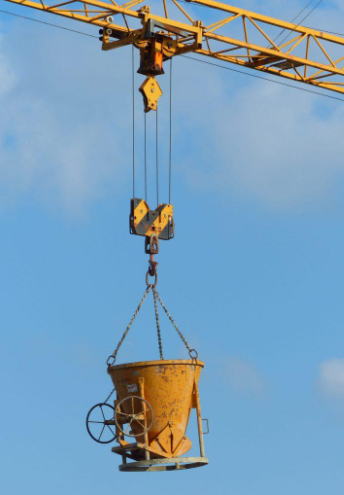
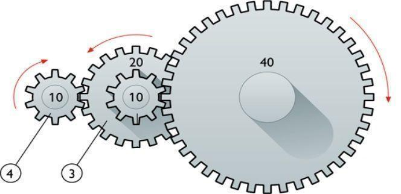
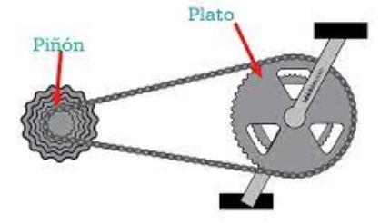
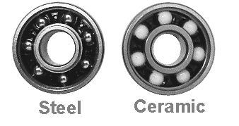
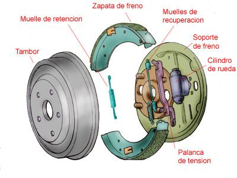
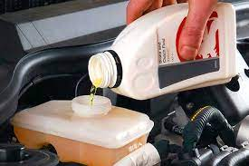

- [Mecanismos de transmisión](#mecanismos-de-transmisión)
  - [TRANSMISIÓN LINEAL](#transmisión-lineal)
  - [Transmisión circular](#transmisión-circular)
  - [Mecanismes d’acoblament d’eixos](#mecanismes-dacoblament-deixos)
  - [Soporte de elementos mecánicos](#soporte-de-elementos-mecánicos)
- [Sistemas de retención](#sistemas-de-retención)
  - [Pastillas de freno](#pastillas-de-freno)
  - [Frenos de tambor](#frenos-de-tambor)
  - [Frens de disc](#frens-de-disc)
  - [Accionament dels sistemes de frenat](#accionament-dels-sistemes-de-frenat)
  - [Líquidos de freno](#líquidos-de-freno)
  - [Servofrens](#servofrens)
  - [Trinquets](#trinquets)
- [Lubrificació](#lubrificació)
  - [Mantenimento](#mantenimento)
  - [Aceites](#aceites)
  - [Circuitos](#circuitos)
  - [Filtro](#filtro)

# Mecanismos de transmisión

Los mecanismos de transmisión son dispositivos que transmiten movimiento, fuerza y potencia de un punto a otro.

## TRANSMISIÓN LINEAL

### POLITGES

Una politja és un element mecànic format per una roda amb una ranura per on passa una corda, cinta o cable. Aquesta corda pot ser arrossegada per una força externa aplicada a l'altre extrem, el que permet desplaçar una càrrega o resistència. Les politges es poden utilitzar en solitari o en conjunt.

### Politja mòbil

La politja mòbil no és altra cosa que una politja de ganxo connectada a una corda que té un dels seus extrems ancorat a un punt fix i l'altre (extrem mòbil) connectat a un mecanisme de tracció.

L'inconvenient d'aquest muntatge és que per elevar la càrrega hem de fer força en sentit ascendent, cosa que resulta especialment incòmoda i poc efectiva. Per solucionar-ho es recorre a la seva utilització sota la forma de polipast (combinació de politges fixes amb mòbils).

### Polipast

Un polipast és un aparell que serveix per elevar o moure càrregues pesades. Aquest aparell està format per un conjunt de polies que van lligades a un ganxo o càrrega.

Quan es tira de la corda del polipasto, la càrrega es mou cap amunt, gràcies a la multiplicació de forces que es produeix amb les polies. El polipasto es pot utilitzar en una gran varietat d'activitats, com en la construcció, el trasllat de mercaderies, en tallers mecànics, entre altres.

### Simulador de poleas

En el siguiente enlace podemos simular el comportamiento de distintos tipos de poleas:

https://www.compassproject.net/html5sims/pulleysim/pulley_en.html

## Transmisión circular

Árboles y ejes

Un eje es un elemento, normalmente cilíndrico, que gira sobre sí mismo y sirve para sostener diferentes piezas.

Atendiendo a la forma de trabajo, los ejes pueden ser:

Ejes fijos: Permiten el giro de los elementos mecánicos situados sobre ellos, pero no giran solidariamente con ellos, es decir, los elementos mecánicos giran libremente sobre ellos.

Ejes giratorios: pueden girar solidariamente con algunos de los elementos situados sobre ellos.

Un árbol es un elemento de una máquina, cilíndrico o no, sobre el que se montan diferentes piezas mecánicas, por ejemplo, un conjunto de engranajes o poleas, a los que se transmite potencia. Pueden adoptar diferentes formas (rectos, acodados, flexibles,). Los árboles (también llamados árboles de transmisión) giran siempre junto con los órganos soportados.

Como consecuencia de su función, están sometidos fundamentalmente a esfuerzos de torsión y flexión.

La diferencia esencial entre los ejes y los árboles es la siguiente: los primeros son elementos que sustentan (sostienen o soportan) los órganos giratorios de las maquinas   no transmiten potencia (se dice que no están sometidos a esfuerzos de torsión),  mientras que los árboles son elementos que transmiten potencia y si están sometidos a esfuerzos de torsión.

### Ruedas de fricción

Las ruedas de fricción consisten en dos ruedas que se presionan entre sí para transferir el movimiento. La rueda motriz, que se encuentra conectada al motor, hace contacto con la rueda conducida y la hace girar.

A este tipo de transmisión también se le conoce como transmisión por fricción.

Estas ruedas presentan una serie de características:

Los materiales que se utilizan tienen un alto coeficiente de rozamiento para evitar que las ruedas resbalen entre sí.

Normalmente estas ruedas de fricción se emplean en arboles de transmisión muy cercanos y cuando la potencia que hay que transmitir es pequeña.

Este tipo de transmisión tiene la ventaja de que es muy fácil de fabricar, no necesita apenas mantenimiento y no produce ruidos

Este sistema es utilizado en aplicaciones donde se requiere una transmisión de potencia a corta distancia, como la dinamo de una bicicleta.

En el siguiente video podemos ver una dinamo en funcionamiento:

Video dinamo

### Polea y correa

Mecanismo de transmisión de movimiento rotativo que se utiliza en aplicaciones de mayor distancia.

Consiste en una polea que se encuentra conectada al motor y que hace contacto con una correa que se extiende hacia otra polea, que a su vez transfiere el movimiento a la máquina o dispositivo que se desea mover.

Las correas pueden ser de diferentes tipos, como las planas, las trapezoidales o las dentadas, y su elección dependerá del tipo de aplicación.

Simulador: Simulador de polea y correa

Engranajes

Los engranajes de rueda dentada son uno de los mecanismos más utilizados para la transmisión del movimiento. En general, los engranajes de rueda dentada se componen de dos ruedas dentadas que están unidas por un eje. Las ruedas dentadas se encuentran en contacto y los dientes se interbloquean.

Las ruedas dentadas se pueden mover en el mismo sentido o en sentidos opuestos. Si las ruedas dentadas se mueven en el mismo sentido, se llama una reducción; si las ruedas dentadas se mueven en sentidos opuestos, se llama una transmisión.

Los engranajes de rueda dentada de rueda dentada pueden transmitir un movimiento uniforme a una velocidad diferente.

https://geargenerator.com/

Cadenas

Las cadenas son uno de los mecanismos más simples para transmitir el movimiento. Una cadena es una serie de eslabones conectados. Los eslabones pueden girar libremente en torno a su eje.

Las cadenas se utilizan principalmente en bicicletas, motocicletas, motores de bote y trenes de juguete.

Cadenas: simulación

Simulador de cadenas

Calculador motores y cambios de marchas

Piñones y platos

Se denomina piñón a la rueda de un mecanismo de cremallera o a la rueda más pequeña de un par de ruedas dentadas

En una etapa de engranaje, la rueda más grande se denomina corona, mientras que en una transmisión por cadena como la de una bicicleta o motocicleta además de corona a la rueda mayor se le puede denominar plato, «estrella» o «catalina»

## Mecanismes d’acoblament d’eixos

Son dispositivos que se utilizan para conectar dos ejes de manera que puedan transmitir energía mecánica entre ellos. Los acoplamientos pueden ser de diferentes tipos, como acoplamientos rígidos, flexibles, de engranajes, hidráulicos, entre otros, y se utilizan en una amplia gama de aplicaciones mecánicas.

Acoblament per maniguet

Acoblament per maniguet és un tipus senzill i tosc d'acoblament adequat per a màquines amb velocitats reduïdes i d'ús ocasional. L'estructura està formada per un maniguet de fundició amb un canal interior que acull dues xavetes, les quals sostenen els extrems dels eixos i es fixen al maniguet mitjançant cargols de cap avellanat. Una protecció de xapa cobreix els talons de les xavetes per a evitar que surtin de les ranures del maniguet.

Degut a l'asimetria produïda per les ranures i les xavetes, així com l'excentricitat que es produeix per la introducció forçada de les xavetes, és important allunyar el centre de gravetat de l'acoblament dels arbres per a evitar vibracions i irregularitats en el moviment. A més, es pot assegurar la unió entre el maniguet i els arbres mitjançant clavilla cònica transversal si l'esforç a transmetre és petit.

Junta cardan

La junta Cardan és un element mecànic que s'utilitza per a transferir el moviment de rotació d'un eix a un altre quan estan desalineats. Està formada per dues forquilles solidàries als arbres d'entrada i de sortida, i una peça central denominada creueta.

Quan l'eix d'entrada gira, arrossega la creueta, i aquesta a la vegada arrossega l'eix de sortida. No obstant, la velocitat de gir de sortida sofreix algunes variacions a causa dels angles que es formen.

Per evitar aquestes variacions, s'instal·len sempre dues juntes Cardan que es compensen entre si. A aquest element se l'anomena doble Cardan.

Junta homocinètica

La junta homocinètica té com a finalitat connectar dos eixos situats longitudinalment que no són continus, de manera que la velocitat entre ells sigui sempre igual.

Aquesta connexió es fa a través del palier de transmissió de les rodes, que s'uneix per un extrem amb el diferencial i per l'altre amb la caixa de la roda.

Aquesta transmissió està sotmesa a moviments oscil·latoris de la suspensió i moviments giratoris de la direcció, per la qual cosa ha de ser articulada. La junta homocinètica actua com una mena de ròtula complexa que permet aquests moviments sense que les rodes perdin tracció ni les transmissions es vegin afectades.

Embrague

El embrague de un coche es un sistema mecánico que se encuentra entre el motor y la caja de cambios.

Su función principal es desacoplar momentáneamente el motor de la transmisión para permitir cambios de marcha suaves y precisos.

https://www.youtube.com/watch?v=WxRq_bNBmjQ

https://www.youtube.com/watch?v=4Syt_01ZRzA

Mecanismos de transformación

En un gran número de ocasiones será necesario transformar el movimiento rotativo del motor que alimenta el equipo en un movimiento de otro tipo, por ejemplo, lineal o alternativo. Es pues necesario desarrollar múltiples mecanismos transformadores de movimiento. Estos mecanismos pueden llegar a ser muy variados y complejos, pero todos ellos estarán basados en los distintos principios de transmisión que vamos a estudiar a lo largo de este apartado.

Movimiento circular-rectilíneo

manivela-torno

Es un dispositivo que convierte el movimiento circular en movimiento lineal o viceversa. Consiste en una manivela que gira alrededor de un eje y que está conectada a un mecanismo de torno que se encarga de transformar el movimiento.

piñón-cremallera

Es un sistema de engranajes que se utiliza para transformar el movimiento circular en movimiento lineal. Consiste en un piñón que gira alrededor de un eje y que se conecta a una cremallera que se mueve linealmente. Al girar el piñón, la cremallera se desplaza en la dirección deseada.

Tornillo-tuerca

Es un sistema de rosca que se utiliza para transformar el movimiento circular en movimiento lineal. Consiste en un tornillo con una rosca que se conecta a una tuerca con una rosca correspondiente. Al girar el tornillo, la tuerca se desplaza a lo largo del tornillo en la dirección deseada.

Tornillo sin fin

Es un tipo de engranaje que se utiliza para transformar el movimiento circular en movimiento lineal. Consiste en un tornillo con una rosca sin fin que se conecta a una rueda dentada que se llama corona. Al girar el tornillo sin fin, la corona se desplaza en la dirección deseada.

Este sistema se utiliza principalmente en maquinaria que requiere un alto grado de precisión, como los relojes, y también para sistemas reductores de la velocidad.

Se trata de un sistema que no es reversible.

Circular-rectilíneo alternativo

Son mecanismos que se utilizan para transformar el movimiento circular en movimiento lineal o viceversa.

Biela-manivela

Es un mecanismo que se utiliza para transformar el movimiento lineal en movimiento circular o viceversa. Consiste en una biela, que es una barra que se mueve linealmente, conectada a una manivela, que es un brazo que gira alrededor de un eje. Al mover la biela, la manivela gira y viceversa.

Leva

Una leva es una pieza de forma irregular que se mueve en un movimiento circular y que, al hacer contacto con otra pieza, produce un movimiento lineal.

En este ejemplo podemos ver como se utilizan las levas para abrir y cerrar las válvulas de admisión en un motor.

Árbol de levas

Un árbol de levas es un componente del motor de combustión interna que se encarga de controlar la apertura y cierre de las válvulas de admisión y escape. Es un eje con levas o protuberancias que giran en sincronización con el movimiento del cigüeñal, y que están diseñadas para presionar sobre los taqués o balancines, moviendo a su vez las válvulas.

El árbol de levas puede estar ubicado en la culata o en el bloque del motor, dependiendo del diseño del motor. La culata, también conocida como tapa de cilindros o tapa del bloque del motor, es la parte superior de un motor de combustión interna que permite el cierre de las cámaras de combustión.

En los motores de cuatro tiempos, el árbol de levas gira a la mitad de la velocidad del cigüeñal y tiene tantas levas como válvulas tenga el motor.

Excéntrica

Una excéntrica es una pieza circular que gira alrededor de un eje descentrado y que se utiliza para producir un movimiento lineal.

Cigüeñal

Es un componente importante en la mayoría de los motores de combustión interna. Se utiliza para transformar el movimiento lineal de los pistones en movimiento circular. Consiste en un eje que gira alrededor de un punto central y que tiene una serie de contrapesos y muñequillas en ángulos específicos. 

Pistones

Los pistones se conectan a las muñequillas y, al girar el cigüeñal, se produce un movimiento circular que impulsa el motor.

## Soporte de elementos mecánicos

Los cojinetes y rodamientos se utilizan en una gran variedad de máquinas, desde ventiladores y bombas hasta automóviles y aviones.

Los rodamientos son especialmente importantes en las ruedas de los automóviles, ya que soportan el peso del vehículo y permiten que las ruedas se muevan libremente.

Coixinets

Els coixinets són elements fonamentals per als mecanismes que necessiten suportar moviments giratoris i realitzar diferents funcions, com sustentar el pes, guiar la rotació i evitar desplaçaments. Aquests coixinets poden ser col·locats en el bastidor de la màquina o suports independents que en facilitin el muntatge.

En funció de la forma en què es produeix el lliscament de l'eix, hi ha dos tipus de coixinets: els de fricció i els de rodaments.

Coixinets de fricció

En els coixinets de fricció, els eixos giren lliscant en el coixinet

Coixinets de rodament

En els coixinets de rodaments s'interposen una sèrie d'esferes, cilindres i cons, el que fa que el lliscament es produeixi per rodadura i disminueixi el coeficient de fregament.

En resum, els coixinets són elements essencials per als mecanismes que necessiten suportar moviments giratoris i realitzar diferents funcions, i la seva correcta elecció és clau per a l'optimització dels mecanismes.

# Sistemas de retención

Destinados a interrumpir a voluntad el movimiento de rotación del eje.

###Frenos

Los sistemas de frenado son elementos mecánicos que se utilizan para reducir o detener el movimiento de una máquina.

Su funcionamiento consiste en aumentar las resistencias que se producen en una máquina durante su funcionamiento.

La energía cinética que poseen los elementos móviles se transforma en trabajo durante la deceleración, generando calor.

## Pastillas de freno

Las pastillas de freno pueden estar hechas de materiales metálicos o cerámicos, dependiendo del tipo de freno y de las condiciones de funcionamiento.

Las pastillas se van desgastando con el uso, y pierden gran parte del material, por lo que dejan de ser efectivas y tienen que ser sustituidas.

## Frenos de tambor

El sistema de freno de tambor se compone de un tambor que se encuentra en el interior de la rueda, y que gira junto con ella.

Las zapatas son piezas de metal en forma de arco que se ajustan dentro del tambor, y que se activan para crear fricción y detener la rotación del tambor y, por lo tanto, de la rueda.

Cuando se presiona el pedal de freno, una serie de piezas mecánicas e hidráulicas trabajan juntas para empujar las zapatas contra el tambor, lo que crea la fricción necesaria para detener el vehículo.

## Frens de disc

Els frens de disc funcionen mitjançant una pinça que pren un disc col·locat en l'eix de gir. La pinça pressiona dues pastilles de fre, una a cada costat del disc, per frenar el moviment. Això es fa mitjançant èmbols que s'accionen amb pressió hidràulica.

El líquid que circula en el sistema de frenat es diu líquid de frens.

Hi ha dos tipus de frens de disc: sistema rígid i sistema flotant. En el sistema rígid, els èmbols pressionen per ambdós costats del disc de manera simultània, mentre que en el sistema flotant, una pinça solidària duu dos pistons, un acciona directament sobre una de les pastilles de fre i l'altre acciona sobre l'altra per mitjà de la porta de la pinça.

## Accionament dels sistemes de frenat

Hi ha diferents tipus d'accionament dels sistemes de frenat que s'utilitzen en vehicles i altres màquines. Els dos tipus més comuns són els sistemes de frenat mecànics i hidràulics.

**Accionament mecànic**

Els sistemes de frenat mecànics utilitzen una vareta per mitjà d'una palanca per fer girar la lleva i separar les sabates de frens per aplicar-les contra el tambor.

**Accionament hidràulic**

Los sistemas de frenado hidráulicos utilizan un líquido para transmitir la presión a través de una columna de líquido que actúa como transmisor de energía.

## Líquidos de freno

El líquido de frenos es un fluido hidráulico que se utiliza en el sistema de frenos. El líquido transmite la presión ejercida por el conductor sobre el pedal del freno a las zapatas o pastillas de freno, que a su vez generan la fricción necesaria para detener el vehículo.

## Servofrens

Los servofrenos son un tipo especial de sistema de frenado que ayuda a reducir la fuerza de la fuerza que se debe realizar en el pedal de freno. 

Los servofrenos utilizan una fuente externa de energía, como el aire comprimido o la energía hidráulica, para ayudar a aplicar la fuerza a los frenos y reducir el esfuerzo que se debe hacer en el pedal.

Los servofrenos neumáticos son los más habituales y utilizan una válvula para dejar pasar aire comprimido que acciona los émbolos para aplicar la fuerza a los frenos.

## Trinquets

Es un mecanismo que permite que una pieza o componente se mueva en una dirección determinada, pero no en la dirección opuesta. El trinquete generalmente está compuesto por una rueda dentada y una palanca que se encajan entre los dientes de la rueda dentada para evitar que la pieza se mueva hacia atrás.

Permeten rotació d’un eix en un sentit determinat l’impideixen en l’oposat

Sistema de trinquet. Compost de:

- Roda dentada. Dents tenen un costat recte i l’altre corb.
- Nucli o trinquet. Articulat en una part fixa, encaixa en el costat recte de la dent
- Bon funcionament quan el trinquet, en contacte amb la dent, tendeix espontàniament a introduir-se a l’espai lliure.

### Resorte

Es un componente elástico que se utiliza para almacenar y liberar energía en una variedad de aplicaciones mecánicas.

Los resortes pueden ser de diferentes tipos, como helicoidales, de láminas, de torsión, entre otros, y se utilizan en una amplia gama de aplicaciones, desde relojes hasta vehículos.

# Lubrificació

La lubricación es el proceso de colocar una sustancia entre dos piezas para disminuir el rozamiento y prevenir la oxidación, la suciedad y otras formas de desgaste. Esto produce una mejor eficiencia y vida útil de los mecanismos.

La lubricación es esencial para el funcionamiento de la mayoría de las máquinas.

Sin ella, las piezas se rozan entre sí, lo que genera calor, desgaste y, en última instancia, la falla del mecanismo.

## Mantenimento

Un mantenimiento adecuado del sistema de lubricación y la limpieza también son esenciales para una lubricación eficaz. Si la lubricación es inadecuada o insuficiente, puede provocar un aumento del rozamiento y de la temperatura, lo que puede acelerar el desgaste y afectar negativamente a la vida útil de los mecanismos.

## Aceites

La denominació de l'oli es basa en una escala de viscositat que es mesura a través d'un procediment estandarditzat i establert per la Societat d'Enginyers d'Automoció (SAE). Aquesta escala classifica els olis segons la seva consistència o viscositat a diferents temperatures.

En la denominació de l'oli es fa referència a la seva viscositat a 100 graus Celsius, la qual es representa amb la lletra "W" (que significa "Winter" o hivern en anglès). Així, per exemple, un oli 10W-40 té una viscositat de 10 a baixes temperatures (en fred) i de 40 a altes temperatures (en calent).

## Circuitos

Los sistemas de lubricación cuentan con diferentes mecanismos para la recirculación del lubricante. El aceite debe ser bombeado a través del circuito y luego retornado a un recipiente (cárter) donde se recoge.

El carter se encuentra en la parte inferior del motor.

## Filtro

La reutilización del aceite requiere filtración.

La filtración implica tomar una derivación de aceite a presión antes de que llegue a los puntos de lubricación para pasarlo por un filtro.

Esto tiene la ventaja de que, si el filtro se obstruye, la lubricación no se viene afectada.

El aceite entra por unos orificios del filtro y sale por la parte central.

